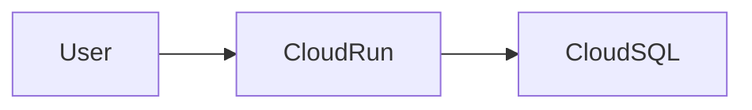

# AI Agent Instructions

This repository contains a developer-focused handbook for learning Google Cloud.

The goal is **not** to reproduce Google's documentation.

Instead, every chapter should explain:

- Why the service exists
- What problem it solves
- How it works
- When it should be used
- When it should NOT be used

---

# Target Audience

Software engineers preparing for the **Google Cloud Professional Cloud Developer Certification**.

Readers are expected to have programming experience but may have limited cloud experience.

Avoid assuming prior Google Cloud knowledge.

---

# Writing Philosophy

Always explain **the problem first**.

Then explain the solution.

Never introduce a Google Cloud service without first explaining why it exists.

---

# Mandatory Chapter Structure

Every section must contain the following headings in this exact order.

## 🎯 Learning Objectives

## 🤔 Why does this exist?

## ☁️ What is it?

## ⚙️ How does it work?

## 🏗️ Architecture

## 💡 Real World Example

## 🔄 Service Comparison

## 🧠 Analogy

## 📌 Key Takeaways

## 🎯 Exam Notes

## ⚠️ Common Mistakes

## 🔗 Related Services

## 📚 Further Reading

---

# Writing Rules

Always explain concepts before APIs.

Prefer diagrams over long paragraphs.

Prefer examples over definitions.

Avoid marketing language.

Avoid copying Google documentation.

Write in your own words.

---

# Code Blocks

Use code blocks whenever they improve understanding.

Examples:

- gcloud commands
- kubectl
- Terraform
- YAML
- JSON

---

# Diagrams

Prefer Mermaid diagrams whenever possible.

Example:

---

# Service Comparisons

Whenever possible compare services.

Examples:

Cloud Run vs GKE

Cloud SQL vs Spanner

Pub/Sub vs Cloud Tasks

Firestore vs Bigtable

---

# Exam Focus

Every chapter must contain certification notes.

Highlight common exam traps.

Explain why wrong answers are wrong.

---

# Quality Standard

The handbook should read like an O'Reilly technical book.

Clarity is more important than completeness.

Understanding is more important than memorization.

---

# Practice Questions

Each module's practice-questions set (`exam-guide/practice-questions/NN-*/practice-questions.en.md` and `.tr.md`) must have a **homogeneous answer-key distribution** across A/B/C/D.

- For a 16-question set, aim for exactly 4 correct answers per letter (A/B/C/D). Scale proportionally for other counts.
- Never let one letter dominate (e.g. correct answer is B for most or all questions) — users notice the pattern and start guessing the dominant letter instead of reading the question.
- Avoid long runs of the same letter in sequence (e.g. don't put 3+ consecutive questions with the same correct letter).
- The `.en.md` and `.tr.md` files for the same module must keep option order in sync — the same letter must map to the same option content in both languages.
- When writing or editing a practice-questions set, plan the target letter for each question's correct answer *before* writing the options, then place the correct content at that letter and fill the remaining letters with the distractors.
