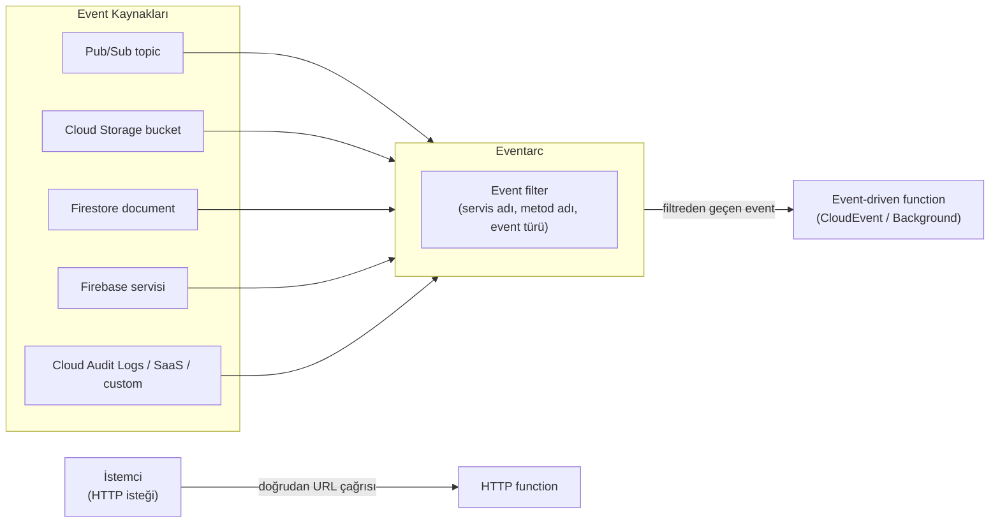
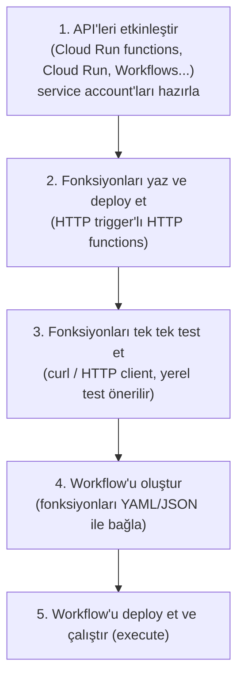
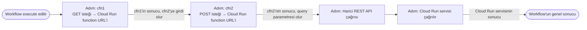
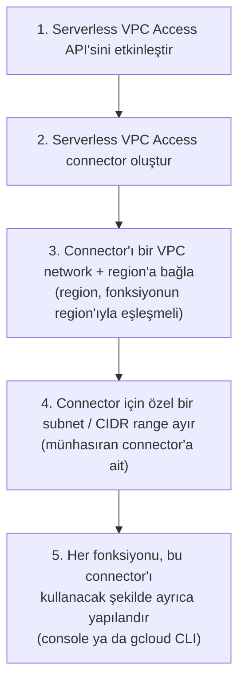
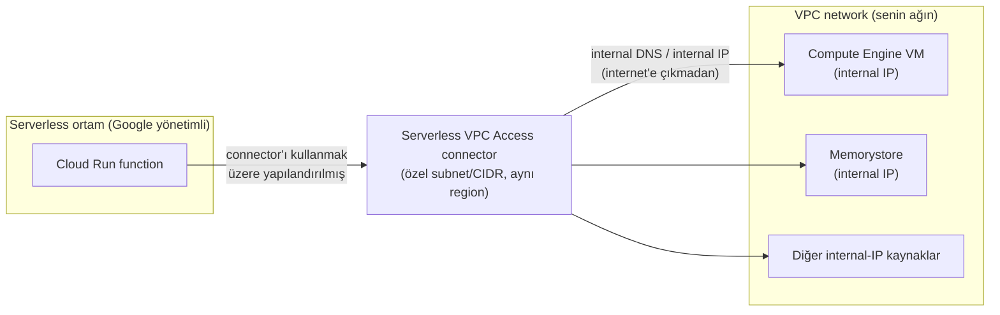

# Calling and Connecting Cloud Run Functions — Baştan Sona Öğretici

> Bu metin, **"Developing Applications with Cloud Run Functions on Google Cloud"** kursunun **Modül 2 — Calling and Connecting Cloud Run Functions** dersinde anlatılan **her şeyi** kavratmak için yazıldı. Bir önceki modülde (`deep-dive/12-introduction-to-cloud-run-functions`) Cloud Run functions'ın **ne olduğunu** — fully managed, serverless bir FaaS platformu olduğunu, iki neslini, iki fonksiyon türünü (HTTP ve event-driven) ve nasıl build edilip deploy edildiğini — öğrenmiştik. Bu modül, bir adım öteye geçiyor ve üç soruya cevap veriyor: **Bir fonksiyon nasıl çağrılır (trigger edilir)?** **Birden fazla fonksiyon ve servis nasıl birbirine bağlanıp bir iş akışı oluşturur?** Ve **bir fonksiyon, internete kapalı, VPC network içindeki özel kaynaklara (bir Compute Engine VM'i, bir Memorystore instance'ı) nasıl erişir?**
>
> **Kapsam notu:** Bu doküman, "Developing Applications with Cloud Run Functions on Google Cloud" kursunun **Modül 2**'sini kapsıyor. Önceki modül `deep-dive/12-introduction-to-cloud-run-functions/introduction-to-cloud-run-functions.md` dosyasındadır; kursun ilerleyen modülleri eklendikçe bu handbook'a `deep-dive/14-...`, `deep-dive/15-...` gibi yeni numaralı modüller olarak eklenmeye devam edecek.

---

## Bu ders tam olarak neyi öğretiyor ve neden önemli?

Modülün kendi açılışında söylediği gibi: önce **function trigger'ları** ile Cloud Run functions'ı nasıl çağıracağını öğreneceksin; sonra Cloud Run functions'ı **Workflows** ile nasıl birbirine bağlayacağını göreceksin; son olarak Cloud Run functions'ı **VPC network**'teki kaynaklara nasıl bağlayacağını öğreneceksin. Bu üç konu, birbirinden kopuk üç bilgi parçası gibi görünebilir — ama aslında hepsi **aynı sorunun** farklı katmanlarıdır: *"Tek başına, izole çalışan bir fonksiyonu, gerçek bir uygulamanın parçası hâline nasıl getiririm?"*

Bir fonksiyon, tek başına faydasızdır — bir elektrik anahtarının, hiçbir kabloya bağlı değilken faydasız olması gibi. Bu modül, o anahtarı üç farklı şekilde "kabloya bağlamayı" öğretiyor:

1. **Trigger'lar (BÖLÜM 1-7)** — fonksiyonun **ne zaman ve neye tepki olarak** çalışacağını tanımlar. Bu, fonksiyonun **girdi** tarafıdır: "beni ne uyandırır?"
2. **Workflows (BÖLÜM 8-10)** — birden fazla fonksiyonu ve servisi, **belirli bir sırada** çalışacak şekilde birbirine bağlar. Bu, fonksiyonların **birbiriyle nasıl konuştuğu** tarafıdır: "ben bittiğimde sıra kimde?"
3. **Serverless VPC Access (BÖLÜM 11-13)** — fonksiyonun, herkese açık internetin dışında kalan **özel (private) kaynaklara** nasıl erişebileceğini tanımlar. Bu, fonksiyonun **dışarıya nasıl uzandığı** tarafıdır: "internete çıkmadan, güvenli ağıma nasıl dokunurum?"

Bu üçünü birlikte öğrendiğinde, artık sadece "Cloud Run functions nedir" sorusuna değil, "Cloud Run functions'ı gerçek, çok parçalı bir uygulamanın içine **nasıl örerim**" sorusuna da cevap verebiliyor olacaksın.

---

# BÖLÜM 1 — Trigger Kavramı: Fonksiyonu Neyin Çalıştırdığını Tanımlamak

## Trigger nedir ve neden gereklidir?

Önceki modülde gördüğün gibi, bir cloud function **tek başına** hiçbir zaman kendiliğinden çalışmaz — bir **event** ile tetiklenir. Cloud Run functions'ı, çeşitli senaryolara tepki olarak çalışacak şekilde kurman için kullandığın mekanizmanın adı **trigger**'dır.

Trigger'lar iki biçimde gelebilir:

- **HTTP(S) istekleri** — biri fonksiyonun URL'ine bir istek gönderir.
- **Desteklenen cloud event'lerden biri** — Google Cloud altyapısında bir şey olur (bir dosya yüklenir, bir mesaj yayınlanır, bir belge güncellenir) ve fonksiyon bundan haberdar edilir.

Bir trigger'ı, fonksiyonun **deploy edilmesinin bir parçası olarak** belirtirsin — yani trigger, fonksiyonun koduna gömülü bir şey değil, **deploy zamanında yapılandırılan bir ayardır.** Bu ayrım önemlidir: aynı fonksiyon kodunu, farklı deploy'larda **farklı trigger'larla** çalıştırabilirsin (elbette her deploy, ayrı bir fonksiyon instance'ı olarak var olur).

## İki trigger kategorisi

Trigger'lar, önceki modülde gördüğün iki fonksiyon türüyle birebir eşleşen iki kategoriye ayrılır:

- **HTTP triggers** — HTTP(S) isteklerine tepki verir ve **HTTP functions**'a karşılık gelir.
- **Event triggers** — Google Cloud projen içindeki event'lere tepki verir ve **event-driven functions**'a karşılık gelir.

> **Bu neden BÖLÜM 3'teki "iki fonksiyon türü" ayrımının tekrarı değil?** Önceki modülde "HTTP functions vs. event-driven functions" ayrımını, fonksiyonun **nasıl implemente edildiği** (hangi handler imzasını yazdığın) açısından görmüştük. Burada aynı ayrımı, fonksiyonun **nasıl deploy zamanında yapılandırıldığı** (hangi trigger'ı seçtiğin) açısından görüyoruz. Bu iki bakış açısı, aynı madalyonun iki yüzüdür: bir HTTP function yazmak için HTTP handler imzasını kullanırsın (implementasyon), ve o fonksiyonu deploy ederken bir HTTP trigger belirtirsin (yapılandırma) — ikisi birbirini tamamlar, biri olmadan diğeri anlamsızdır.

## Aynı event'i birden fazla fonksiyona bağlamak — ama tersini yapamazsın

Burada, sınavda sıkça karıştırılan, ince ama kritik bir kural var: **Aynı event, birden fazla fonksiyonu çalıştırabilir** — bunu, aynı trigger source ayarlarına sahip birden fazla fonksiyon deploy ederek yaparsın. Örneğin bir Cloud Storage bucket'ına dosya yüklendiğinde, hem "küçük resim oluştur" fonksiyonunu hem de "virüs taraması yap" fonksiyonunu **aynı anda** tetikleyebilirsin — ikisi de aynı bucket'ı, aynı event tipini dinleyen ayrı fonksiyonlardır.

Ama bunun **tersi mümkün değildir**: **Tek bir fonksiyonu, aynı anda birden fazla trigger'a bağlayamazsın.** Bir fonksiyon, tek bir trigger kaynağına bağlıdır.

> **Sınav tuzağı — "bire çok" ile "çoka bir"i karıştırmak:** Ders şunu açıkça söylüyor: *"You can have the same event cause multiple functions to execute... but you cannot bind the same function to more than one trigger at a time."* Yani ilişki **bire-çok**tur (bir event → çok fonksiyon), **çoka-bir** değildir (çok event → bir fonksiyon). Bir sınav sorusu "tek bir fonksiyonu hem bir Pub/Sub topic'ine hem bir Cloud Storage bucket'ına bağlayabilir miyim?" diye sorarsa, cevap **hayır**dır — bunu yapmak istiyorsan, iki ayrı fonksiyon deploy edip her birini kendi trigger'ına bağlaman, ardından gerekiyorsa bunları bir workflow ile (BÖLÜM 8) birbirine bağlaman gerekir.

## Event filters

Event-driven Cloud Run functions için, **Eventarc event trigger'ları** oluştururken **event filter**'lar kullanırsın. Event filter'lar, fonksiyonu **hangi event'in tam olarak** tetikleyeceğini daraltmanı sağlar; şunları içerebilir:

- **Servis adı (service name)** — event'i üreten Google Cloud servisi.
- **Metod adı (method name)** — servis üzerinde çağrılan işlem (örneğin bir Cloud Storage nesnesinin oluşturulması).
- **Event türü (event type)** — ne tür bir event olduğu (create, update, delete, write gibi).
- **Diğer bilgiler.**

Bu filtreleri, **Google Cloud console**'da ya da **gcloud CLI** ile, doğru event filter'larını belirterek oluşturabilirsin.

> **Analoji:** Event filter'ları, bir **posta yönlendirme kuralına** benzet. Postane (Eventarc), her gün binlerce mektup (event) taşır; ama sen sadece "İstanbul'dan gönderilen, üzerinde 'fatura' yazan mektupları bana getir" dersin (servis + tür filtresi). Postane, elindeki her mektubu sana getirmez — sadece kurallarına uyanları. Event filter, aynı şekilde, Eventarc'ın taşıdığı devasa event akışından **fonksiyonunu ilgilendiren tek bir dilimi** seçip ayıklar.

---

# BÖLÜM 2 — Event-Driven Trigger'ların Ortak Motoru: Eventarc

## Eventarc nedir ve neden merkezi bir rol oynar?

Ders açıkça şunu söylüyor: **"Tüm event-driven Cloud Run functions, event teslimi (event delivery) için Eventarc kullanır."** Bu, önceki modülde ("Choreography and Orchestration" kursunda, modül 09-11) tanıdığın Eventarc'ın, burada **event-driven Cloud Run functions'ın alt yapısındaki tek, ortak teslim mekanizması** olarak karşımıza çıktığı anlamına gelir. Pub/Sub trigger da, Cloud Storage trigger da, Firestore trigger da — hepsi, kaputun altında **birer Eventarc trigger türüdür.**

Eventarc, **90'dan fazla Google Cloud kaynağından** gelen event'leri destekler; bunlara ek olarak:

- **Cloud Audit Logs**'tan gelen event'ler,
- **Harici SaaS event kaynakları**,
- Ve **Pub/Sub'a publish ederek** oluşturduğun **özel (custom) kaynaklar.**

> **Bu neden önemli?** Eventarc'ın bu kadar geniş bir kaynak yelpazesini desteklemesi, Cloud Run functions'ın "sadece birkaç Google servisine tepki verebilen dar bir araç" olmadığını, aksine **neredeyse her şeyin** (bir Google servisi, üçüncü parti bir SaaS uygulaması, ya da senin kendi yazdığın herhangi bir sistem) tetikleyebileceği bir platform olduğunu gösterir — yeter ki o kaynak, event'i Pub/Sub'a ya da Cloud Audit Logs'a yazabilsin.

## Pub/Sub'ı bir event bus olarak kullanan her servisle entegrasyon

Cloud Run functions'ı, **Pub/Sub'ı bir event bus olarak destekleyen herhangi bir Google servisiyle** entegre edebilirsin — örnek olarak **Cloud Logging** ve **Cloud Scheduler** veriliyor. Bu mümkündür, çünkü Cloud Run functions zaten **Pub/Sub topic'lerindeki mesajlarla tetiklenebilir** (BÖLÜM 4'te detaylıca göreceğiz).

Bunun pratikte ne anlama geldiğine iki somut örnekle bakalım:

- **HTTP functions + Cloud Tasks:** HTTP Cloud Run functions'ı, **Cloud Tasks** ile birlikte **task handler** olarak kullanabilirsin — yani Cloud Tasks, bir görevi kuyruğa koyar ve sırası geldiğinde bu görevi işlemesi için HTTP function'ının URL'ini çağırır.
- **Gmail Push Notification API + Pub/Sub:** Gmail Push Notification API kullanarak, Gmail event'lerini bir **Pub/Sub topic**'ine gönderebilir, sonra bunları bir Cloud Run function ile **tüketebilirsin (consume).**

> **Analoji:** Eventarc'ı, bir şehrin **tüm toplu taşıma ağını yöneten merkezi bir kontrol kulesi** gibi düşün. Otobüsler (Google servisleri), metro hatları (SaaS kaynakları) ve özel servisler (Pub/Sub'a publish eden custom kaynaklar) — hepsi farklı yerlerden gelir, ama hepsi aynı kontrol kulesi üzerinden **koordine edilir ve yönlendirilir.** Sen, fonksiyonunu deploy ederken sadece "beni şu hatta bağlayın" dersin (event filter); Eventarc, arkadaki tüm karmaşık yönlendirme işini senin için yapar.

---

# BÖLÜM 3 — HTTP Triggers

## HTTP triggers nasıl çalışır?

**HTTP triggers**, bir fonksiyonun **HTTP(S) isteklerine tepki olarak** çalışmasını sağlar. Bir fonksiyon için HTTP trigger belirttiğinde:

- Fonksiyon, isteklerini alabileceği bir **URL**'e atanır. (Bunu önceki modülde de görmüştük: Cloud Run functions'a bir **HTTPS endpoint** atanır ve fonksiyon bu endpoint üzerinden çağrılabilir.)
- HTTP trigger, **GET, POST, PUT, DELETE ve OPTIONS** request metodlarını destekler.

Bu, HTTP trigger'ı, standart bir web API'sinin ya da webhook'un davranışına çok benzer kılar: istemci (client), belirli bir metodla belirli bir URL'e istek atar, fonksiyon bu isteği işler ve bir yanıt döner.

> **Neden HTTP trigger, event trigger'lardan farklı bir "kategori" sayılır?** Event trigger'ların hepsi (Pub/Sub, Cloud Storage, Firestore, Firebase) kaputun altında **Eventarc**'a dayanırken, HTTP trigger **Eventarc'a hiç ihtiyaç duymaz** — istemci doğrudan fonksiyonun URL'ine bağlanır. Bu, HTTP trigger'ı kavramsal olarak en "basit" trigger türü yapar: aradaki dolaylı (event delivery) katmanı ortadan kaldırır, doğrudan bir istek-yanıt ilişkisi kurar.

---

# BÖLÜM 4 — Pub/Sub Triggers

## Pub/Sub triggers nasıl çalışır?

**Pub/Sub triggers**, fonksiyonların **Pub/Sub mesajlarına tepki olarak** çağrılmasını sağlar. Bir fonksiyon için Pub/Sub trigger belirlediğinde, aynı zamanda bir **Pub/Sub topic** de belirtirsin — fonksiyonun, o topic'e her mesaj publish edildiğinde çağrılmasını istersin.

Bir fonksiyonun Pub/Sub trigger kullanabilmesi için, **event-driven bir fonksiyon olarak implemente edilmesi gerekir** (yani HTTP function olamaz — bu, BÖLÜM 1'deki "trigger kategorisi ↔ fonksiyon türü" eşleşmesinin somut bir örneğidir).

Event verisinin fonksiyona hangi biçimde ulaşacağı, fonksiyonun **hangi yaklaşımla implemente edildiğine** bağlıdır (bu ayrımı önceki modülün BÖLÜM 4'ünden hatırlıyorsun):

- **CloudEvent function** kullanılıyorsa, Pub/Sub event verisi fonksiyona **CloudEvents formatında** geçirilir.
- **Background function** kullanılıyorsa, Pub/Sub event verisi fonksiyona **PubsubMessage formatında** geçirilir.

Ve Cloud Run functions'da, **Pub/Sub triggers, bir tür Eventarc trigger olarak implemente edilir** — yani BÖLÜM 2'de gördüğümüz "tüm event-driven fonksiyonlar Eventarc kullanır" kuralının somut bir örneğidir.

> **Sınav tuzağı — hangi formatın hangi implementasyona ait olduğunu karıştırmak:** Bu, önceki modülün CloudEvent vs. Background function ayrımıyla doğrudan bağlantılıdır ve sınavda kolayca karıştırılır. Kural şu: **CloudEvent function → CloudEvents format**, **Background function → PubsubMessage format.** Bir soru "Cloud Run functions (1st generation)'da Node.js ile yazılmış bir Pub/Sub-trigger'lı fonksiyon, event verisini hangi formatta alır?" diye sorarsa — önceki modülden hatırla: gen1 + Node.js = Background function → cevap **PubsubMessage format**'tır.

---

# BÖLÜM 5 — Cloud Storage Triggers

## Cloud Storage triggers nasıl çalışır?

**Cloud Storage triggers**, fonksiyonların **Cloud Storage'daki değişikliklere tepki olarak** çağrılmasını sağlar. Bir Cloud Storage trigger belirlerken:

- Bir **event türü (event type)** seçersin (örneğin bir nesnenin oluşturulması, silinmesi, arşivlenmesi ya da metadata'sının güncellenmesi).
- Belirli bir **Cloud Storage bucket** belirtirsin.

Fonksiyon, belirtilen bucket içindeki **herhangi bir nesnede (dosyada)** bu türden bir değişiklik olduğunda çağrılır.

Pub/Sub trigger'da olduğu gibi, bir fonksiyonun Cloud Storage trigger kullanabilmesi için **event-driven bir fonksiyon olarak implemente edilmesi gerekir**, ve veri formatı yine implementasyon türüne bağlıdır:

- **CloudEvent function** kullanılıyorsa, Cloud Storage event verisi fonksiyona **CloudEvents formatında** geçirilir.
- **Background function** kullanılıyorsa, Cloud Storage event verisi fonksiyona **StorageObjectData formatında** geçirilir.

Cloud Run functions'da, **Cloud Storage triggers de bir tür Eventarc trigger olarak implemente edilir.**

> **Analoji — dosya yükleme kullanım senaryosu:** Bunu önceki modülün "veri işleme" kullanım alanıyla birleştirerek düşün: bir kullanıcı bir resmi Cloud Storage bucket'ına yüklediğinde (bir "create" event'i tetiklenir), bir Cloud Storage trigger'lı fonksiyon otomatik olarak çalışır ve resmi küçük bir thumbnail'e dönüştürür. Sen hiçbir zaman "her 5 dakikada bir bucket'ı kontrol et" gibi bir polling mekanizması kurmazsın — trigger, event'i **anında** sana getirir.

---

# BÖLÜM 6 — Firestore Triggers

## Firestore triggers nasıl çalışır?

**Firestore triggers**, fonksiyonların, **fonksiyonla aynı Google Cloud projesindeki** Firestore'da gerçekleşen event'leri işlemesini sağlar. Bir Firestore trigger belirlerken:

- Bir **event türü** seçersin.
- Bir **document path** (belge yolu) belirtirsin.

Belirtilen türde bir event, belirtilen belgede gerçekleştiğinde, fonksiyon çağrılır.

Firestore, dört event türünü destekler: **create, update, delete ve write.** (`write`, aslında create/update/delete'in herhangi birini kapsayan geniş bir kategoridir.)

Fonksiyon, tetiklendiğinde, **etkilenen belgenin (document) bir anlık görüntüsünü (snapshot) içeren bir veri nesnesi** alır.

## Kritik bir sınır: sadece belge seviyesi

Burada, sınavda özellikle vurgulanan bir kısıtlama var: **Firestore triggers, yalnızca belge (document) seviyesinde uygulanır.** Belirli bir **alan (field)** ya da belirli bir **koleksiyon (collection)** için bir trigger oluşturmak **mümkün değildir.**

> **Sınav tuzağı — "sadece şu alan değiştiğinde çalışsın" isteğini Firestore trigger ile çözmeye çalışmak:** Bir senaryoda "kullanıcı belgesindeki sadece `email` alanı değiştiğinde bir fonksiyon çalışsın, diğer alanlar değiştiğinde çalışmasın" isteği gelirse, doğrudan bir Firestore trigger bunu **karşılayamaz** — trigger, tüm belge seviyesinde tetiklenir (write event'i, alan bazında değil belge bazında ateşlenir). Bu senaryoyu çözmek istiyorsan, fonksiyonun kendi kodu içinde, gelen belge snapshot'ını **önceki durumla karşılaştırarak** hangi alanın değiştiğini kontrol etmen gerekir — trigger mekanizmasının kendisi bu inceliği sağlamaz.

Ayrıca iki önemli kısıtlama daha var:

- **Firestore, fonksiyonla aynı Google Cloud projesinde olmalıdır.** Farklı bir projedeki Firestore'u doğrudan trigger olarak kullanamazsın.
- Fonksiyon, **dil runtime'ına bağlı olarak** ya bir **CloudEvent function** ya da bir **Background function** olabilir — burada da önceki modüldeki nesil/dil kuralı geçerlidir.

---

# BÖLÜM 7 — Firebase Servis Trigger'ları

## Hangi Firebase servisleri desteklenir?

Cloud Run functions, çeşitli **Firebase servisleri** için de trigger desteği sunar:

| Firebase servisi | Desteklendiği nesil |
| --- | --- |
| **Google Analytics for Firebase** | Sadece **Cloud Run functions (1st generation)** |
| **Firebase Realtime Database** | Her iki nesilde de |
| **Firebase Authentication** | Sadece **Cloud Run functions (1st generation)** |
| **Firebase Remote Config** | Her iki nesilde de |

> **Sınav tuzağı — "tüm Firebase trigger'ları her nesilde çalışır" varsayımı:** Ders açıkça, **Google Analytics for Firebase** ve **Firebase Authentication** trigger'larının **sadece Cloud Run functions (1st generation)**'da desteklendiğini belirtiyor. Bir soru "yeni bir projede (Cloud Run functions, yani gen2) Firebase Authentication event'lerine tepki veren bir fonksiyon kurmak istiyorum" diye sorarsa, bu senaryonun **doğrudan desteklenmediğini** — bu iki trigger türü için hâlâ gen1'e ihtiyaç duyulduğunu bilmen gerekir.

Firestore trigger'da olduğu gibi, burada da işlediğin Firebase servisinin **fonksiyonla aynı Google Cloud projesinde** olması gerekir.

## BÖLÜM 1-7'nin toplu görünümü

Bu yedi bölümü tek bir tabloda toplayalım — trigger türleri, hangi fonksiyon türüne karşılık geldiği, ve Eventarc ile ilişkisi:

| Trigger türü | Fonksiyon türü | Eventarc'a dayanır mı? | Veri formatı (CloudEvent / Background) |
| --- | --- | --- | --- |
| **HTTP trigger** | HTTP function | Hayır — doğrudan istek/yanıt | — |
| **Pub/Sub trigger** | Event-driven function | Evet | CloudEvents / PubsubMessage |
| **Cloud Storage trigger** | Event-driven function | Evet | CloudEvents / StorageObjectData |
| **Firestore trigger** | Event-driven function | Evet | Runtime'a bağlı (CloudEvent ya da Background) |
| **Firebase servis trigger'ları** | Event-driven function | Evet | Runtime'a ve nesle bağlı |

---

# BÖLÜM 8 — Workflows ile Cloud Run Functions'ı Birbirine Bağlamak

## Workflows nedir?

**Workflows**, tam yönetilen (fully managed), sunucusuz (serverless) bir **orkestrasyon platformudur.** Servisleri, senin tanımladığın bir sırada çalıştırır — bu tanıma **workflow (iş akışı)** denir.

Workflows, önceki kursta (modül 09-11, "Service Orchestration and Choreography") gördüğün **service orchestration pattern**'inin **merkezi orkestratörü** olarak görev yapar. Workflow'lar tasarlar ve deploy edersin; bunlar Google Cloud servislerini ve API çağrılarını **orkestre eder ve birleştirir.**

> **Bu neden önceki kursla doğrudan bağlantılı?** Modül 11'de "orchestration" desenini, tek bir merkezi bileşenin diğer servisleri yönettiği bir yaklaşım olarak öğrenmiştin (choreography'nin aksine, orada her servis birbirinin event'lerine bağımsızca tepki verir). Workflows, tam olarak o **merkezi orkestratör rolünü somutlaştıran gerçek Google Cloud ürünüdür.** Yani modül 11'de kavramsal olarak öğrendiğin "orchestration" fikrini, bu modülde **elle tutulur bir servisle** (Workflows) hayata geçiriyorsun.

## Neden Workflows'a ihtiyaç var? (Sorun neydi?)

Tek bir fonksiyon, tek bir işi yapar (önceki modülden hatırla: "cloud function, tek bir işlevi yerine getiren basit bir koddur"). Ama gerçek uygulamalar, genellikle **birden fazla adımdan** oluşan süreçler gerektirir: bir sipariş alınır → ödeme işlenir → stok güncellenir → bir bildirim gönderilir. Bu adımların her birini ayrı bir fonksiyon olarak yazabilirsin — ama o zaman "hangi adım hangi sırada, hangi girdiyle çalışacak" sorusunu **birinin** cevaplaması gerekir.

İşte Workflows tam olarak bunu yapar: **uygulama akışı için merkezi bir doğruluk kaynağı (source of truth)** sağlar. Fonksiyonların kendi aralarında birbirini doğrudan çağırıp "sıradaki kim" diye karar vermesi yerine, bu **sıralama mantığını** ayrı, gözlemlenebilir bir katmana taşırsın.

## Workflows'un temel yetenekleri

- Workflows, **stateful (durum tutan), otomatikleştirilmiş süreçler** inşa etmek için, **Cloud Run üzerinde barındırılan özel servisleri ya da fonksiyonları** içerebilir.
- Her workflow **execution**'ı (çalıştırılması) **loglanır ve gözlemlenebilir (observable)** — bu, workflow'un o anki durumunu anlamayı ve sorunları teşhis etmeyi (troubleshoot) kolaylaştırır.
- Bir workflow, **durumu (state) tutabilir, yeniden deneyebilir (retry), yoklayabilir (poll), ya da bir yıla kadar bekleyebilir (wait).** Bu esneklik, **uzun süreli (long-running) iş süreçleri** oluşturmana olanak tanır.

> **Neden "bir yıla kadar bekleyebilme" özelliği önemli?** Bir fonksiyonun timeout limiti (önceki modülden hatırla: HTTP functions için 60 dakika, event-driven functions için 10 dakika) çok kısadır — bir fonksiyon, "müşterinin ödemeyi onaylamasını 3 gün bekle" gibi bir işi **kendi başına** yapamaz, çünkü çok önce timeout'a uğrar. Workflows, bu sınırı aşar: bir workflow, bir sonraki adıma geçmeden önce **günler, haftalar, hatta bir yıla kadar** bekleyebilir — çünkü Workflows'un execution modeli, bir fonksiyonunkinden temelde farklıdır; bekleme sırasında hesaplama kaynağı tüketmez, sadece durumunu saklar.

## Workflows ile neleri birbirine bağlayabilirsin?

Workflows'u, aşağıdakileri içeren bir servis zincirini birbirine bağlamak için kullanabilirsin:

- **Cloud Run functions** ile inşa edilmiş **HTTP servisleri.**
- **Harici (external) API'ler.**
- **Cloud Run** gibi diğer Google Cloud servisleri.

Bu yaklaşımla, **esnek, sunucusuz bir uygulama** oluşturabilirsin — her parça kendi başına bağımsız, ölçeklenebilir, sunucusuz bir bileşen olurken, Workflows bu parçaları anlamlı bir sıraya sokar.

> **Analoji:** Workflows'u, bir **restoranın mutfak şefi (executive chef)** gibi düşün. Mutfaktaki her aşçı (her Cloud Run function, her Cloud Run servisi, her harici API), kendi başına tek bir işi çok iyi yapar — biri sadece et pişirir, biri sadece sos hazırlar, biri sadece tabak dizer. Ama şef olmadan, bu aşçılar **hangi sırayla** çalışacaklarını, kimin çıktısının kime malzeme olacağını bilemezler. Şef (Workflows), "önce eti pişir, sonra sosu hazırla, sosun sonucunu tabak dizen kişiye ver" der — kendisi eti pişirmez ya da sos yapmaz, sadece **sırayı ve veri akışını yönetir.**

---

# BÖLÜM 9 — Workflow İnşa Etme Akışı: Build, Deploy, Test, Connect, Execute

Bir workflow inşa etmek, sıralı, tekrarlanabilir bir akış izler. Bu akışı beş adıma ayırabiliriz:

## Adım 1 — Gerekli API'leri etkinleştir ve service account'ları hazırla

Bir workflow inşa etmenin ilk adımı, ihtiyaç duyduğun tüm Google API'lerini etkinleştirmektir: **Cloud Run functions, Cloud Run, Workflows** ve kullandığın diğer servislerin API'leri. Ayrıca, bu servislere erişmek için gereken **service account'ları** oluşturman gerekebilir.

## Adım 2 — Fonksiyonları yaz ve deploy et

Sıradaki adım, fonksiyonları **yazmak ve deploy etmektir.** Burada dikkat edilmesi gereken önemli bir nokta: workflow tarafından çağrılacak bu fonksiyonlar, **HTTP trigger'lı HTTP functions** olmalıdır — çünkü workflow, bunları **URL endpoint'leri** üzerinden çağıracaktır.

> **Bu neden mantıklı?** Workflows, adımları sırayla **çağırır (invoke eder)** ve her adımın sonucunu bir sonrakine aktarır. Bunu yapabilmesi için, çağıracağı her şeyin **adreslenebilir (addressable)** olması gerekir — yani bir URL'i olması gerekir. Event-driven bir fonksiyon (Pub/Sub trigger'lı, Cloud Storage trigger'lı gibi) doğrudan bir URL üzerinden çağrılamaz; o, sadece kendi event kaynağına tepki verir. Bu yüzden workflow'un adımları olarak kullanılacak fonksiyonlar **HTTP functions olmak zorundadır** — event-driven bir fonksiyonu workflow'a doğrudan bir adım olarak bağlayamazsın.

## Adım 3 — Fonksiyonları tek tek test et

Fonksiyonları deploy ettikten sonra, her birini **ayrı ayrı, izole olarak** test etmen gerekir — bunu **curl** ya da başka bir HTTP client ile yapabilirsin. Ayrıca, **deploy etmeden önce fonksiyonları yerel ortamda test etmek** de bir **en iyi pratiktir (best practice)**.

> **Neden bu adım atlanmamalı?** Bir workflow, birden fazla fonksiyonu zincirleme bağladığında, bir hatayı ayıklamak (debug) çok daha zorlaşır — hangi adımın, hangi girdiyle, neden başarısız olduğunu ayırt etmen gerekir. Her fonksiyonu workflow'a bağlamadan **önce** tek başına test etmek, "workflow çalışmıyor" gibi belirsiz bir hatayla uğraşmak yerine, "fonksiyon X, Y girdisiyle Z hatası veriyor" gibi **kesin, izole** bir hata ile karşılaşmanı sağlar.

## Adım 4 — Workflow'u oluştur (fonksiyonları birbirine bağla)

Fonksiyonlar test edildikten sonra, bu fonksiyonları birbirine bağlayan **workflow'u oluşturursun.** Bu adımın detaylarını (workflow'un nasıl yazıldığını) BÖLÜM 10'da inceleyeceğiz.

## Adım 5 — Deploy et ve çalıştır (execute)

Workflow oluşturulduktan sonra, onu **deploy eder** ve **çalıştırırsın (execute).**

> **Sınav tuzağı — sırayı karıştırmak:** Bu beş adımın sırası rastgele değildir; her adım bir öncekine **bağımlıdır.** API'ler etkin olmadan fonksiyon deploy edemezsin; fonksiyonlar deploy edilip test edilmeden güvenilir bir workflow tanımı yazamazsın; workflow tanımlanmadan onu deploy edemezsin. Bir sınav sorusu bu adımları karışık sırayla verip "doğru sıra hangisi?" diye sorabilir — cevap her zaman **enable API'ler → yaz/deploy fonksiyonlar → test et → workflow oluştur → deploy & execute** sırasını izler.

---

# BÖLÜM 10 — Workflow Tanımı: YAML/JSON, Adım Zincirleme, Harici API ve Cloud Run Bağlantısı

## Workflow tanımı nedir?

Bir workflow, **Workflows syntax'ı** kullanılarak tanımlanan bir dizi **adımdan (steps)** oluşur. Bu adımlar kümesine **workflow definition (workflow tanımı)** denir ve bu tanım **YAML** ya da **JSON** formatında yazılabilir.

> **Neden hem YAML hem JSON destekleniyor?** Bu, Google Cloud'un birçok yapılandırma diline yaklaşımıyla tutarlıdır: YAML, insan tarafından okunması/yazılması daha kolay olduğu için genellikle **elle yazılan** tanımlar için tercih edilirken, JSON, **programatik olarak üretilen** ya da başka sistemlerle entegre edilen tanımlar için daha uygundur. İkisi de aynı yapıyı temsil eder — hangisini seçtiğin bir tercih meselesidir, işlevsel bir fark yaratmaz.

## Örnek bir workflow tanımının anatomisi

Ders, somut bir örnek workflow tanımı üzerinden ilerliyor. Bu örnekte:

- **`cfn1`** ve **`cfn2`** adında iki adım vardır — bunlar, sırasıyla **GET** ve **POST** HTTP metodlarıyla, birer **HTTP isteği** üzerinden çağrılan **Cloud Run functions** adımlarıdır.
- Fonksiyonların **URL'leri**, adım tanımına birer **argüman (argument)** olarak verilir.
- **İlk cloud function'ın (`cfn1`) ürettiği sonuç, ikinci cloud function'a (`cfn2`) girdi (input) olarak verilir.**

Bu son nokta, workflow'un gerçek gücünü gösterir: adımlar birbirinden **izole değildir** — bir adımın çıktısı, doğal olarak bir sonraki adımın girdisi olabilir. Bu, tam olarak BÖLÜM 8'deki "mutfak şefi" analojisindeki "sosun sonucunu tabak dizen kişiye ver" adımının karşılığıdır.

## Harici bir REST API'ye bağlanmak

Workflow tanımı ayrıca, **harici bir REST API endpoint'ine bağlanma yapılandırmasını** da içerebilir. Örnekte, **ikinci cloud function'ın (`cfn2`) sonucu**, bu harici API çağrısına bir **query parametresi** olarak geçirilir.

Bu, workflow'ların sadece Google Cloud'un kendi servislerini değil, **Google Cloud dışındaki herhangi bir REST API'yi** de zincire dahil edebileceğini gösterir — üçüncü parti bir ödeme sağlayıcısı, bir hava durumu servisi, bir SMS gönderim API'si, ne olursa olsun.

## Bir Cloud Run servisine bağlanmak

Son olarak, workflow tanımı, workflow içinde bir **Cloud Run servisine** bağlanan bir yapılandırma da içerir. Bu örnekte, **Cloud Run servisinin ürettiği sonuç, workflow'un genel sonucudur (the result of the workflow).**

> **Bu neden önemlidir?** Bu, Workflows'un sadece Cloud Run **functions**'a değil, Cloud Run **servislerine** (yani daha genel, container tabanlı, fonksiyon olmayan iş yüklerine) de bağlanabildiğini gösterir. Önceki modülde öğrendiğin gibi, Cloud Run functions zaten Cloud Run'ın üzerine kurulu bir katmandı — burada Workflows'un, bu ilişkiden bağımsız olarak, **hem Cloud Run functions'ı hem düz Cloud Run servislerini aynı workflow içinde bir arada kullanabildiğini** görüyoruz. Bu da workflow'ları, salt "fonksiyonları birbirine bağlama aracı" olmaktan çıkarıp, **her türlü sunucusuz compute'u birleştiren genel bir orkestrasyon aracına** dönüştürür.

## Örnek workflow akışının görsel özeti

## Workflow tanımının bileşenleri — özet tablo

| Bileşen | Açıklama |
| --- | --- |
| **Format** | YAML ya da JSON |
| **Adım (step)** | Workflow tanımının temel yapı taşı; her adım bir işlemi (fonksiyon çağrısı, API çağrısı, vb.) temsil eder |
| **Fonksiyon adımı (`cfn1`, `cfn2`)** | HTTP isteğiyle (GET/POST/...) çağrılan bir Cloud Run function; URL argüman olarak verilir |
| **Adımlar arası veri akışı** | Bir adımın sonucu, bir sonraki adıma girdi olarak aktarılabilir |
| **Harici REST API bağlantısı** | Herhangi bir dış API'ye, önceki adımın sonucu query parametresi olarak geçirilerek bağlanılabilir |
| **Cloud Run servis bağlantısı** | Workflow, bir Cloud Run servisini çağırabilir; onun sonucu workflow'un genel sonucu olabilir |

> **Sınav tuzağı — "workflow sadece Cloud Run functions'ı bağlar" varsayımı:** Modülün adı "Calling and Connecting **Cloud Run Functions**" olsa da, ders açıkça workflow'ların **harici REST API'leri** ve **Cloud Run servislerini** de bağlayabildiğini gösteriyor. Bir sınav sorusu "bir workflow, sadece Cloud Run functions arasında mı çalışır, yoksa başka servisleri de içerebilir mi?" diye sorarsa, cevap: **hayır, sadece Cloud Run functions ile sınırlı değildir** — harici API'ler ve Cloud Run servisleri de aynı workflow'un parçası olabilir.

---

# BÖLÜM 11 — VPC Network ve Serverless VPC Access: Neden Var, Ne Sağlar?

## Cloud Run functions'ı bir VPC network'e neden bağlamak istersin?

Şimdiye kadar gördüğümüz her şey — HTTP trigger'lar, event trigger'lar, Workflows — Cloud Run functions'ı **dışarıdan** (bir istemciden, bir event kaynağından, bir workflow'dan) nasıl çağıracağınla ilgiliydi. Şimdi madalyonun öbür yüzüne bakıyoruz: bir fonksiyon çalışırken, **kendisi** başka bir kaynağa nasıl erişir?

Cloud Run functions, varsayılan olarak **serverless bir ortamda** çalışır — yani senin yönetmediğin, Google'ın işlettiği bir altyapı üzerinde. Ama uygulamalarının çoğu zaman, **senin kendi VPC network'ün içinde**, herkese açık internete kapalı kaynaklara ihtiyacı olur: bir Compute Engine VM üzerinde çalışan özel bir veritabanı, bir Memorystore (Redis) instance'ı, ya da VPC içindeki başka bir dahili servis. Fonksiyonun bu kaynaklara **internet üzerinden** erişmesi, hem güvenlik hem de performans açısından istenmeyen bir durumdur. **Serverless VPC Access**, tam olarak bu sorunu çözer.

## VPC network nedir?

Bir **Virtual Private Cloud (VPC) network**, **fiziksel bir ağın sanal bir versiyonudur**; Google'ın kendi production network'ü **içinde** implemente edilir. VPC network **global bir kaynaktır** — birbirine, **global bir wide area network (WAN)** ile bağlı, veri merkezlerindeki **bölgesel (regional) sanal alt ağlardan (subnet'lerden)** oluşan bir listedir.

> **Bu tanımı parçalarına ayıralım:** "Global bir kaynak" olması, tek bir VPC network'ün **tüm dünyadaki** Google Cloud bölgelerine yayılabileceği anlamına gelir — bir VPC'yi tek bir bölgeye hapsetmezsin. Ama bu VPC'nin **içindeki subnet'ler bölgeseldir (regional)** — her subnet, belirli bir region'a aittir. Yani VPC, "şemsiye" gibi global bir kapsayıcıdır; subnet'ler ise bu şemsiyenin altında, her biri kendi bölgesine ait, daha küçük parçalardır.

## Serverless VPC Access ne sağlar?

**Serverless VPC Access** ile, Cloud Run functions'ı **doğrudan VPC network'üne bağlayabilirsin** ve şunlara erişim sağlayabilirsin:

- **Compute Engine VM instance'ları**
- **Memorystore**
- **İnternal (dahili) IP adresine sahip diğer kaynaklar**

Ve kritik olan şu: Serverless VPC Access ile, VPC network'üne istek gönderip yanıt alırken **internal DNS ve internal IP adresleri** kullanırsın — böylece **trafik internete hiç maruz kalmaz.**

> **Neden "internet'e maruz kalmama" bu kadar önemli?** Serverless VPC Access olmadan, bir Cloud Run function'ın VPC içindeki bir kaynağa erişmesinin tek yolu, o kaynağın **herkese açık (public) bir IP adresine** sahip olması ve fonksiyonun bu public IP'ye internet üzerinden bağlanmasıdır. Bu yaklaşımın iki büyük sorunu vardır: (1) **Güvenlik** — kaynağını public internete açık tutmak, saldırı yüzeyini (attack surface) genişletir; herkese açık bir IP, teorik olarak dünyanın her yerinden erişilebilir demektir. (2) **Performans/güvenilirlik** — internet üzerinden yapılan bir istek, dahili bir ağdaki bir istekten çok daha fazla ara nokta (hop), daha değişken gecikme (latency) ve daha fazla arıza noktası (failure point) içerir. Serverless VPC Access, bu iki sorunu da ortadan kaldırır: kaynağın hiç public IP'ye ihtiyacı kalmaz, ve trafik tamamen Google'ın kendi dahili ağı içinde kalır.

> **Analoji:** Serverless VPC Access'i olmadan Cloud Run functions'ı VPC'ye bağlamayı, **şehirlerarası bir yolculuğa çıkıp, komşunun evine gitmek için önce havaalanına gidip uçağa binmeye** benzet — teknik olarak işe yarar ama tamamen gereksiz, yavaş ve riskli bir yoldur (herkesin göreceği bir yoldan geçersin). Serverless VPC Access ise, aynı mahallede **doğrudan arka bahçeden komşuya geçen özel bir kapı** açmak gibidir — ana caddeye (internete) hiç çıkmadan, kısa ve güvenli bir şekilde hedefine ulaşırsın.

---

# BÖLÜM 12 — Serverless VPC Access Kurulumu: Connector, Region, Subnet, Fonksiyon Yapılandırması

Serverless VPC Access'i kurmak, sıralı adımlardan oluşan somut bir süreçtir. Bu adımları tek tek görelim.

## Adım 1 — Serverless VPC Access API'sini etkinleştir

İlk adım, projende **Serverless VPC Access API**'sini etkinleştirmektir. (Bu, BÖLÜM 9'da gördüğün "önce gerekli API'leri etkinleştir" prensibinin burada da geçerli olduğunu gösterir — Google Cloud'da neredeyse her yeni entegrasyon, önce ilgili API'nin açılmasını gerektirir.)

## Adım 2 — Bir Serverless VPC Access connector oluştur

Google Cloud projende bir **Serverless VPC Access connector** oluşturursun. **Connector**, senin **serverless Cloud Run functions ortamın** ile **VPC network'ün** arasındaki trafiği **taşıyan (handle eden)** bir kaynaktır.

> **Connector'ı nasıl anlamalısın?** Connector'ı, iki farklı dünya arasında duran bir **köprü** gibi düşün. Cloud Run functions, Google'ın yönettiği, senin doğrudan göremediğin bir serverless ortamda çalışır; VPC network ise senin kendi tanımladığın, kendi IP aralıklarına sahip özel bir ağdır. Bu iki dünya, varsayılan olarak birbirinden **izole**dir. Connector, bu izolasyonu **kontrollü bir şekilde** delen tek resmi geçiş noktasıdır — fonksiyonun VPC'ye giden ve VPC'den gelen tüm trafiği, bu köprüden geçer.

## Adım 3 — Connector'ı bir VPC network'e ve region'a bağla

Connector'ı oluşturduktan sonra, onu bir **VPC network**'e ve bir **region**'a **bağlarsın (attach edersin).**

Burada kritik bir kural var: **Connector için yapılandırılan region, Cloud Run functions'ının deploy edildiği region ile eşleşmelidir.**

> **Sınav tuzağı — connector'ı farklı bir region'a bağlamaya çalışmak:** Bu, sınavda doğrudan sorulabilecek net bir kuraldır. Fonksiyonun `europe-west1`'de deploy edildiğini, ama connector'ın `us-central1`'de oluşturulduğunu varsayalım — bu fonksiyon, bu connector'ı **kullanamaz.** Bunun nedeni, Serverless VPC Access'in **bölgesel (regional)** bir kaynak olmasıdır — bir connector, sadece kendi region'ındaki serverless kaynaklara hizmet verebilir. Eğer fonksiyonların birden fazla region'da deploy edildiği bir mimarin varsa, **her region için ayrı bir connector** oluşturman gerekir.

## Adım 4 — Connector için özel bir subnet ya da CIDR range ayır

Connector'a, **münhasıran (exclusively)** kendisi tarafından kullanılacak bir **subnet** ya da **CIDR range** yapılandırman gerekir.

> **Neden "münhasıran" bu kadar vurgulanıyor?** Connector, VPC network'e giden trafiği taşırken, kendi IP havuzundan **IP adresleri kullanır.** Eğer bu subnet/CIDR range'i başka kaynaklarla (örneğin bir Compute Engine VM grubuyla) paylaşırsan, IP çakışması (conflict) riski doğar ve ağ trafiğinin kim tarafından üretildiğini ayırt etmek zorlaşır. Bu yüzden connector'a **kendine ait, başka hiçbir şeyin kullanmadığı** bir IP aralığı ayırmak, hem teknik bir zorunluluk hem de temiz bir ağ mimarisi pratiğidir.

## Adım 5 — Her fonksiyonu connector'ı kullanacak şekilde yapılandır

Serverless VPC Access connector'ı oluşturduktan sonra, **VPC network'üne bağlamak istediğin her fonksiyonu ayrıca yapılandırman gerekir.** Bunu **Google Cloud console**'da ya da **gcloud CLI** ile yapabilirsin.

> **Bu neden ayrı bir adım?** Connector'ın var olması, **hiçbir fonksiyonu otomatik olarak** VPC'ye bağlamaz — connector, sadece "VPC'ye giden bir yol **var**" der. Her fonksiyonun, deploy edilirken ya da güncellenirken, **"bu yolu kullanacağım"** demesi (yani connector'ı açıkça seçmesi) gerekir. Bu, BÖLÜM 1'deki trigger mantığına benzer bir "opt-in" prensibidir: platform sana imkanı sunar, ama bu imkanı kullanmak istediğini **açıkça belirtmen** gerekir.

## Kurulum adımlarının görsel özeti

---

# BÖLÜM 13 — Erişimi Kısıtlamak: Firewall Rules ve Shared VPC

Serverless VPC Access kurulumunu tamamladıktan sonra, ders iki ek yapılandırma imkanından bahsediyor — bunlar zorunlu adımlar değil, ama gerçek dünyadaki mimarilerde sıkça ihtiyaç duyulan **güvenlik ve organizasyon** araçlarıdır.

## Firewall rules ile connector'ın erişimini kısıtlamak

**Firewall rules (güvenlik duvarı kuralları)** kullanarak, connector'ının **VPC network'ündeki kaynaklara erişimini kısıtlayabilirsin.** Yani connector'ı kurmuş olman, fonksiyonun VPC içindeki **her şeye** sınırsızca erişebileceği anlamına gelmez — firewall rule'lar ile, hangi kaynakların, hangi portların, hangi protokollerin erişilebilir olacağını **daraltabilirsin.**

> **Neden bu, "her şeyi aç, sonra kısıtla" mantığından daha iyi?** Bu, güvenlikte **en az ayrıcalık ilkesinin (principle of least privilege)** somut bir uygulamasıdır. Connector, teknik olarak VPC'ye bir yol açar; ama "yol açık olması" ile "her kaynağa erişim izni olması" aynı şey değildir. Firewall rule'lar, connector'ın **sadece ihtiyaç duyduğu** kaynaklara erişebilmesini sağlayarak, bir fonksiyonun (örneğin bir güvenlik açığı nedeniyle) kötüye kullanılması durumunda saldırganın erişebileceği alanı **daraltır.**

## Shared VPC ile bağlantı

Cloud Run functions'ı, bir **Shared VPC network**'teki kaynaklara da bağlayabilirsin.

**Shared VPC**, birden fazla Google Cloud projesinin, **ortak bir VPC network'ü paylaşmasına** izin veren bir yapıdır — genellikle büyük organizasyonlarda, ağ yönetimini merkezi bir "host" projede toplarken, uygulama kaynaklarını ayrı "service" projelerde tutmak için kullanılır.

> **Bu neden pratik bir senaryo?** Büyük organizasyonlarda, ağ (network) yönetimi genellikle **merkezi bir ekibin** sorumluluğundadır, ama uygulama geliştirme farklı takımların kendi projelerinde yürütülür. Shared VPC, bu ayrımı korumana izin verir: ağ ekibi, VPC'yi ve subnet'lerini merkezi bir host projede yönetirken, senin Cloud Run function'ın kendi (service) projende yaşar ve Serverless VPC Access connector'ı aracılığıyla **paylaşılan** VPC network'üne bağlanabilir — sanki o VPC kendi projenmiş gibi.

---

# Toplu Özet (Hızlı Tekrar)

**Modülün ana fikri:** Bu modül, izole bir Cloud Run function'ı gerçek bir uygulamanın parçası hâline getiren üç mekanizmayı öğretiyor: **trigger'lar** (fonksiyonu ne çağırır), **Workflows** (fonksiyonlar/servisler birbirine nasıl bağlanır) ve **Serverless VPC Access** (fonksiyon, özel ağ kaynaklarına nasıl erişir).

**Trigger kavramı ve kategoriler (BÖLÜM 1):** Trigger, deploy zamanında belirlenir; iki kategori vardır: HTTP triggers (HTTP functions'a karşılık gelir) ve event triggers (event-driven functions'a karşılık gelir). Aynı event birden fazla fonksiyonu tetikleyebilir (aynı trigger source ayarlarıyla birden fazla fonksiyon deploy ederek), ama tek bir fonksiyon aynı anda birden fazla trigger'a bağlanamaz. Event filter'lar (servis adı, metod adı, event türü) ile Eventarc trigger'ları daraltılır; console ya da gcloud CLI ile oluşturulur.

**Eventarc (BÖLÜM 2):** Tüm event-driven Cloud Run functions, event teslimi için Eventarc kullanır. Eventarc, 90'dan fazla Google Cloud kaynağını, Cloud Audit Logs'u, harici SaaS kaynaklarını ve Pub/Sub'a publish ederek oluşturulan custom kaynakları destekler. Pub/Sub'ı event bus olarak kullanan her Google servisiyle (Cloud Logging, Cloud Scheduler gibi) entegrasyon mümkündür; ayrıca HTTP functions Cloud Tasks ile task handler olarak, Gmail Push Notification API ise Pub/Sub üzerinden kullanılabilir.

**HTTP triggers (BÖLÜM 3):** Fonksiyona bir URL atanır; GET, POST, PUT, DELETE, OPTIONS metodlarını destekler; Eventarc'a ihtiyaç duymaz.

**Pub/Sub triggers (BÖLÜM 4):** Bir topic belirtilir; event-driven fonksiyon olarak implemente edilmelidir; CloudEvent function → CloudEvents format, Background function → PubsubMessage format; bir tür Eventarc trigger'dır.

**Cloud Storage triggers (BÖLÜM 5):** Event türü + bucket belirtilir; event-driven fonksiyon gerektirir; CloudEvent function → CloudEvents format, Background function → StorageObjectData format; bir tür Eventarc trigger'dır.

**Firestore triggers (BÖLÜM 6):** Event türü + document path belirtilir; create/update/delete/write event'lerini destekler; fonksiyon, etkilenen belgenin snapshot'ını alır; sadece belge seviyesinde çalışır (alan/koleksiyon seviyesinde trigger mümkün değildir); Firestore, fonksiyonla aynı projede olmalıdır; CloudEvent ya da Background function (runtime'a bağlı) olabilir.

**Firebase servis trigger'ları (BÖLÜM 7):** Google Analytics for Firebase ve Firebase Authentication sadece Cloud Run functions (1st generation)'da desteklenir; Firebase Realtime Database ve Firebase Remote Config her iki nesilde de desteklenir; servis, fonksiyonla aynı projede olmalıdır.

**Workflows nedir (BÖLÜM 8):** Fully-managed, serverless bir orkestrasyon platformu; service orchestration pattern'inin merkezi orkestratörüdür. Cloud Run üzerinde barındırılan özel servisleri/fonksiyonları içerebilen stateful süreçler inşa eder; uygulama akışı için merkezi bir doğruluk kaynağıdır; her execution loglanır ve gözlemlenebilir; state tutabilir, retry/poll/wait yapabilir (bir yıla kadar) — uzun süreli iş süreçlerine imkan tanır. HTTP servisleri (Cloud Run functions), harici API'ler ve Cloud Run gibi diğer servisleri birbirine bağlayarak esnek, serverless uygulamalar oluşturur.

**Workflow inşa etme akışı (BÖLÜM 9):** (1) Gerekli API'leri etkinleştir (Cloud Run functions, Cloud Run, Workflows, diğerleri), gerekli service account'ları oluştur. (2) Fonksiyonları yaz ve deploy et — HTTP trigger'lı HTTP functions olmalıdır (URL üzerinden çağrılabilmeleri için). (3) Fonksiyonları curl/HTTP client ile tek tek test et; deploy öncesi yerel test önerilir. (4) Fonksiyonları bağlayan workflow'u oluştur. (5) Workflow'u deploy et ve çalıştır (execute).

**Workflow tanımı (BÖLÜM 10):** Workflows syntax'ı ile YAML ya da JSON formatında yazılan bir dizi adımdan (steps) oluşur. Örnekte cfn1 (GET) ve cfn2 (POST) adımları, URL'leri argüman olarak alır; cfn1'in sonucu cfn2'ye girdi olarak aktarılır. Workflow tanımı ayrıca harici bir REST API'ye bağlanma yapılandırması içerebilir (önceki adımın sonucu query parametresi olarak geçirilir) ve bir Cloud Run servisine bağlanma yapılandırması içerebilir (Cloud Run servisinin sonucu, workflow'un genel sonucu olabilir). Workflow'lar sadece Cloud Run functions ile sınırlı değildir — harici API'ler ve Cloud Run servisleri de dahil edilebilir.

**VPC network ve Serverless VPC Access'in amacı (BÖLÜM 11):** VPC network, Google'ın production network'ü içinde implemente edilen, global bir kaynak olan ve bölgesel subnet'lerden oluşan sanal bir ağdır. Serverless VPC Access, Cloud Run functions'ı doğrudan VPC network'e bağlar; Compute Engine VM instance'larına, Memorystore'a ve internal IP'li diğer kaynaklara erişim sağlar; trafik internal DNS ve internal IP adresleri kullanılarak taşınır, böylece internete hiç maruz kalmaz.

**Serverless VPC Access kurulumu (BÖLÜM 12):** (1) Serverless VPC Access API'sini etkinleştir. (2) Bir connector oluştur — connector, serverless ortam ile VPC network arasındaki trafiği taşıyan kaynaktır. (3) Connector'ı bir VPC network'e ve region'a bağla — region, fonksiyonun deploy edildiği region ile eşleşmelidir. (4) Connector için münhasıran kullanılacak bir subnet/CIDR range yapılandır. (5) VPC network'e bağlamak istediğin her fonksiyonu, connector'ı kullanacak şekilde ayrıca yapılandır (console ya da gcloud CLI).

**Firewall rules ve Shared VPC (BÖLÜM 13):** Firewall rules ile connector'ın VPC network'teki kaynaklara erişimi kısıtlanabilir. Cloud Run functions, bir Shared VPC network'teki kaynaklara da bağlanabilir — birden fazla projenin ortak bir VPC'yi paylaşmasına izin veren bir yapı.

---

# En Kritik Ayrımlar / Hızlı Tekrar (Cebinde Taşı)

- **Bire-çok, çoka-bir değil:** Aynı event, birden fazla fonksiyonu (aynı trigger source ile deploy edilmiş) çalıştırabilir. Ama **tek bir fonksiyon, aynı anda birden fazla trigger'a bağlanamaz.**
- **Tüm event-driven fonksiyonlar Eventarc kullanır:** Pub/Sub, Cloud Storage, Firestore ve Firebase trigger'larının hepsi, kaputun altında **bir tür Eventarc trigger**dır. HTTP trigger ise Eventarc'a ihtiyaç duymaz — doğrudan istek/yanıt.
- **Veri formatı, implementasyon türüne bağlıdır:** CloudEvent function → **CloudEvents format**. Background function → Pub/Sub'da **PubsubMessage format**, Cloud Storage'da **StorageObjectData format**.
- **Firestore trigger'lar sadece belge seviyesindedir:** Belirli bir alan (field) ya da koleksiyon (collection) için trigger oluşturamazsın — sadece document path seviyesinde.
- **Bazı Firebase trigger'ları sadece gen1'de var:** Google Analytics for Firebase ve Firebase Authentication → sadece **Cloud Run functions (1st generation)**. Firebase Realtime Database ve Firebase Remote Config → her iki nesilde de.
- **Workflow adımı olacak fonksiyonlar HTTP functions olmalı:** Bir workflow, adımları URL üzerinden çağırır — bu yüzden event-driven bir fonksiyonu doğrudan bir workflow adımı olarak kullanamazsın.
- **Workflow'lar sadece Cloud Run functions ile sınırlı değil:** Harici REST API'ler ve Cloud Run servisleri de aynı workflow'un parçası olabilir; bir adımın sonucu bir sonrakine girdi/query parametresi olarak aktarılabilir.
- **Workflow, uzun süreli bekleyebilir:** State tutabilir, retry/poll/wait yapabilir — bir yıla kadar. Bu, fonksiyonların kısa timeout limitlerinin (60 dakika / 10 dakika) çözemediği bir problemi çözer.
- **Serverless VPC Access'in temel vaadi:** Fonksiyon, VPC network'teki kaynaklara **internal DNS/internal IP** üzerinden erişir — trafik hiçbir zaman internete çıkmaz.
- **Connector'ın region'ı, fonksiyonun region'ıyla eşleşmelidir:** Farklı bir region'daki connector, fonksiyon tarafından kullanılamaz.
- **Connector'ın subnet/CIDR range'i münhasırdır:** Başka hiçbir kaynakla paylaşılmaz — IP çakışmasını önlemek için.
- **Connector'ın varlığı, otomatik bağlantı sağlamaz:** Her fonksiyonu, connector'ı kullanacak şekilde **ayrıca** yapılandırman gerekir (console ya da gcloud CLI).
- **Firewall rules ile erişim daraltılabilir; Shared VPC ile paylaşılan ağlara bağlanılabilir:** Bunlar, Serverless VPC Access'in temel kurulumunun üzerine eklenen güvenlik ve organizasyon araçlarıdır.

---

> **Kapanış:** Bu modül, önceki modülde tanıdığın Cloud Run functions'ı, gerçek bir uygulamanın parçası hâline getiren üç mekanizmayı öğretti: **trigger'lar** ile fonksiyonun ne zaman ve neye tepki olarak çalışacağını (HTTP, Pub/Sub, Cloud Storage, Firestore, Firebase — hepsi Eventarc üzerinden, HTTP hariç), **Workflows** ile birden fazla fonksiyonu ve servisi (Cloud Run functions, harici API'ler, Cloud Run servisleri) belirli bir sırada ve veri akışıyla nasıl birbirine bağlayacağını, ve **Serverless VPC Access** ile fonksiyonun, internete hiç çıkmadan, kendi özel VPC network'ündeki kaynaklara (Compute Engine VM'leri, Memorystore, internal IP'li diğer kaynaklar) nasıl güvenli bir şekilde erişebileceğini. Bu üç mekanizma birlikte, Cloud Run functions'ı izole bir "tek işlevli kod parçası" olmaktan çıkarıp, daha büyük, çok parçalı, güvenli bir sistemin **bileşenlerinden biri** hâline getiriyor. Kursun ilerleyen modüllerinin transkriptleri eklendikçe, bu handbook'a yeni numaralı modüller olarak eklenmeye devam edecek.
