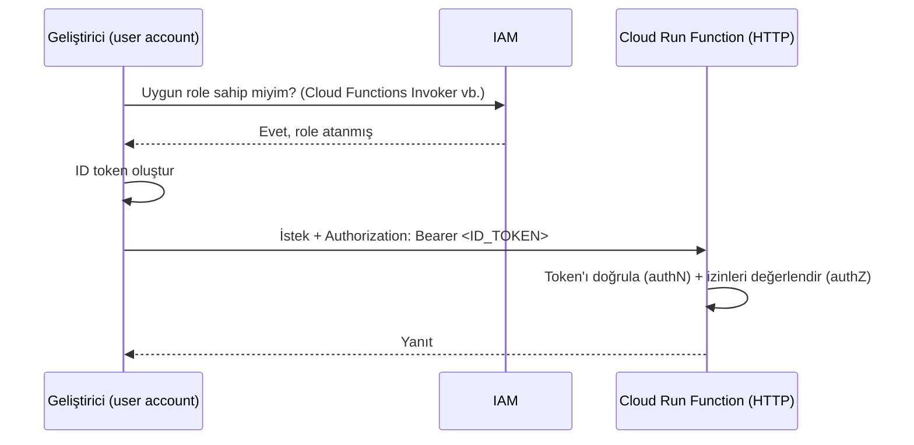
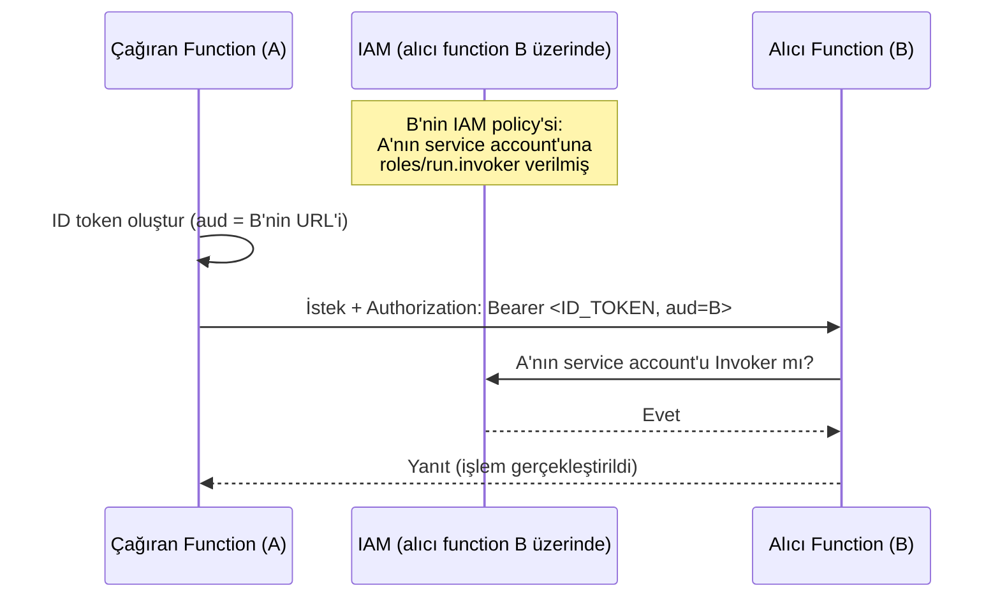
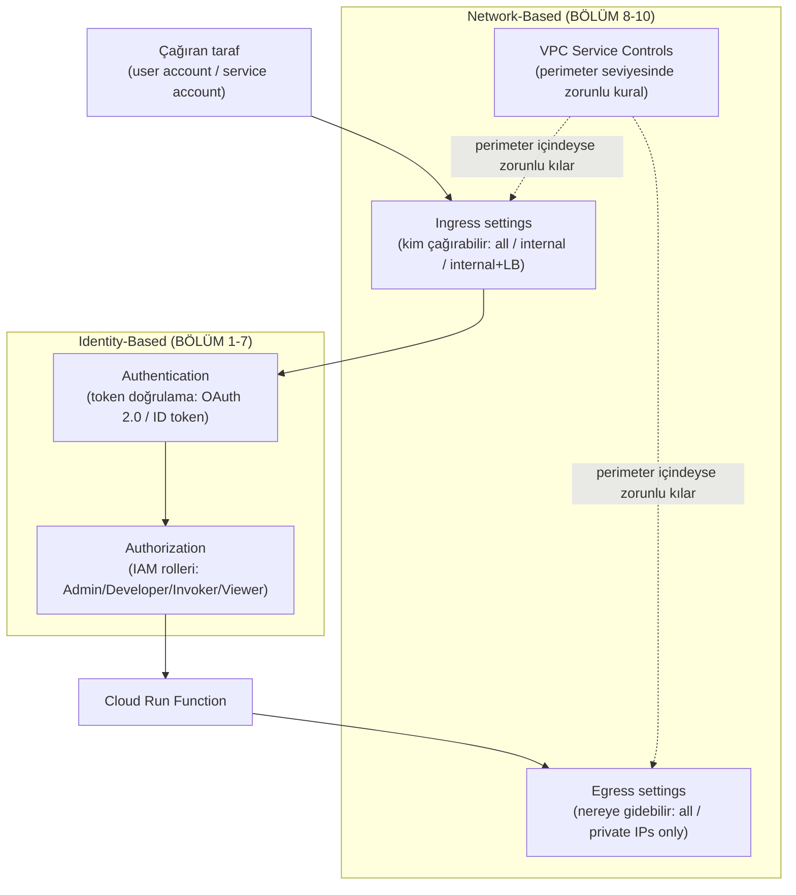
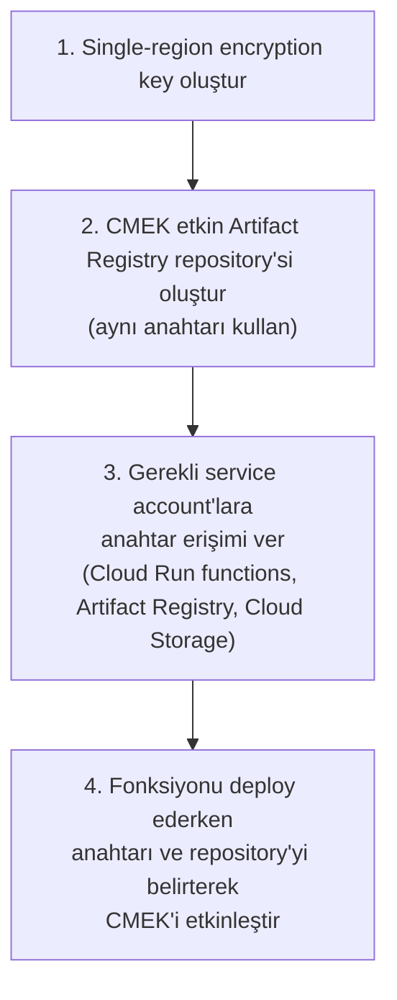
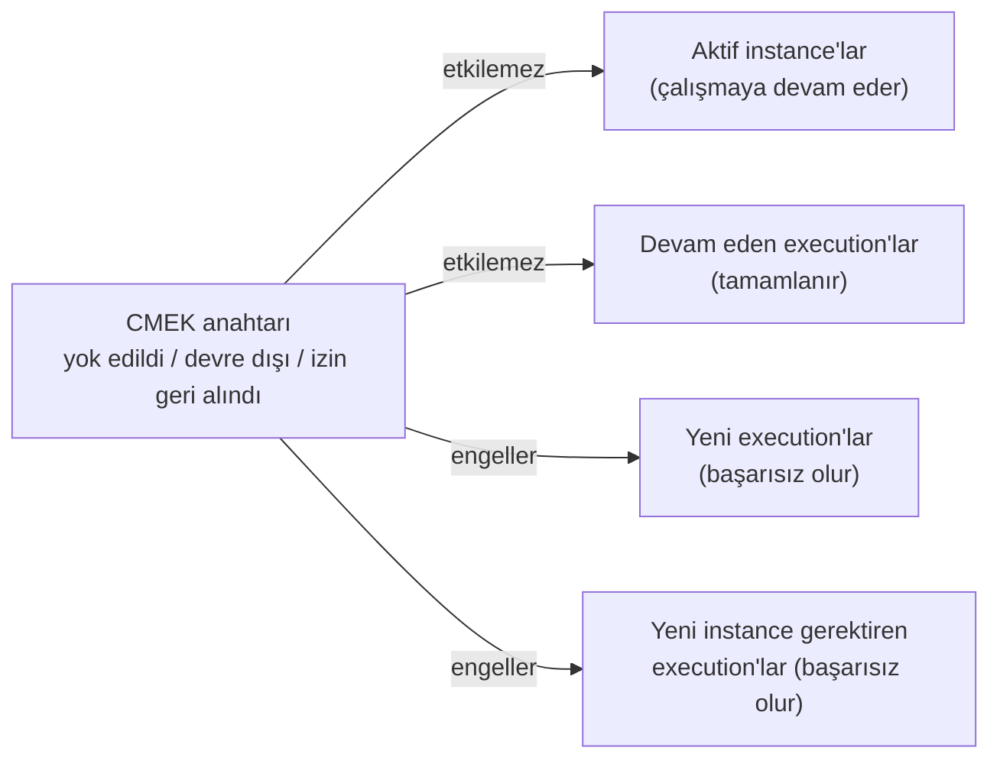

# Securing Cloud Run Functions — Baştan Sona Öğretici

> Bu metin, **"Developing Applications with Cloud Run Functions on Google Cloud"** kursunun **Modül 3 — Securing Cloud Run Functions** dersinde anlatılan **her şeyi** kavratmak için yazıldı. Önceki modülde (`deep-dive/13-calling-and-connecting-cloud-run-functions`) bir fonksiyonun **nasıl çağrıldığını** (trigger'lar), **başka servislerle nasıl zincirlendiğini** (Workflows) ve **kendi VPC network'üne nasıl eriştiğini** (Serverless VPC Access) öğrenmiştik. Bu modül, tamamen farklı ama tamamlayıcı bir soruya odaklanıyor: **"Bu bağlantıların hiçbiri yanlış ellere geçmesin diye ne yapıyoruz?"**
>
> **Kapsam notu:** Bu doküman, "Developing Applications with Cloud Run Functions on Google Cloud" kursunun **Modül 3**'ünü kapsıyor. Önceki modül `deep-dive/13-calling-and-connecting-cloud-run-functions/calling-and-connecting-cloud-run-functions.md` dosyasındadır; kursun ilerleyen modülleri eklendikçe bu handbook'a `deep-dive/15-...` gibi yeni numaralı modüller olarak eklenmeye devam edecek.

---

## Bu ders tam olarak neyi öğretiyor ve neden önemli?

Modül, güvenliği iki büyük eksene ayırıyor: **erişimi kim/ne yapabilir** (identity-based ve network-based access control) ve **veriyi kim okuyabilir** (encryption ile koruma). Bunlar, birbirinden bağımsız iki soru gibi görünse de, aslında aynı hedefe hizmet ediyor: *"Bu fonksiyona ve onun verisine, sadece olması gerekenler erişebilsin."*

1. **Kimlik tabanlı erişim kontrolü (BÖLÜM 1-7)** — fonksiyonu **kim** çağırabilir, **hangi izinlerle**? Bu, "seni tanıyorum, ve sana ne yapmana izin verdiğimi biliyorum" sorusudur.
2. **Network tabanlı erişim kontrolü (BÖLÜM 8-10)** — fonksiyona **nereden** trafik gelebilir ve fonksiyon **nereye** trafik gönderebilir? Bu, kimliğin ötesinde, **ağın kendisini** daraltma sorusudur.
3. **Encryption ile koruma (BÖLÜM 11-14)** — fonksiyonun kodu, build çıktıları ve ilişkili verisi, **disk üzerinde otururken (at rest)** kim tarafından okunabilir? Bu, doğru kimlik ve doğru ağdan gelse bile, **anahtara erişimi olmayan hiç kimsenin** veriyi okuyamaması sorusudur.

Önceki modülde "izole bir fonksiyonu gerçek bir uygulamanın parçası haline nasıl getiririm" sorusuna cevap vermiştik. Bu modül, o sorunun doğal devamıdır: *"Bu parçaları birbirine bağladıktan sonra, bu bağlantıları nasıl kilit altına alırım?"*

---

# BÖLÜM 1 — İki Erişim Kontrolü Ekseni: Identity-Based ve Network-Based

## Neden iki ayrı mekanizmaya ihtiyaç var?

Ders, Cloud Run functions'a erişimi güvenli hale getirmenin iki temel yolunu tanımlıyor: **identity-based access controls (kimlik tabanlı erişim kontrolleri)** ve **network-based access controls (ağ tabanlı erişim kontrolleri).**

Bu ikisi, birbirinin **yerine geçmez** — birbirini **tamamlar.** Identity-based kontroller "bu isteği kim yaptı, ve bu kişinin/servisin bunu yapmaya izni var mı?" sorusuna cevap verirken, network-based kontroller "bu istek nereden geldi, ve o kaynaktan gelen trafiğe izin veriyor muyum?" sorusuna cevap verir.

> **Analoji:** Bunu, güvenlikli bir bina girişine benzet. **Identity-based kontrol**, güvenlik görevlisinin senin kimliğini kontrol edip, hangi katlara girme yetkin olduğuna bakması gibidir (kimliğin geçerli mi, ve bu kimlikle bu kata girebiliyor musun?). **Network-based kontrol** ise, binanın hangi kapılardan girişe izin verdiğidir — bazı kapılar sadece binanın **kendi otoparkından** gelenlere açıktır, sokaktan doğrudan girilemez. Geçerli bir kimlik kartın olsa bile, **yanlış kapıdan** girmeye çalışıyorsan içeri alınmazsın. İkisi birlikte, hem "kimsin" hem "neredensin" sorularını kapatarak çok katmanlı bir savunma (defense in depth) oluşturur.

## Identity-based erişim kontrolünün iki adımı

Identity-based erişim kontrolü kendi içinde iki sıralı adımdan oluşur:

1. **Authentication (kimlik doğrulama)** — istek sahibinin kimlik bilgisini (identity credential) doğrulayıp, **gerçekten iddia ettiği kişi/servis olduğunu** teyit etme adımı.
2. **Authorization (yetkilendirme)** — kimliği doğrulanmış istek sahibinin **erişim seviyesinin veya izinlerinin** değerlendirilmesi adımı.

Bu sıra önemlidir: **önce kim olduğun** doğrulanır, **sonra ne yapabileceğin** değerlendirilir. Kimliği doğrulanamayan bir istek sahibinin, izinleri değerlendirilmeye bile alınmaz.

## Varsayılan davranış: private deploy

Cloud Run functions, **varsayılan olarak private (özel) olarak deploy edilir** ve **authentication gerektirir.** Bunu isteyerek **public (herkese açık)** olarak da deploy edebilir ve authentication zorunluluğunu kaldırabilirsin.

> **Sınav tuzağı — "varsayılan olarak herkese açıktır" varsayımı:** Bir sınav sorusu, yeni deploy edilmiş bir fonksiyonun varsayılan erişilebilirliğini sorabilir. Doğru cevap: **private ve authentication gerektirir** — public erişim, senin **açıkça** seçtiğin bir yapılandırmadır, varsayılan davranış değildir. Bu, "en az ayrıcalık ilkesi"nin (principle of least privilege) platform seviyesinde nasıl varsayılan hale getirildiğinin bir örneğidir.

---

# BÖLÜM 2 — İki Kimlik Türü: Service Accounts ve User Accounts

Cloud Run functions, iki farklı kimlik türünü destekler:

| Kimlik türü | Neyi temsil eder |
| --- | --- |
| **Service account** | Bir kişi olmayan bir varlığın (non-person) kimliği — bir fonksiyon, bir uygulama ya da bir VM |
| **User account** | Bir kişinin kimliği — ya bireysel bir Google Account sahibi ya da bir Google Group'un parçası olarak |

Bu ayrım, önceki kurstan (IAM temel kavramları) tanıdık gelmeli: **service account**'lar makineler-arası (machine-to-machine) etkileşimler için, **user account**'lar ise insan etkileşimleri için tasarlanmıştır. Cloud Run functions bağlamında bu ayrım özellikle önemlidir, çünkü bir fonksiyonu kimin çağırdığına göre (bir geliştirici mi test ediyor, yoksa başka bir servis mi çağırıyor) hangi kimlik türünün kullanılacağı değişir — bunu BÖLÜM 5'te detaylıca göreceğiz.

---

# BÖLÜM 3 — Token Tabanlı Kimlik Doğrulama: OAuth 2.0 ve OIDC

## Neden doğrudan credential yerine token kullanılır?

Cloud Run functions'a authenticate olmak için, istemciler **service account ya da user account credential'ına dayalı bir token oluşturur.** Bu token:

- **Sınırlı bir ömre (limited lifetime)** sahiptir,
- İstekle **birlikte gönderilir (passed with the request)**,
- Hesabı **güvenli bir şekilde** doğrulamaya yarar.

> **Bu neden önemli — token'ın asıl amacı nedir?** Ders açıkça şunu belirtiyor: token tabanlı kimlik doğrulama, **service ya da user account credential'ının sızması (leak olması) durumunda oluşabilecek potansiyel zararı sınırlamak** için kullanılır. Eğer istemciler her istekte doğrudan ham credential'ı (örneğin bir service account anahtarını) gönderselerdi, bu credential bir yerde loglanır, yakalanır ya da sızarsa, saldırgan **süresiz olarak** o kimlikle hareket edebilirdi. Ama sızan şey **sınırlı ömürlü bir token** ise, saldırganın penceresi token'ın süresi dolana kadar ile sınırlıdır — zararın "yarı ömrünü" kısaltan bir güvenlik tasarımıdır.

## İki token türü

Cloud Run functions, iki tür token kullanır:

| Token türü | Ne için kullanılır |
| --- | --- |
| **OAuth 2.0 access token** | API çağrılarını authenticate etmek için |
| **ID token** | Geliştirici tarafından yazılmış koda yapılan çağrıları authenticate etmek için (örneğin bir fonksiyonun başka bir fonksiyonu çağırması) |

Bu iki token, **OAuth 2.0 framework**'ü ve **OpenID Connect (OIDC)** kullanılarak oluşturulur.

> **Bu ayrımı nasıl hatırlamalısın?** OAuth 2.0 access token, "Google Cloud API'lerine (Cloud Storage, Pub/Sub gibi) bir şey yapmak istiyorum" senaryosu için; ID token ise "senin yazdığın bir fonksiyonu/servisi çağırmak istiyorum, ve bunun gerçekten benden geldiğini kanıtlamak istiyorum" senaryosu içindir. BÖLÜM 7'de göreceğin fonksiyon-fonksiyon çağrılarında kullanılan token, **her zaman bir ID token'dır** — çünkü orada bir Google API'sine değil, senin kendi kodunun bir API endpoint'ine erişiyorsun.

---

# BÖLÜM 4 — Yetkilendirme: IAM Rolleri ve Cloud Run Functions'a Özgü Roller

## Yetkiler nasıl değerlendirilir?

Kimliği doğrulanan bir varlığın izinleri değerlendirilirken, bu izinler **hesap kurulurken (set up edilirken)** tanımlanmış olan izinlerdir. Cloud Run functions, izinleri değerlendirmek için **Identity and Access Management (IAM)**'ı, **rol (role)** kavramı üzerinden kullanır.

Bir **rol**, birlikte gruplanmış ve bir hesaba — doğrudan ya da bir policy configuration aracılığıyla — atanmış bir izin kümesidir. Rol içindeki her tekil izin, genellikle ilgili servisin açığa çıkardığı **tek bir REST API çağrısına** karşılık gelir.

## Cloud Run functions'a özgü predefined roller

Cloud Run functions'ın desteklediği predefined roller şunlardır:

| Rol | Amaç (genel çerçeve) |
| --- | --- |
| **Cloud Functions Admin** | Fonksiyonlar üzerinde tam yönetim yetkisi |
| **Cloud Functions Developer** | Fonksiyonları geliştirme/deploy etme yetkisi |
| **Cloud Functions Invoker** | Fonksiyonu çağırma (invoke etme) yetkisi |
| **Cloud Functions Viewer** | Fonksiyonları salt-okunur görüntüleme yetkisi |

Bir fonksiyona **administrative işlemler** (oluşturma, güncelleme, silme gibi) yapma yetkisi vermek için, fonksiyona **principal**'lar (bir user ya da service account email'i) uygun IAM rolleriyle birlikte eklersin. Bunu **Google Cloud console**'da ya da **gcloud CLI** ile yapabilirsin.

> **Sınav tuzağı — dört rolü birbirine karıştırmak:** Sınav, bu dört rolün isimlerini birbirine yakın vererek seni yormaya çalışabilir. Aklında tutman gereken basit kural: **Admin** = her şeyi yönet, **Developer** = kod yaz/deploy et, **Invoker** = sadece çağır, **Viewer** = sadece bak. Özellikle **Invoker** rolü, BÖLÜM 7'de fonksiyon-fonksiyon çağrılarında merkezi bir rol oynayacak — onu şimdiden ayırt etmeyi öğren: Invoker, fonksiyonu **değiştirme** yetkisi vermez, sadece **tetikleme** yetkisi verir.

Tam rol/izin listeleri için (bu doküman onları tekrar üretmiyor, sadece kavramsal çerçeveyi veriyor): "Cloud Functions IAM Roles" dokümantasyonuna ve "Access control with IAM" dokümantasyonuna bakılması öneriliyor.

---

# BÖLÜM 5 — Fonksiyonu Kim Çağırabilir? Event-Driven vs. HTTP Functions

Bir önceki modülden hatırlayacağın gibi, Cloud Run functions iki türdedir: **event-driven** ve **HTTP.** Bu ayrım, "kim çağırabilir" sorusuna da farklı cevaplar üretiyor.

## Event-driven functions: sadece abone olunan kaynak çağırabilir

**Event-driven functions, yalnızca abone oldukları (subscribed) event kaynağı tarafından invoke edilebilir.** Yani bir Pub/Sub trigger'lı fonksiyonu, rastgele bir istemci doğrudan çağıramaz — sadece o topic'e mesaj publish edildiğinde, Eventarc mekanizması üzerinden tetiklenir.

> **Bu neden bir güvenlik özelliği sayılır?** Bir önceki modülde trigger'ları **işlevsellik** açısından öğrenmiştik ("fonksiyon neye tepki verir"); burada aynı mekanizmayı **güvenlik** açısından görüyoruz. Event-driven bir fonksiyonun çağrılabilirliği, doğası gereği **dar ve öngörülebilir**dir — sadece belirlenen tek bir kaynaktan gelen event'lere tepki verir. Bu, saldırı yüzeyini otomatik olarak daraltır: rastgele bir HTTP isteğiyle bu fonksiyonu tetikleyemezsin, çünkü ona bir HTTP endpoint'i olarak değil, bir event abonesi olarak davranılır.

## HTTP functions: farklı kimlik türleri çağırabilir, ID token gerekir

**HTTP functions ise farklı kimlik türleri tarafından çağrılabilir** — örneğin fonksiyonu test eden bir geliştirici, ya da fonksiyonu kullanan bir servis. Bu kimliklerin, authentication ve authorization için **uygun izinlere sahip bir ID token sağlaması gerekir.**

## Geliştirici olarak test etme akışı

Bir fonksiyonu geliştirici olarak test ederken izlemen gereken sıralı adımlar şunlardır:

1. Çağrılan fonksiyon üzerinde **uygun izinleri içeren bir role sahip** bir **user account**'un olması gerekir.
2. Bu hesabı kullanarak bir **ID token** oluşturursun.
3. Bu token'ı, fonksiyona yapılan isteğin **`Authorization` header**'ında geçirirsin.

```text
Authorization: Bearer <ID_TOKEN>
```

> **Analoji:** Bunu, özel bir etkinliğe girmeye benzet. Kapıda sadece "ben davetliyim" demek yetmez (kimlik iddiası) — davetiyeni (ID token) göstermen ve bu davetiyenin **o etkinlik için** (audience — BÖLÜM 7'de detaylandıracağız) geçerli olması gerekir. `Authorization` header'ı, bu davetiyeyi kapı görevlisine (fonksiyona) uzattığın andır.



---

# BÖLÜM 6 — Runtime Service Account: Fonksiyonun Kendi Kimliği

## Runtime service account nedir?

Fonksiyonlar, işlerini yapmak için sıklıkla Google Cloud'daki **başka kaynaklara erişime** ihtiyaç duyar (bir Cloud Storage bucket'ına yazmak, bir Pub/Sub topic'ine publish etmek gibi). Her fonksiyon, **başka kaynaklara eriştiğinde kendi kimliği olarak** görev yapan bir service account ile ilişkilendirilir. Bu service account, fonksiyonun **runtime service account**'ı olarak bilinir.

> **Bu, BÖLÜM 2'deki service account kavramından farklı bir şey mi?** Hayır — aynı kavramın, belirli bir role'de kullanılmasıdır. BÖLÜM 2'de service account'ı "fonksiyonu çağıran taraf" bağlamında görmüştük (biri fonksiyonu çağırırken kullandığı kimlik). Burada aynı service account kavramını, **fonksiyonun kendisinin, başka bir şeyi çağırırken kullandığı kimlik** olarak görüyoruz. Yön tersine döndü: orada "bana kim geliyor", burada "ben kime gidiyorum."

## Varsayılan runtime service account — sadece test/geliştirme için

Cloud Run functions, fonksiyon kimliği için **varsayılan bir runtime service account** kullanır:

- **Compute Engine default service account** (Cloud Run functions için), veya
- **App Engine default service account** (1st generation için).

> **Sınav tuzağı — varsayılan service account'ı production'da kullanmak:** Ders açıkça şunu söylüyor: **varsayılan service account'ı sadece test ve geliştirme amaçlı kullan.** Bunun nedeni, varsayılan service account'ların genellikle **geniş, proje-seviyesinde izinlere** sahip olmasıdır — bu, "en az ayrıcalık ilkesi"ne (least privilege) doğrudan aykırıdır. Bir sınav sorusu, production'a deploy edilen bir fonksiyonun varsayılan service account'ı kullanıp kullanmaması gerektiğini sorarsa, cevap: **hayır** — production için **ayrı, özel (dedicated) bir runtime service account** belirtmen ve ona **sadece ihtiyaç duyduğu minimum izin kümesini** vermen gerekir.

## Production için kural: dedicated + minimum izin

Production için, fonksiyonu deploy ederken **farklı, bireysel bir runtime service account** belirt, ve bu service account'a **sadece hedefine ulaşmak için gereken minimum izin kümesini** ver.

---

# BÖLÜM 7 — Fonksiyondan Fonksiyona Çağrı: `roles/run.invoker` ve ID Token ile Audience

## Sorun: birden fazla fonksiyonu birbirine bağlarken erişimi daraltmak

Birden fazla fonksiyonu birbirine bağlayan servisler inşa ederken, **her fonksiyonun sadece belirli bir fonksiyon alt kümesine istek gönderebilmesini** sağlaman gerekir. Yani "herhangi bir fonksiyon, herhangi bir başka fonksiyonu çağırabilir" gibi gevşek bir varsayılan durum istemezsin — bu, önceki modülde Workflows ile gördüğün "fonksiyonları birbirine bağlama" fikrinin **güvenlik tarafı**dır.

## Çözüm: alıcı fonksiyona, çağıran fonksiyonun kimliğine Invoker rolü ver

Bir alıcı fonksiyonu (receiving function), belirli bir çağıran fonksiyondan (calling function) gelen istekleri kabul edecek şekilde yapılandırmak için:

- **Cloud Run functions için:** çağıran fonksiyonun **service account**'una, alıcı fonksiyon üzerinde **Cloud Run Invoker (`roles/run.invoker`)** rolünü ver.
- **Cloud Run functions (1st generation) için:** aynı şeyi **Cloud Run functions Invoker (`roles/cloudfunctions.invoker`)** rolüyle yap.

## Çağıran fonksiyon ne sağlamalı?

Çağıran fonksiyon, kimlik doğrulaması için **Google tarafından imzalanmış bir ID token** sağlamalıdır — ve bu token'ın **`audience` (`aud`) alanı, alıcı fonksiyonun URL'ine ayarlanmış olmalıdır.**

ID token, isteğin **`Authorization` header**'ında gönderilmelidir (BÖLÜM 5'teki geliştirici test akışıyla aynı mekanizma — tek fark, token'ı burada bir kişi değil, çağıran fonksiyonun kendisi oluşturur).

> **`audience` (`aud`) alanı neden bu kadar kritik?** `aud` alanı, token'a "bu token sadece şunun için geçerlidir" diyen bir imzadır. Eğer çağıran fonksiyon A, alıcı fonksiyon B için bir ID token oluşturursa (yani `aud = B'nin URL'i`), bu token'ı **başka bir fonksiyon C'ye** göndermeye çalışırsa, C bu token'ı **reddetmelidir** — çünkü token'ın audience'ı C değil, B'dir. Bu, sızmış bir token'ın **her yerde** kullanılabilmesini engelleyen kritik bir sınırlamadır: token, sadece **niyet edilen tek bir hedef** için geçerlidir, genel bir "her kapıyı açan anahtar" değildir.

> **Sınav tuzağı — Invoker rolünü çağıran tarafa değil, alıcı tarafa vermek:** Kolayca karışan bir nokta: Invoker rolü, **kime** verilir? Cevap: **alıcı fonksiyon üzerinde**, **çağıran fonksiyonun service account'una.** Yani rol, alıcı fonksiyonun IAM policy'sinde tanımlanır ve "bu belirli identity, beni çağırabilir" der — çağıran fonksiyonun kendi policy'sinde değil.



---

# BÖLÜM 8 — Network Tabanlı Erişim Kontrolü: Ingress Settings

## Network settings ne sağlar?

Identity-based kontrollerin ötesinde, **network settings** ile Cloud Run functions'a giden ve gelen ağ trafiğini kontrol edebilirsin. Bu ayarlar iki yöne ayrılır: **ingress (içeri giren trafik)** ve **egress (dışarı çıkan trafik).** Bu bölümde ingress'i, BÖLÜM 9'da egress'i inceleyeceğiz.

## Ingress settings: fonksiyon dışarıdan kim tarafından tetiklenebilir?

**Ingress settings**, bir fonksiyonun, senin **Google Cloud projenin ya da VPC Service Controls service perimeter'ının dışındaki** kaynaklar tarafından invoke edilip edilemeyeceğini kısıtlar.

Üç seçeneğin var:

| Ingress seçeneği | Anlamı |
| --- | --- |
| **Allow all traffic** | Her yerden gelen trafiğe izin ver |
| **Allow internal traffic only** | Sadece internal trafiğe izin ver |
| **Allow internal traffic and traffic from Cloud Load Balancing** | Internal trafiğe **ve** Cloud Load Balancing'den gelen trafiğe izin ver |

**"Internal traffic" (internal trafik)** tanımı önemlidir: **aynı proje içindeki ya da aynı VPC Service Controls perimeter'ı içindeki Workflows ve VPC network'lerinden gelen trafiktir.**

> **Bu neden BÖLÜM 1'deki "identity vs. network" ayrımının somut bir örneği?** Diyelim ki bir fonksiyona hem doğru bir ID token'la hem de "internal traffic only" ingress ayarıyla erişmeye çalışıyorsun, ama isteğin **projenin/perimeter'ın dışından** geliyor — bu istek **reddedilir**, token geçerli olsa bile. Çünkü ingress ayarı, identity-based kontrolden **önce** devreye giren, ayrı bir kapıdır. Doğru kimlik + yanlış ağ = yine de erişim yok. Bu, BÖLÜM 1'deki "binaya yanlış kapıdan girmeye çalışmak" analojisinin tam karşılığıdır.

---

# BÖLÜM 9 — Egress Settings ve Serverless VPC Access Connector

## Egress settings ne sağlar?

**Egress settings**, bir fonksiyondan giden **outbound HTTP isteklerinin yönlendirilmesini (routing)** kontrol eder.

Egress ayarlarını belirtebilmek için, önceki modülde öğrendiğin **Serverless VPC Access connector**'ı kullanarak fonksiyonları bir **VPC network**'e bağlaman gerekir. Egress ayarları, hangi trafik türlerinin bu connector üzerinden VPC network'üne yönlendirileceğini kontrol eder.

## İki egress seçeneği

| Egress seçeneği | Anlamı |
| --- | --- |
| **Route all outbound traffic through the connector** | Fonksiyondan çıkan **tüm** outbound trafiği connector üzerinden yönlendir |
| **Route only requests to private IPs through the connector** | Sadece **private IP'lere** giden istekleri connector üzerinden yönlendir |

> **Bu neden BÖLÜM 8'in aynası?** BÖLÜM 8'deki ingress, "fonksiyona **kim gelebilir**" sorusuna cevap veriyordu. Egress ise, "fonksiyon **nereye gidebilir**" sorusuna cevap veriyor — aynı iki yönlü kontrol fikrinin, trafiğin ters yönüne uygulanmış hali. İkisi birlikte, fonksiyonun etrafına hem bir **giriş filtresi** hem bir **çıkış filtresi** koyar.

> **Neden önceki modüldeki Serverless VPC Access kurulumuna bağımlı?** Egress ayarlarını belirtmek, **VPC network'e giden bir yol olmasını gerektirir** — bu yol da tam olarak önceki modülde kurduğun Serverless VPC Access connector'ıdır. Yani egress settings, connector'ın **üzerine inşa edilen bir ince ayar (fine-tuning)** katmanıdır: connector "VPC'ye bir yol var" der, egress settings ise "bu yoldan **hangi trafik** geçecek" der.

---

# BÖLÜM 10 — VPC Service Controls ile Ek Güvenlik Katmanı

## VPC Service Controls neden gerekir?

**VPC Service Controls**'u Cloud Run functions ile kullanarak, fonksiyonlarına **ek bir güvenlik katmanı** ekleyebilirsin. Bunu yapmak için:

1. Bir **service perimeter** oluşturursun.
2. Bir ya da daha fazla **proje**yi bu perimeter'a eklersin.
3. **Shared VPC**'ler için, hem **host** hem **service** projelerini perimeter'a eklersin.
4. **Cloud Functions API**'sini, perimeter içindeki fonksiyonlar için network ayarlarını kontrol eden **organization policy**'ler ayarlayarak kısıtlarsın.

## Organization policy'ler devrede olduğunda ne değişir?

Bu organization policy'ler yerinde olduğunda, üç kural devreye girer:

- **HTTP functions**, yalnızca **service perimeter içindeki bir VPC network**'ten gelen trafiği kabul eder.
- **Tüm fonksiyonlar**, bir **Serverless VPC Access connector** kullanmak **zorundadır.**
- Fonksiyonlar, **tüm egress trafiğini kendi VPC network'ün üzerinden** yönlendirmek **zorundadır.**

> **Bu neden BÖLÜM 8-9'un "opsiyonel" ayarlarını zorunlu hale getiriyor?** BÖLÜM 8-9'da ingress/egress ayarlarını, sen seçtiğin için uygulanan **isteğe bağlı** yapılandırmalar olarak gördük ("allow all traffic" da bir seçenekti). VPC Service Controls devreye girdiğinde, bu esneklik ortadan kalkar: organization policy, en sıkı ingress kuralını (**sadece perimeter içinden**) ve en sıkı egress kuralını (**tüm trafik VPC üzerinden**) **zorunlu** hale getirir. Bu, VPC Service Controls'ün neden "ek bir güvenlik katmanı" olarak tanımlandığını açıklar: senin tek tek her fonksiyon için doğru ingress/egress ayarını seçmeni beklemek yerine, **perimeter seviyesinde** bunu tüm fonksiyonlar için merkezi olarak zorunlu kılar.

> **Analoji:** BÖLÜM 8-9'daki ingress/egress ayarlarını, her bir odanın kendi kapı kilidini seçmesi gibi düşün — bazı odalar kilitli, bazıları açık kalabilir. VPC Service Controls ise, **tüm binayı çevreleyen bir güvenlik çemberi (perimeter)** kurmak gibidir: çemberin dışından kimse içeri giremez, çemberin içindekiler de dışarıya sadece belirlenen tek bir kapıdan (VPC network) çıkabilir — tek tek her odanın kilidine güvenmek yerine, **binanın tamamını** çevreleyen bir sınır çizersin.

---

# BÖLÜM 1-10'un Toplu Görünümü: Erişim Kontrolü Katmanları



---

# BÖLÜM 11 — Cloud KMS ve CMEK: Veriyi Neden ve Nasıl Korursun?

Şimdiye kadar gördüğümüz her şey — identity-based ve network-based kontroller — fonksiyona **kimin erişebileceği** ile ilgiliydi. Şimdi madalyonun öbür yüzüne bakıyoruz: doğru kimlik ve doğru ağdan gelse bile, **fonksiyonun disk üzerindeki verisini kim okuyabilir?**

## Cloud KMS ve CMEK nedir?

**Cloud Key Management Service (KMS)**'i, Cloud Run functions'ı ve ilişkili verisini **at rest (disk üzerinde dururken)** koruyan encryption key'ler oluşturmak ve yönetmek için kullanabilirsin.

Bu anahtarlar, **customer-managed encryption keys (CMEK)** olarak bilinir ve **sana ait**tir — **Google tarafından kontrol edilmezler.** CMEK'ler şu şekillerde saklanabilir:

- **Software key** olarak,
- Bir **HSM (Hardware Security Module) cluster**'ında,
- Ya da **harici olarak (externally).**

> **"Customer-managed" ifadesi tam olarak neyi değiştiriyor?** Varsayılan olarak, Google Cloud senin verini zaten encrypt eder (Google-managed encryption keys ile) — ama bu anahtarları Google yönetir, sen görmezsin bile. CMEK ile, bu denklem tersine döner: **anahtar sana aittir**, sen oluşturursun, sen döndürürsün (rotate), ve en kritik olarak, **sen devre dışı bırakabilir ya da yok edebilirsin.** Bu kontrol, aynı zamanda bir sorumluluk getirir — BÖLÜM 14'te göreceğin gibi, anahtarı yok edersen, **kimse** (Google dahil) o veriye erişemez.

## CMEK, hangi Cloud Run functions verisini korur?

Bir fonksiyonu bir CMEK ile deploy etmek, aşağıdaki veri türlerini, **sadece senin erişebildiğin bir encryption key** kullanarak korur:

| Korunan veri türü | Detay |
| --- | --- |
| **Function source code** | Deployment için upload edilen ve Google tarafından Cloud Storage'da saklanan, build sürecinde kullanılan kaynak kod |
| **Build sonuçları** | Kaynak koddan build edilen container image, ve deploy edilen her fonksiyon instance'ı |
| **Internal event transport channel'ların at-rest verisi** | Fonksiyonun event teslimi sırasında kullandığı internal kanalların dururken tuttuğu veri |

> **Anahtar devre dışı bırakılırsa ya da yok edilirse ne olur?** Eğer anahtar devre dışı bırakılır (disabled) ya da yok edilir (destroyed) ise, **hiç kimse — seni de dahil ederek — o anahtarla korunan veriye erişemez.** Bu, CMEK'in en kritik güvenlik özelliğidir: bu, veriyi "silmenin" bir yolu değil, veriyi **kriptografik olarak erişilemez** kılmanın bir yoludur (crypto-shredding). Anahtarı yok ederek, fiziksel olarak diskte duran veriyi silmeden, o veriyi **etkin bir şekilde silmiş** olursun.

---

# BÖLÜM 12 — CMEK Kurulumu: Adım Adım

Cloud Run functions için CMEK kurmak, sıralı adımlardan oluşur:

## Adım 1 — Single-region bir encryption key oluştur

CMEK kurulumunun ilk adımı, **tek bölgeli (single-region)** bir encryption key oluşturmaktır.

## Adım 2 — CMEK etkin bir Artifact Registry repository'si oluştur

Fonksiyon image'larını saklamak için, **CMEK etkinleştirilmiş bir Artifact Registry repository'si** oluşturursun. Bu repository için, **fonksiyon için CMEK'i etkinleştirmede kullandığın aynı anahtarı** kullanman gerekir.

## Adım 3 — Gerekli service account'lara anahtar erişimi ver

**Cloud Run functions, Artifact Registry ve Cloud Storage service account'larına**, anahtara erişim izni verirsin (bu adımın detaylarını BÖLÜM 13'te göreceğiz).

## Adım 4 — CMEK'i fonksiyonunda etkinleştir

Son olarak, fonksiyonunda **CMEK'i etkinleştirirsin.**



> **Sınav tuzağı — Artifact Registry repository'sine farklı bir anahtar kullanmak:** Ders özellikle vurguluyor: repository için **fonksiyonla aynı anahtarı** kullanman gerekiyor. Farklı iki anahtar kullanırsan, kurulum tutarsız hale gelir — fonksiyonun kaynak kodu bir anahtarla korunurken, build edilen container image'ı başka bir anahtarla korunmuş olur, bu da senin CMEK stratejini parçalı ve yönetilmesi zor hale getirir.

---

# BÖLÜM 13 — CMEK Kullanım Senaryosu: Cloud Storage + Eventarc ile Şifreli Nesne İşleme

## Örnek senaryo: CMEK korumalı bir Cloud Storage bucket

Ders, CMEK için somut bir kullanım senaryosu (use case) veriyor: **Cloud Storage bucket'larındaki nesneleri (object) saklama ve erişme.**

CMEK'leri, **tek tek nesneler üzerinde** ya da **bucket'ı, eklenen tüm yeni nesnelere varsayılan olarak bir anahtar kullanacak şekilde** yapılandırabilirsin. Upload edilen nesneler, CMEK ile **encrypted (şifrelenmiş)** olarak saklanır.

## Fonksiyonun rolü: decrypt edip okumak, ya da encrypt edip yazmak

Bu senaryoda Cloud Run functions'ın rolü iki yönlüdür:

- **Okuma yönü:** Cloud Storage bucket'ındaki nesnelerde bir değişiklik olduğunda, bir Cloud Run function **Eventarc'tan tetiklenebilir** (önceki modülden hatırla: Cloud Storage trigger, kaputun altında bir Eventarc trigger'dır). Fonksiyon daha sonra, **decrypt edilmiş nesneyi** bucket'tan alabilir (retrieve).
- **Yazma yönü:** Bunun tersini de yapabilirsin — tek tek nesneleri **encrypt eden ve Cloud Storage'a upload eden** bir fonksiyon implemente edebilirsin.

> **Bu neden önceki modülün Cloud Storage trigger konusuyla doğrudan birleşiyor?** BÖLÜM 5'te (önceki modülde) Cloud Storage trigger'ları "bir dosya yüklendiğinde fonksiyonu çalıştır" işlevselliği olarak öğrenmiştik. Burada aynı mekanizmayı, **güvenlik** bağlamında görüyoruz: dosya, sadece "yüklendiğinde bir şey olsun" değil, **encrypted olarak yüklenip, sadece yetkili bir fonksiyon tarafından decrypt edilerek okunsun** diye tasarlanmış bir akışın parçası olabilir. Trigger mekanizması aynıdır — üzerine eklenen şey, verinin CMEK ile korunmasıdır.

## Gerekli izin: hangi service account'lara ne verilir?

CMEK'leri kullanmak için, projenin **Cloud Storage service account'una** (ya da service agent'ına) anahtara erişim izni vermen gerekir.

Service account'lara anahtar erişimi vermek için:

1. Her service account'u, anahtarın bir **principal**'ı olarak ekle.
2. Bu service account'a **Cloud KMS CryptoKey Encrypter/Decrypter** rolünü ver.

Kullanılan service account email'leri şunlardır:

| Service Agent | Rolü |
| --- | --- |
| **Cloud Run Functions Service Agent** | Fonksiyonun kendisi için |
| **Artifact Registry Service Agent** | Build edilen container image'lar için |
| **Cloud Storage Service Agent** | Bucket'taki nesneler için |

Bir Artifact Registry repository'sini CMEK etkin olarak kurup, gerekli service agent'lara anahtar erişimi verdikten sonra, fonksiyonu deploy ederken **anahtarı ve repository'yi belirterek** CMEK'i fonksiyonun için etkinleştirebilirsin.

> **Sınav tuzağı — "sadece bir service account'a izin vermek yeterli" varsayımı:** CMEK zincirinin çalışması için **üç ayrı service agent**'ın (Cloud Run Functions, Artifact Registry, Cloud Storage) her birinin anahtara erişimi olması gerekir — sadece birine izin vermek yeterli değildir, çünkü zincirin her halkası (kaynak kod, build/image, nesne verisi) farklı bir servis tarafından işlenir ve her biri kendi başına anahtara erişebilmelidir.

---

# BÖLÜM 14 — Key Versiyonu Kısıtlaması ve Anahtar Yaşam Döngüsü Riskleri

## Sadece primary versiyon kullanılabilir

Cloud Run functions, CMEK koruması için anahtarın **primary versiyonunu** kullanır. **CMEK'i fonksiyonun için etkinleştirirken belirli bir key versiyonu seçemezsin** — bu bir kısıtlamadır, bir seçenek değil.

> **Bu neden bir kısıtlama olarak vurgulanıyor?** Cloud KMS'te, bir anahtarın zaman içinde birden fazla versiyonu olabilir (rotation ile). Birçok senaryoda, hangi versiyonun kullanılacağını seçebilirsin. Ama Cloud Run functions'ın CMEK entegrasyonu, bu esnekliği sunmaz — her zaman **o anki primary versiyonu** kullanır. Bir sınav sorusu "belirli bir key versiyonunu CMEK için sabitleyebilir miyim?" diye sorarsa, cevap **hayır**dır.

## Anahtar devre dışı bırakılır, yok edilir ya da izinler geri alınırsa ne olur?

Eğer bir anahtar **yok edilir (destroyed)**, **devre dışı bırakılır (disabled)**, ya da anahtar üzerindeki gerekli izinler **geri alınır (revoked)** ise, dört farklı davranış söz konusu olur:

| Durum | Davranış |
| --- | --- |
| **Aktif fonksiyon instance'ları** | **Kapatılmaz** — çalışmaya devam ederler |
| **Zaten devam eden execution'lar** | **Çalışmaya devam eder** ve tamamlanır |
| **Yeni execution'lar** | Cloud Run functions anahtara erişimi olmadığı sürece **başarısız olur** |
| **Yeni fonksiyon instance'ı gerektiren execution'lar** | **Başarısız olur** |

> **Bu dört davranışı nasıl tek bir mantıkla hatırlarsın?** Kural basit: **anahtara erişim, sadece yeni bir şey başlatılırken kontrol edilir; hâlihazırda çalışan hiçbir şey durdurulmaz.** Zaten bellekte çalışan bir instance, ya da zaten başlamış bir execution, anahtarın o anki durumundan etkilenmez — çünkü anahtara erişim ihtiyacı genellikle **başlangıçta** (decrypt işlemi sırasında) gerçekleşmiştir. Ama **yeni** bir şey — yeni bir execution, yeni bir instance — başlatılmak istendiğinde, sistem anahtara **tekrar** erişmeye çalışır, ve bu erişim yoksa **başarısız olur.**

> **Sınav tuzağı — "anahtar yok edilirse fonksiyon anında durur" varsayımı:** Bu, sınavda sıkça yanlış anlaşılan bir noktadır. Bir anahtar yok edildiğinde, Cloud Run functions **çalışan hiçbir şeyi zorla durdurmaz** — devam eden execution'lar tamamlanana kadar çalışmaya devam eder. Etki, sadece **yeni** işlemler üzerinde, ve **kademeli olarak** (yeni instance gerektiren her execution başarısız olmaya başladıkça) hissedilir. Bu, CMEK'in "acil kapatma düğmesi" gibi anlık bir etki yaratmadığını, aksine **yeni erişimi engelleyen bir kapı** gibi çalıştığını gösterir.



---

# Toplu Özet (Hızlı Tekrar)

**Modülün ana fikri:** Bu modül, önceki modülde birbirine bağlanan fonksiyonları **kim çağırabilir**, **fonksiyon nereye/nereden trafik alıp verebilir**, ve **fonksiyonun verisini kim okuyabilir** sorularına cevap veriyor — sırasıyla identity-based erişim kontrolü, network-based erişim kontrolü, ve CMEK ile encryption üzerinden.

**İki erişim kontrolü ekseni (BÖLÜM 1):** Identity-based (kimlik doğrulama + yetkilendirme) ve network-based (nereden/nereye) kontroller birbirini tamamlar. Fonksiyonlar varsayılan olarak **private**'dır ve authentication gerektirir.

**İki kimlik türü (BÖLÜM 2):** Service account (kişi olmayan varlıklar) ve user account (kişiler/Google Groups).

**Token tabanlı authentication (BÖLÜM 3):** İstemciler, credential sızıntısının etkisini sınırlamak için sınırlı ömürlü token'lar kullanır — OAuth 2.0 access token (API çağrıları için) ve ID token (geliştirici kodu çağrıları için), OAuth 2.0 ve OIDC ile oluşturulur.

**IAM rolleri (BÖLÜM 4):** Cloud Functions Admin, Developer, Invoker, Viewer — her biri REST API çağrılarına karşılık gelen izin kümeleridir; principal'lara console ya da gcloud CLI ile atanır.

**Kim çağırabilir (BÖLÜM 5):** Event-driven functions sadece abone oldukları event kaynağı tarafından çağrılabilir. HTTP functions, uygun izinlere sahip bir ID token sağlayan farklı kimlikler tarafından çağrılabilir; token, `Authorization` header'ında gönderilir.

**Runtime service account (BÖLÜM 6):** Fonksiyonun başka kaynaklara erişirken kullandığı kimliktir. Varsayılan (Compute Engine / App Engine default SA), sadece test/geliştirme içindir; production'da dedicated bir SA + minimum izin gerekir.

**Fonksiyondan fonksiyona çağrı (BÖLÜM 7):** Alıcı fonksiyona, çağıran fonksiyonun service account'una `roles/run.invoker` (ya da 1st gen'de `roles/cloudfunctions.invoker`) verilir. Çağıran fonksiyon, `aud` alanı alıcının URL'ine ayarlanmış, Google-signed bir ID token sağlar.

**Ingress settings (BÖLÜM 8):** Allow all / internal only / internal + Cloud Load Balancing seçenekleriyle, fonksiyonu projenin/perimeter'ın dışından gelen trafiğe karşı kısıtlar.

**Egress settings (BÖLÜM 9):** Serverless VPC Access connector'ı kullanarak, outbound trafiği tüm trafik ya da sadece private IP'ler olarak yönlendirir.

**VPC Service Controls (BÖLÜM 10):** Service perimeter + organization policy'ler ile ek bir güvenlik katmanı ekler; perimeter aktifken HTTP functions sadece perimeter içinden trafik kabul eder, tüm fonksiyonlar bir connector kullanmak zorundadır, ve tüm egress VPC network üzerinden geçmek zorundadır.

**Cloud KMS ve CMEK (BÖLÜM 11):** Sana ait, Google tarafından kontrol edilmeyen encryption key'ler (software, HSM, ya da harici) — function source code, build sonuçları (image + instance'lar) ve internal event transport channel verisini at-rest korur. Anahtar yok edilirse, kimse veriye erişemez.

**CMEK kurulumu (BÖLÜM 12):** (1) Single-region key oluştur. (2) Aynı anahtarla CMEK etkin bir Artifact Registry repository'si oluştur. (3) Cloud Run functions, Artifact Registry, Cloud Storage service account'larına erişim ver. (4) Fonksiyonda CMEK'i etkinleştir.

**CMEK kullanım senaryosu (BÖLÜM 13):** Cloud Storage bucket'ları, nesne bazında ya da varsayılan olarak CMEK kullanabilir; bir fonksiyon Eventarc'tan tetiklenip decrypted nesneyi alabilir, ya da nesneleri encrypt edip upload edebilir. Üç service agent'ın (Cloud Run Functions, Artifact Registry, Cloud Storage) her birine, principal olarak eklenip Cloud KMS CryptoKey Encrypter/Decrypter rolü verilmelidir.

**Key versiyonu ve yaşam döngüsü riskleri (BÖLÜM 14):** Sadece primary key versiyonu kullanılır, belirli bir versiyon seçilemez. Anahtar yok edilir/devre dışı bırakılır/izinleri geri alınırsa: aktif instance'lar kapatılmaz, devam eden execution'lar tamamlanır, ama yeni execution'lar ve yeni instance gerektiren execution'lar başarısız olur.

---

# En Kritik Ayrımlar / Hızlı Tekrar (Cebinde Taşı)

- **Fonksiyonlar varsayılan olarak private'dır ve authentication gerektirir** — public erişim, açıkça seçilen bir yapılandırmadır.
- **Authentication önce, authorization sonra:** Kimlik doğrulanmadan izinler değerlendirilmez.
- **OAuth 2.0 access token → API çağrıları; ID token → geliştirici kodu çağrıları** (fonksiyondan fonksiyona çağrılar dahil).
- **Cloud Functions Admin/Developer/Invoker/Viewer:** Invoker, sadece çağırma yetkisi verir — değiştirme yetkisi vermez.
- **Event-driven functions sadece abone oldukları event kaynağı tarafından çağrılabilir** — rastgele bir HTTP isteğiyle tetiklenemezler.
- **Runtime service account'un varsayılanı (Compute Engine/App Engine default SA) sadece test/geliştirme içindir** — production'da dedicated SA + minimum izin gerekir.
- **Fonksiyondan fonksiyona çağrıda, Invoker rolü alıcı fonksiyon üzerinde, çağıranın service account'una verilir** — tersi değil.
- **ID token'ın `aud` alanı, sadece belirtilen hedef için geçerlidir** — başka bir fonksiyona gönderilirse reddedilir.
- **Ingress = kim çağırabilir (allow all / internal only / internal + LB); Egress = nereye gidebilir (tüm trafik / sadece private IP'ler, connector üzerinden).**
- **VPC Service Controls, ingress/egress'i perimeter seviyesinde zorunlu kılar** — organization policy'ler devredeyken HTTP functions sadece perimeter içinden trafik kabul eder, tüm fonksiyonlar connector kullanmak zorundadır, tüm egress VPC üzerinden geçer.
- **CMEK, sana ait bir anahtardır — Google kontrol etmez.** Kaynak kodu, build sonuçlarını (image + instance) ve internal event transport'un at-rest verisini korur.
- **CMEK kurulumunda, fonksiyon ve Artifact Registry repository'si aynı anahtarı kullanmalıdır.**
- **Üç service agent'a (Cloud Run Functions, Artifact Registry, Cloud Storage) Cloud KMS CryptoKey Encrypter/Decrypter rolü verilmelidir.**
- **CMEK sadece anahtarın primary versiyonunu kullanır** — belirli bir versiyon seçilemez.
- **Anahtar yok edilirse/devre dışı bırakılırsa: çalışan hiçbir şey anında durmaz** — sadece yeni execution'lar ve yeni instance gerektiren execution'lar başarısız olur.

---

> **Kapanış:** Bu modül, önceki modülde birbirine bağladığın Cloud Run functions'ı **güvence altına almanın** üç katmanını öğretti: **identity-based erişim kontrolü** ile fonksiyonu kimin, hangi izinlerle çağırabileceğini (authentication + authorization, token'lar, IAM rolleri, runtime service account, fonksiyondan fonksiyona çağrı); **network-based erişim kontrolü** ile fonksiyona nereden trafik girebileceğini ve fonksiyonun nereye trafik gönderebileceğini (ingress, egress, VPC Service Controls); ve **CMEK ile encryption** ile fonksiyonun kodunun, build çıktılarının ve ilişkili verisinin, at rest hâldeyken sadece senin kontrol ettiğin bir anahtarla korunmasını. Bu üç katman birlikte, önceki modülde inşa ettiğin bağlantılı, çok parçalı sistemi, **sadece doğru kimliklerin, doğru ağlardan, doğru verilere eriştiği** güvenli bir sisteme dönüştürüyor. Kursun ilerleyen modüllerinin transkriptleri eklendikçe, bu handbook'a yeni numaralı modüller olarak eklenmeye devam edecek.
