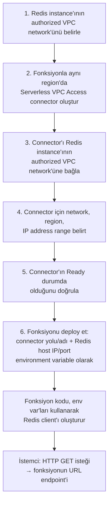
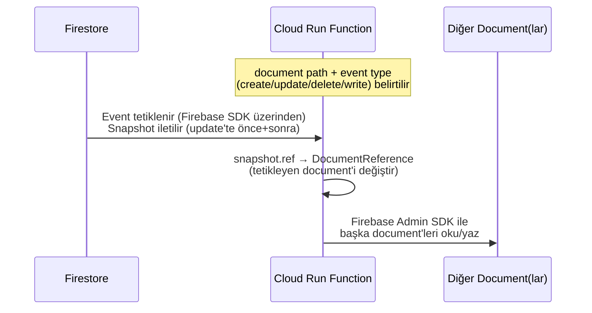
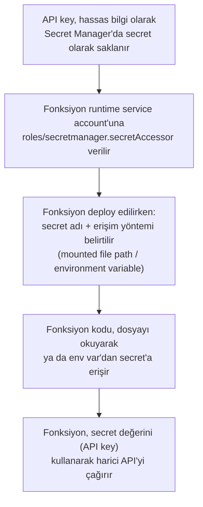
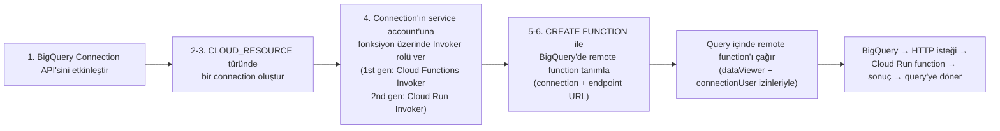

# Integrating with Cloud Databases — Baştan Sona Öğretici

> Bu metin, **"Developing Applications with Cloud Run Functions on Google Cloud"** kursunun **Modül 4 — Integrating with Cloud Databases** dersinde anlatılan **her şeyi** kavratmak için yazıldı. Önceki üç modülde sırasıyla Cloud Run functions'ın **ne olduğunu** (Modül 1), **nasıl çağrılıp bağlandığını** (Modül 2), ve **nasıl güvence altına alındığını** (Modül 3) öğrendik. Bu modül, bambaşka ama son derece pratik bir soruya odaklanıyor: **"Bir fonksiyon, gerçek veriyi nerede tutar, ve o veriye nasıl güvenli bir şekilde ulaşır?"**
>
> **Kapsam notu:** Bu doküman, "Developing Applications with Cloud Run Functions on Google Cloud" kursunun **Modül 4**'ünü kapsıyor. Önceki modül `deep-dive/14-securing-cloud-run-functions/securing-cloud-run-functions.md` dosyasındadır; kursun ilerleyen modülleri eklendikçe bu handbook'a `deep-dive/16-...` gibi yeni numaralı modüller olarak eklenmeye devam edecek.

---

## Bu ders tam olarak neyi öğretiyor ve neden önemli?

Ders, açılışında Cloud Run functions'ın entegre olabileceği veritabanlarının tam listesini veriyor: **Firestore, Cloud SQL, Spanner, Bigtable, BigQuery** ve **Memorystore.** Ama bu modül, hepsini aynı derinlikte işlemiyor — **iki tanesine** (Memorystore ve Firestore) derinlemesine odaklanıyor, ve bir ek okuma parçası olarak **BigQuery Remote Functions**'ı ekliyor. Diğerleri (Cloud SQL, Spanner, Bigtable) için dokümantasyona yönlendiriliyoruz.

Bu seçim rastgele değil — Memorystore ve Firestore, iki **farklı bağlanma modelini** temsil ediyor:

1. **Memorystore (BÖLÜM 1-3)** — fonksiyonun, **kendi kodundan aktif olarak** bir veritabanına bağlandığı model. Fonksiyon, bir client kütüphanesi kullanarak Redis'e **bağlanır**, sorgu **gönderir**, yanıt **alır**. Bu, "ben veritabanına giderim" modelidir.
2. **Firestore (BÖLÜM 4-6)** — fonksiyonun, veritabanındaki **değişikliklere tepki verdiği** model (event-driven). Firestore'da bir belge değiştiğinde, fonksiyon **otomatik olarak tetiklenir.** Bu, "veritabanı bana gelir" modelidir. (Firestore'a doğrudan sorgu da atabilirsin — ama bu modülün odak noktası, trigger tabanlı entegrasyondur.)

Bu iki modelin üzerine, modül iki tamamlayıcı konu daha ekliyor: **environment variables** (BÖLÜM 3) — bağlantı bilgilerini nasıl yapılandırırsın, ve **secrets** (BÖLÜM 7-9) — hassas kimlik bilgilerini (credential) nasıl güvenli tutarsın. Son olarak, **BigQuery Remote Functions** (BÖLÜM 10-11), Cloud Run functions'ı tamamen farklı bir yönden — **SQL sorgularının içinden** — çağırmanın bir yolunu gösteriyor.

---

# BÖLÜM 1 — Memorystore Nedir?

## Memorystore'un sağladığı temel değer

**Memorystore**, **Redis** ve **Memcached** için **yüksek erişilebilirlikli (highly available), ölçeklenebilir ve güvenli** bir in-memory cache çözümü sağlayan bir Google Cloud servisidir.

Tam yönetilen (fully managed) bir servis olarak, şunları **otomatikleştirir:**

- **Provisioning** (kaynak sağlama)
- **Replication** (çoğaltma)
- **Failover** (yük devretme)
- **Patching** (yama uygulama)

Ayrıca:

- **IAM** ile entegredir — güvenli erişim için.
- **Cloud Monitoring** ile entegredir — servis izleme ve alerting için.

> **Bu neden önemli?** "Fully managed" ifadesi burada somut bir anlam taşıyor: Redis ya da Memcached'i **kendi başına** işletmek istesen, bir cluster kurman, node'ların sağlığını izlemen, bir node çöktüğünde failover'ı elle (ya da kendi yazdığın otomasyonla) yönetmen, güvenlik yamalarını takip edip uygulaman gerekirdi. Memorystore, bu **operasyonel yükün tamamını** senden alır — sen sadece bir cache instance'ı istersin, Google onu ayakta tutar.

## Redis ve Memcached nedir?

Ders, iki alttaki teknolojiyi kısaca tanımlıyor:

| Teknoloji | Tanım |
| --- | --- |
| **Redis** | Veritabanı, cache, message broker ve streaming engine olarak kullanılan, açık kaynaklı bir in-memory veri yapısı deposu (data structure store) |
| **Memcached** | Açık kaynaklı, dağıtık (distributed) bir memory object caching sistemi |

> **Analoji:** Memorystore'u, senin için işletilen bir **soğuk hava deposu** gibi düşün. Redis ya da Memcached, deponun içindeki raf sistemidir (verinin nasıl organize edildiği) — ama depoyu kimin inşa ettiği, sıcaklığını kimin ayarladığı, jeneratörün arızalanması durumunda kimin devreye girdiği (failover), kapıların kimin tarafından güvenlik altına alındığı (IAM) tamamen Memorystore'un işidir. Sen sadece rafları (veriyi) kullanırsın.

---

# BÖLÜM 2 — Cloud Run Functions'ı Redis'e Bağlamak: Adım Adım

## Neden doğrudan bağlanamazsın?

Bir önceki modülden hatırlayacağın gibi, Cloud Run functions varsayılan olarak **senin VPC network'ünün dışında**, Google'ın yönettiği bir serverless ortamda çalışır. Bir Memorystore Redis instance'ı ise, **senin VPC network'ün içindeki, internal IP'ye sahip** bir kaynaktır. Bu iki dünyayı birbirine bağlamak için, Modül 2'de (`deep-dive/13-...`) ve Modül 3'te öğrendiğin **Serverless VPC Access** mekanizmasını kullanırsın.

## Bağlanma akışı

Bir Cloud Run function'ını bir Redis instance'ına bağlamak, sıralı adımlardan oluşur:

1. **Redis instance'ının authorized VPC network'ünü belirle.** Her Memorystore Redis instance'ı, belirli bir VPC network'e yetkilendirilmiştir (authorized) — bu, instance'ın hangi ağdan erişilebilir olduğunu tanımlar.
2. **Fonksiyonunla aynı region'da bir Serverless VPC Access connector oluştur.** (Önceki modülden hatırla: connector'ın region'ı, fonksiyonun region'ıyla **eşleşmelidir.**)
3. **Connector'ı, Redis instance'ının authorized VPC network'üne bağla (attach et).**
4. **Connector oluşturulurken network, region ve IP address range'i belirt.**
5. **Connector'ın `Ready` durumda olduğundan emin ol** — kullanmadan önce.
6. **Fonksiyonu deploy et** — connector'ın yolunu ve adını, ve Redis host IP adresi ile port'u içeren **environment variable'ları** belirterek.

Fonksiyon kodun, bu environment variable'ları kullanarak Redis servisine bağlanan bir **client** oluşturabilir (instantiate edebilir). Fonksiyonu invoke etmek için, fonksiyonun URL endpoint'ine bir **HTTP GET** isteği gönderirsin.

> **Bu akış neden BÖLÜM 1'deki "iki dünya" fikrini somutlaştırıyor?** Adım 1-3, tam olarak önceki modüldeki Serverless VPC Access kurulumunun **tekrarı** değil, onun **belirli bir hedefe (Redis instance'ının authorized network'üne) uygulanmasıdır.** Önceki modülde connector'ı genel olarak "VPC network'e bağlan" diye öğrenmiştik; burada bu genel mekanizmayı, **spesifik bir Memorystore instance'ına** erişecek şekilde daraltıyoruz.



> **Sınav tuzağı — connector'ı Redis'in bulunduğu region'da değil, fonksiyonun region'ında oluşturmayı unutmak:** Bu kural, önceki modülden tanıdık ama burada somut bir örnekle pekişiyor: connector, **fonksiyonun region'ıyla eşleşecek şekilde** oluşturulur — Redis instance'ının kendi region'ıyla değil. Connector, sonrasında Redis instance'ının authorized network'üne **bağlanır (attach edilir)**, ama connector'ın kendi region'ı hâlâ fonksiyonunkiyle eşleşmek zorundadır.

---

# BÖLÜM 3 — Environment Variables

## Environment variables nedir?

Cloud Run functions, **environment variable** kullanımını destekler. Bunlar, **deployment zamanında** Cloud Run functions için ayarlanabilen **key-value çiftleridir.**

Bu değişkenler:

- Fonksiyon kodun tarafından **runtime'da** erişilir, **veya**
- **Buildpack sistemi** için yapılandırma bilgisi olarak kullanılır.

## Nerede saklanır, hangi kapsamda yaşarlar?

Environment variable'lar:

- **Cloud Run functions backend'inde** saklanır,
- **Tek bir fonksiyona bağlıdır (bound)**,
- Ve **aynı fonksiyon yaşam döngüsü (function lifecycle) içinde** var olurlar.

## Nasıl sağlanır?

Environment variable key-value çiftlerini şu şekillerde sağlayabilirsin:

- Fonksiyonu **gcloud CLI** ile deploy ederken,
- **Google Cloud console**'da,
- Ya da onları **source control'deki bir YAML dosyasında** saklayıp, deployment sırasında bu dosyanın adını vererek.

## Kod içinde nasıl erişilir?

**Python** ile yazılmış fonksiyonlarda, runtime environment variable'lara erişmek için **`os` modülü** kullanılır. Diğer dil runtime'ları için, Cloud Run functions dokümantasyonundaki örneklere bakman gerekir.

> **Bu neden BÖLÜM 2'nin doğal bir devamı?** BÖLÜM 2'de, Redis host IP'sini ve port'unu fonksiyona **environment variable olarak** verdiğimizi gördük — ama o sırada "environment variable nedir, nasıl çalışır" sorusuna cevap vermemiştik. Burada o boşluğu dolduruyoruz: environment variable'lar, fonksiyonun **kod değişikliği gerektirmeden**, deployment zamanında yapılandırılabilen ayarlarıdır. Bu, Redis bağlantı bilgisi gibi **ortam-spesifik (environment-specific)** değerleri (bir "dev" ortamındaki Redis IP'si, bir "prod" ortamındakinden farklıdır) kodun içine gömmeden yönetmenin standart yoludur.

> **Analoji:** Environment variable'ları, bir fonksiyonun **deploy anında eline tutuşturulan bir not kağıdı** gibi düşün. Fonksiyonun kodu değişmez — ama her deploy'da, o nota farklı bir "Redis'in adresi şu" yazabilirsin. Kod, "not kağıdına bak, oradaki adrese git" der; adresin kendisi, kodun bir parçası değildir.

---

# BÖLÜM 4 — Firestore Nedir?

## Firestore'un temel özellikleri

**Firestore**, tam yönetilen (fully managed), sunucusuz (serverless) bir **NoSQL document database** sağlayan bir Google Cloud servisidir. Şunları sağlar:

- **Yüksek erişilebilirlik (high availability)**
- **Bakım penceresi ya da downtime gerektirmeyen ölçeklenebilirlik**
- **Multi-region replication (çoklu bölge çoğaltma)**

## Veri modeli: document ve collection

Firestore'da, **key-value çiftlerinden oluşan bir küme**, bir **document (belge)** olarak saklanır, ve tüm document'lar **collection'lar (koleksiyonlar)** içinde tutulur.

> **Bu, önceki modüllerdeki Firestore trigger bilgisiyle nasıl birleşiyor?** Modül 2'de (`deep-dive/13-...`, BÖLÜM 6), Firestore trigger'larını "sadece belge seviyesinde çalışır" diye öğrenmiştik — ama o zaman Firestore'un **kendisinin** ne olduğunu derinlemesine görmemiştik. Burada o boşluk dolduruluyor: "belge seviyesi" kısıtlaması, aslında Firestore'un **temel veri modeliyle** (document → collection hiyerarşisi) doğrudan uyumludur — trigger'lar, bu modelin **en küçük anlamlı birimine** (document) bağlanır, daha küçük bir birime (field) değil.

---

# BÖLÜM 5 — Firestore Trigger'ları ile Fonksiyonu Genişletmek

## Neden Firestore trigger'ları kullanılır?

Firestore'un yeteneklerini, **Firestore veritabanındaki değişikliklerin tetiklediği event'leri işleyen** Cloud Run functions ile **genişletebilirsin.** Bu event'leri işleyen fonksiyon kodu yazarak, **kendi sunucularını işletmeden**, uygulamana kolayca **sunucu tarafı (server-side) işlevsellik** ekleyebilirsin.

## Desteklenen event türleri

Fonksiyon kodunu, şu Firestore event'lerini işleyecek şekilde implemente edebilirsin:

- Bir document **oluşturulduğunda (created)**
- Bir document **güncellendiğinde (updated)**
- Bir document **silindiğinde (deleted)**
- **Bu event'lerden herhangi biri** gerçekleştiğinde (yani genel bir "write" event'i)

Bu event'ler, fonksiyon kaynak kodunda kullandığın **Cloud Run functions for Firebase SDK** tarafından açığa çıkarılır (exposed).

## Kritik kısıtlama: sadece Native mode

**Firestore trigger'ları, Cloud Run functions için, yalnızca Native mode'daki Firestore için kullanılabilir.** **Datastore mode'daki Firestore için kullanılamaz.**

> **Sınav tuzağı — "Datastore mode'da da trigger kurabilirim" varsayımı:** Bu, ders tarafından **açıkça ve net bir şekilde** vurgulanan bir kısıtlamadır: *"Firestore triggers for Cloud Run functions are available only for Firestore in Native mode. It is not available for Firestore in Datastore mode."* Bir sınav sorusu, Datastore mode'da çalışan bir Firestore veritabanı üzerinde trigger kurmaya çalışan bir senaryo verirse, cevap **bunun desteklenmediğidir** — bu senaryoyu çözmek istiyorsan, ya veritabanını Native mode'a geçirmen (mümkünse) ya da farklı bir entegrasyon yaklaşımı (örneğin doğrudan client kütüphanesiyle polling ya da sorgu) kullanman gerekir.

---

# BÖLÜM 6 — Document Path, Snapshot, DocumentReference ve Firebase Admin SDK

## Fonksiyonun tetiklenmesi için gerekenler

Firestore event'leri üzerinde tetiklenen fonksiyonlar, iki şeyi **belirtmek zorundadır:**

- Bir **document path (belge yolu)**
- Bir **event type (event türü)**

Document path:

- **Belirli bir document'a** referans verebilir, **ya da**
- Bir **wildcard pattern (joker karakter deseni)** kullanabilir.
- **Sonunda bir eğik çizgi (trailing slash) içeremez.**

## Fonksiyona ne ulaşır: snapshot

Bir fonksiyon tetiklendiğinde, **event ile ilişkili verinin bir snapshot'ı (anlık görüntüsü)** fonksiyona ulaşır. Bu snapshot'ı, event'i tetikleyen document'i **okumak ya da ona yazmak** için kullanabilirsin.

**Update event'lerinde**, güncellemeden **önceki ve sonraki** document snapshot verisi fonksiyona ulaşır — yani sadece "yeni hâl" değil, "eski hâl" de elindedir.

## DocumentReference: tetikleyen document'i değiştirmek

Her fonksiyon invocation'ı, Firestore veritabanındaki **belirli bir document ile ilişkilidir.** Bu document'e, fonksiyona dönen snapshot'ın **`ref` property'sinde** bir **`DocumentReference`** olarak erişebilirsin.

Bu `DocumentReference`, **Firestore Node.js SDK**'sından gelir ve **tetikleyen document'i değiştirmeni sağlayan metodlar** içerir.

## Firebase Admin SDK: tetikleyenin dışındaki document'lere erişmek

Fonksiyonu tetikleyen document'in **dışındaki** document'lerin verisini okumak ve onlara yazmak için, **Firebase Admin SDK**'yı kullanabilirsin.

> **Bu ayrımı nasıl hatırlarsın?** `DocumentReference` (snapshot'ın `ref` property'si), **sadece seni tetikleyen document'e** dar bir erişim sağlar — "beni tetikleyen şeyi değiştir" senaryosu için yeterlidir. Ama gerçek dünya senaryoları genellikle daha geniştir: "bir sipariş document'i güncellendi, bu yüzden ilgili bir 'stok' document'ini de güncellemem gerekiyor." Bu, tetikleyen document'in **dışına çıkmayı** gerektirir — işte tam olarak **Firebase Admin SDK**'nın devreye girdiği yer burasıdır. `DocumentReference`'ı "yerel, dar kapsamlı erişim", Firebase Admin SDK'yı "genel, geniş kapsamlı erişim" olarak ayırt edebilirsin.

> **Analoji:** Bunu bir postane senaryosuna benzet. Sana gelen bir mektup (event snapshot), o mektubun **kendisine** bir not iliştirmene izin verir (`DocumentReference` ile tetikleyen document'i güncellemek) — ama sen o mektuba dayanarak **başka birinin posta kutusuna** da bir şey bırakmak istiyorsan (başka bir document'i güncellemek), postanenin genel erişim yetkisine (Firebase Admin SDK) ihtiyacın vardır.



---

# BÖLÜM 7 — Secrets: Neden Gerekiyor?

## Sorun: hassas kimlik bilgileri

Fonksiyon kodun, belirli veritabanlarına ya da API'lere erişmesi gerektiğinde, genellikle bir **database username/password** ya da bir **API key** gibi **credential** sağlaması gerekir. Bu tür hassas bilgiler, fonksiyon çalıştığında **güvenli bir şekilde saklanmalı ve erişilmelidir.**

## Çözüm: Secret Manager

Bu bilgiyi saklamak için **secrets** ve Google Cloud'un **Secret Manager**'ını kullanabilirsin.

## Secret ve secret version arasındaki fark

| Kavram | İçeriği |
| --- | --- |
| **Secret** | Metadata koleksiyonu içeren bir nesne — replication location'lar, label'lar, permission'lar ve diğer bilgiler; ayrıca **secret version'ları** içerir |
| **Secret version** | Gerçek secret verisini (bir API key ya da password gibi) bir **text string** ya da **binary blob** olarak saklar |

> **Bu ayrım neden önemli?** "Secret" ile "secret version" karıştırılabilir ama farklı katmanlardır. **Secret**, bir **konteynerdir** — kimin erişebileceğini (permission), nerede çoğaltılacağını (replication) tanımlayan bir kabuk. **Secret version** ise, o kabuğun **içindeki gerçek değerdir** — ve bir secret, zaman içinde **birden fazla version**'a sahip olabilir (örneğin bir API key rotate edildiğinde, yeni bir version oluşturulur, eski version'lar hâlâ mevcut kalabilir).

Secret oluşturmak ve yönetmek için, **Secret Manager API**'sini etkinleştirmen gerekir.

---

# BÖLÜM 8 — Secret'a Erişim: IAM Rolü, Mount vs. Environment Variable, Cross-Project Erişim

## Fonksiyona erişim izni vermek

Bir secret'a erişmek için, fonksiyonuna **önce erişim izni verilmesi gerekir.** Bu, fonksiyonun **runtime service account**'una (Modül 3'ten hatırla — fonksiyonun, başka kaynaklara erişirken kullandığı kimlik), secret üzerinde uygun rolü — **`roles/secretmanager.secretAccessor`** — vererek sağlanır.

> **Bu neden Modül 3'ün doğal bir devamı?** Modül 3'te runtime service account kavramını "fonksiyonun başka kaynaklara erişirken kullandığı kimlik" olarak öğrenmiştik. Burada, bu genel kavramın **somut bir uygulamasını** görüyoruz: secret'lara erişim, tam olarak bu runtime service account üzerinden, **`secretAccessor`** rolüyle sağlanır — fonksiyonun kendisi değil, **onun runtime kimliği** yetkilendirilir.

## Secret'ı fonksiyona nasıl ulaştırırsın: iki yöntem

| Yöntem | Nasıl çalışır | Version davranışı |
| --- | --- | --- |
| **Volume olarak mount etmek** | Fonksiyon, secret'ı bir dosyadan okuyarak erişir | Dosya her okunduğunda, secret'ın **en güncel version'ına** erişilir |
| **Environment variable olarak geçirmek** | Secret, bir environment variable olarak fonksiyona geçirilir | Environment variable'lar **fonksiyon instance başlangıcında (startup time)** çözümlendiği için, fonksiyon secret'ın **belirli, sabit bir version'ına** erişir |

> **Sınav tuzağı — "her iki yöntem de her zaman en son version'ı verir" varsayımı:** Bu iki yöntem arasındaki fark, sınavda doğrudan sorulabilecek net bir ayrımdır. **Volume mount**, her dosya okumasında **dinamik olarak en son version'ı** getirir — secret rotate edilirse, fonksiyon bir sonraki okumada **otomatik olarak yeni version'ı** görür. **Environment variable** ise, fonksiyon instance'ı **başlarken bir kez** çözümlenir — secret sonradan rotate edilse bile, o instance çalışmaya devam ettiği sürece **eski version'ı** kullanmaya devam eder (yeni bir instance başlayana kadar). Bir soru "secret rotate edildiğinde fonksiyonun anında yeni değeri görmesini istiyorum, hangi yöntemi seçmeliyim?" diye sorarsa, cevap **volume mount**'tur.

## Farklı bir projedeki secret'a erişmek

Fonksiyonunun, **kendi projesinden farklı bir projedeki** bir secret'a erişmesini sağlamak için:

1. Fonksiyonun runtime service account'una, **daha önce anlatıldığı şekilde** secret'a erişim izni ver.
2. Secret'ı fonksiyona, **project ID ve secret adını içeren resource path'ini** belirterek ulaştır.

> **Bu neden şaşırtıcı olmamalı?** IAM izinleri, proje sınırlarını **doğal olarak** aşabilir — bir service account'a, kendi projesinin dışındaki bir kaynak üzerinde rol verebilirsin (yeterli izinlere sahipsen). Cross-project secret erişimi, bu genel IAM prensibinin secret'lara uygulanmasından başka bir şey değildir; tek ek gereksinim, secret'ı **tam nitelikli (project ID dahil) bir resource path**'i ile referanslamaktır — sadece secret adını vermek yetmez.

---

# BÖLÜM 9 — Secret Kullanım Senaryosu: Harici Bir API'ye Erişmek

Ders, somut bir kullanım senaryosu (use case) veriyor: fonksiyonunun, çağıran uygulamayı tanımlamak için bir **API key** gerektiren **harici bir servise ya da API'ye** erişmesi gerektiği senaryo.

Bu senaryoda izlenen akış:

1. API key, hassas bir bilgi olarak kabul edilir, bu yüzden **Secret Manager kullanılarak bir secret olarak saklanır.**
2. Fonksiyon kodun, secret'a **bir dosyanın içeriğini okuyarak** ya da **bir environment variable'dan** erişecek şekilde yazılır.
3. **Dosya yolu (file path)**, fonksiyon deploy edilirken sağlanır.
4. Fonksiyonu deploy ederken, **secret adını** ve **erişim yöntemini** (mounted file path ya da environment variable) belirtirsin.
5. Secret'a erişmek için, fonksiyonun runtime service account'una, secret üzerinde **Secret Manager Secret Accessor** rolü verilmiş olmalıdır.
6. Fonksiyon, API'yi, secret değerini (API key'i) kullanarak çağırır.



---

# BÖLÜM 10 — BigQuery Remote Functions: Ne İşe Yarar?

## BigQuery kısa hatırlatma

**BigQuery**, verini yönetmene ve analiz etmene yardımcı olan, tam yönetilen, sunucusuz bir **enterprise data warehouse**'dur — machine learning, geospatial analysis, business intelligence gibi özelliklere sahiptir. BigQuery'nin mimarisi, **SQL sorgularıyla** veri sorgulamana izin verir; son derece ölçeklenebilir ve dağıtıktır — terabaytlarca veriyi saniyeler içinde, petabaytlarca veriyi dakikalar içinde sorgulayabilirsin.

## BigQuery remote function nedir?

Bir **BigQuery remote function**, **Google Standard SQL işlevselliğini, BigQuery'nin dışındaki yazılımla** birleştirmeni sağlar — bunu, **Cloud Run functions ile doğrudan bir entegrasyon** sağlayarak yapar.

Akış şu şekildedir: fonksiyonunu **Cloud Run functions'da deploy edersin**, ardından onu **Google Standard SQL sorgularından invoke edersin.**

BigQuery Remote Functions'ı kullanmak için:

1. Cloud Run functions'da bir **HTTP function** oluştur ve deploy et.
2. BigQuery'de, **`CLOUD_RESOURCE`** türünde bir **connection** oluştur.
3. Bir **remote function** oluştur ve onu bir **query içinde** kullan.

> **Bu neden önemli — hangi problemi çözüyor?** SQL, doğası gereği **veri sorgulama** için tasarlanmıştır, genel amaçlı hesaplama için değil. Ama bazen bir sorgunun, SQL'in doğal olarak ifade edemediği bir işlem yapması gerekir — örneğin harici bir API'yi çağırmak, karmaşık bir iş mantığını uygulamak, ya da başka bir sistemle entegre olmak. BigQuery remote functions, bu boşluğu kapatır: **SQL sorgusunun içinden, senin yazdığın herhangi bir kodu** (bir Cloud Run function aracılığıyla) **çağırmana** izin verir — SQL'in ifade gücünü, genel amaçlı kodun ifade gücüyle birleştirir.

---

# BÖLÜM 11 — BigQuery Remote Function Kurulumu ve Çağrılması

## Adım grubu 1 — BigQuery connection'ı yapılandırmak

1. **BigQuery Connection API**'sini etkinleştir.
2. Gerekli **IAM rol izinlerine** sahip olduğundan emin ol (örneğin `roles/bigquery.admin`).
3. **Google Cloud console**, **bq CLI** ya da **connection API** kullanarak, **`CLOUD_RESOURCE`** türünde bir connection oluştur.
4. Connection ile ilişkilendirilen service account'a, fonksiyonun üzerinde uygun **Invoker rolünü** ver:
   - **1st gen fonksiyon** için: **Cloud Functions Invoker** rolü.
   - **2nd gen fonksiyon** için: **Cloud Run Invoker** rolü.

Örnek bir connection oluşturma komutu:

```bash
bq mk --connection --display_name='friendly name' \
  --connection_type=CLOUD_RESOURCE \
  --project_id=my_project_id --location=US my-connection
```

## Adım grubu 2 — BigQuery'de remote function oluşturmak

5. BigQuery dataset'i (remote function'ı oluşturduğun) ve kullanılan BigQuery connection üzerinde gerekli rol izinlerine sahip olduğundan emin ol (örneğin `roles/bigquery.admin`).
6. `CREATE FUNCTION` deyimiyle, BigQuery connection adını ve fonksiyonun URL endpoint'ini belirterek BigQuery'de bir remote function oluştur.

```sql
CREATE FUNCTION my_project_id.my_dataset.function_name(x INT64, y INT64) RETURNS INT64
REMOTE WITH CONNECTION `my_project_id.us.my-connection`
OPTIONS (
  endpoint = 'https://us-east1-my_gcf_project.cloudfunctions.net/function_name'
)
```

## Adım grubu 3 — Cloud Run functions'ı BigQuery'den invoke etmek

- Dataset üzerinde gerekli rol izinlerine (örneğin `roles/bigquery.dataViewer`), ve remote function'ın kullandığı connection üzerinde (`roles/bigquery.connectionUser`) sahip olduğundan emin ol.
- BigQuery remote function'ı, gerekli argümanları sağlayarak bir **query içinde** kullan.

Örnek (ikinci argümanı ilk argümanın değerine ekleyen ve her satır için sonucu döndüren bir fonksiyon):

```sql
SELECT val, my_project_id.my_dataset.function_name(val, 2)
FROM UNNEST([NULL, 2, 3, 5, 8]) AS val;
```

| `val` | `f0_` (sonuç) |
| --- | --- |
| `NULL` | `2` |
| `2` | `4` |
| `3` | `5` |
| `5` | `7` |
| `8` | `10` |

> **Sınav tuzağı — 1st gen ve 2nd gen için doğru Invoker rolünü karıştırmak:** Bu, sınavda net bir şekilde sorulabilecek bir ayrımdır. Connection'ın service account'una, fonksiyon üzerinde şu rol verilmelidir: **1st generation fonksiyon → Cloud Functions Invoker**, **2nd generation fonksiyon (Cloud Run functions) → Cloud Run Invoker**. Bu, Modül 3'te öğrendiğin, fonksiyondan fonksiyona çağrılarda kullanılan aynı iki role karşılık gelir (`roles/cloudfunctions.invoker` vs. `roles/run.invoker`) — burada çağıran taraf bir başka fonksiyon değil, **BigQuery connection'ın service account'udur**, ama mantık aynıdır: alıcı fonksiyon üzerinde, çağıran kimliğe Invoker rolü verilir.



---

# Toplu Özet (Hızlı Tekrar)

**Modülün ana fikri:** Bu modül, Cloud Run functions'ın verilerle nasıl entegre olduğunu iki temel model üzerinden öğretiyor: **Memorystore'a aktif bağlanma** (fonksiyon veritabanına gider) ve **Firestore trigger'larıyla event-driven tepki** (veritabanı fonksiyona gelir) — ayrıca bağlantı bilgilerini yönetmek için **environment variables**, hassas kimlik bilgilerini korumak için **Secret Manager**, ve SQL'den fonksiyon çağırmak için **BigQuery Remote Functions.**

**Memorystore (BÖLÜM 1):** Redis/Memcached için fully managed, highly available bir in-memory cache servisi; provisioning/replication/failover/patching'i otomatikleştirir; IAM ve Cloud Monitoring ile entegredir.

**Redis bağlantı akışı (BÖLÜM 2):** Redis instance'ının authorized VPC network'ünü belirle → fonksiyonla aynı region'da bir Serverless VPC Access connector oluştur → connector'ı bu network'e bağla (network/region/IP range belirterek) → connector'ın Ready olduğunu doğrula → fonksiyonu, connector'ı ve Redis host IP/port'unu environment variable olarak belirterek deploy et → HTTP GET ile invoke et.

**Environment variables (BÖLÜM 3):** Deployment zamanında ayarlanan key-value çiftleri; runtime'da kod tarafından ya da buildpack config'i olarak kullanılır; Cloud Run functions backend'inde saklanır, tek bir fonksiyona bağlıdır; gcloud CLI, console, ya da source control'deki bir YAML dosyasıyla sağlanır; Python'da `os` modülüyle okunur.

**Firestore (BÖLÜM 4):** Fully managed, serverless bir NoSQL document database; high availability, downtime'sız ölçeklenebilirlik, multi-region replication sağlar; veri, collection'lar içindeki document'larda (key-value çiftleri) tutulur.

**Firestore trigger'ları (BÖLÜM 5):** Create/update/delete/write event'lerini işleyen fonksiyon kodu yazarak Firestore'u genişletirsin; event'ler Cloud Run functions for Firebase SDK tarafından exposed edilir; **yalnızca Native mode'da** çalışır, Datastore mode'da çalışmaz.

**Document path, snapshot, DocumentReference, Firebase Admin SDK (BÖLÜM 6):** Fonksiyon, bir document path (belirli/wildcard, trailing slash'siz) ve event type belirtmelidir; tetiklendiğinde bir veri snapshot'ı alır (update'te önce+sonra); `snapshot.ref` (Firestore Node.js SDK) ile tetikleyen document'i değiştirebilir; başka document'lere erişmek için Firebase Admin SDK gerekir.

**Secrets ve Secret Manager (BÖLÜM 7):** Credential'lar (DB şifresi, API key) Secret Manager'da saklanır; bir secret, metadata + secret version'lardan oluşur; secret version, gerçek veriyi (text/binary) tutar; Secret Manager API etkinleştirilmelidir.

**Secret'a erişim (BÖLÜM 8):** Runtime service account'a `roles/secretmanager.secretAccessor` verilir; secret ya volume olarak mount edilir (her okumada en son version) ya da environment variable olarak geçirilir (instance startup'ında sabitlenen version); cross-project erişim için, aynı izin + project ID içeren tam resource path gerekir.

**Secret kullanım senaryosu (BÖLÜM 9):** API key, secret olarak saklanır → runtime SA'ya secretAccessor rolü verilir → deploy sırasında secret adı + erişim yöntemi belirtilir → fonksiyon dosya/env var'dan okuyup harici API'yi çağırır.

**BigQuery Remote Functions (BÖLÜM 10-11):** Cloud Run functions'da bir HTTP function deploy edilir; BigQuery'de bir `CLOUD_RESOURCE` connection oluşturulur; connection'ın service account'una fonksiyon üzerinde Invoker rolü verilir (1st gen: Cloud Functions Invoker, 2nd gen: Cloud Run Invoker); `CREATE FUNCTION ... REMOTE WITH CONNECTION ... OPTIONS (endpoint = ...)` ile remote function tanımlanır; dataViewer + connectionUser izinleriyle bir SQL query içinde çağrılır.

---

# En Kritik Ayrımlar / Hızlı Tekrar (Cebinde Taşı)

- **İki bağlanma modeli:** Memorystore = fonksiyon veritabanına aktif olarak bağlanır (client kütüphanesiyle); Firestore = veritabanındaki değişiklik fonksiyonu tetikler (event-driven).
- **Redis'e bağlanmak Serverless VPC Access gerektirir:** Connector, fonksiyonla **aynı region'da** oluşturulur, sonra Redis instance'ının authorized VPC network'üne attach edilir.
- **Environment variables, tek bir fonksiyona bağlıdır ve fonksiyon lifecycle'ı içinde yaşar** — deployment zamanında (gcloud/console/YAML dosyası) ayarlanır.
- **Firestore trigger'ları yalnızca Native mode'da çalışır** — Datastore mode'da desteklenmez.
- **Document path trailing slash içeremez**, ve belirli bir document'e ya da bir wildcard pattern'e referans verebilir.
- **`DocumentReference` (snapshot.ref) = sadece tetikleyen document; Firebase Admin SDK = herhangi bir document.**
- **Update event'lerinde, fonksiyona hem önceki hem sonraki snapshot ulaşır.**
- **Secret ≠ secret version:** Secret, metadata + version'ları içeren bir konteynerdir; secret version, gerçek veriyi (text/binary) tutar.
- **Secret'a erişim, `roles/secretmanager.secretAccessor` rolüyle, fonksiyonun runtime service account'una verilir.**
- **Volume mount = her zaman en son version; environment variable = instance startup'ında sabitlenen, sabit bir version.**
- **Cross-project secret erişimi, aynı izin + project ID'yi içeren tam resource path gerektirir.**
- **BigQuery Remote Functions, `CLOUD_RESOURCE` türünde bir connection üzerinden çalışır** — connection'ın service account'una, hedef fonksiyon üzerinde Invoker rolü (1st gen: Cloud Functions Invoker, 2nd gen: Cloud Run Invoker) verilir.
- **BigQuery'den bir remote function'ı invoke etmek için, dataset üzerinde `dataViewer` ve connection üzerinde `connectionUser` izinleri gerekir.**

---

> **Kapanış:** Bu modül, önceki üç modülde inşa ettiğin (Modül 1: nedir, Modül 2: nasıl çağrılır/bağlanır, Modül 3: nasıl güvence altına alınır) Cloud Run functions bilgisine, **veriyle nasıl konuşulacağı** boyutunu ekledi: **Memorystore**'a Serverless VPC Access ile aktif bağlanmayı, **Firestore**'daki değişikliklere event-driven trigger'larla tepki vermeyi, bağlantı ayarlarını **environment variables** ile yönetmeyi, hassas kimlik bilgilerini **Secret Manager** ile korumayı, ve fonksiyonlarını **BigQuery Remote Functions** aracılığıyla doğrudan SQL sorgularından çağrılabilir hale getirmeyi. Bu beş mekanizma birlikte, izole bir hesaplama biriminden (Modül 1) başlayıp, güvenli bir şekilde bağlanan (Modül 2), korunan (Modül 3), ve şimdi **gerçek veriyle çalışan** eksiksiz bir uygulama bileşenine ulaşmanı sağlıyor. Kursun ilerleyen modüllerinin transkriptleri eklendikçe, bu handbook'a yeni numaralı modüller olarak eklenmeye devam edecek.
