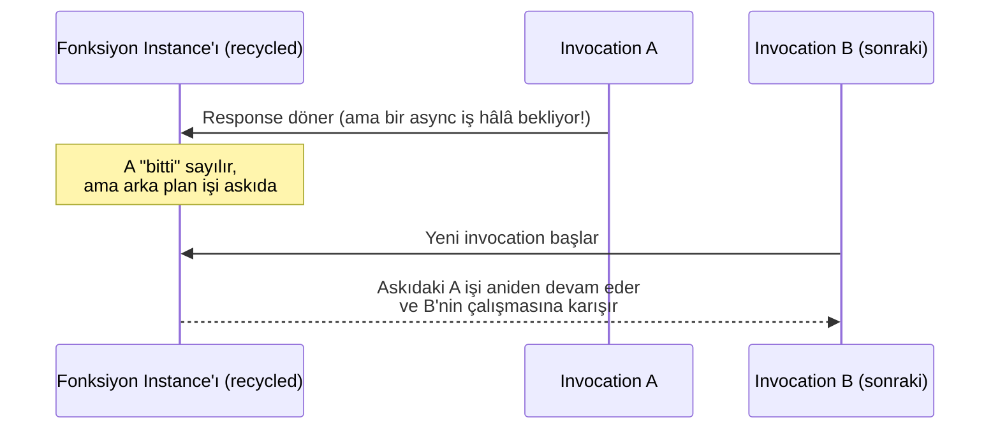
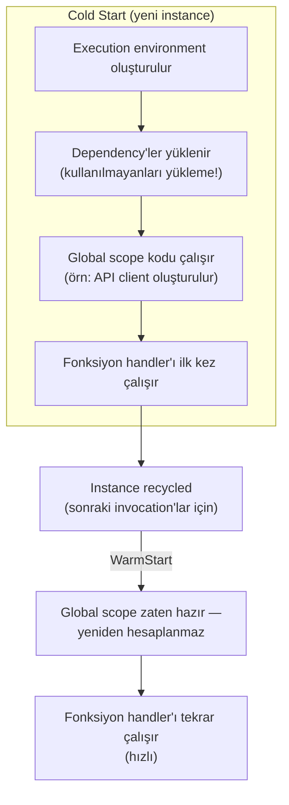
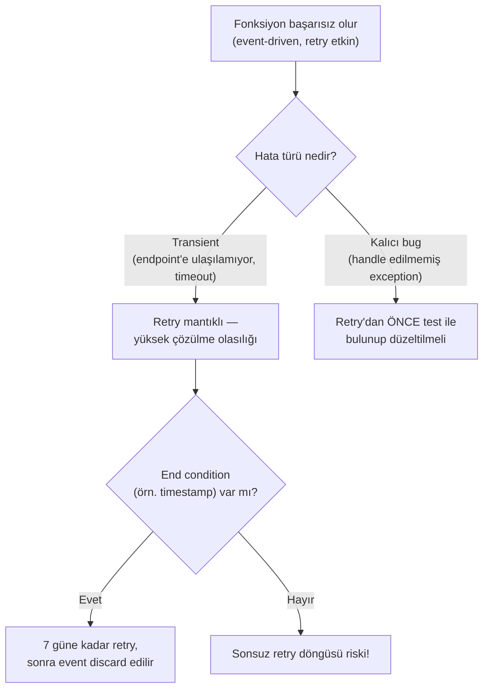
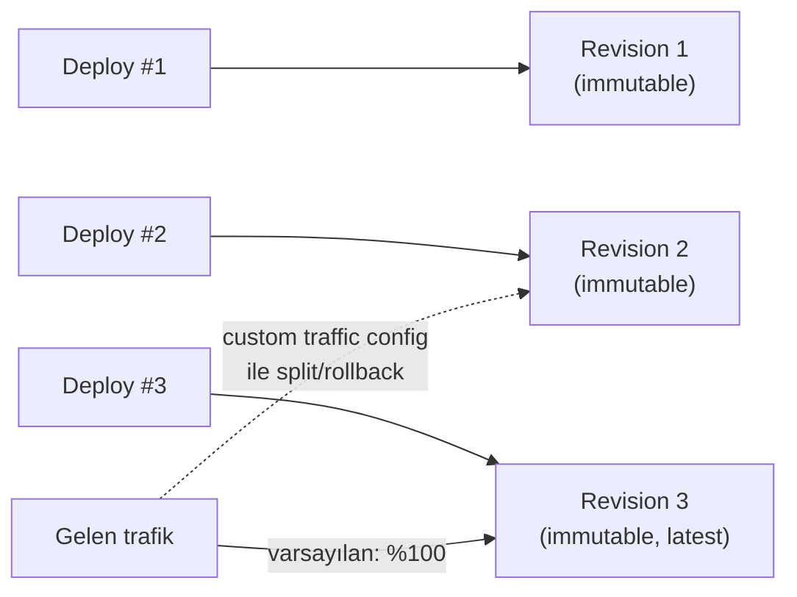

# Best Practices for Cloud Run Functions — Baştan Sona Öğretici

> Bu metin, **"Developing Applications with Cloud Run Functions on Google Cloud"** kursunun **Modül 5 — Best Practices for Functions** dersinde anlatılan **her şeyi** kavratmak için yazıldı. Önceki dört modülde sırasıyla Cloud Run functions'ın **ne olduğunu** (Modül 1), **nasıl çağrılıp bağlandığını** (Modül 2), **nasıl güvence altına alındığını** (Modül 3), ve **veritabanlarıyla nasıl entegre olduğunu** (Modül 4) öğrendik. Bu modül, farklı bir tür bilgi sunuyor: **doğru çalışan** bir fonksiyonu, **iyi çalışan, üretime hazır** bir fonksiyona dönüştüren pratik dersler.
>
> **Kapsam notu:** Bu doküman, "Developing Applications with Cloud Run Functions on Google Cloud" kursunun **Modül 5**'ini kapsıyor. Önceki modül `deep-dive/15-integrating-with-cloud-databases/integrating-with-cloud-databases.md` dosyasındadır; kursun ilerleyen modülleri eklendikçe bu handbook'a `deep-dive/17-...` gibi yeni numaralı modüller olarak eklenmeye devam edecek.

---

## Bu ders tam olarak neyi öğretiyor ve neden önemli?

Önceki dört modülün her biri, tek bir soruya odaklanan bir yapıya sahipti ("nasıl çağrılır", "nasıl güvence altına alınır" gibi). Bu modül farklı — dört ayrı ama birbirini tamamlayan pratik alanı bir araya getiriyor:

1. **Implementasyon best practice'leri (BÖLÜM 1-5)** — fonksiyon **kodunu nasıl yazarsın** ki güvenilir, öngörülebilir ve hata ayıklanabilir olsun?
2. **Performans ve networking (BÖLÜM 6-8)** — fonksiyonun **çalışma zamanı davranışını** nasıl optimize edersin (cold start'lar, bağlantı yönetimi)?
3. **Retry (BÖLÜM 9-10)** — bir fonksiyon başarısız olduğunda, **otomatik olarak yeniden denemesini** nasıl sağlarsın, ve bunun riskleri nelerdir?
4. **Yapılandırma ve ölçekleme (BÖLÜM 11-16)** — IAM, memory/CPU/timeout, concurrency, scaling ve revision'lar aracılığıyla fonksiyonu **production'a uygun** hale nasıl getirirsin?

Bu dört alan, aslında tek bir ortak temaya hizmet ediyor: **Cloud Run functions'ın "serverless" doğasının, senin kodunda ve yapılandırmanda ne gibi varsayımlar gerektirdiğini anlamak.** Serverless bir ortamda, senin kontrolünde olmayan şeyler vardır (instance ne zaman yeniden kullanılır, ne zaman soğuk başlar, ne zaman ölçeklenir) — bu modül, bu kontrolsüz alanlarla **uyumlu** kod yazmayı öğretiyor.

---

# BÖLÜM 1 — Idempotency: Fonksiyonu Güvenle Yeniden Çalıştırılabilir Kılmak

## Idempotent fonksiyon nedir ve neden gereklidir?

Fonksiyonlarını **idempotent** olacak şekilde yaz — yani **birden fazla kez çağrıldığında aynı sonucu üretecek şekilde.**

Bu, doğrudan pratik bir faydaya bağlanıyor: idempotency, **önceki bir invocation kısmen başarısız olduğunda**, o invocation'ı **güvenle yeniden deneyebilmeni (retry)** sağlar. Eğer fonksiyonun idempotent değilse — örneğin her çağrıldığında bir sayacı artırıyorsa, ya da bir kaydı tekrar tekrar ekliyorsa — bir retry, **yanlış, tekrarlanmış bir sonuç** üretebilir (örneğin bir ödemenin iki kez işlenmesi).

> **Bu neden BÖLÜM 9-10'daki retry mekanizmasının ön koşulu?** Retry, "bir şey başarısız oldu, tekrar dene" der — ama bu ancak fonksiyon idempotent ise **güvenlidir.** İdempotent olmayan bir fonksiyonu retry etmek, "yarı tamamlanmış bir işlemi baştan çalıştırmak" anlamına gelebilir, bu da veri bütünlüğünü bozabilir. Idempotency, bu modülün ilerleyen bölümlerinde göreceğin retry mekanizmasının **güvenle kullanılabilmesinin temel şartıdır.**

> **Analoji:** Idempotent bir fonksiyonu, bir **asansör çağırma düğmesine** benzet. Düğmeye bir kere basarsın ya da on kere basarsın, sonuç aynıdır: asansör gelir. Düğmeye her basışta yeni bir asansör **inşa edilmiyor.** Idempotent olmayan bir işlem ise, her basışta yeni bir asansör siparişi veren bir sisteme benzer — tekrar tekrar basarsan, sonunda gereğinden fazla asansörle baş başa kalırsın.

---

# BÖLÜM 2 — Fonksiyonun Yaşam Döngüsünü Doğru Bitirmek

## HTTP fonksiyonları her zaman bir yanıt döndürmelidir

Bir **HTTP function, her zaman bir HTTP response döndürmelidir.** Aksi takdirde, fonksiyon **timeout'a kadar çalışmaya devam edebilir** ve o süre boyunca **ücretlendirilirsin.**

> **Bu neden sadece bir "iyi pratik" değil, bir maliyet riski?** Serverless bir platformda ödediğin şey, çalışma süresidir (execution time). Bir HTTP function, response döndürmeyi "unutursa", platform bunun bittiğini **anlayamaz** — sadece timeout'u bekler. Bu, sessizce **maksimum süre boyunca fatura edilen**, hiçbir iş yapmayan bir fonksiyon anlamına gelir.

## Arka planda çalışan işlemler bırakmamak

Fonksiyon invocation'ı sona erdikten **sonra**, arka planda çalışan hiçbir aktivite olmamalıdır — çünkü bu noktada **CPU'ya erişim yoktur** ve kod **çalışmaya devam edemez.**

Bunun tehlikesi şurada: aynı ortamda çalıştırılan **sonraki bir invocation**, bu arka plan aktivitesinin **yeniden başlamasına (resume)** neden olabilir ve **mevcut invocation'a müdahale ederek** hatalara ve beklenmeyen davranışlara yol açabilir.

**Fonksiyonu sonlandırmadan önce, kod içindeki tüm asenkron (asynchronous) işlemlerin bittiğinden emin ol.**

> **Bu senaryo somut olarak nasıl bir hataya dönüşür?** Instance'lar, invocation'lar arası **yeniden kullanılır (recycled)** — bunu BÖLÜM 6'da cold start bağlamında detaylıca göreceğiz. Diyelim ki invocation A, bitmemiş bir asenkron callback bırakarak sona eriyor (yanlışlıkla "tamamlandı" olarak işaretlenmiş bir Promise, ya da callback'i beklenmeden dönen bir HTTP response). Aynı instance'ta çalışan **sonraki invocation B**, bu unutulmuş callback'in **aniden tetiklendiğini** görebilir — ama artık B'nin state'i içinde çalışıyordur, A'nın değil. Sonuç: B'nin değişkenlerine A'nın eski işi karışır, öngörülemez hatalar oluşur.

---

# BÖLÜM 3 — Geçici Dosyalar ve Bellek Yönetimi

## `/tmp` dizini, bellek üzerinde çalışır

Fonksiyon geliştirirken, **geçici bir dizine (temporary directory)** dosya yazarsın — bu dizin, **in-memory bir dosya sisteminin** bir parçasıdır.

Bu dosyalar:

- Fonksiyonuna **ayrılmış olan belleği (memory)** tüketir,
- Ve bazen **invocation'lar arasında kalıcı (persist)** olabilir.

## Riski: bellek tükenmesi ve cold start

Zamanla belleğin tükenmesini ve bunun sonucunda fonksiyonunun **cold start** yaşamasını önlemek için, **fonksiyon kodunun oluşturduğu tüm dosyaları açıkça sil.**

> **Bu neden BÖLÜM 6'daki cold start konusuyla doğrudan bağlantılı?** Eğer geçici dosyalar temizlenmezse, bellek zamanla dolar. Bellek dolduğunda, platform o instance'ı **yeniden başlatmak (yeni bir instance oluşturmak)** zorunda kalabilir — bu da tam olarak bir **cold start**'tır (BÖLÜM 6'da tanımını göreceğiz). Yani "geçici dosyaları temizlemeyi unutmak" gibi küçük bir ihmal, dolaylı olarak, önlemeye çalıştığın en pahalı performans sorununu (cold start) **kendi elinle tetikleyebilir.**

---

# BÖLÜM 4 — Local Development ve Data Locality

## Neden local'de geliştirip test etmelisin?

Fonksiyon kodunu test etmek için, önce onu **deploy etmen**, deployment'ın **tamamlanmasını** ve log kayıtlarının **kullanılabilir hale gelmesini** beklemen gerekir. Bu döngü **yavaştır.**

Fonksiyonunu **kendi geliştirme ortamında local olarak** geliştirip test etmek, geliştirme ve test sürecini **önemli ölçüde hızlandırır.**

> **Bu neden BÖLÜM 15'teki (Modül 4) "developer testing flow"un ötesinde bir öneri?** Modül 4'te bir fonksiyonu ID token ile **deploy edilmiş hâliyle** test etmeyi öğrenmiştik. Burada, ders bir adım geriye gidiyor: **deploy etmeden önce**, mümkün olduğunca çok hatayı **local'de** yakalamayı öneriyor. Deploy-test-log bekleme döngüsü, her iterasyon için dakikalar alabilir; local test, bu döngüyü saniyelere indirir.

## Data locality kısıtlamalarına uymak

Fonksiyonlarının erişemediği **coğrafi ya da ağ sınırları (geographical or network boundaries)** içindeki **data locality kısıtlamalarına** uymak için, fonksiyonlarını, bu kısıtlamalara uyan ve Cloud Run functions'da kullanılan **açık kaynak abstraction layer'larıyla uyumlu** bir platformda çalıştırabilirsin.

> **Bu neden önemli?** Bazı kurumsal ya da yasal gereksinimler, verinin **belirli bir coğrafi bölgenin dışına çıkmamasını** zorunlu kılar. Eğer standart Cloud Run functions ortamı bu gereksinimi karşılamıyorsa (örneğin veri, izin verilmeyen bir bölgedeki altyapıdan geçmek zorunda kalıyorsa), Cloud Run functions'ın **temelini oluşturan açık kaynak katmanlarla uyumlu** alternatif bir platformda aynı fonksiyon kodunu çalıştırabilirsin — kodun taşınabilirliği (portability), bu esnekliği sağlar.

---

# BÖLÜM 5 — Exception Handling: Doğru Sonlandırma, Yanlış Sonlandırma

## `process.exit()` / `sys.exit()` kullanma

Fonksiyonlardan **manuel olarak çıkmak** için `process.exit()` (Node.js'te) ya da `sys.exit()` (Python'da) kullanmak, **beklenmeyen davranışlara** neden olabilir.

**Bunun yerine:**

- **Event-driven function'lardan**, örtük (implicit) ya da açık (explicit) olarak **return** et.
- **HTTP function'lardan**, HTTP response'lar döndür.

> **Bu neden `process.exit()`'ten daha güvenli?** `process.exit()`/`sys.exit()`, çalışma ortamını **anında ve sert bir şekilde** sonlandırır — bu, platformun kendi yaşam döngüsü yönetimini (bir response'u düzgün şekilde flush etmek, kaynakları temizlemek gibi) **atlar.** `return` ya da bir HTTP response döndürmek ise, platforma "işim bitti, kontrolü sana geri veriyorum" demenin **öngörülebilir, standart yoludur** — platform, bunun üzerine kendi temizlik işlemlerini güvenle yapabilir.

## Uncaught exception'lar cold start'ı tetikler

Exception handling'i destekleyen dillerde, **uncaught (yakalanmamış) exception'lar fırlatma** — çünkü bunlar, **gelecekteki fonksiyon invocation'larında cold start'a zorlar.**

**Runtime hatalarını ve exception'ları her zaman fonksiyon kodunda handle etmelisin**, çünkü yakalanmayan exception'lar fonksiyonu **sonlandırabilir** ve gelecekteki invocation'lar için **cold start'lara** yol açabilir.

> **Sınav tuzağı — "uncaught exception sadece o invocation'ı etkiler" varsayımı:** Bu, kolayca gözden kaçan bir noktadır. Bir uncaught exception'ın etkisi, **sadece o anki invocation ile sınırlı değildir** — ders açıkça, bunun **gelecekteki invocation'lar için de cold start'a** yol açtığını söylüyor. Yani bir exception'ı yakalamayı ihmal etmek, hem o anki isteği hem de sonraki isteklerin performansını (bir cold start pahasına) etkileyebilir.

---

# BÖLÜM 6 — Error Reporting ve Logging

## Runtime hataları nereye gider?

Fonksiyonundan yayılan (emitted) **runtime exception'lar, Error Reporting'e gönderilir.**

Bu sayede:

- Hataları **Google Cloud console'da toplayabilir (aggregate) ve görüntüleyebilirsin.**
- Hatalar oluştuğunda **bildirim alabilirsin.**
- Sorunları **mümkün olduğunca hızlı** tespit edip çözebilirsin.

## Varsayılan logging

Cloud Run functions, varsayılan olarak **basit runtime logging** içerir. **`stdout`** ya da **`stderr`**'e yazılan log'lar, **otomatik olarak Google Cloud console'da görünür** — ekstra bir yapılandırma gerekmez.

## Hata türüne göre doğru tepki

| Fonksiyon türü | Hata oluştuğunda ne yapmalı |
| --- | --- |
| **HTTP function** | Hatayı raporlamalı ve karşılaşılan hata türüne uygun bir **HTTP status code**'uyla yanıt vermeli |
| **Event-driven function** | Bir exception oluştuğunda, bunu raporlamalı ve bir **hata mesajı döndürmeli** |

Her iki durumda da, fonksiyon çalışması sırasında oluşabilecek exception'ları ve hataları Google Cloud'un **Error Reporting** servisine raporlamalısın.

> **Bu neden BÖLÜM 5'in doğal bir devamı?** BÖLÜM 5'te "exception'ları handle etmelisin" demiştik ama "handle etmek" tam olarak ne anlama gelir sorusunu açık bırakmıştık. Burada cevaplıyoruz: handle etmek, sadece exception'ı **yakalamak (catch)** değil, onu **uygun bir HTTP status code'uyla ya da hata mesajıyla dışarı bildirmek**, ve **Error Reporting'e raporlamaktır.** "Sessizce yutulan" bir exception, teknik olarak "handle edilmiş" olabilir ama bu, ders açısından yeterli bir uygulama değildir.

---

# BÖLÜM 7 — Cold Start Nedir ve Nasıl Azaltılır?

## Cold start tanımı

Bir **cold start**, bir fonksiyonun **execution environment'ını (çalışma ortamını) oluşturur ve initialize eder.**

Cold start sırasında, fonksiyonunun import ettiği **tüm bağımlılıklar (dependencies) yüklenir** — bu da fonksiyonun **invocation latency**'sine (gecikmesine) ekleme yapar.

## Kullanılmayan dependency'leri yüklememek

Fonksiyonunun **kullanmadığı bağımlılıkları yüklemeyerek**, bu gecikmeyi ve fonksiyonu deploy etmek için gereken süreyi **azaltabilirsin.**

## Instance yeniden kullanımı ve global scope caching

Bir fonksiyonun **önceki bir invocation'ının execution environment'ı, sıklıkla yeniden kullanılır (recycled).**

Eğer bir değişkeni **global scope'ta** tanımlarsan, bu değişkenin değeri, **bir fonksiyon instance'ına yapılan sonraki invocation'larda**, yeniden hesaplanmasına gerek kalmadan **yeniden kullanılabilir** — bu da **önemli performans iyileştirmelerine** yol açar.

Bu yaklaşımı, her invocation'da yeniden oluşturulması **pahalı olabilecek** nesneleri (API client nesneleri, network bağlantıları gibi) **cache'lemek** için kullanabilirsin.

> **Analoji:** Global scope'ta bir değişken tanımlamayı, bir ofise **her sabah yeni bir masa ve sandalye getirmek yerine, aynı masa ve sandalyeyi kullanmaya** benzet. Eğer masa/sandalye (örneğin bir database client'ı) her invocation'da **sıfırdan kurulursa**, her seferinde zaman kaybedersin. Ama onu bir kere kurup **odada (global scope'ta) bırakırsan**, sonraki kişiler (sonraki invocation'lar) gelip direkt kullanabilir — tabii oda hâlâ aynı ofisse (instance recycled ise).

---

# BÖLÜM 8 — Lazy Initialization ve Minimum Instance Sayısı

## Global değişkenlerin cold start maliyeti

BÖLÜM 7'de global scope'un faydasını gördük — ama bunun bir bedeli de var: **global değişkenlerin initialize edilmesi, her zaman cold start invocation'larının gecikmesini artırır.**

Eğer bu global değişkenlerden bazıları **fonksiyonunun tüm kod yollarında (code path'lerinde) kullanılmıyorsa**, bu değişkenleri **lazy (tembel), yani ihtiyaç anında (on demand)** initialize etmeyi düşünmelisin.

> **Bu neden BÖLÜM 7 ile bir denge (trade-off) oluşturuyor?** BÖLÜM 7, "her şeyi global scope'a koy, tekrar tekrar hesaplama" derken; BÖLÜM 8, "ama her şeyi global scope'ta **hemen** initialize etme" diyor. Bu ikisi çelişmiyor — birlikte **daha ince bir kural** oluşturuyorlar: **her invocation'da kullanılan** pahalı nesneleri global scope'ta **eagerly (hemen)** initialize et (BÖLÜM 7); **sadece bazı code path'lerinde kullanılan** nesneleri ise **lazy** initialize et (BÖLÜM 8) — böylece o code path'e hiç girilmeyen invocation'lar, gereksiz bir initialization maliyeti ödemez.

## Minimum instance sayısı ile cold start'ı azaltmak

Fonksiyon instance'ları, **gelen istek sayısına göre ölçeklenir (scaled).**

**İstekleri karşılamaya hazır tutulacak minimum bir fonksiyon instance sayısı belirleyerek**, fonksiyonunun cold start'larını **azaltabilir** ve uygulamanın genel performansını **iyileştirebilirsin.**

> **Bu neden en güçlü cold start çözümü?** BÖLÜM 7-8'deki teknikler (dependency azaltma, global scope caching, lazy init), **bir cold start olduğunda onu daha hızlı hale getirir.** Minimum instance sayısı ise farklı bir stratejidir: **cold start'ın hiç yaşanmamasını sağlar** — çünkü zaten "ısınmış (warm)" instance'lar, istek gelmeden önce **hazır bekler.** Bu iki yaklaşım birbirini dışlamaz, tamamlar: minimum instance'lar sık kullanılan yükü karşılar, geri kalan tekniklerse, minimum instance sayısının üzerine çıkan trafik için oluşan **yeni** instance'ların cold start'ını hafifletir.

---

# BÖLÜM 9 — Ağ Performansı: Persistent Connections ve Serverless VPC Access

## Persistent HTTP bağlantıları oluşturmak

Fonksiyonlarından URL'lere erişirken, bu URL'lere **persistent (kalıcı) HTTP bağlantıları** oluşturmalısın.

Bu bağlantıları oluşturup, fonksiyonunun **global scope'unda cache'leyerek:**

- Her invocation'da **yeni bir bağlantı kurmak için harcanan CPU süresini** azaltabilirsin.
- **Connection quota'nı tüketme olasılığını** azaltabilirsin.

## Google API'leri için client nesnesini global scope'ta oluşturmak

Benzer şekilde, fonksiyonundan Google API'leriyle iletişim kurarken **gereksiz bağlantıları ve DNS sorgularını** önlemek için, **Google service client nesnesini global scope'ta oluştur.**

> **Bu, BÖLÜM 7'deki genel prensibin iki somut uygulaması:** BÖLÜM 7'de "pahalı nesneleri global scope'ta cache'le" demiştik — burada bunun iki spesifik örneğini görüyoruz: **HTTP bağlantıları** ve **Google API client nesneleri.** İkisi de aynı mantığı paylaşır: bağlantı kurmak (TCP handshake, DNS lookup, TLS negotiation gibi adımlarla) **pahalıdır**; bunu her invocation'da tekrarlamak yerine, bir kere kurup **tekrar kullanmak (reuse)** çok daha verimlidir.

## Serverless VPC Access ile internal kaynaklara erişim

**Serverless VPC Access connector'larını kullanarak**, VPC network'üne istek gönderip yanıt alırken **internal DNS ve internal IP adresleri** kullan — böylece internal kaynaklara giden trafik **internete maruz kalmaz.**

> **Bu neden burada, "performans" bağlamında tekrar geçiyor?** Modül 2 ve 3'te Serverless VPC Access'i **bağlanabilirlik (connectivity)** ve **güvenlik** açısından görmüştük. Burada aynı mekanizma, **performans** açısından da fayda sağlıyor olarak çerçeveleniyor: internal trafiğin internete çıkmaması, sadece güvenlik değil, genellikle **daha düşük gecikme ve daha az ara nokta (hop)** anlamına da gelir — BÖLÜM 11'de (Modül 3) gördüğümüz "havaalanına gitmeden komşuya geçen özel kapı" analojisi burada da geçerlidir.

---

# BÖLÜM 10 — Retry on Failure: Nasıl Etkinleştirilir?

## Otomatik retry, sadece event-driven fonksiyonlar için

**Otomatik retry, yalnızca event-driven function'lar için kullanılabilir** ve **varsayılan olarak devre dışıdır.**

## Nasıl etkinleştirilir / devre dışı bırakılır?

| İşlem | Yöntem |
| --- | --- |
| **Etkinleştir** | `gcloud functions deploy` komutunda **`--retry`** flag'i, ya da Google Cloud console'da deploy sırasında **"Retry on failure"** seçeneği |
| **Devre dışı bırak** | `--retry` flag'i **olmadan** yeniden deploy et, ya da console'da **"Retry on failure"** seçeneğini kaldır |

> **Sınav tuzağı — "retry'ı HTTP functions için de etkinleştirebilirim" varsayımı:** Ders açık: otomatik retry, **sadece event-driven function'lar için** mevcuttur. HTTP function'lar için bu mekanizma yoktur — bir HTTP isteği başarısız olduğunda, retry'ı **çağıran taraf** (istemci) kendi mantığıyla yapmalıdır, platform bunu otomatik yapmaz.

## Fonksiyon neden başarısız olur?

Ders, fonksiyon başarısızlığının birkaç örneğini veriyor:

- Bir **bug**, runtime'ın **handle edilmemiş bir exception** fırlatmasına neden olur.
- Bir **service endpoint'e ulaşılamaz** ve bu **timeout**'a yol açar.
- Fonksiyon kodu, **belirli koşullar oluştuğunda kasıtlı olarak** handle edilmemiş bir exception fırlatır.
- Bir **Node.js fonksiyonu**, reddedilmiş (rejected) bir **promise döndürür** ya da bir callback'e **null olmayan bir değer geçirir.**

Bu durumlarda, fonksiyon **çalışmayı durdurur ve event discard edilir (atılır).**

## Retry etkinken ne olur?

Retry etkinleştirildiğinde, event **varsayılan olarak en fazla yedi güne kadar**, fonksiyon **başarıyla çalışana kadar**, ya da **maksimum retry süresi dolana kadar** tekrar tekrar retry edilir.

---

# BÖLÜM 11 — Retry'ı Doğru Kullanmak: Ne Zaman, Nasıl Güvenli?

## Retry'ın en iyi kullanım alanı: geçici (transient) hatalar

Retry, en iyi şekilde, **aralıklı (intermittent) ya da geçici (transient) hataları** ele almak için kullanılır — örneğin bir service endpoint'ine bağlanamama ya da bağlantının başarılı olmasını beklerken timeout olma gibi.

Bu tür hataların, **retry edildiğinde çözülme olasılığı yüksektir** — çünkü genellikle **anlık, kalıcı olmayan** koşullardan kaynaklanırlar (örneğin hedef servis geçici olarak aşırı yüklenmiştir, ama birkaç saniye sonra tekrar müsaittir).

## Retry'dan önce: bug'ları test ederek bul

Fonksiyonun **başarılı çalışana kadar sürekli retry edildiği** için, fonksiyon başarısızlığına neden olan **bug'lar, retry'ı etkinleştirmeden önce, test yoluyla kodunda bulunmalı ve düzeltilmelidir.**

> **Bu neden kritik bir sıralama kuralı?** Eğer bir bug'ı retry etkinken production'a taşırsan, ne olur? Bug her seferinde aynı hatayı üretir — ve fonksiyon bunu **yedi güne kadar, defalarca** dener, her seferinde başarısız olur. Bu, hem gereksiz **kaynak tüketimine (ve maliyete)** hem de event'in **hiçbir zaman işlenmemesine** yol açar. Retry, "geçici sorunları kendi kendine çözen" bir mekanizmadır — "kalıcı bug'ları maskeleme aracı" değildir.

## Retry edilmemesi gereken exception'ları handle etmek

Fonksiyon kodunun, **retry'a yol açmaması gereken exception'ları handle ettiğinden** emin ol.

## Sonsuz retry döngülerini önlemek: end condition

Hatalar **kalıcı (persistent)** olduğunda, fonksiyon işleme kodu çalışmadan **önce bir end condition (bitiş koşulu)** ekleyerek **sonsuz retry döngülerini önle.**

Bir yaklaşım: **timestamp'leri kullanarak**, belirli bir zamandan **daha eski event'leri discard et (at).**

> **Analoji:** Retry mekanizmasını, bir zil çalan ama kapıyı açan olmayan bir eve ısrarla giden bir kurye gibi düşün. Kurye (retry), kapıyı çalmaya **makul bir süre** devam etmelidir (transient hata — belki ev sahibi bir anlığına dışarıdaydı). Ama kurye **sonsuza kadar** çalmaya devam etmemeli — bir noktada (end condition, örneğin "7 günden eski paketleri iade et"), pes edip paketi geri götürmelidir. End condition olmadan, kurye sonsuza kadar orada kalır, kaynak tüketir, ve hiçbir zaman ilerleme kaydetmez.

---

# BÖLÜM 12 — IAM Best Practice'leri: Least Privilege ve Fonksiyonlar Arası Erişim

## En az ayrıcalık ilkesini uygulamak

**En az ayrıcalık ilkesini (principle of least privilege) izleyerek**, fonksiyonlarına erişimi **minimum sayıda kullanıcı ve service account** ile sınırla, ve fonksiyonlarını geliştirmek ve kullanmak için gereken **minimum izin kümesini** ver.

## Fonksiyonlar arası erişimi daraltmak

Birden fazla fonksiyonu birbirine bağlayan servisler inşa ederken, **her fonksiyonun sadece belirli bir diğer fonksiyon alt kümesine istek gönderebilmesini** sağla.

Ders somut bir örnek veriyor: bir **login fonksiyonu**, bir **user profiles fonksiyonuna** erişebilmeli, ama muhtemelen bir **search fonksiyonuna erişememeli.**

> **Bu neden Modül 3'ün (BÖLÜM 7) bir tekrarı değil, onun "neden" açıklaması?** Modül 3'te `roles/run.invoker`'ın **nasıl** verileceğini (mekanizma) öğrenmiştik. Burada, ders **neden** böyle bir kısıtlama koyman gerektiğinin **iş mantığı gerekçesini** veriyor: login ve user profiles arasında **meşru bir iş ilişkisi** vardır (giriş yapan kullanıcının profili gösterilir), ama login ile search arasında **yoktur.** Bu örnek, "her fonksiyona her fonksiyonu çağırma izni ver" gibi gevşek bir varsayılan yerine, **gerçek iş akışını yansıtan, dar bir izin haritası** çizmen gerektiğini somutlaştırıyor.

---

# BÖLÜM 13 — Runtime Service Account: Production İçin Dedicated Identity

Aksini belirtmediğin sürece, bir fonksiyonun deploy edilmesinde **varsayılan bir service account**, fonksiyonun kimliği olarak kullanılır.

**Production kullanımı için**, her fonksiyona, bir **user-managed service account** atayarak **dedicated (özel) bir kimlik** vermelisin.

User-managed service account'lar, **Identity and Access Management (IAM)** kullanarak **minimal bir izin kümesi** vererek erişimi kontrol etmeni sağlar.

> **Bu, Modül 3'te (BÖLÜM 6) öğrendiğin "runtime service account" kavramının aynı kuralının tekrarıdır** — burada modül, bunu **genel bir "best practice" listesinin parçası** olarak yeniden vurguluyor, çünkü bu kural, tek başına Modül 3'e özgü bir güvenlik detayı değil, **her production fonksiyonu için geçerli, temel bir yapılandırma alışkanlığıdır.**

---

# BÖLÜM 14 — Memory, CPU ve Timeout Yapılandırması

## Memory ve CPU ilişkisi

Cloud Run functions'ı, **farklı miktarlarda memory** ile provision edebilir ve bir fonksiyonun kullanabileceği memory miktarını kontrol edebilirsin.

**Seçtiğin allocated memory miktarı, fonksiyonun allocated CPU miktarına karşılık gelir.**

Memory'yi sınırlamak için: `gcloud functions deploy` komutunda **`--memory`** flag'ini kullan, ya da Google Cloud console'daki **memory ayarlarını** kullan.

> **Bu ilişki neden önemli?** Memory ve CPU'nun **bağlı (coupled)** olması, bunları **bağımsız olarak ayarlayamayacağın** anlamına gelir. Bir fonksiyon CPU-yoğun bir iş yapıyorsa ama düşük memory ile deploy edilmişse, dolaylı olarak **yetersiz CPU** ile de çalışıyor olabilir — bu ilişkiyi bilmeden yapılan bir memory ayarı, beklenmedik bir CPU darboğazına yol açabilir.

## Timeout yapılandırması

Fonksiyonunun timeout'a uğramasını önlemek için, **fonksiyonun timeout süresini, fonksiyonun execution süresinden biraz daha yüksek** belirle.

Timeout'u yapılandırmak için: `gcloud functions deploy` komutunda **`--timeout`** flag'ini kullan, ya da Google Cloud console'daki **Timeout ayarlarını** kullan.

> **Bu neden "biraz daha yüksek" olarak ifade ediliyor, "çok daha yüksek" değil?** Timeout'u gereğinden çok yüksek ayarlamak (örneğin normalde 2 saniye süren bir fonksiyona 60 dakikalık bir timeout vermek), BÖLÜM 2'deki riski büyütür: eğer fonksiyon bir şekilde takılırsa (hang), bu durumun fark edilmesi ve sonlandırılması çok daha uzun sürer — bu da BÖLÜM 2'de gördüğümüz "response dönmeyen fonksiyon = maksimum süre boyunca faturalandırma" riskini büyütür. "Biraz daha yüksek" bir timeout, hem normal çalışmayı kesmemek hem de anormal bir takılmayı **makul bir sürede** tespit etmek arasında bir denge kurar.

---

# BÖLÜM 15 — Concurrency: Tek İstekten Eşzamanlı İsteklere

## Varsayılan davranış: tek seferde bir istek

**Varsayılan olarak, fonksiyon instance'ları aynı anda yalnızca bir isteği işler.**

## Concurrency'yi etkinleştirmek

Bu davranışı, Cloud Run functions için değiştirebilir, böylece **tek bir fonksiyon instance'ı birden fazla eşzamanlı isteği işleyebilir.**

Bu, **cold start'ları önleyerek genel gecikmeyi azaltmaya yardımcı olur** — çünkü zaten **ısınmış (warmed) bir instance**, fonksiyona gelen **ek istekleri de işleyebilir** (yeni bir instance oluşturmak yerine).

Concurrency'yi etkinleştirmek için: fonksiyonun **altta yatan Cloud Run servisi üzerinden**, function başına bir **concurrency değeri** ayarlarsın. Bu değer, **tek bir fonksiyon instance'ının işleyebileceği maksimum eşzamanlı istek sayısını** temsil eder.

## Concurrency'nin gerektirdiği kod sorumluluğu

Concurrency etkinken, **fonksiyon kodunun eşzamanlı çalıştırılmaya güvenli (safe) olması gerekir** — çünkü **Cloud Run functions herhangi bir izolasyon (isolation) sağlamaz.**

> **Sınav tuzağı — "concurrency etkinleştirmek her zaman güvenlidir" varsayımı:** Bu, dikkatle okunması gereken bir cümledir: **"Cloud Run functions does not provide isolation."** Concurrency etkin olduğunda, aynı instance içinde **birden fazla istek, aynı global scope'u (BÖLÜM 7) paylaşarak** eşzamanlı çalışır. Eğer fonksiyon kodun, paylaşılan bir değişkeni (örneğin bir global sayaç ya da cache) **thread-safe olmayan** bir şekilde okuyup yazıyorsa, concurrency etkinleştirmek **race condition'lara** yol açabilir. Concurrency'yi etkinleştirmeden önce, kodun bu şekilde paylaşılan state'e karşı güvenli olduğundan emin olmalısın.

---

# BÖLÜM 16 — Scaling, Revisions ve Traffic Splitting

## Scaling nasıl işler?

**Scaling**, fonksiyonuna gelen **istek hacmine göre**, fonksiyonunun **yeni instance'larının oluşturulmasıyla** implemente edilir.

Fonksiyonunun scaling davranışını, **deployment sırasında minimum ve maksimum instance sayısını ayarlayarak** kontrol edebilirsin.

**Fonksiyonlar birbirinden bağımsız olarak ölçeklenir** — her fonksiyonun kendi scaling yapılandırması vardır.

| Ayar | Ne için kullanılır |
| --- | --- |
| **Minimum instance sayısı** | Cold start'ları önlemek ve uygulama gecikmesini azaltmak için |
| **Maksimum instance sayısı** | Throughput açısından kısıtlı downstream kaynaklara (örneğin veritabanları) giden istekleri sınırlamak için |

## Sınırların geçici olarak aşılabileceği iki durum

- **Trafik ani yükselişlerini (spike) karşılamak için**, belirtilen maksimum instance sayısından **daha fazlası, kısa bir süre için** oluşturulabilir.
- Instance limitleri, her **revision** için **bağımsız olarak** ayarlandığından, **deployment sonrası bir dönemde** belirtilen limit **geçici olarak aşılabilir** — bu, **mevcut isteklerin önceki instance'lar tarafından kesintisiz işlenmesini**, ve yeni isteklerin **yeni instance'lar tarafından** karşılanmasını sağlamak içindir.

> **Bu neden mantıklı bir istisna, bir hata değil?** Eğer deployment anında instance limiti **katı bir şekilde** uygulansaydı, yeni revision'a geçiş sırasında ya eski istekler **kesintiye uğrardı** ya da yeni istekler **reddedilirdi.** Limitin geçici olarak esnetilmesi, **kesintisiz bir geçiş (seamless transition)** sağlamanın kaçınılmaz bir maliyetidir — bu, bir yapılandırma hatası değil, **bilinçli bir tasarım kararıdır.**

## Revisions: her deploy, yeni ve değişmez bir revizyon oluşturur

Bir Cloud Run function'ını her deploy ettiğinde, fonksiyonun ve **altta yatan Cloud Run servisinin yeni bir revision'ı** otomatik olarak oluşturulur.

**Revision'lar immutable'dır (değişmezdir)** — bir kere deploy edildikten sonra **değiştirilemezler.** Bir fonksiyonu değiştirmek için, onu **yeniden deploy etmelisin.**

## Trafiği yönetmek

**Varsayılan olarak, bir fonksiyona giden tüm trafik, en son (latest) revision'a yönlendirilir.**

Bu davranışı, **özel bir trafik yapılandırması (custom traffic configuration)** belirleyerek değiştirebilirsin — bu, sana şunları sağlar:

- Trafiği **farklı revision'lar arasında bölmek (split etmek).**
- Fonksiyonunu **önceki bir revision'a geri almak (roll back).**

> **Analoji:** Revision'ları, bir kitabın **farklı baskıları (edition)** gibi düşün. Her yeni baskı (deploy), önceki baskıyı **değiştirmez** — yeni, ayrı bir baskı olarak var olmaya devam eder, eski baskılar da rafta kalır (immutable). Varsayılan olarak, kütüphaneci (platform) herkese **en yeni baskıyı** verir. Ama istersen, "okuyucuların %10'una hâlâ eski baskıyı ver" (traffic splitting) diyebilir, ya da "yeni baskıda bir hata var, herkese eski baskıyı geri ver" (rollback) diyebilirsin — eski baskı hâlâ oradadır, çünkü hiçbir zaman silinmedi.

---

# Toplu Özet (Hızlı Tekrar)

**Modülün ana fikri:** Bu modül, doğru çalışan bir Cloud Run function'ını, **güvenilir, performanslı ve production'a hazır** bir fonksiyona dönüştüren dört pratik alanı öğretiyor: implementasyon best practice'leri, performans/networking, retry, ve yapılandırma/ölçekleme.

**Idempotency ve yaşam döngüsü (BÖLÜM 1-2):** Fonksiyonlar idempotent yazılmalı (güvenli retry için); HTTP function'lar her zaman bir response döndürmeli (aksi halde timeout'a kadar faturalandırılır); invocation sonrası arka plan aktivitesi bırakılmamalı, tüm async işlemler bitirilmeli.

**Geçici dosyalar ve local test (BÖLÜM 3-4):** `/tmp`, in-memory bir dosya sistemidir ve belleği tüketir — oluşturulan dosyalar açıkça silinmeli (cold start riskini azaltmak için); local development, deploy-test döngüsünü hızlandırır; data locality kısıtlamaları için uyumlu platformlar kullanılabilir.

**Exception handling (BÖLÜM 5):** `process.exit()`/`sys.exit()` kullanma; bunun yerine return et / HTTP response döndür. Uncaught exception'lar, gelecekteki invocation'lar için de cold start'a yol açar.

**Error Reporting ve logging (BÖLÜM 6):** Runtime exception'lar Error Reporting'e gider; `stdout`/`stderr` otomatik olarak console'da görünür; HTTP function'lar uygun status code'la, event-driven function'lar hata mesajıyla yanıt vermeli.

**Cold start (BÖLÜM 7-8):** Cold start, execution environment'ı oluşturur ve dependency'leri yükler. Kullanılmayan dependency'leri yükleme; global scope'ta pahalı nesneleri cache'le (instance'lar recycled olur); ama sadece bazı code path'lerinde kullanılan değişkenleri lazy initialize et; minimum instance sayısı belirleyerek cold start'ları tamamen önle.

**Ağ performansı (BÖLÜM 9):** Persistent HTTP bağlantılarını ve Google API client nesnelerini global scope'ta cache'le; Serverless VPC Access ile internal DNS/IP kullanarak internal kaynaklara internete çıkmadan eriş.

**Retry (BÖLÜM 10-11):** Otomatik retry sadece event-driven function'lar için mevcuttur, varsayılan olarak kapalıdır; `--retry` flag'i ya da console ile etkinleştirilir; varsayılan olarak en fazla 7 gün retry edilir. Retry, transient hatalar için idealdir; bug'lar retry'dan önce test ile bulunup düzeltilmelidir; sonsuz döngüleri önlemek için bir end condition (örn. timestamp) eklenmelidir.

**IAM ve runtime service account (BÖLÜM 12-13):** Least privilege ilkesiyle erişim minimumda tutulmalı; fonksiyonlar arası erişim, gerçek iş ilişkisini yansıtacak şekilde daraltılmalı; production'da, varsayılan service account yerine dedicated bir user-managed service account kullanılmalı.

**Memory, CPU, timeout (BÖLÜM 14):** Memory miktarı, allocated CPU miktarını belirler (`--memory` flag'i); timeout, execution süresinden biraz daha yüksek ayarlanmalı (`--timeout` flag'i).

**Concurrency (BÖLÜM 15):** Varsayılan olarak bir instance tek bir isteği işler; concurrency etkinleştirilerek bir instance'ın birden fazla eşzamanlı isteği işlemesi sağlanabilir (cold start azaltır) — ama Cloud Run functions izolasyon sağlamadığı için, kod eşzamanlı çalıştırmaya güvenli olmalıdır.

**Scaling, revisions, traffic splitting (BÖLÜM 16):** Scaling, istek hacmine göre yeni instance'lar oluşturur; min/max instance ile kontrol edilir (spike'larda ve deployment sonrasında geçici olarak aşılabilir); her deploy yeni, immutable bir revision oluşturur; varsayılan olarak tüm trafik en son revision'a gider, ama custom traffic config ile split edilebilir ya da rollback yapılabilir.

---

# En Kritik Ayrımlar / Hızlı Tekrar (Cebinde Taşı)

- **Idempotency, güvenli retry'ın ön koşuludur** — idempotent olmayan bir fonksiyonu retry etmek, veri bütünlüğünü bozabilir.
- **HTTP function response dönmezse, timeout'a kadar faturalandırılırsın.**
- **`process.exit()`/`sys.exit()` kullanma** — return et ya da HTTP response döndür.
- **Uncaught exception'lar, sadece o anki değil, gelecekteki invocation'lar için de cold start'a yol açar.**
- **`/tmp`, in-memory'dir ve belleği tüketir** — oluşturulan dosyaları açıkça sil.
- **Cold start = execution environment oluşturma + dependency yükleme.** Kullanılmayanı yükleme; pahalı, her yerde kullanılan nesneleri global scope'ta cache'le; sadece bazı yollarda kullanılanları lazy initialize et; minimum instance ile cold start'ı tamamen önle.
- **Otomatik retry yalnızca event-driven function'lar içindir**, varsayılan olarak kapalıdır, varsayılan maksimum süre 7 gündür.
- **Retry, bug'ları maskelemek için değil, transient hatalar içindir** — bug'lar retry'dan önce test edilip düzeltilmelidir; sonsuz döngüyü önlemek için end condition gerekir.
- **Production'da dedicated bir runtime service account kullan** — varsayılan service account sadece test/geliştirme içindir.
- **Memory miktarı, allocated CPU miktarını belirler** — ikisi bağlıdır (coupled).
- **Timeout, execution süresinden biraz daha yüksek olmalı** — aşırı yüksek değil.
- **Concurrency etkinken, Cloud Run functions izolasyon sağlamaz** — kod eşzamanlı çalıştırmaya güvenli olmalıdır.
- **Min instance = cold start'ı azaltır; max instance = downstream kaynakları korur** — ikisi de spike'larda ya da deployment sonrasında geçici olarak aşılabilir.
- **Revision'lar immutable'dır** — değiştirilemez, sadece yeniden deploy edilebilir. Varsayılan olarak tüm trafik en son revision'a gider, ama split/rollback mümkündür.

---

> **Kapanış:** Bu modül, önceki dört modülde inşa ettiğin Cloud Run functions bilgisine (Modül 1: nedir, Modül 2: nasıl çağrılır/bağlanır, Modül 3: nasıl güvence altına alınır, Modül 4: veriyle nasıl entegre olunur), **üretime hazır olma** boyutunu ekledi: idempotent ve düzgün sonlandırılan kod yazmayı, geçici dosyaları ve exception'ları doğru yönetmeyi, cold start'ları global scope caching ve minimum instance'larla azaltmayı, ağ bağlantılarını yeniden kullanmayı, başarısızlıkları güvenli bir şekilde retry etmeyi, IAM'i en az ayrıcalık ilkesiyle yapılandırmayı, memory/CPU/timeout'u doğru ayarlamayı, concurrency'yi güvenle etkinleştirmeyi, ve scaling ile revision'lar aracılığıyla trafiği kontrol etmeyi. Bu pratikler birlikte, izole bir hesaplama biriminden başlayıp (Modül 1), güvenli bir şekilde bağlanan (Modül 2), korunan (Modül 3), gerçek veriyle çalışan (Modül 4), ve şimdi **güvenilir, performanslı ve ölçeklenebilir** bir uygulama bileşenine ulaşmanı sağlıyor. Kursun ilerleyen modüllerinin transkriptleri eklendikçe, bu handbook'a yeni numaralı modüller olarak eklenmeye devam edecek.
