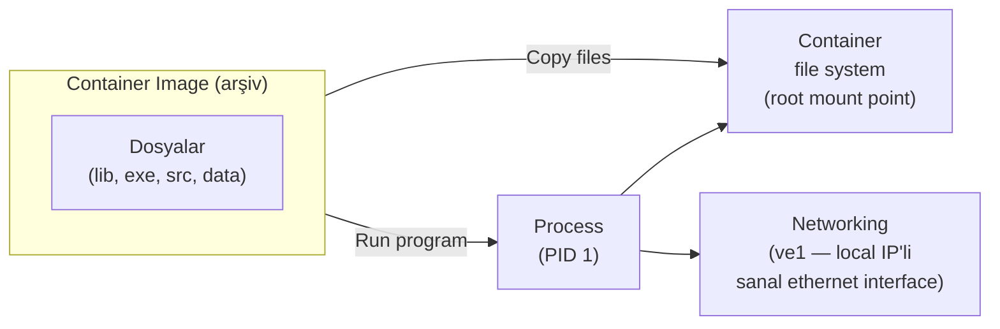
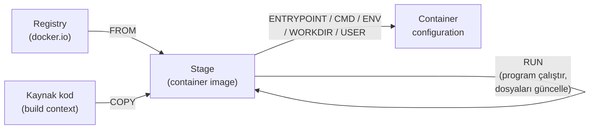
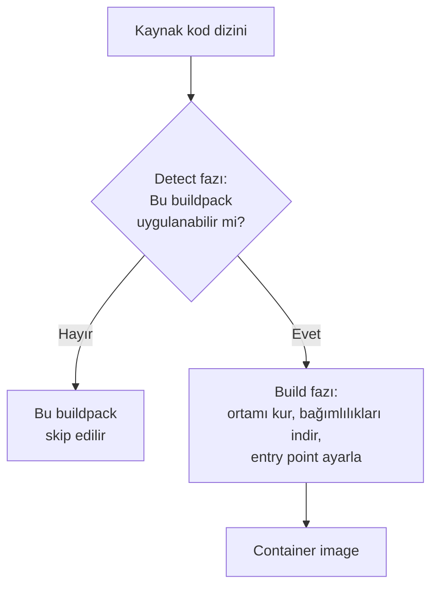
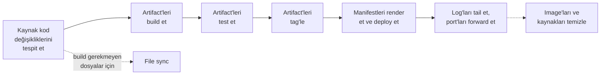
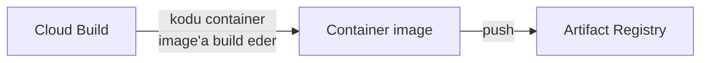
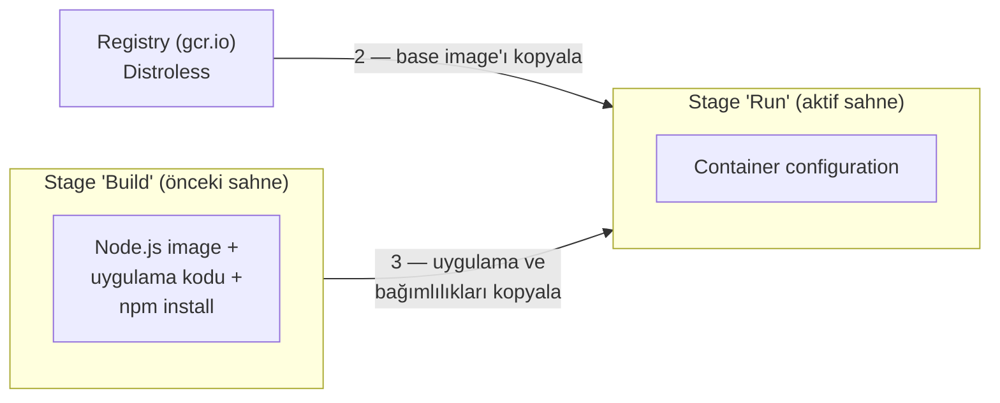
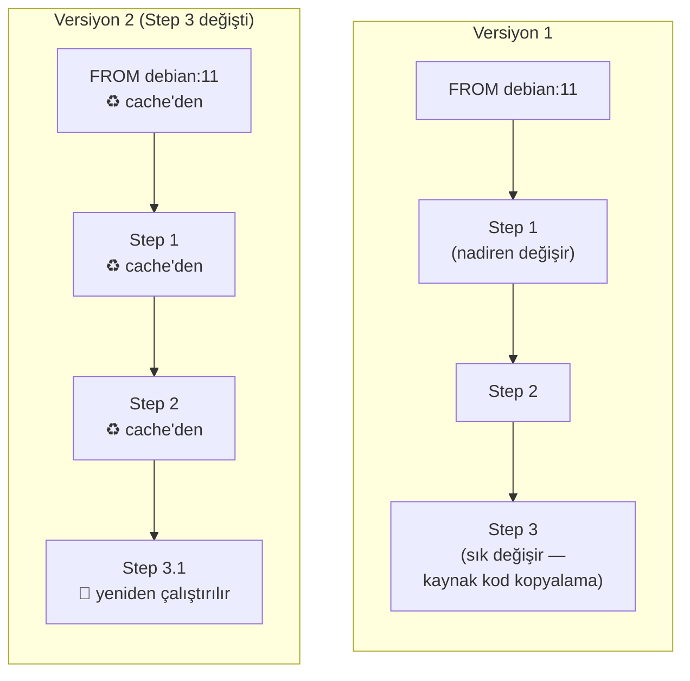
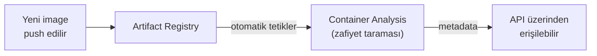

# Introduction to Containers — Baştan Sona Öğretici

> Bu metin, **"Developing Containerized Applications on Google Cloud"** kursunun **Modül 1 — Introduction to Containers** dersinde anlatılan **her şeyi** kavratmak için yazıldı.
>
> **Kapsam notu:** Bu, handbook'taki **yeni bir kursun** ilk modülüdür. Önceki 16 modül, "Developing Applications with Cloud Run Functions on Google Cloud" kursunu kapsıyordu (fonksiyonların nasıl çağrıldığı, güvence altına alındığı, ve production'a hazır hale getirildiği). Bu yeni kurs — **"Developing Containerized Applications on Google Cloud"** — farklı bir soruyla başlıyor: **uygulamanı bir container'a nasıl paketlersin, ve bu container'ı nasıl çalıştırırsın?** Handbook'un numaralandırma sırasına göre bu, **Modül 17**'dir, ama kursun kendi sırasına göre **Modül 1**'idir.
>
> Bu modülün dört öğrenme hedefi var: (1) container ve container image'ları tanımlamak, (2) uygulamaları container image'lara build edip paketlemek, (3) container'ları oluşturma, test etme ve güvence altına alma best practice'lerini öğrenmek, ve (4) Cloud Run ile Google Kubernetes Engine'in temellerini anlamak (bu ikisi ilerleyen modüllerde derinlemesine işlenecek).

---

## Bu ders tam olarak neyi öğretiyor ve neden önemli?

Bu modül, container dünyasına **sıfırdan** giriyor ve beş ayrı ama birbirini besleyen alanı kapsıyor:

1. **Kavramlar (BÖLÜM 1-5)** — bir container ile bir container image **aslında nedir**, ve bir uygulamayı çalıştırmak için container image'ın içinde **ne bulunur**?
2. **Docker ile build (BÖLÜM 6)** — bir Dockerfile yazarak, kaynak kodunu **elle, adım adım** bir container image'a nasıl dönüştürürsün?
3. **Buildpacks ile build (BÖLÜM 7)** — Dockerfile yazmadan, kaynak kodunu **otomatik olarak** bir container image'a nasıl dönüştürürsün?
4. **CI/CD araçları (BÖLÜM 8-10)** — bu build sürecini Skaffold, Artifact Registry, ve Cloud Build ile nasıl **otomatikleştirir ve production'a bağlarsın**?
5. **Best practice'ler (BÖLÜM 11-13)** — küçük, güvenli, ve doğru davranan container image'lar oluşturmak için **nelere dikkat etmelisin**?

Bu beş alan, tek bir ortak temaya hizmet ediyor: **bir container image, uygulamanı çalıştırmak için gereken her şeyi içeren, taşınabilir (portable) bir pakettir** — ve bu paketi doğru inşa etmek, onu güvenli ve verimli çalıştırmanın ön koşuludur.

---

# BÖLÜM 1 — Container Nedir?

## Container: kod + bağımlılıklar

Bir **container**, uygulama kodunu, çalışması için gereken **bağımlılıklarla (dependencies)** birlikte paketleyen bir yapıdır — programlama dili runtime'larının belirli sürümleri, ve yazılım kütüphaneleri gibi.

Bunu şu şekilde düşün: bir uygulamayı "çalıştırmak" için sadece kaynak kodunun kendisi yeterli değildir — kodun **hangi runtime üzerinde** (Node.js, Python, JVM gibi), **hangi kütüphane sürümleriyle** çalışacağı da belirlenmelidir. Container, bu iki şeyi (kod + bağımlılıklar) **tek bir pakette** birleştirir.

> **Bu neden önemli?** Klasik bir dağıtım modelinde, "kodu bir sunucuya kopyala, sonra sunucuya doğru Node.js sürümünü, doğru kütüphaneleri kur" adımları **ayrı ayrı ve elle** yapılırdı. Bu, "benim makinemde çalışıyordu" probleminin klasik kaynağıdır — sunucudaki ortam, geliştiricinin makinesindeki ortamdan **ufak bir farkla bile** ayrılabilir. Container, bu riski ortadan kaldırır: kod ve bağımlılıkları **birlikte, tek bir birim olarak** taşınır.

---

# BÖLÜM 2 — Container Image Nedir?

## Container image: çalışma zamanı için bir şablon

Bir **container image**, bir container instance'ının **runtime'da nasıl gerçekleneceğini (realized)** tanımlayan bir **şablondur (template)**.

Bir container image, uygulamanı, **uygulamanın çalışması için ihtiyaç duyduğu her şeyle birlikte** paketler. Örneğin bir Java uygulamasının container image'ında, uygulama kodu, **uygun Java Virtual Machine (JVM) ile birlikte** paketlenir.

## Pratikte bir container image nedir: dosyalardan oluşan bir arşiv

Pratik olarak, bir container image, uygulamanın çalışması için gereken **her şeyi içeren, dosyalardan oluşan bir arşivdir (archive)**. Bir container image şunları içerebilir:

- **Sistem kütüphaneleri (system libraries)**
- **Çalıştırılabilir programlar (executable programs)**
- **Kaynaklar (resources)** — html dosyaları, görseller, binary blob'lar, ve uygulamanın kaynak dosyaları

Bir container image, **herhangi bir programlama dilinde** (Java, Python, JavaScript, PHP, Go, vb.) yazılmış programlar içerebilir, ve ihtiyaç duyduğun **herhangi bir binary bağımlılığı** içerebilir.

Bu paketleme, kodunu ve kaynaklarını, **saklayabileceğin, indirebileceğin, ve başka bir yere gönderebileceğin** bir şeye dönüştürür.

## Container: bir container image'ın çalışma zamanı örneği

Bir container image'ı **çalıştırdığında**, container image'ın içindeki programlardan **birini çalıştırırsın**. Örneğin container image'ın bir Java uygulaması içeriyorsa, çalıştırdığın program JVM'dir.

Bir **container**, uygulamanın **çalışan process'lerini (running processes)** temsil eder, ve **yalnızca runtime'da var olur**. Eğer çalışan bir process yoksa, **container da yoktur.**

> **Sınav tuzağı — "container" ile "container image" birbirinin yerine kullanılabilir mi?** Hayır. Bu ayrım, tüm modülün temelini oluşturur: **container image**, diskte duran, statik bir **arşivdir/şablondur** — bir dosyayı bir yere kopyalar gibi kopyalanabilir, saklanabilir, paylaşılabilir. **Container** ise, bu şablondan **runtime'da yaratılan bir çalışma örneğidir** — process'ler durduğunda container da ortadan kalkar, ama image diskte kalmaya devam eder.

## Container çalıştığında iki şey daha olur: dosya sistemi ve network

Bir container çalıştığında, iki ilave şey gerçekleşir:

1. **Container image'ın içeriği, container için özel (private) bir dosya sistemini seed eder.** Uygulamanın process'lerinin gördüğü tüm dosyalar, bu private dosya sistemindedir.
2. **Container içindeki process'ler, yerel (local) bir IP'ye sahip sanal bir network interface'e erişebilir** — böylece uygulaman bu interface'e bağlanıp (bind) gelen trafik için bir portu dinlemeye (listen) başlayabilir.



## Hatırlanacaklar

1. Bir **container image**, dosyalardan oluşan bir arşivdir.
2. Bir container image, uygulamanı ve **uygulamanın çalışması için ihtiyaç duyduğu her şeyi** içerir.
3. Bir **container**, bir container image'ın **runtime örneğidir.**

---

# BÖLÜM 3 — Farklı Dillerde Bir Uygulama, Container Image'a Ne Koyar?

## Örnek: minimal bir Node.js web uygulaması

Üç dosyadan oluşan basit bir Node.js uygulamasını ele alalım: `server.js`, `package.json`, `index.html`.

- **`server.js`** — uygulamanın ana dosyası. `express` kütüphanesine (bir Node.js web framework'ü) bağımlıdır, bir HTTP isteğine `index.html` dosyasının içeriğini döndüren bir endpoint oluşturur, ve `process.env.PORT || 8080` portunda dinlemeye başlar.
- **`package.json`** — `npm` (Node.js package manager) tarafından okunur ve şunları belirtir: **kütüphane bağımlılığı** (`express`, tam sürüm numarasıyla), **başlatma komutu** (`node server.js`), ve **gereken Node.js runtime sürümü**.
- **`index.html`** — bir HTTP isteğinde döndürülen statik bir HTML dosyası.

Bu uygulamayı çalıştırmak için beş bileşen gerekir: **runtime** (Node.js), **kütüphane bağımlılıkları** (npm ile kurulur), **kaynak kodu** (JavaScript), **statik varlıklar** (HTML, CSS, görseller), ve **configuration** (başlatma komutu — `node server.js`).

## Diğer diller aynı deseni nasıl tekrarlıyor?

| Dil | Runtime | Bağımlılık kurulumu | Ekstra adım |
| --- | --- | --- | --- |
| **Node.js** | Node.js | `npm install` | — |
| **Python** | Python (yorumlanan bir dil) | `pip install -r requirements.txt` | — |
| **Java** | Java Virtual Machine | Maven ya da Gradle | Kaynak kodu **compile edilmelidir** — çalışma zamanında sadece compiled binary'ler gerekir, kaynak kodun kendisi gerekmez |
| **Go** | Gerekmez (statik binary) | `go get` | Bağımlılıklar kaynak koduyla **birlikte tek bir binary'e compile edilir**; static asset'ler bile binary'e gömülebilir (embed) |

> **Bu neden önemli bir ayrım?** Java ve Go örnekleri, "her uygulamanın bir runtime'a ihtiyacı vardır" varsayımını kırıyor. Go'da, compile adımından sonra elinde **tek bir çalıştırılabilir binary** kalır — bu binary'nin çalışması için ayrı bir "Go runtime"ına ihtiyaç yoktur, çünkü her şey zaten binary'nin içine gömülüdür. Bu, BÖLÜM 11'de göreceğimiz **minimal container image**ların neden mümkün olduğunun temelidir: bazı diller için, container image'ın içinde **tek bir dosya** (binary + configuration) yeterli olabilir.

## Sistem bağımlılıkları: kütüphane bağımlılığı olarak ifade edilemeyen ihtiyaçlar

Bazı uygulamaların, **uygulama kütüphanesi bağımlılığı olarak ifade edilemeyen** sistem araçlarına ihtiyacı vardır. Örnekler:

- HTML'i PDF'e dönüştürmek için **headless bir browser**
- `curl`, `tar`, `zip` gibi **araçlar**
- Ek **sistem fontları**
- Görselleri işlemek için **ImageMagick**
- Belge formatlarını dönüştürmek için **OpenOffice**

Geliştirme sırasında, hata ayıklamaya (debugging) yardımcı olacak ek araçlara da ihtiyaç duyabilirsin.

## Özet: bir container image'a girebilecek dosya türleri

Uygulamanı çalıştırmak için ihtiyaç duyabileceğin ve bir container image'a dahil edilebilecek dosya türleri:

- **Sistem paketleri (system packages)**
- **Runtime**
- **Kütüphane bağımlılıkları (library dependencies)**
- **Kaynak kodu (source code)**
- **Binary'ler (binaries)**
- **Statik varlıklar (static assets)**
- **Configuration**

Uygulaman bu listenin **tamamına ihtiyaç duymayabilir** — bazen elinde sadece tek bir binary olabilir. Son madde olan **container configuration**, bir container image'ı bir container'a — yani **çalışan bir process'e** — nasıl dönüştüreceğini detaylandırır.

---

# BÖLÜM 4 — Container Configuration: Neyi, Nasıl Başlatacağını Söylemek

## Entrypoint ve diğer ayarlar

Bir container başlatıldığında **çalıştırılacak komuta**, **entrypoint** denir. Bunun yanında birkaç önemli ayar daha vardır:

| Ayar | Ne işe yarar |
| --- | --- |
| **Entrypoint** | Container başladığında hangi programın, hangi parametrelerle çalıştırılacağını belirtir (örn. `node server.js`) |
| **Environment variables (ENV)** | Uygulamana configuration ayarlarını geçirmek için kullanılır |
| **Working directory** | Programın çalışacağı dizini belirler |
| **User** | Programın **hangi kullanıcıyla** başlatılacağını belirler |

**User ayarını yapmak önemlidir.** Eğer ayarlanmazsa, varsayılan olarak **root kullanıcısı (sistem yöneticisi)** kullanılır — bu, güvenlik açısından bir best practice **değildir** (bu konuya BÖLÜM 11'de geri döneceğiz).

Container'ı başlattığında, **uygulama argümanlarının ve environment variable'ların değerlerini override edebilirsin.**

> **Sınav tuzağı — "user ayarlanmazsa ne olur?" varsayımı:** Birçok kişi, container'ların varsayılan olarak "izole ve güvenli" olduğunu, dolayısıyla varsayılan kullanıcının önemli olmadığını düşünür. Ders açıkça belirtiyor: **varsayılan kullanıcı root'tur** — yani bir saldırgan container içindeki bir zafiyeti kullanarak kod çalıştırırsa, bu kod **root yetkileriyle** çalışır. BÖLÜM 11'de, bunun neden ciddi bir risk olduğunu ve `nonroot` kullanıcısının neden tercih edilmesi gerektiğini göreceğiz.

## Hatırlanacaklar

1. Bir container image, uygulamanı ve **uygulamanın ihtiyaç duyduğu her şeyi** içerir.
2. **Minimal bir container image**, yalnızca **tek bir program dosyası ve onu çalıştıracak bir komuttan** oluşabilir.
3. Bazı programlama dilleri bir **runtime**'a ihtiyaç duyar (Java, Python, Node.js).
4. Uygulaman, çalışması için **ek sistem bağımlılıklarına** ihtiyaç duyabilir.

---

# BÖLÜM 5 — Container'ları Nerede Çalıştırırsın?

Uygulaman bir container image'a paketlendikten sonra, onu **her yerde çalıştırabilirsin**.

| Ortam | Araç |
| --- | --- |
| **Google Cloud — Compute Engine** | Sanal bir makine üzerinde |
| **Google Cloud — Kubernetes** | Bir Kubernetes cluster'ında |
| **Google Cloud — Cloud Run** | (Bu kursta ilerleyen modüllerde detaylı işlenecek) |
| **Local makine** | **Docker** — container tabanlı uygulamalar geliştirmek ve çalıştırmak için açık bir platform |
| **Local makine** | **Podman** — Open Containers Initiative (OCI) tabanlı container'ları build etmek ve çalıştırmak için açık kaynaklı bir Linux aracı |

Bu "her yerde çalıştırabilme" özelliği, **container image'ın taşınabilirliğinin (portability)** doğrudan bir sonucudur — image, ihtiyaç duyduğu her şeyi kendi içinde taşıdığı için, hangi platformda çalıştırıldığı görece önemsizdir.

---

# BÖLÜM 6 — Docker ile Container Image Build Etmek

## Build ve paketleme adımları

Uygulamanı bir container image'a build edip paketlemek için şu adımları izlersin:

1. Varsa **sistem bağımlılıklarını kur**.
2. Bir **runtime kur** (örn. Node.js ya da Python).
3. Uygulamanın **bağımlılıklarını indir** (`npm install`, `go get`, `pip install`, ya da tercih ettiğin package manager).
4. **Binary'leri compile et** (ya da kaynak kodu process/bundle et).
5. **Dosyaları image'a paketle.**
6. **Container configuration'ı ayarla.**

Bu adımları gerçekleştirmenin iki yolu var: **Docker** (bir script ile, düşük seviyeli ama esnek) ve **Buildpacks** (heuristic'lerle otomatik, "otomatik pilot" gibi). Bu bölümde Docker'ı, BÖLÜM 7'de Buildpacks'i inceleyeceğiz.

## Docker Build: kaynak kod + Dockerfile → container image

**Docker**, container'lar içinde uygulama paketlemeni ve çalıştırmanı sağlayan açık bir platformdur. Container'larının yaşam döngüsünü (geliştirmeden paketlemeye, deploy'a kadar) yönetmen için araçlar sunar.

**Docker Build**, Docker içindeki, uygulamalarını container image'lara build edip paketlemeni sağlayan bir dizi özellik ve araçtır. Docker Build, senin **kaynak kodunu** ve bir **Dockerfile**'ı girdi olarak alır.

Bir **Dockerfile**, kaynak kodunu bir container image'a nasıl dönüştüreceğini detaylandıran bir **manifesttir** — build ve paketleme sürecini bir **script** ile ifade etmeni sağlar. Bu, düşük seviyeli bir yaklaşımdır: **esneklik sunar, ama karmaşıklık pahasına.**

## Örnek bir Dockerfile

```dockerfile
FROM docker.io/library/node:16 AS build
WORKDIR /app
COPY * /app
RUN npm install --production
CMD [ "node", "server.js" ]
```

Bu talimatlar sırasıyla:

1. Bir **Node.js base image**'dan başlar.
2. Container dosya sisteminde **uygulama dizinini oluşturur.**
3. Kaynak kodunu ve diğer dosyaları container image'a **kopyalar.**
4. `package.json`'da listelenen `devDependencies` hariç, uygulama bağımlılıklarını **kurar.**
5. Uygulamayı başlattığında çalıştırılacak komutu **ayarlar** (`node server.js`).

## Zihinsel model: bir "stage" üzerinde çalışmak

Docker'ın nasıl çalıştığını anlamak için önemli bir kavram: **Docker ile, uygulamanı container image'ın *içinde* build edersin.**

Bir container image'ı bir **stage**'e (sahneye) koyarsın, ve **her Dockerfile talimatı, o sahnedeki image'ı değiştirir.** Genel süreç:

1. **Base image** ile başla — bu image, uygulamanı build etmek için gereken araçları içerir.
2. Kaynak kodunu ve gereken diğer dosyaları container image'a **çek.**
3. Uygulamanı build etmek için, image'daki dosyaları güncelleyecek bir **program çalıştır.**
4. Image'ı, uygulamanı **başlatacak şekilde yapılandır.**

Dockerfile'lar, bir container image'ın build edilmesini ve paketlenmesini **tek bir sürece** birleştirir.



## Dockerfile talimatları

| Talimat | Ne yapar |
| --- | --- |
| **`FROM`** | Bir registry'den (örn. `docker.io`) bir **base image indirir** ve onu, sonraki talimatlarla değiştirilecek sahneye koyar. Örnekler: `golang` (go programlarını build etmek için araçlar içerir), `nodejs` (node programlarını kurmak/build etmek için araçlar içerir). |
| **`COPY`** | Kaynak kodunu **çeker.** Docker, kaynak kod dizinindeki dosya kümesine **"build context"** der; `COPY`, `FROM` ile indirdiğin sahnelenmiş image'a bu dosyaları getirir. |
| **`RUN`** | Image'daki **bir programı çalıştırır** — image'dan bir programı **image üzerinde** çalıştırırsın. Bu şu anlama gelir: çalıştırdığın program dosyası **container image'da mevcut olmalıdır**, ve programın erişebileceği **tek dosyalar container image'da bulunanlardır.** Örnek kullanımlar: build için gereken ek bir sistem paketini kurmak, kütüphane bağımlılıklarını indirmek, kaynak kodunu binary'lere compile etmek. |
| **`ENTRYPOINT`** | Container'ı bir **executable** olarak çalıştırırken, başlatılacak program dosyasına işaret eder. |
| **`CMD`** | Çalışan bir container için **varsayılanlar** sağlar — container başladığında çalıştırılacak komutu içerir. Eğer executable komut belirtilmezse, `ENTRYPOINT` talimatı **zorunludur.** |
| **`ENV`** | **Environment variable**'lar ayarlamak için kullanılır. |
| **`WORKDIR`** | Programın **çalışma dizinini** ayarlar. |
| **`USER`** | Programı başlatırken kullanılacak **kullanıcıyı** ayarlar. |

Tüm Dockerfile talimatlarının tam referansı: [docs.docker.com/engine/reference/builder](https://docs.docker.com/engine/reference/builder/)

> **Bu neden BÖLÜM 4'teki "container configuration" kavramının somutlaşmış hali?** BÖLÜM 4'te, bir container'ın entrypoint, environment variable, working directory, ve user gibi ayarlara ihtiyaç duyduğunu öğrenmiştik — ama bunları **nasıl ayarlayacağını** görmemiştik. `ENTRYPOINT`/`CMD`, `ENV`, `WORKDIR`, ve `USER` talimatları, tam olarak bu dört ayarı **Dockerfile diliyle ifade etme yoludur.**

## Hatırlanacaklar

1. **`FROM`** talimatı, başlanacak bir base image indirir.
2. **`COPY`** talimatı, build context'ten dosyaları çeker.
3. **`RUN`** talimatı, container image'daki bir programı, image'daki dosyaları güncellemek için çalıştırmanı sağlar.
4. Diğer talimatlar, **container configuration**'ı değiştirir.

---

# BÖLÜM 7 — Buildpacks ile Container Image Build Etmek

## Buildpacks nedir?

**Buildpacks**, kaynak kodunu, **bir Dockerfile yazmadan** bir container image'a dönüştürmenin bir yoludur.

Buildpacks, geliştiricilere, container image'ların build edilmesiyle gelen **karmaşıklığı düşünmeden**, container image'larla çalışmanın **kullanışlı bir yolunu** sunar. Kendi Buildpack'lerini oluşturabilir, ya da birden fazla vendor tarafından sağlanan Buildpack'leri kullanabilirsin.

**Buildpacks, Cloud Run'a gömülüdür (built into)** — bu, kaynak koduna dayalı (source-based) bir deployment akışını mümkün kılar.

> **Bu, BÖLÜM 6'daki Docker yaklaşımıyla nasıl karşılaştırılır?** Docker, "sana tam kontrol veririm, ama her adımı sen Dockerfile'da yazarsın" der. Buildpacks ise "kaynak kodunu bana ver, gerisini ben hallederim" der. Bu bir trade-off'tur: Docker **esneklik** sunar, Buildpacks **kolaylık ve tutarlılık** sunar (aynı builder, birçok farklı proje için aynı, test edilmiş build mantığını uygular).

## Builder'lar: buildpack'lerin dağıtım ve çalıştırma birimi

Buildpack'ler, **builder** adı verilen OCI image'larında dağıtılır ve çalıştırılır. Her builder, **bir ya da daha fazla buildpack** içerebilir.

> **OCI nedir?** Open Container Initiative — Linux container'larının işletim sistemi seviyesindeki sanallaştırması için açık standartlar tasarlamak amacıyla 2015'te başlatılan bir Linux Foundation projesi.

Bir **builder**, kaynak kodunu bir container image'a dönüştürür. Asıl build ve paketleme işini **buildpack'ler** yapar. Builder'lar, **birden fazla dilde** yazılmış kaynak kodunu destekleyebilir (örn. aynı builder; Python, Node.js, Go, ve Java uygulamalarını build edip paketleyebilir).

## İki fazlı süreç: detect ve build

Bir builder, bir kaynak dizinini işlemeye başladığında, bir buildpack'in **iki fazını** çalıştırır:

### 1. Detect fazı

Detect fazı, kaynak kodun üzerinde çalışır ve **bir buildpack'in uygulanabilir olup olmadığını** belirler. Bir buildpack uygulanabilir olarak tespit edilirse, builder **build fazına** geçer. Detection başarısız olursa, o buildpack için build fazı **atlanır (skip edilir).**

Örnekler:
- Bir **Python buildpack**, `requirements.txt` ya da `setup.py` dosyası arayabilir.
- Bir **Node buildpack**, bir `package-lock.json` dosyası arayabilir.

### 2. Build fazı

Build fazı, kaynak kodun üzerinde çalışır ve: build-time ve run-time ortamını kurar, bağımlılıkları indirir ve (gerekirse) kaynak kodunu compile eder, ve uygun entry point ile başlangıç script'lerini ayarlar.

Örnekler:
- Bir **Python buildpack**, `requirements.txt` tespit ettiyse `pip install -r requirements.txt` çalıştırabilir.
- Bir **Node buildpack**, `package-lock.json` tespit ettiyse `npm install` çalıştırabilir.



## Örnek: bir Node.js projesi için builder'ın çalışması

Detect fazından sonra, **uygun buildpack'ler aktive olur ve build yapar, diğerleri yapmaz.** Bir Node.js projesi için üç buildpack aktive olabilir:

1. Bir buildpack, **Node.js runtime'ını kurar.**
2. Bir başka buildpack, **`npm install` çalıştırır.**
3. Son buildpack, sonuçtaki image'ı **Node.js runtime'ını başlatacak şekilde yapılandırır.**

Sonuç, Cloud Run'a deploy edebileceğin ya da local'de Docker ile çalıştırabileceğin bir container image'dır.

## `pack`: buildpack'leri kullanmak için komut satırı aracı

Bir geliştirici olarak, Buildpacks kullanmak kolaydır. **`pack`** komut satırı aracıyla, bir builder kullanarak kaynak kodunu bir container image'a dönüştürebilirsin. `pack`, Cloud Native Buildpacks projesi tarafından bakımı yapılan bir araçtır.

```shell
pack build \
  --builder gcr.io/buildpacks/builder:v1 \
  --path ./source-dir \
  sample-app
```

Bu komut, Google Cloud'un Cloud Run'a gömülü builder'ını kullanarak bir kaynak dizinini build eder. Bu komutu local makinende çalıştırarak, container image'ı, Cloud Run'ın Google Cloud'da yaptığına **benzer bir şekilde** yeniden üretebilirsin.

## Builder seçimi: birden fazla proje, tek bir standart

Buildpacks standardını kullanarak kendi builder'larını oluşturan birçok proje vardır. Örnekler:

| Proje | Açıklama |
| --- | --- |
| **Google Cloud's buildpacks** | App Engine, Cloud Functions, ve Cloud Run tarafından **dahili olarak** kullanılır; Go, Java, Node.js, Python, ve .NET Core'u destekler; açık kaynaktır; Cloud Run'a deploy edilen kaynak kodu, Google Cloud's buildpacks ile build edilir; güvenlik, hız, ve yeniden kullanılabilirlik için optimize edilmiştir. ([github.com/GoogleCloudPlatform/buildpacks](https://github.com/GoogleCloudPlatform/buildpacks)) |
| **Paketo Buildpacks** | Vendor-neutral governance'a adanmış bir Cloud Foundry Foundation projesi. |
| **Heroku Buildpacks** | Cloud native uygulamaları build etmeyi kolaylaştıran, bilinen bir platform-as-a-service ürünü olan Heroku'nun buildpack'leri. |

Hangi buildpack ile build edilirse edilsin — **Cloud Run bunu çalıştırabilir.** `pack` komut satırı aracı, bunların hepsiyle çalışabilir.

## Hatırlanacaklar

1. Buildpacks, kaynak kodunu bir Dockerfile yazmadan bir container image'a dönüştürmenin bir yoludur.
2. Buildpacks, **builder** adı verilen OCI image'larında dağıtılır ve çalıştırılır. Her builder bir ya da daha fazla buildpack içerebilir.
3. Builder'lar, birden fazla dilde yazılmış kaynak kodunu destekleyebilir.
4. `pack` komut satırı aracıyla, bir builder kullanarak kaynak kodunu bir container image'a dönüştürebilirsin.

---

# BÖLÜM 8 — CI/CD Aracı: Skaffold

## Skaffold nedir?

**Skaffold**, container tabanlı ve Kubernetes uygulamalarının **sürekli geliştirme (continuous development)**, **sürekli entegrasyon (CI)**, ve **sürekli teslimatını (CD)** orkestre eden bir komut satırı aracıdır.

Skaffold, **pluggable bir mimariyle deklaratif, taşınabilir configuration** sunan açık kaynaklı bir Google projesidir. Uygulamanı build etme ve deploy etme workflow'unu yönetir, ve CI/CD pipeline'ları oluşturmak için yapı taşları sağlar. Skaffold, container'larını **local ya da remote bir Kubernetes cluster'ına, bir Docker ortamına, ya da bir Cloud Run projesine** sürekli deploy etmek için kullanılabilir.

## Skaffold workflow: çok aşamalı bir süreç



Skaffold başlatıldığında, projendeki kaynak kod değişikliklerini toplar ve seçtiğin araçla (Dockerfile'lar, Cloud Native Buildpacks, ve diğerleri) artifact'leri **local'de ya da uzaktan Google Cloud Build ile** build eder. Build edilmesi gerekmeyen dosyalar için, Skaffold değişen dosyaları deploy edilmiş bir container'a **sync etmeyi (kopyalamayı)** destekler.

Artifact'ler başarıyla build edildikten sonra, **test edilir, tag'lenir, ve belirttiğin repository'ye push edilir.** Skaffold, aşamaları atlamana izin verir — örneğin Kubernetes'i local'de Minikube ile çalıştırıyorsan, Skaffold artifact'leri uzak bir repository'ye push etmez.

Test fazında, unit ve integration testleri, doğrulama, güvenlik taramaları, ve container image üzerinde structure testleri için özel komutlar çalıştırabilirsin. Build ettiğin image'ı, Skaffold'un desteklediği farklı tag policy'leriyle (gitCommit, sha256, vb.) tag'leyebilirsin.

Container'larını Kubernetes'e deploy etmek için, Skaffold ham YAML'ın render edilmesini ya da `helm`, `kpt`, ve `kustomize` gibi render araçlarını destekler. Bu fazda, Skaffold manifestlerdeki tag'lenmemiş image isimlerini son, tag'lenmiş image isimleriyle değiştirir.

Skaffold, dev, debug, ya da run modunda çalışırken Skaffold tarafından build edilip deploy edilen container'lar için **log tailing**'i, ve cluster'ındaki açığa çıkarılmış (exposed) Kubernetes kaynaklarından local makinene **port forwarding**'i destekler. Ayrıca Kubernetes kaynaklarını ve Docker image'larını silmek için **cleanup** işlevselliğine sahiptir.

## `skaffold.yaml`: build ve deploy configuration'ı

Skaffold, projenin nasıl build edileceğini ve deploy edileceğini tanımlayan bir `skaffold.yaml` configuration dosyasına ihtiyaç duyar. `skaffold init` komutunu çalıştırarak, proje dizininin kökünde gereken `skaffold.yaml`'ı oluşturan bir sihirbaz ile başlayabilirsin.

```yaml
apiVersion: skaffold/v1beta13
kind: Config
build:
  artifacts:
    - image: skaffold-app
      context: app
      docker:
        dockerfile: Dockerfile
deploy:
  kustomize:
    paths:
      - overlays/dev
```

- **`build`** bölümü, container image'ın nasıl build edileceğini tanımlayan configuration'ı içerir — hangi Dockerfile'ın kullanılacağını belirtir.
- **`deploy`** bölümü, container'ın nasıl deploy edileceğini tanımlayan configuration'ı içerir. Bu örnekte, varsayılan deployment **Kustomize** aracını kullanır — bir base dizindeki ortak YAML dosyalarını, bir ya da daha fazla **overlay** ile birleştirerek Kubernetes manifestleri oluşturan bir araç. Bir overlay, tipik olarak dev, staging, ya da production gibi bir deployment ortamına karşılık gelir.

Skaffold, ayrıca bir **`profiles`** bölümünü destekler (bu örnekte gösterilmedi) — deployment pipeline'ındaki farklı bağlamlar/ortamlar (staging ya da production gibi) için build, test, ve deployment configuration'larını tanımlar. Bu, ortak configuration'ı tekrar etmeden, her ortam için farklı manifestleri kolayca yönetmeni sağlar.

---

# BÖLÜM 9 — Artifact Registry ve Cloud Build

## Artifact Registry: container image'ların ve paketlerin deposu

**Artifact Registry**, container image'lar ve yazılım paketleri de dahil olmak üzere, yazılım artifact'lerini **private repository'lerde** saklamak ve yönetmek için kullanılan bir Google Cloud servisidir. **Google Cloud için önerilen container registry'sidir.** Artifact Registry, build'lerinden gelen paketleri ve container image'ları saklamak için **Cloud Build ile entegre olur.**

## Cloud Build: Google Cloud üzerinde build'leri çalıştıran servis

**Cloud Build**, build'lerini Google Cloud üzerinde çalıştıran bir servistir. Cloud Build ile, uygulamanı bir CI/CD pipeline'ı kullanarak sürekli build edebilir, test edebilir, ve deploy edebilirsin.

Cloud Build, çeşitli repository'lerden ya da cloud storage alanlarından kaynak kodu içe aktarabilir, spesifikasyonlarına göre bir build çalıştırabilir, ve Docker container'ları ya da Java arşivleri gibi artifact'ler üretebilir.

Cloud Build'e talimat vermek için, bir dizi görev içeren bir **build configuration dosyası** oluşturursun. Bu talimatlar build'leri şu şekilde yapılandırabilir: bağımlılıkları getirmek, unit ve integration testleri çalıştırmak, statik analizler yapmak, ve `docker`, `gradle`, `maven` gibi build araçlarıyla (builder'lar) artifact'ler oluşturmak.

## Build süreci: tamamen otomatik

Bir container image'ı build etme süreci **tamamen otomatiktir** ve senden **doğrudan bir girdi gerektirmez.**

- **Cloud Build API'sinin, projen için etkinleştirilmiş olması gerekir.**
- Build sürecinde kullanılan tüm kaynaklar **kendi user projende** çalışır, ve tüm build log'larına **Cloud Logging** üzerinden erişebilirsin.



## Cloud Build'in özellikleri

- **Herhangi bir programlama dilinde** kod yazabilirsin (Java, Go, Python, Node.js, vb.).
- Bir **build configuration dosyası** kullanırsın.
- GitHub, Bitbucket, ve GitLab gibi **farklı kaynak kod repository'leriyle entegre olur.**
- Kodunu **otomatik olarak build eder, test eder, ve deploy eder.**
- Build artifact'lerini Artifact Registry'de ya da Cloud Storage gibi diğer storage sistemlerinde **saklayabilirsin.**
- Uygulama kodunu Cloud Run, Google Kubernetes Engine, Cloud Functions, Anthos, ve Firebase gibi popüler platformlara **deploy etmeyi destekler.**

## `cloudbuild.yaml`: build adımları

Build configuration dosyası `cloudbuild.yaml` adını taşır ve YAML ya da JSON formatında yazılabilir. Talimatlar, bir dizi **step (adım)** olarak yazılır. Her step, ortak araçları çalıştıran bir container image olan bir **builder** belirten bir `name` alanı içermelidir.

```yaml
steps:
- name: 'gcr.io/cloud-builders/docker'
  args: ['build', 'us-central1-docker.pkg.dev/${PROJECT_ID}/my-repo/my-image', '.']
- name: 'gcr.io/cloud-builders/docker'
  args: ['push', 'us-central1-docker.pkg.dev/${PROJECT_ID}/my-repo/my-image']
- name: 'gcr.io/google.com/cloudsdktool/cloud-sdk'
  entrypoint: 'gcloud'
  args: ['compute', 'instances', 'create-with-container', 'my-vm-name',
         '--container-image', 'us-central1-docker.pkg.dev/${PROJECT_ID}/my-repo/my-image']
  env:
  - 'CLOUDSDK_COMPUTE_REGION=us-central1'
  - 'CLOUDSDK_COMPUTE_ZONE=us-central1-a'
```

Bir step'in `args` alanı, bir argüman listesi alır ve bunları builder'a geçirir — bu değerler, builder'ın entrypoint'ine erişmek için kullanılır. Eğer builder'ın bir entrypoint'i yoksa, `args` listesindeki ilk eleman entrypoint olarak kullanılır.

Örnekte:

1. İlk step, `docker` builder'ını kullanarak, geçerli dizindeki kaynak koddan bir container image build eder.
2. İkinci step, önceki step'te build edilen image'ı Artifact Registry'e push etmek için `docker push` komutunu kullanır.
3. Üçüncü step, `gcloud` entrypoint'iyle Cloud SDK'yı kullanarak, container image'dan bir Compute Engine instance'ı oluşturur.

## Build'leri manuel çalıştırmak

```shell
# Dockerfile ile build
gcloud builds submit \
  --region=us-central1 --tag \
  $REPO/my-image .

# Configuration dosyasıyla build
gcloud builds submit \
  --region=us-central1 \
  --config=cloudbuild.yaml .
```

`gcloud builds submit` komutu: (1) uygulama kodunu ve geçerli dizindeki diğer dosyaları Cloud Storage'a yükler, (2) belirtilen bölgede bir build başlatır, (3) image'ı belirtilen isimle tag'ler, ve (4) build edilen image'ı Artifact Registry'e push eder. Bu komutu, bir Dockerfile ya da Cloud Build configuration dosyasıyla, ya da **Cloud Native Buildpacks ile (Dockerfile'sız)** kullanabilirsin.

---

# BÖLÜM 10 — Cloud Build Triggers ile Otomatik Build'ler

## Trigger nedir?

Build'leri **Cloud Build trigger'larıyla otomatik olarak** çalıştırabilirsin. Bir **trigger**, Cloud Source Repositories, GitHub, ya da Bitbucket'taki kaynak koduna **herhangi bir değişiklik yaptığında** otomatik olarak bir build başlatır. Build talimatları, bir **Dockerfile** ya da **Cloud Build configuration dosyası** olarak sağlanmalıdır.

Bir repository'deki kodu build etmeden önce, **Cloud Build'i o repository'ye bağlamalısın.** Cloud Source Repositories'teki repository'ler, varsayılan olarak Cloud Build'e bağlıdır; GitHub ya da Bitbucket'ta barındırılan harici bir repository'yi bağlamak için, dokümantasyonda belirtilen adımları izlemelisin.

## Trigger oluşturmak için gerekenler

Bir build trigger oluşturmak için şunları sağlarsın:

| Alan | Açıklama |
| --- | --- |
| **İsim, açıklama, bölge** | Trigger'ın kimliği ve çalışacağı Cloud bölgesi |
| **Trigger event** | Belirli bir branch'e commit/push, belirli bir tag içeren commit/push, ya da GitHub'da bir pull request'e commit |
| **Kaynak repository** | Kaynak kodunu içeren repository |
| **Branch/tag deseni** | Kaynak branch'i ya da tag'i tanımlayan bir regular expression |
| **Build configuration** | YAML/JSON formatında Cloud Build configuration dosyası, bir Dockerfile, ya da Buildpacks |
| **Service account e-postası** | Kendi service account'unun ya da varsayılan Cloud Build service account'unun e-postası |

```shell
gcloud beta builds triggers create github \
  --name=my-trigger \
  --region=us-central1 \
  --repo-name=repos \
  --branch-pattern=".*" \
  --build-config=cloudbuild.yaml \
  --service-account=sa_email
```

## Diğer trigger türleri

| Tür | Ne için kullanılır |
| --- | --- |
| **Manual triggers** | Build'leri manuel olarak tetikler; hosted bir repository'den belirli bir branch/tag ile kod çekmeyi otomatikleştiren, ardından o kodu manuel olarak diğer ortamlara build edip deploy eden bir pipeline oluşturmanı sağlar. |
| **Pub/Sub triggers** | Pub/Sub event'lerine yanıt olarak build'ler çalıştırır — örn. Artifact Registry ve Cloud Storage'daki image push/tag/delete event'lerine tepki olarak build'leri otomatikleştirmek. |
| **Webhook triggers** | Özel bir URL'e gelen webhook event'lerini kimlik doğrular ve işler — bu sayede GitLab, Bitbucket.com gibi harici kaynak kod yönetim sistemlerini Cloud Build'e bağlayabilir ve build'i bir build configuration dosyasıyla otomatikleştirebilirsin. |

---

# BÖLÜM 11 — Image Boyutu Problemi ve Distroless ile Çözümü

## Problem: neden bir Node.js image'ı ~950 MB?

BÖLÜM 6'daki örnek Dockerfile ile build edilen bir Node.js uygulamasının image boyutu, **yaklaşık 950 MB'a** ulaşır. Node.js runtime'ı ~80 MB, uygulama ve kütüphane bağımlılıkları ise 1 MB'dan azdır. Peki geri kalan **869 MB nereden geliyor?**

Sebep, image'ın **Docker Hub `node` image'ına** dayanmasıdır — bu image, yazılım build etmek için ihtiyaç duyacağın **sistem paketleriyle doludur**, hatta Debian package manager `apt-get` bile dahildir (daha fazla sistem paketi kurabilmen için). Bu base image, **çalıştırmak için değil, build etmek için** daha uygundur. Şunları içerir:

- **Build araçları** (GCC compiler, make)
- **Araçlar** (tar, curl, zip)
- **Version control** (git, subversion, mercurial)
- **Debian package manager** (apt-get)
- Python, Perl, Bash gibi ek diller

Production'da **daha küçük image'lar, güvenlik açısından daha iyidir** — çünkü bu ek sistem paketlerinde **güvenlik zafiyetleri** olabilir.

> **Sınav tuzağı — "base image = production image" varsayımı:** Bir Dockerfile'da `FROM node:16` yazmak, kolayca "artık production'a hazır bir image'ım var" hissi verebilir. Ama ders açıkça gösteriyor ki bu image, **build araçlarıyla dolu** — production'da ihtiyacın olmayan, hatta güvenlik riski oluşturan yüzlerce megabaytlık fazlalık içeriyor. "Çalışıyor" ile "production'a hazır" arasındaki fark, tam olarak bu bölümün konusu.

## Çözüm: multi-stage build ve Distroless

Docker'ın bu soruna çözümü, bir **multi-stage image build**'dir. Bu, ilk build'ini tamamladıktan sonra **yeni bir image indirmeyi**, ve tüm uygulama dosyalarını, varlıkları, ve kütüphane bağımlılıklarını bu yeni image'a **kopyalamayı** içerir.

Bu süreci, **Distroless** projesinden bir image ile gösterelim — bu image, sadece uygulamayı ve onun **runtime (build-time değil) bağımlılıklarını** içerdiği için, uygulama çalıştırmak üzere optimize edilmiştir.

```dockerfile
FROM docker.io/library/node:16 AS build
WORKDIR /app
COPY * /app
RUN npm install --production

FROM gcr.io/distroless/nodejs:16 AS run
WORKDIR /app
COPY --from=build /app /app
USER nonroot
CMD [ "nodejs/bin/node", "server.js" ]
```

Bu geliştirilmiş Dockerfile'da, `npm install` çalıştıktan sonra, **`FROM` talimatı tekrarlanır** — bu sefer Distroless projesinden. `FROM`'u bir `COPY` talimatı takip eder, ve bu talimat, **önceki sahnelenmiş image'dan uygulamayı, aktif sahneye çeker.** Dockerfile ayrıca ek bir container configuration içerir: **`nonroot` kullanıcısını** ayarlar — sistem yöneticisi izinleri olmayan bir kullanıcı.

## Multi-stage build nasıl çalışır?



1. İlk sahne, ilk `FROM` ve `COPY` talimatlarını kullanarak, Node.js image'ını uygulama koduyla birlikte içerecek şekilde build edilir.
2. İkinci `FROM` talimatı, Distroless projesinden **yeni bir container image**'ı sahneler.
3. İkinci `COPY` komutu, uygulamayı ve bağımlılıklarını **önceki sahneden aktif sahneye kopyalar.**

Sonuç: **80 MB'lık** bir image — 950 MB'dan **~12 kat daha küçük.**

## Hatırlanacaklar

1. **Base image'lar**, uygulamanı çalıştırmak için ihtiyacın olmayan (ama build etmek için ihtiyacın olan) paketlerle **şişirilmiştir.**
2. **Distroless**, minimal runtime container image'ları sunan bir projedir.
3. `FROM` talimatını **tekrarlarsan**, bir **multi-stage build** oluşturursun.
4. Bir build'i tamamlamak için, uygulamayı ve bağımlılıklarını **son sahneye kopyalarsın.**

---

# BÖLÜM 12 — Process/Signal Handling, Build Cache, ve Ek Best Practice'ler

## PID 1 ve signal handling: graceful shutdown neden çalışmayabilir?

**Process identifier'lar (PID'ler)**, Linux kernel'inin her process'e verdiği benzersiz kimliklerdir. Bir container'da başlatılan **ilk process, PID 1'i alır.**

Docker, Kubernetes, ve Cloud Run gibi container platformları, container'lar içindeki process'lerle iletişim kurmak için (özellikle onları **sonlandırmak** için) **signal'lar** kullanır. Bu platformlar, signal'ları **yalnızca container içindeki PID 1 olan process'e gönderebildiği** için:

- **Process'ini `CMD` ya da `ENTRYPOINT` talimatıyla başlatmalısın.** Bu, process'in signal'ları alabilmesini ve sonlandırıldığında uygulamayı **düzgün bir şekilde kapatabilmesini (graceful shutdown)** sağlar.
- Signal handler'lar, PID 1 olan process için **otomatik olarak kaydedilmediğinden**, bu handler'ları **uygulama kodunda kendin implement edip kaydetmelisin.**

> **Bu neden pratikte sinsi bir hataya yol açabilir?** Eğer bir Dockerfile'da `CMD ["sh", "-c", "node server.js"]` gibi bir shell wrapper kullanırsan, PID 1 olan process **shell**'dir, `node` değil — ve platform sonlandırma sinyalini shell'e gönderir, uygulamanın kendisine değil. Sonuç: uygulama **graceful shutdown yapamadan**, aniden sonlanabilir. `CMD ["node", "server.js"]` gibi exec formunu kullanmak, uygulamanın doğrudan PID 1 olmasını sağlar.

## Docker build cache: değişmeyen adımları en üste koy

Bir container image build ederken, Docker Dockerfile'daki talimatları **belirtilen sırayla** adım adım işler. **Her talimat, sonuç image'da bir katman (layer) oluşturur.** Her talimat için, Docker cache'inde **yeniden kullanılabilecek mevcut image katmanları** arar.

Docker, bir image için build cache'ini **ancak önceki tüm build adımları da cache'i kullandıysa** kullanabilir. **Sık değişen build adımlarını Dockerfile'ın altına yerleştirerek**, Docker build cache'ini kullanarak daha hızlı build'ler elde edebilirsin.

Kaynak kodun her yeni sürümü için genellikle yeni bir Docker image build edildiğinden, **kaynak kodunu Dockerfile'da mümkün olduğunca geç ekle.**



Örnekte: eğer **STEP 1** değişirse, Docker sadece `FROM debian:11` adımının katmanlarını yeniden kullanabilir. Eğer **STEP 3** değişirse, Docker STEP 1 **ve** STEP 2'nin katmanlarını da yeniden kullanabilir.

## Diğer önemli best practice'ler

| Best practice | Neden |
| --- | --- |
| **En küçük image'ı mümkün olduğunca build et** | Daha küçük bir image, yükleme (upload) ve indirme (download) sürelerini azaltır. |
| **Uygulamayı non-root bir kullanıcı olarak çalıştır** | Container içinde root olarak çalışmaktan kaçın — saldırganların `apt-get` gibi bir package manager kullanarak root'a ait dosyaları değiştirmesini önler. `sudo` komutunu devre dışı bırak ya da kaldır; container'ı read-only modda başlatmayı düşün. |
| **Ortak katmanlarla image'lar oluştur** | Container image build süresini azaltmak için ortak, standart base image'lar kullan. Her base image'ı sadece bir kez indirerek, kuruluşundaki geliştiricilere ortak base image'lar sağlayabilirsin — ilk indirmeden sonra, sadece her container image'ı benzersiz kılan katmanlar gerekir. |
| **Gereksiz araçları kaldır** | Uygulamanın saldırı yüzeyini (attack surface) azaltmak için, container image'ından gereksiz araçları ve utility'leri kaldır. İdeal olarak, image'da sadece uygulaman bulunmalıdır. |

---

# BÖLÜM 13 — Vulnerability Scanning ve Otomatik Patching

## Container Analysis: zafiyet taraması

Container image'larını **yazılım zafiyetleri (vulnerabilities)** için taramak, ve zafiyet bulunursa, zafiyeti düzelten yamaları içerecek şekilde image'ı **yeniden build edip yeniden deploy etmek** bir best practice'tir.

**Container Analysis**, Google Cloud'da container'lar için zafiyet taraması ve metadata depolama sağlayan bir servistir. Tarama servisi, Artifact Registry'deki image'lar üzerinde zafiyet taramaları yapar, ardından sonuç metadata'yı saklar ve bir API üzerinden erişilebilir hale getirir.

Etkinleştirildiğinde, bu servis **Artifact Registry'e yeni bir image push edildiğinde otomatik olarak tetiklenir** ve image'ını tarar. **On-demand scanning API**'siyle, bu registry'lerde ya da local'de saklanan container image'ların **manuel taramalarını** da etkinleştirebilirsin.



## Otomatik patching: yüksek seviyeli adımlar

Container image'ında keşfedilen zafiyetleri düzeltmek için, image'ı build etmek için orijinal olarak kullanılan **continuous integration pipeline'ını kullanan otomatik bir süreçle** yamalamak önerilir:

1. **Image'larını Artifact Registry'de sakla ve vulnerability scanning'i etkinleştir.**
2. Container Analysis servisinden zafiyet metadata'sını almak için bir **job yapılandır** — düzeltmesi mevcut bir zafiyet tespit edilirse, image'ının bir **rebuild'ini tetikle.** Zafiyetlerden haberdar olmak ve bir rebuild tetiklemek için **Pub/Sub entegrasyonunu** da kullanabilirsin.
3. **Continuous deployment sürecini kullanarak**, yeniden build edilen image'ı bir **staging ortamına deploy et.**
4. **Staging'de image'ı test et** ve yamaların uygulandığını kontrol et.
5. Image'ın **production ortamına deployment'ını tetikle.**

## On-demand scanning: Cloud Build pipeline'ının bir parçası olarak

Cloud Build pipeline'ının bir parçası olarak, bir container image'ı **build edildikten sonra** zafiyetler için taramak üzere on-demand scanning'i kullanabilirsin. Tarama belirli bir önem derecesinde (severity level) zafiyetler tespit ederse, image'ın Artifact Registry'e yüklenmesini **engelleyebilirsin.**

```shell
gcloud artifacts docker images scan <image> \
  --format='value(response.scan)' > scan.txt
```

- Build için varsayılan Cloud Build service account'u kullanılıyorsa, ona **On-Demand Scanning Admin** IAM rolünü (`roles/ondemandscanning.admin`) ver.
- Build edilen container image'ını zafiyetler için taramak üzere, Cloud Build configuration dosyandaki build step'inden sonra `gcloud artifacts docker images scan` komutunu kullan, ve komut çıktısını bir metin dosyasına kaydet.
- Tarama komutunun çıktısı, istenen önem derecesinde tespit edilmiş zafiyetleri gösteriyorsa **build'den çık.** Aksi halde, build edilen image'ı Artifact Registry'e push etmek için build'e devam et.

---

# Toplu Özet (Hızlı Tekrar)

**Modülün ana fikri:** Bu modül, bir uygulamayı bir **container image**'a nasıl paketleyeceğini (kavramlar, Docker, Buildpacks), bu süreci nasıl **otomatikleştireceğini** (Skaffold, Artifact Registry, Cloud Build), ve sonuçtaki image'ı nasıl **küçük, güvenli, ve doğru davranan** hale getireceğini (best practice'ler) öğretiyor.

**Kavramlar (BÖLÜM 1-5):** Bir **container**, kod + bağımlılıklardan oluşan bir pakettir. Bir **container image**, dosyalardan oluşan bir arşiv ve şablondur; bir **container**, o şablonun runtime'daki çalışan örneğidir (process yoksa, container da yoktur). Farklı diller (Node.js, Python, Java, Go), image'a runtime, kütüphane bağımlılığı, kaynak kod, statik varlık, ve configuration açısından farklı gereksinimler getirir. Container configuration, entrypoint, environment variable, working directory, ve user'ı kapsar — user ayarlanmazsa varsayılan root'tur. Container'lar Compute Engine, Kubernetes, Cloud Run, ya da local'de Docker/Podman ile her yerde çalıştırılabilir.

**Docker (BÖLÜM 6):** Docker Build, kaynak kodu ve bir **Dockerfile**'ı container image'a dönüştürür. `FROM` bir base image indirir, `COPY` build context'ten dosya çeker, `RUN` image üzerinde bir program çalıştırıp dosyaları günceller, `ENTRYPOINT`/`CMD`/`ENV`/`WORKDIR`/`USER` container configuration'ı belirler.

**Buildpacks (BÖLÜM 7):** Dockerfile yazmadan, kaynak kodunu bir container image'a dönüştürmenin bir yolu. **Builder**'lar (OCI image'ları), bir ya da daha fazla buildpack içerir; her buildpack **detect** (uygulanabilir mi?) ve **build** (ortamı kur, bağımlılıkları indir, entry point ayarla) fazlarından geçer. `pack` CLI, bir builder ile kaynak kodu image'a dönüştürür. Google Cloud's buildpacks, Cloud Run'a gömülüdür ve Go/Java/Node.js/Python/.NET Core'u destekler.

**CI/CD araçları (BÖLÜM 8-10):** **Skaffold**, build-test-tag-deploy workflow'unu orkestre eden, açık kaynaklı bir Google projesidir (`skaffold.yaml` ile yapılandırılır). **Artifact Registry**, container image'lar için önerilen Google Cloud registry'sidir. **Cloud Build**, `cloudbuild.yaml`'daki step'lerle build'leri Google Cloud üzerinde tamamen otomatik çalıştırır, ve **trigger'larla** (repository push, manual, Pub/Sub, webhook) otomatikleştirilebilir.

**Best practice'ler (BÖLÜM 11-13):** Base image'lar (örn. `node:16`), build araçlarıyla şişirilmiştir (~950 MB) — **multi-stage build** ve **Distroless** ile bu, ~80 MB'a indirilebilir (FROM'u tekrarla, uygulamayı yeni sahneye kopyala). Process'ini `CMD`/`ENTRYPOINT` ile başlat ki PID 1 olsun ve signal'ları alabilsin. Sık değişen adımları Dockerfile'ın **altına** koyarak build cache'i kullan. Non-root kullanıcı kullan, gereksiz araçları kaldır, ortak base image'lar kullan. **Container Analysis** ile zafiyet taraması yap (otomatik ya da on-demand), ve zafiyetleri CI/CD pipeline'ı üzerinden otomatik patch'le.

---

# En Kritik Ayrımlar / Hızlı Tekrar (Cebinde Taşı)

- **Container image ≠ container.** Image, statik bir arşiv/şablondur; container, o şablonun runtime'daki çalışan örneğidir — process yoksa container da yoktur.
- **Container configuration'da `USER` ayarlanmazsa, varsayılan kullanıcı root'tur** — güvenlik açısından best practice değildir.
- **Docker Build, uygulamayı image'ın *içinde* build eder** — her Dockerfile talimatı, sahnelenmiş image'ı değiştirir.
- **`FROM` = base image indir, `COPY` = build context'ten dosya çek, `RUN` = image üzerinde program çalıştır, diğerleri = container configuration.**
- **Buildpacks, Dockerfile'a alternatiftir** — detect (uygulanabilir mi?) ve build (kur/indir/yapılandır) fazlarından oluşur; builder'lar OCI image'larıdır.
- **`pack build --builder ... --path ...`**, bir builder ile kaynak kodu image'a dönüştürür.
- **Cloud Build tamamen otomatiktir** — kendi user projende çalışır, Cloud Logging üzerinden log'lara erişilir.
- **Cloud Build trigger'ları**: repository push/PR (GitHub, Bitbucket, Cloud Source Repositories), manual, Pub/Sub, webhook.
- **Base image'lar (örn. `node:16`) build araçlarıyla şişirilmiştir** — production'a uygun değildir; **Distroless + multi-stage build**, sadece runtime bağımlılıklarını içeren küçük bir image üretir.
- **`FROM`'u tekrarlamak = multi-stage build.** Son sahneye, uygulamayı ve bağımlılıklarını `COPY --from=<önceki-sahne>` ile kopyalarsın.
- **Platformlar signal'ları sadece PID 1'e gönderebilir** — process'ini `CMD`/`ENTRYPOINT` ile (shell wrapper olmadan) başlat, signal handler'ları kodda kaydet.
- **Docker build cache, sadece önceki tüm adımlar cache'i kullandıysa çalışır** — sık değişen adımları (özellikle kaynak kod kopyalamayı) Dockerfile'ın **sonuna** koy.
- **Container Analysis, Artifact Registry'e push edilen image'ları otomatik tarayabilir** — on-demand scanning API'siyle manuel taramalar da mümkündür.

---
