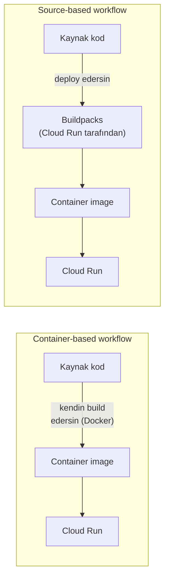
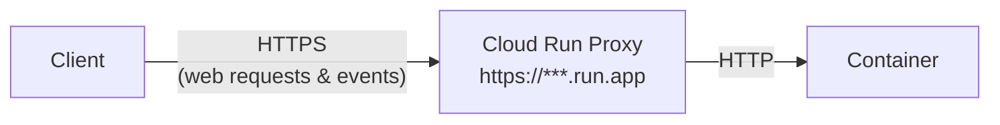
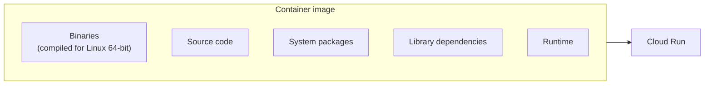
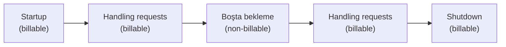
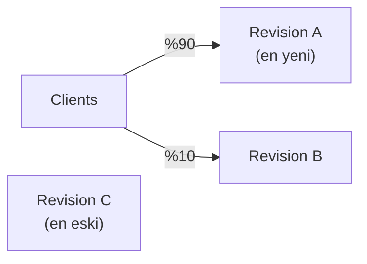
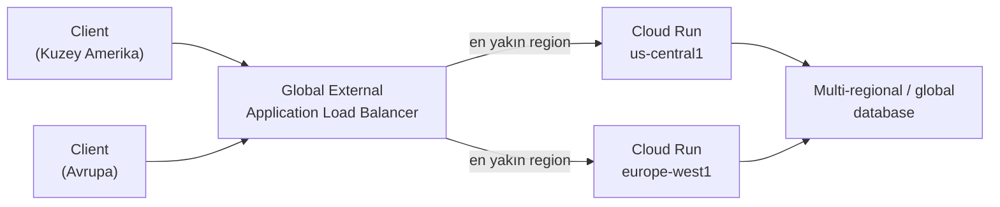
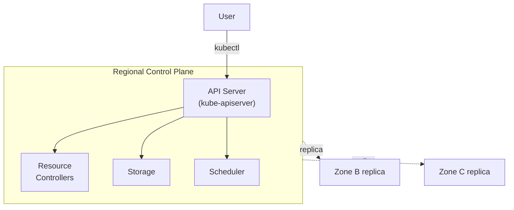
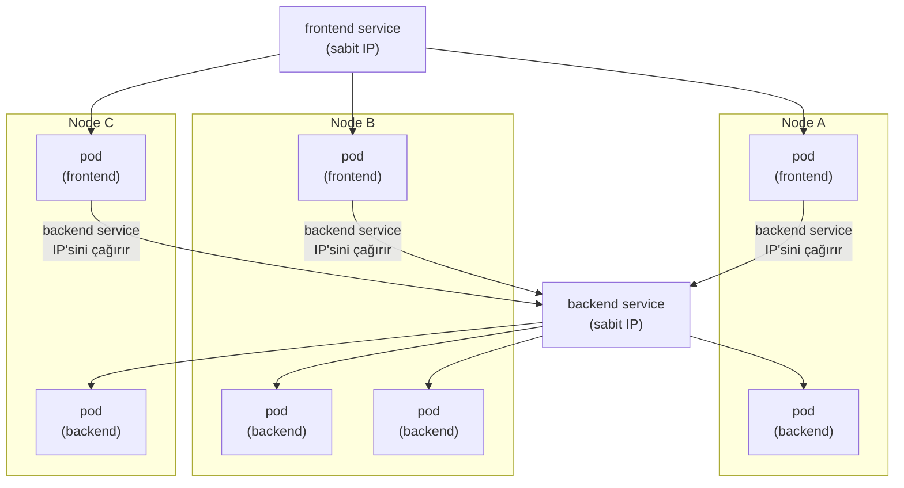
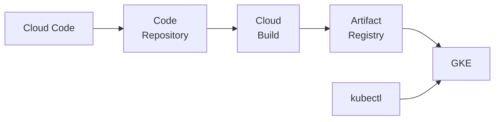

# Introduction to Cloud Run and Google Kubernetes Engine — Baştan Sona Öğretici

> Bu metin, **"Developing Containerized Applications on Google Cloud"** kursunun **Modül 2 — Introduction to Cloud Run and Google Kubernetes Engine** dersinde anlatılan **her şeyi** kavratmak için yazıldı.
>
> **Kapsam notu:** Bu, handbook'taki ikinci kursun ikinci modülüdür. Önceki modül (`deep-dive/17-introduction-to-containers/introduction-to-containers.md`), bir uygulamayı **nasıl bir container image'a paketleyeceğini** öğretmişti — container/image kavramları, Docker, Buildpacks, CI/CD araçları, ve best practice'ler. Bu modül, doğal bir sonraki soruyu yanıtlıyor: **elinde bir container image varken, bunu nerede ve nasıl çalıştırırsın?** Cevap olarak iki platform sunuluyor: **Cloud Run** (serverless, container çalıştıran yönetilen bir compute platformu) ve **Google Kubernetes Engine (GKE)** (Kubernetes'in yönetilen bir sürümü). Ayrıca üçüncü, daha düşük seviyeli bir seçenek olarak **Container-Optimized OS** da ele alınıyor.

---

## Bu ders tam olarak neyi öğretiyor ve neden önemli?

Bu modül, container'ları **çalıştırmak** için üç farklı seviyeyi kapsıyor:

1. **Cloud Run (BÖLÜM 1-11)** — container image'ını verirsin, Google geri kalan her şeyi (scaling, load balancing, HTTPS, altyapı) halleder. **En az operasyonel yük**, ama **en az kontrol.**
2. **Google Kubernetes Engine (BÖLÜM 12-18)** — Kubernetes'in kendisini yönetirsin (ya da GKE'nin yönetilen sürümünü kullanırsın), ama pod'lar, deployment'lar, service'ler gibi **çok daha ince taneli (fine-grained)** kontrol elde edersin. **Daha fazla kontrol**, ama **daha fazla operasyonel sorumluluk.**
3. **Container-Optimized OS (BÖLÜM 19)** — en alt seviyede, container'larını çalıştıracak **işletim sistemini kendin** seçtiğin bir Compute Engine VM'i.

Bu üç seçenek, aslında tek bir spektrumun üç noktasıdır: **"Google her şeyi yönetsin" ile "ben her şeyi kontrol edeyim" arasındaki trade-off.** Bu modülün amacı, bu spektrumdaki her noktanın **ne zaman doğru seçim olduğunu** anlamandır.

---

# BÖLÜM 1 — Cloud Run Nedir?

## Tam yönetilen bir compute platformu

**Cloud Run**, container'larını doğrudan Google'ın ölçeklenebilir altyapısının üzerinde deploy edip çalıştırmanı sağlayan, **tam yönetilen (fully managed) bir compute platformudur.**

Eğer uygulama kodunun bir **container image**'ını build edebiliyorsan — hangi dilde yazılmış olursa olsun — bu uygulamayı Cloud Run'da deploy edebilirsin.

## İki deployment yaklaşımı: container-based ve source-based

Cloud Run, uygulamanı Go, Node.js, Python, Java, .NET Core, ya da Ruby'de geliştiriyorsan, **container'ı senin için build eden** bir **source-based deployment** seçeneği sunar (bu konuyu BÖLÜM 2'de derinlemesine göreceğiz).

Cloud Run, diğer Google Cloud servisleriyle **iyi çalışır** — bu sayede Cloud Run servisini operasyonel olarak yönetmeye, yapılandırmaya, ve ölçeklendirmeye çok fazla zaman harcamadan, **tam özellikli uygulamalar** inşa edebilirsin.

> **Bu neden BÖLÜM 17'nin doğal devamı?** Modül 17'de, bir container image'ın **her şeyi kendi içinde taşıyan, taşınabilir bir paket** olduğunu öğrenmiştik. Cloud Run, bu paketi alıp "her yerde çalıştırabileceğin" bir soyutlamayı, **Google'ın altyapısında, hiçbir sunucu yönetmeden çalıştırabileceğin somut bir platforma** dönüştürüyor.

---

# BÖLÜM 2 — Cloud Run Developer Workflow

## Üç adımlı süreç

Cloud Run developer workflow'u, üç adımdan oluşur:

1. **Kodunu yaz.** Uygulamanı favori programlama dilinde yazarsın. Bu uygulama, web isteklerini dinleyen bir **sunucu başlatmalıdır.**
2. **Build et ve paketle.** Uygulamanı bir **container image**'a build edip paketlersin.
3. **Cloud Run'a deploy et.** Container image'ı Cloud Run'a deploy edersin.

Container'ını Cloud Run'a şu yollarla deploy edebilirsin: **Google Cloud console**, **gcloud CLI**, ya da bir **YAML configuration dosyasından deklaratif olarak.** Cloud Run, ayrıca infrastructure-as-code için popüler bir açık kaynak araç olan **Terraform** ile servis deployment'ını da destekler.

Container'ını deploy ettikten sonra, **benzersiz bir HTTPS URL** elde edersin. Cloud Run daha sonra container'ını **istek üzerine (on demand)** başlatır, ve **gelen tüm istekleri** container'ları dinamik olarak ekleyip kaldırarak karşılamayı garanti eder.

**Cloud Run serverless'tır.** Bu, bir geliştirici olarak, uygulamanı **inşa etmeye** odaklanabileceğin, uygulamanı güçlendiren altyapıyı **inşa etmeye ve bakımını yapmaya** odaklanmana gerek olmadığı anlamına gelir.

## İkinci yol: source-based workflow

Container-based bir workflow harika bir **şeffaflık ve esneklik** sunar — container image'ı kendin build edersen, image'ında **tam olarak hangi dosyaların** paketleneceğine sen karar verirsin.

Ancak bir uygulama inşa etmek zaten yeterince zor — containerization eklemek, ek iş ve sorumluluk getirir. Eğer amacın sadece kaynak kodunu, **güvenli, iyi yapılandırılmış, ve tutarlı bir şekilde**, containerized bir uygulama oluşturup deploy ederek bir HTTPS endpoint'ine dönüştürmekse, Cloud Run'ı kullanabilirsin.

Cloud Run ile hem **container-based** hem **source-based** bir workflow kullanabilirsin. Source-based yaklaşımı kullanırsan, bir container image yerine **kaynak kodunu deploy edersin.** Cloud Run, ardından **Buildpacks kullanarak** kaynağını build eder, ve uygulamayı bağımlılıklarıyla birlikte senin için bir container image'a paketler.



> **Bu neden BÖLÜM 17'deki Buildpacks bilgisiyle doğrudan bağlantılı?** Modül 17'de, Buildpacks'in bir **builder** aracılığıyla, bir Dockerfile yazmadan kaynak kodunu bir container image'a dönüştürdüğünü görmüştük. Cloud Run'ın source-based deployment'ı, bu mekanizmanın **doğrudan bir uygulamasıdır** — sen kaynak kodunu deploy edersin, Cloud Run arka planda Google Cloud's buildpacks'i çalıştırır.

---

# BÖLÜM 3 — HTTPS ve Port 8080 Gereksinimi

## Cloud Run, HTTPS'i senin için halleder

Cloud Run, uygulamana güvenli **HTTPS istekleri** desteği sunar. Cloud Run'da uygulaman, sürekli olarak bir **service** olarak ya da bir **job** olarak çalışabilir. **Cloud Run service'leri**, web isteklerine ya da event'lere yanıt verir; **job'lar** ise bir iş yapar ve o iş tamamlandığında sonlanır.

Cloud Run:

- Geçerli bir **TLS sertifikası** ve HTTPS isteklerini desteklemek için gereken diğer configuration'ı **provision eder.**
- Gelen istekleri **handle eder, decrypt eder**, ve uygulamana **forward eder.**



## Uygulama, 8080 portunu dinlemelidir

Bir container içinde çalışan bir process, **kendi private, sanal network stack'ine** erişime sahiptir — bu sayede uygulaman her zaman bir port açıp gelen bağlantıları dinleyebilir.

**Cloud Run, container'ının web isteklerini handle etmek için 8080 numaralı portu dinlemesini bekler.** 8080 portu, **yapılandırılabilir bir varsayılandır** — eğer bu port uygulamana uygun değilse, uygulamanın configuration'ını farklı bir port kullanacak şekilde değiştirebilirsin.

**Bir HTTPS sunucusu sağlamana gerek yoktur** — Google'ın altyapısı bunu senin için halleder.

> **Sınav tuzağı — "kendi HTTPS sertifikamı yönetmeliyim" varsayımı:** Ders açıkça belirtiyor: uygulaman sadece **HTTP** üzerinden, 8080 portunda dinlemelidir. TLS sertifikası provizyonlama, encryption/decryption, ve HTTPS terminasyonu tamamen **Cloud Run Proxy** tarafından halledilir — bu, uygulama kodunun sorumluluğunda değildir.

---

# BÖLÜM 4 — Cloud Run'da Container Çalıştırmak

## Herhangi bir dil, tek bir kısıtlama

Cloud Run'ın büyük bir avantajı, **container'lar çalıştırmasıdır.** Bu şu anlama gelir: uygulamalarını **herhangi bir programlama dilinde** geliştirip Cloud Run'da çalıştırabilirsin — tek şart, bunların **64-bit Linux binary'sine compile edilebilir** ve bir **container image'a paketlenebilir** olmasıdır.



Bu, modül 17'deki "container image'a girebilecek dosya türleri" listesinin (BÖLÜM 4-5) Cloud Run bağlamındaki karşılığıdır: hangi dosya türlerinin image'a girdiği önemli değildir — önemli olan **sonuçtaki binary'nin Linux 64-bit üzerinde çalışabilmesidir.**

---

# BÖLÜM 5 — Pricing Model

## Benzersiz bir fiyatlandırma modeli: sadece kullandığın kadar öde

Cloud Run pricing modeli **benzersizdir**: yalnızca bir container **istekleri handle ederken**, ve **başlarken (startup) ya da kapanırken (shutdown)** kullanılan sistem kaynakları için ödeme yaparsın.



## Alternatif model: instance-based pricing

Cloud Run, ayrıca **container'ın tüm lifecycle'ı için** seni ücretlendiren bir pricing modelini de destekler — bu modelde, uygulamana hiç istek gelmese bile, container instance'larına **her zaman CPU tahsis edilir.** Bu model, çoğu **steady-state (istikrarlı, sürekli yük altındaki)** workload için **daha ekonomik olabilir.**

Container süresinin fiyatı, container için tahsis edilen **vCPU ve bellek miktarına** göre artar.

> **Bu neden önemli bir tasarım kararı?** Request-based pricing, **düzensiz, seyrek trafikli** uygulamalar için idealdir — çünkü boşta geçen zaman için ödeme yapmazsın. Instance-based pricing ise, **sürekli yüksek trafikli** uygulamalar için daha öngörülebilir ve genellikle daha ucuz olabilir, çünkü her istek için cold start riski taşımaz (instance zaten "her zaman açık"). Hangi modeli seçeceğin, **workload'ının trafik desenine** bağlıdır.

## Hatırlanacaklar

1. Cloud Run, container'ları **istek üzerine (on-demand) çalıştırır ve autoscale eder.**
2. Container tabanlı uygulaman, **web isteklerini handle etmelidir.**
3. **Source-based ya da container-based** bir workflow kullanabilirsin.
4. Cloud Run, uygulamana gelen **HTTPS isteklerini handle eder.**
5. **Pay-per-use** bir pricing modeli.

---

# BÖLÜM 6 — Cloud Run Use Case'leri

## REST API sunmak

Cloud Run'ın yaygın bir kullanım alanı, bir **REST API** sunan bir servis deploy etmektir. Bu servisi bir API, bir website, ya da bir web uygulaması sunmak için kullanabilirsin. Gerekirse, servisi API ya da web uygulaması tarafından işlenen veriyi **kalıcı hale getirmek (persist)** için bir veritabanına bağlayabilirsin.

## Daha karmaşık bir public website: e-ticaret sitesi

Cloud Run üzerinde, örneğin bir e-ticaret sitesi gibi daha karmaşık bir public website de build edebilirsin. Bu durumda ayrıca:

- Performansı iyileştirmek için **Cloud CDN**'i etkinleştirebilirsin,
- Content-based kurallarla kötü amaçlı gelen trafiği filtrelemek için **Google Cloud Armor** ekleyebilirsin.

Backend'de, ilişkisel bir veritabanı, kullanıcı session'ları için bir Redis store, ve üçüncü parti API'lerle bağlantı kurabilirsin.

## Cloud Run üzerinde mikroservisler

Cloud Run üzerinde, **birçok mikroservisten oluşan** bir uygulamayı deploy edip çalıştırabilirsin.

Cloud Run'daki servisler birbirleriyle **REST API'ler ya da gRPC** kullanarak iletişim kurabilir. **Pub/Sub kullanarak**, servisler arasında **garantili teslimatlı asenkron mesajlar** gönderip alabilirsin. Pub/Sub, **push subscription'ları** kullanılarak Cloud Run ile iyi entegre olur — Pub/Sub, mesajları Cloud Run servisinin endpoint'ine **HTTP istekleri olarak forward eder** ve isteğe bağlı olarak **kimlik doğrular (authenticate eder).**

> **Bu neden BÖLÜM 2'nin (source-based/container-based) bir uzantısı değil, farklı bir konu?** Buradaki mikroservis mimarisi, servislerin **birbiriyle nasıl konuştuğuyla** ilgilidir — senkron (REST/gRPC, doğrudan request/response) ya da asenkron (Pub/Sub, bir message broker aracılığıyla). Bu, her bir servisin **nasıl build edildiğinden** (source-based mi, container-based mi) tamamen bağımsız bir karardır.

## Event processing workflow'ları

Cloud Run, Cloud Storage, Cloud Build, Pub/Sub, Eventarc gibi, cloud altyapından **event üreten** çeşitli Google Cloud servisleriyle entegre olur — bu da Cloud Run ile **event processing workflow'ları** inşa etmeni sağlar.

Örnek bir workflow: bir tıbbi tarama görseli Cloud Storage'a yüklendiğinde, bir Cloud Run servisi taranan görseli işleyip modern bir formata dönüştürmek üzere tetiklenir. Servis daha sonra Pub/Sub'a bir mesaj gönderir — bu mesaj, dönüştürülen görseli etiketleyip watermark'layan **başka bir Cloud Run servisini**, ve tarama verisindeki anomalileri tespit eden **GPU'lu bir VM uygulamasını** tetikler. Her iki servis de çıktısını **Cloud Storage'a geri yazar.**

## Cloud Scheduler ile zamanlanmış görevler

Bir Cloud Run servisini **zamanlanmış (scheduled)** olarak güvenle tetiklemek için **Cloud Scheduler** kullanabilirsin. Cloud Scheduler, **tam yönetilen bir cron job scheduler'ıdır.**

Zamanlanmış servislere örnekler: fatura oluşturmak, ya da bir arama indeksini yeniden build etmek.

**Zamanlanmış bir işi container'ın kendisinde çalıştırmanın sınırlaması** şudur: bir container'ın ömrü, yalnızca **istekleri handle ederken garanti edilir.** Eğer görevleri bir container üzerinde **daha sonra çalışacak şekilde zamanlarsan**, o görevin çalışması gereken zamana kadar container **kapatılmış ya da durdurulmuş** olabilir.

**Cloud Run servisi, görevini yapılandırılmış istek timeout'u içinde tamamlamalıdır.**

> **Bu neden dikkat çekici bir tuzak?** Sezgisel olarak, "bir container'ın içinde bir cron iş çalıştırırım" gibi bir yaklaşım akla gelebilir. Ama Cloud Run'ın serverless doğası gereği, container'ın **yaşam süresi istek işlemeyle sınırlıdır** — bir container, işlediği isteğin dışında **süresiz olarak var olmayı garanti etmez.** Bu yüzden zamanlanmış görevler için doğru yaklaşım, **Cloud Scheduler'ın harici olarak bir HTTP isteği göndererek servisi tetiklemesidir** — servisin kendi içinde bir zamanlayıcı çalıştırması değil.

---

# BÖLÜM 7 — Yüksek Erişilebilirlik: Service Revision'lar ve Traffic Splitting

## Revision: immutable bir container image + service configuration çifti

Servis kesintilerinin yaygın bir nedeni, genellikle uygulamanın **erişilebilirliğini etkileyen uygulama güncellemeleridir.**

Cloud Run'da, container image'ını bir servise her deploy edişinde, **yeni bir revision oluşturulur.**

**Bir service revision immutable'dır (değişmezdir) ve değiştirilemez.** Uygulamanda bir değişiklik yapıp deploy edersen, Cloud Run servisinin **yeni bir revision'ını** oluşturur.

Bir service revision şunlardan oluşur:

- **Container image'ın**, ve
- **Service configuration** — environment variable'lar, memory limit'leri, ve diğer configuration değerleri gibi ayarları içerir.

**Trafiği yeni ve önceki revision'lar arasında bölerek (split ederek)**, yeni revision'a gönderilecek isteklerin yüzdesini belirterek, istek işleme hatalarının etkisini azaltabilirsin. Bu, yüksek bir istek hata oranı olduğunda **önceki, stabil bir revision'a geri dönmeni (rollback)**, ya da trafiği kademeli olarak **%100 yeni revision'a** göndermeni sağlar.



> **Bu neden modül 16'daki (Cloud Run functions) revision konseptiyle aynı mantığı taşıyor?** Modül 16'da, Cloud Run functions'ın her deploy'unun **immutable, yeni bir revision** oluşturduğunu, ve varsayılan olarak tüm trafiğin en son revision'a gittiğini görmüştük. Burada aynı temel mekanizma — immutable revision'lar + traffic splitting — Cloud Run **service'leri** için de geçerlidir, çünkü Cloud Run functions'ın altyapısı zaten Cloud Run'ın kendisidir.

---

# BÖLÜM 8 — Automatic Scaling

## Container instance sayısı, talebe göre otomatik ayarlanır

Servisine gelen istekleri handle etme kapasitesini korumak için, Cloud Run gerektiğinde bir service revision'ının **container instance sayısını otomatik olarak artırır.** Bu özelliğe **autoscaling** denir.

Bir service revision'ına gelen istekler, container instance'ları grubuna **dağıtılır.**

- Eğer tüm container instance'ları **meşgulse**, Cloud Run **ek instance'lar ekler.**
- Talep **azaldığında**, Cloud Run bazı instance'lara trafik göndermeyi durdurur ve onları **kapatır.**
- Bir container instance'ı **aynı anda birçok isteği** alabilir. **Concurrency** ayarıyla, belirli bir container instance'ına **paralel olarak gönderilebilecek maksimum istek sayısını** belirleyebilirsin.

Servisine gelen istek oranına ek olarak, container instance sayısı şunlardan da etkilenir:

| Faktör | Detay |
| --- | --- |
| **CPU utilization** | İstekleri işlerken mevcut instance'ların CPU kullanımı — hedef **%60 utilization**'dır |
| **Maximum concurrency ayarı** | Bir instance'ın paralel olarak kaç isteği kabul edebileceği |
| **Minimum/maximum container instance sayısı ayarı** | Instance sayısının alt ve üst sınırı |

> **Bu neden modül 16'daki concurrency konusuyla dikkatlice karşılaştırılmalı?** Modül 16'da (Cloud Run functions), concurrency etkinleştirildiğinde kodun **eşzamanlı çalıştırmaya güvenli olması gerektiğini** çünkü **izolasyon sağlanmadığını** öğrenmiştik. Burada aynı temel mekanizma (concurrency ayarı) Cloud Run service'leri için de geçerlidir — ders açıkça, **bir instance'ın aynı anda birden fazla isteği alabileceğini** belirtiyor; bu, aynı instance'a düşen isteklerin **aynı kaynakları (bellek, global scope) paylaştığı** anlamına gelir.

---

# BÖLÜM 9 — Region, Zone, ve Global Load Balancing

## Region ve zone nedir?

Cloud Run **regional bir servistir** — container'larının deploy edileceği bir **region seçmeni** sağlar. Bir **region**, Google Cloud kaynaklarının barındırıldığı **belirli bir coğrafi konumdur.**

Bir region, **üç ya da daha fazla zone**'dan oluşur. Zone'lar ve region'lar, bir ya da daha fazla veri merkezinde sağlanan **fiziksel kaynakların mantıksal soyutlamalarıdır.** Bir region örneği, Kuzey Amerika, Iowa'daki **`us-central1`**'dir.

Bir **zone**, bir region içindeki cloud kaynakları için bir **deployment alanıdır.** Zone'lar, bir region içinde **tek bir hata alanı (single failure domain)** olarak kabul edilir.

**Yüksek erişilebilirlik için**, Cloud Run container'larını bir region içindeki **birden fazla zone'a dağıtır** — bu da uygulamanı bir zone'un başarısız olmasına karşı **dirençli (resilient)** kılar.

## Global external Application Load Balancer

Cloud Run, Google Cloud'un **global external Application Load Balancer**'ıyla entegre olur — bu, birden fazla **regional Cloud Run servisinin önünde tek, global bir IP adresi** açığa çıkarmanı sağlar.

Global external Application Load Balancer, bir client'tan gelen istekleri **onlara en yakın region'a yönlendirir.** Uygulama erişilebilirliğini iyileştirmenin yanında, global external Application Load Balancer, **dünya çapındaki client'lar için gecikmeyi (latency) azaltır.**



---

# BÖLÜM 10 — Uygulama Taşınabilirliği (Portability)

## Neden taşınabilirlik önemlidir?

Taşınabilirlik, uygulama geliştiricileri için önemlidir. Taşınabilirliğin önemli olduğu birkaç kullanım alanı:

- Uygulamanın, Google Cloud'un **fiziksel varlığının olmadığı** coğrafi bir region'da çalışması gerekiyor, ve bunu orada çalıştırman **zorunlu** (data sovereignty — veri egemenliği için).
- Geliştirici, **vendor lock-in'den kaçınmak** istiyor.

## İki taşınabilirlik yolu

Cloud Run'daki uygulamalar iki şekilde taşınabilirdir:

1. **Cloud Run, container'lar kullanır.** Container'ların her yerde çalışabildiğini zaten öğrendin — bu, uygulamanı **doğası gereği taşınabilir** kılar.
2. **Cloud Run platformu, Knative ile API-uyumludur** — Knative, serverless uygulamaların **Kubernetes tabanlı ortamlarda** kolayca çalışmasını sağlayan açık kaynaklı bir projedir. Cloud Run platformu, Knative'in **aynı container runtime contract'ını** implement eder.

> **Bu, GKE bölümüne (BÖLÜM 12+) neden bir köprü kuruyor?** Knative uyumluluğu, Cloud Run'ın "kapalı bir kutu" olmadığını gösteriyor — Cloud Run'da çalışan bir uygulamayı, gerekirse **Knative çalıştıran bir Kubernetes cluster'ında** (örneğin bir GKE cluster'ında) da çalıştırabilirsin. Bu, ders boyunca kurduğumuz "spektrum" fikrini somutlaştırıyor: Cloud Run ve GKE, birbirinden tamamen izole iki dünya değil, **aynı temel container runtime contract'ı üzerine kurulu**, farklı kontrol seviyeleri sunan iki platformdur.

---

# BÖLÜM 11 — Cloud Run Kullanırken Dikkat Edilmesi Gerekenler

Cloud Run üzerinde uygulamalarını çalıştırırken göz önünde bulundurman gereken bazı noktalar var:

## Autoscaling maliyetleri

Eğer birçok container instance'ına kadar ölçeklenen bir servis deploy edersen, bu container'ları çalıştırmak için **maliyete katlanırsın.** Autoscaling sırasındaki instance sayısını sınırlamak için, Cloud Run servisin için **maksimum container instance sayısını** ayarlayabilirsin.

## Downstream sistemlerle scaling uyuşmazlığı

Eğer Cloud Run servisin **kısa bir süre içinde** birçok container instance'ına kadar ölçeklenirse, **downstream sistemlerin** ek trafik yükünü handle edemeyebilir. Cloud Run servisini yapılandırırken, o downstream sistemlerin **throughput kapasitesini** anlaman gerekir.

## Workload migration

Uygulama modernizasyon stratejinin bir parçası olarak, VM tabanlı workload'ları Cloud Run ya da Google Kubernetes Engine üzerinde çalışacak container'lara **migrate etmek** için bir migration planı oluşturman ve araçlar kullanman gerekir.

> **Bu neden BÖLÜM 8'deki (autoscaling) bilgiyle birlikte okunmalı?** Autoscaling, "sorunu otomatik çözer" gibi görünse de, aslında **iki yeni sorumluluk** yaratır: (1) maliyet kontrolü (max instance ile sınırlamak), ve (2) downstream kapasiteyle uyum (bir veritabanının aniden 100 yeni instance'tan gelen bağlantı yükünü kaldıramaması gibi). Autoscaling'i "kur ve unut" olarak değil, **aktif olarak yönetilmesi gereken bir mekanizma** olarak düşünmek gerekir.

## Hatırlanacaklar

1. Cloud Run, uygulamanı **istek üzerine çalıştırır ve autoscale eder.**
2. Cloud Run'ı, mikroservisler, event processing workflow'ları, ve zamanlanmış görevler/job'lar dahil, **web isteklerine hizmet veren uygulamalar** için kullan.
3. **Automatic scaling, incremental application update'ler, ve built-in load balancing**, yüksek erişilebilirlikli uygulamalar inşa etmene yardımcı olur.
4. Cloud Run, **geliştiricileri daha üretken** kılmak için tasarlanmıştır.

---

# BÖLÜM 12 — Google Kubernetes Engine (GKE) Nedir?

## Kubernetes ve GKE arasındaki fark

**Kubernetes**, yazılım deployment'ını, ölçeklendirmesini, ve yönetimini otomatikleştirmek için **açık kaynaklı bir container orkestrasyon sistemidir.** Orijinal olarak Google tarafından tasarlanan proje, artık **Cloud Native Computing Foundation (CNCF)** tarafından bakımı yapılmaktadır.

**Google Kubernetes Engine (GKE)**, **tam yönetilen bir Kubernetes servisidir.** GKE, containerized uygulamalarını Google altyapısında deploy etmen, yönetmen, ve ölçeklendirmen için **yönetilen bir ortam** sağlar.

GKE ortamı, bir **cluster** oluşturmak üzere bir araya getirilen birden fazla makine ya da **node**'dan (spesifik olarak, Compute Engine instance'larından) oluşur.

> **Bu neden Cloud Run ile temel bir zıtlık oluşturuyor?** Cloud Run'da, altyapı tamamen soyutlanmıştır — bir "node" ya da "cluster" kavramıyla hiç uğraşmazsın. GKE'de ise, **altındaki Compute Engine VM'lerinin bir cluster oluşturduğunu bilerek** düşünürsün — bu, daha fazla kontrol demektir, ama aynı zamanda daha fazla kavramla (node, pod, cluster, control plane) uğraşman gerektiği anlamına gelir.

## GKE'nin faydaları

Kubernetes gibi bir container orkestrasyon sistemini yönetmek — kurulumdan ve provizyonlamadan, upgrade'lere, ölçeklendirmeye, ve service level agreement'ları (SLA) karşılamaya kadar — **çok fazla iş gerektirir.**

Google Kubernetes Engine ile, şu gelişmiş cluster yönetim özelliklerinin faydasını elde edersin:

| Özellik | Açıklama |
| --- | --- |
| **Kolay cluster oluşturma ve yönetim** | Cluster'ı hızlıca kurup yönetebilirsin |
| **Load balancing** | Trafiği otomatik olarak dağıtır |
| **Automatic scaling** | Talebe göre otomatik ölçeklenir |
| **Cluster node yazılımının otomatik upgrade'leri** | Node'ların yazılımı otomatik güncellenir |
| **Node sağlığını ve erişilebilirliğini korumak için automatic repair** | Sorunlu node'lar otomatik onarılır |
| **Cluster görünürlüğü için Google Cloud'un operations suite'iyle logging ve monitoring** | Cluster'ının durumunu izleyebilirsin |

---

# BÖLÜM 13 — GKE Cluster Mimarisi: Control Plane

## Cluster: control plane + node'lar

Bir GKE cluster'ı, bir ya da daha fazla **control plane**'den ve **node** adı verilen worker makinelerinden oluşur. Control plane ve node'lar, **Kubernetes cluster orkestrasyon sistemini** oluşturur. GKE, cluster'ların **tüm altındaki altyapısını** — control plane, node'lar, ve tüm sistem bileşenleri dahil — yönetir.

## Control plane ne yapar?

**Control plane, cluster'ın tüm node'larında çalışan her şeyi yönetir.** Control plane, container workload'larını **zamanlar (schedule eder)** ve workload'ların **yaşam döngüsünü, ölçeklendirmesini, ve upgrade'lerini** yönetir. Control plane ayrıca, o workload'lar için **network ve storage kaynaklarını** da yönetir. Control plane ve node'lar, **Kubernetes API'leri** kullanarak birbiriyle iletişim kurar.

Control plane, cluster'ın için **birleşik endpoint'idir** ve API isteklerini handle etmek için Kubernetes API server process'ini (**`kube-apiserver`**) çalıştırır. Control plane'le etkileşim kurmak için, şunları kullanarak Kubernetes API çağrıları yaparsın:

- **HTTP/gRPC istekleri.**
- **`kubectl`** gibi komut satırı client'ları, ya da **Google Cloud console.**

**API server process, cluster'ın tüm iletişimi için merkezdir (hub).** Node'lar, sistem process'leri, ve uygulama controller'ları gibi tüm dahili cluster bileşenleri, API server'ın **client'ları** olarak davranır.



> **Sınav tuzağı — zonal ile regional cluster arasındaki fark:** Bir **zonal cluster**'ın, **tek bir zone'da** çalışan tek bir control plane'i vardır. Bir **regional cluster**'ın ise, bir region içindeki **birden fazla zone'da** çalışan **birden fazla control plane replica'sı** vardır. Regional cluster'lar, bir zone başarısız olsa bile control plane'in erişilebilir kalması açısından **daha yüksek erişilebilirlik** sunar.

---

# BÖLÜM 14 — GKE Cluster Mimarisi: Node'lar ve Pod'lar

## Node: containerized workload'ları çalıştıran VM

**Node'lar**, containerized uygulamalarını ve diğer workload'larını çalıştıran **Compute Engine sanal makineleridir (VM'lerdir).**

Bir node, cluster'ının workload'larını oluşturan container'ları desteklemek için gereken servisleri çalıştırır. Bunlar arasında **runtime** ve **Kubernetes node agent'ı (`kubelet`)** bulunur — `kubelet`, control plane ile iletişim kurar ve node üzerinde zamanlanan container'ları **başlatmaktan ve çalıştırmaktan sorumludur.**

## Pod: Kubernetes'in en küçük deployable birimi

Bir **pod**, Kubernetes'te oluşturup yönetebileceğin **en küçük deployable compute birimidir.** Bir pod, **paylaşılan storage ve network kaynaklarına sahip, bir ya da daha fazla container'dan oluşan bir gruptur**, ve container'ların nasıl çalıştırılacağına dair bir spesifikasyon içerir.

Pod'lar genellikle **doğrudan oluşturulmaz**, bunun yerine **Deployment'lar** ya da **Job'lar** gibi Kubernetes workload kaynakları kullanılarak oluşturulur.

**Pod'lar geçici (ephemeral), atılabilir (disposable) varlıklardır.** Bir pod oluşturulduğunda, cluster'daki bir node üzerinde çalışacak şekilde zamanlanır. Pod, şunlardan biri gerçekleşene kadar o node'da kalır:

- Çalışması **tamamlanır**,
- Pod nesnesi **silinir**,
- Pod, **kaynak yetersizliği nedeniyle tahliye edilir (evicted)**,
- Ya da **node başarısız olur.**

> **Bu neden BÖLÜM 2'deki (modül 17) "container" tanımıyla dikkatlice karşılaştırılmalı?** Modül 17'de, bir container'ın "yalnızca runtime'da var olan, çalışan bir process'i temsil ettiğini" öğrenmiştik. Pod, bu kavramı **Kubernetes'e özgü bir sonraki katmana** taşır: bir pod, **bir ya da daha fazla container'ı** paylaşılan storage/network ile gruplayan bir **zarf (envelope)**'tır. Yani "container" hâlâ en küçük çalışma birimidir, ama Kubernetes'in yönettiği, zamanladığı, ve yaşam döngüsünü takip ettiği şey **pod'dur.**

---

# BÖLÜM 15 — Kubernetes Deployment: İstenen Durumu Tanımlamak

## Deklaratif configuration: "ne istediğini" söyle, "nasıl yapılacağını" değil

Kubernetes ile, cluster'ındaki nesneler için **istenen durumu (desired state)** belirtmek üzere API istekleri yaparsın. Kubernetes, o durumu **sürekli olarak korumaya (maintain)** çalışır.

Kubernetes, API'deki nesneleri ya **imperatif (buyurgan)** ya da **deklaratif (bildirimsel)** olarak yapılandırmana izin verir.

## Deployment nedir?

Bir **Deployment**, Kubernetes'te pod'ları **deklaratif olarak** oluşturup yönetmenin bir yoludur. Bir Deployment, ihtiyaç duyulan istenen pod replica sayısını belirten bir **ReplicaSet** tanımlar. Bir ReplicaSet'in amacı, **herhangi bir anda çalışan stabil bir replica pod kümesini korumaktır.**

Kubernetes'teki **Deployment Controller**, deployment'ın gerçek durumunu, **kontrollü bir hızda** istenen duruma değiştirir.

Bir deployment, istenen pod sayısını ve deployment'a **hangi pod'ların dahil edileceğini tanımlayan bir selector label'ı** belirten bir YAML dosyasıyla tanımlanır. Ayrıca, pod içinde çalışacak container'ları tanımlayan bir spesifikasyon içerir.

```yaml
kind: Deployment
apiVersion: v1.1
Metadata:
  name: frontend
spec:
  replicas: 4
  selector:
    role: web
  template:
    metadata:
      name: web
      labels:
        role: web
    spec:
      containers:
      - name: my-app
        image: my-app
      - name: nginx-ssl
        image: nginx
        ports:
        - containerPort: 80
        - containerPort: 443
```

Örnek Deployment, `role` label'ı `web` olarak ayarlanmış **4 pod replica'sını** yönetir.

---

# BÖLÜM 16 — Kubernetes Service: Pod'lar İçin Sabit Bir Adres

## Neden pod IP'lerini doğrudan kullanmak işe yaramaz?

Bir pod **geçici (ephemeral)** olduğundan, silinip yeniden oluşturuldukça **IP adresi değişir.** Bu yüzden, Pod IP adreslerini **doğrudan** kullanmak mantıklı değildir.

## Service nedir?

Kubernetes'te bir **Service**, pod'ların mantıksal bir kümesini ve bunlara erişim politikasını tanımlayan bir **network soyutlamasıdır.**

| Özellik | Açıklama |
| --- | --- |
| **Stabil endpoint** | Bir pod grubu için stabil bir endpoint sağlar |
| **Referans verme** | Diğer pod'ların, üye pod'larına **birim olarak** referans verip iletişim kurmasına izin verir |
| **Selector kullanımı** | Hangi pod'lar üzerinde çalıştığını belirlemek için **selector**'lar kullanır |
| **Sabit IP** | Servisin ömrü boyunca kalan **sabit (fixed) bir IP adresi** sağlar |
| **Load balancing** | Üye pod'ları arasında **load balancing** sağlar |

Bir servis tarafından hedeflenen pod kümesi genellikle bir **selector** ile belirlenir. Client'lar, **servis IP adresini** çağırır, ve istekleri, servisin üyesi olan pod'lar arasında **load-balanced** edilir.



## Service manifest'i

```yaml
kind: Service
apiVersion: v1.1
metadata:
  name: frontend-svc
spec:
  selector:
    role: web
  type: LoadBalancer
  ports:
  - name: http
    protocol: TCP
    port: 80
    targetPort: 80
```

Örnekte, resource'un `kind`'i **Service** olarak belirtilmiştir. Servise bir isim verilir (`frontend-svc`). Servisin `role: web` olarak ayarlanmış bir **selector**'ı vardır — bu, `role` label'ı `web` olan **tüm pod'ları** frontend servisinin bir parçası olarak seçer.

Tanımlanan servis türü **`LoadBalancer`**'dır. Bir LoadBalancer servisi, **externally accessible**'dır ve servisin DNS adını ya da IP adresini bilen client'lar tarafından erişilebilir. `LoadBalancer`'a ek olarak, Kubernetes'te yaygın olarak kullanılan iki servis türü daha vardır: **`ClusterIP`** ve **`NodePort`.**

Harici client'lar, servisi load balancer'ın IP adresini ve YAML'daki `port` değeriyle belirtilen TCP portunu kullanarak çağırır. İstek, `targetPort` değeriyle belirtilen TCP portunda, üye pod'lardan **birine forward edilir.**

---

# BÖLÜM 17 — Kubernetes Volume ve Diğer Kaynak Türleri

## Volume: pod'daki tüm container'lara erişilebilir bir dizin

Kubernetes'te bir **volume**, bir pod'daki **tüm container'lara erişilebilir bir dizindir.**

Bir volume kullanmak için, bir pod hangi volume'leri sağladığını ve bunların container'lara nerede mount edileceğini belirtir. Volume mount edildikten sonra, pod'daki container'lar **online duruma getirilir** ve pod initialization'ının geri kalanı tamamlanır.

## İki temel volume kategorisi

| Kategori | Yaşam döngüsü |
| --- | --- |
| **Ephemeral volume türleri** (örn. **ConfigMap**, **Secret**) | Kapsayan pod'la **aynı ömre** sahiptir — pod oluşturulduğunda oluşturulur, pod sonlandırıldığında kaldırılır |
| **Dayanıklı (durable) storage'la desteklenen volume türleri** (örn. **PersistentVolume**) | Pod'dan **bağımsız** var olur — pod sonlandırıldığında verisi **korunur** |

## Diğer Kubernetes kaynak türleri

Deployment, ReplicaSet, Service, ve Volume kaynak türlerine ek olarak, Kubernetes şunları da destekler: **DaemonSet**, **StatefulSet**, **Job**, ve diğerleri — özel (custom) resource türleri dahil.

---

# BÖLÜM 18 — GKE İçin Geliştirme ve CI/CD Workflow'u

## Geliştirme araçları

Uygulama kodunu geliştirmek için herhangi bir kaynak kod editörü ya da IDE kullanabilirsin, ama geliştirme sürecini daha verimli kılmak için, kod değişikliklerini **geliştirici workspace'inde doğrulamana** izin veren araçları kullanmayı düşünmelisin.

**Cloud Code**, popüler IDE'ler için, uygulamaları Google Cloud ile oluşturmayı, deploy etmeyi, ve entegre etmeyi kolaylaştıran bir dizi **IDE plugin'idir.** Cloud Code, cluster kaynaklarını görselleştirmeni ve izlemeni sağlayan **Kubernetes ve Cloud Run explorer'ları** gibi yerleşik yeteneklere sahiptir.

**Code Repository, Cloud Build, ve Container ya da Artifact Registry**, ve **Google Cloud Deploy** ve **Skaffold** gibi diğer Google Cloud araçlarıyla, uygulamanı Google Kubernetes Engine'e deploy eden bir **sürekli entegrasyon ve sürekli teslimat (CI/CD) pipeline'ı** kurabilirsin.

**`kubectl`** CLI'ını kullanarak, Kubernetes cluster kaynaklarını ve uygulama workload'larını **yönetebilirsin.**



## Uçtan uca development ve deployment workflow'u

Google Cloud araçlarını kullanarak, development ve deployment workflow'un şu adımları içerir:

1. **Develop:** Kaynağını oluşturmak için Cloud Code ya da başka editörler kullan, ve kodunu Cloud Source Repositories, GitHub, ya da başka bir kaynak kod repository'sinde sakla.
2. **Build and test:** Uygulamanı Cloud Build kullanarak build et. Cloud Build, kaynak kod repository'ne yapılan bir commit'ten tetiklenebilen bir CI pipeline'ı kurmanı sağlar. Kaynak repository'ye bir değişiklik commit edildiğinde, Cloud Build:
   - Uygulamanın container image'ını **yeniden build eder.**
   - Image'ı **Artifact Registry'de saklar.**
   - Herhangi bir build artifact'ini **bir Cloud Storage bucket'ında saklar.**
   - Container üzerinde **testler çalıştırır.**
   - Container'ı, bir GKE cluster'ı içeren bir **staging ortamına** deploy etmek için **Google Cloud Deploy'u çağırır.**
3. **Deploy:** Build ve testler başarılıysa, onay sonrasında container'ı **production ortamına terfi ettirmek (promote)** için Cloud Deploy kullan.
4. **Manage:** Uygulamanı GKE üzerinde **yönet.**
5. **Monitor:** Uygulamanın performansını, uygulaman için entegre monitoring ve logging içeren **Google Cloud'un operations suite'i** ile **izle.**

> **Bu neden modül 17'deki (BÖLÜM 8-10) CI/CD bilgisiyle bire bir örtüşüyor?** Skaffold, Artifact Registry, ve Cloud Build'i modül 17'de görmüştük — burada aynı araçlar, **Google Cloud Deploy** ile birlikte, GKE'ye özel bir workflow'a (staging → onay → production) genişletiliyor. Fark, deployment hedefinin artık Cloud Run değil, **bir ya da daha fazla GKE cluster'ı (staging ve production)** olmasıdır.

## Hatırlanacaklar

1. Google Kubernetes Engine, containerized uygulamalarını deploy etmen, yönetmen, ve ölçeklendirmen için **yönetilen bir ortam** sağlar.
2. Bir GKE cluster'ı, bir ya da daha fazla **control plane**'den ve **node** adı verilen worker makinelerinden oluşur.
3. Control plane, container workload'larını **zamanlar** ve workload'ların yaşam döngüsünü node'lar üzerinde **yönetir.**
4. Bir pod, bir ya da daha fazla container'dan oluşan bir gruptur, ve Kubernetes'teki **en küçük deployable compute birimidir.**
5. Kubernetes'te, API'deki çeşitli nesne türlerini **imperatif ya da deklaratif** olarak yapılandırırsın.

---

# BÖLÜM 19 — Container-Optimized OS

## Container-Optimized OS nedir?

Cloud Run ve Google Kubernetes Engine'e ek olarak, Google Cloud, containerized uygulamalarını çalıştırmak için kullanabileceğin bir işletim sistemi olan **Container-Optimized OS**'u sunar.

Container-Optimized OS, **Docker container'ları çalıştırmak için optimize edilmiş**, Compute Engine VM'leri için bir **işletim sistemi image'ıdır.**

Container-Optimized OS, **Google tarafından bakımı yapılır** ve açık kaynaklı **Chromium OS projesine** dayanır. Container-Optimized OS ile, Docker container'larını Google Cloud'da **hızlıca başlatabilir**, ve onları **verimli ve güvenli** bir şekilde çalıştırabilirsin.

## Faydalar

| Fayda | Açıklama |
| --- | --- |
| **Kutudan çıktığı gibi container çalıştırma** | Container-Optimized OS instance'ları, Docker runtime'ı ve `cloud-init` ile önceden kurulu gelir — VM'ini oluşturduğun anda, host üzerinde hiçbir kurulum gerekmeden Docker container'ını ayağa kaldırabilirsin |
| **Daha küçük saldırı yüzeyi** | Daha küçük bir footprint'e sahiptir, bu da instance'ının potansiyel saldırı yüzeyini azaltır |
| **Varsayılan olarak kilitli (locked-down)** | Varsayılan olarak kilitli bir firewall ve diğer güvenlik ayarları içerir |
| **Otomatik güncellemeler** | Haftalık güncellemeleri arka planda otomatik olarak indirecek şekilde yapılandırılmıştır; en son güncellemeleri kullanmak için sadece bir reboot gerekir |

## Sınırlamalar

| Sınırlama | Açıklama |
| --- | --- |
| **Package manager dahil değildir** | Bir instance'a doğrudan yazılım paketi kuramazsın (ama debugging/admin araçlarını izole bir container'da çalıştırmak için **CoreOS toolbox** kullanabilirsin) |
| **Containerized olmayan uygulamalar desteklenmez** | Container-Optimized OS, containerized olmayan uygulamaların çalıştırılmasını desteklemez |
| **Üçüncü parti kernel modülleri/driver'lar kurulamaz** | Kernel kilitlidir (locked down) |
| **Google Cloud dışında desteklenmez** | Container-Optimized OS, Google Cloud ortamının dışında desteklenmez |

## Ne zaman kullanılmalı, ne zaman kullanılmamalı?

**Container-Optimized OS'u kullanmayı düşün, eğer:**

- Minimal kurulumla Docker container'ları çalıştırman gerekiyorsa,
- Container'ları çalıştırmak için küçük bir footprint'e sahip, güvenli bir işletim sistemine ihtiyacın varsa,
- Compute Engine instance'larında Kubernetes çalıştırman gerekiyorsa.

**Container-Optimized OS doğru seçim olmayabilir, eğer:**

- Uygulaman containerized değilse, ya da containerized uygulaman Container-Optimized OS'ta mevcut olmayan kernel modüllerine, driver'lara, ve diğer ek paketlere bağımlıysa,
- Image'ının ve uygulamanın Google Cloud dışındaki platformlarda **tam olarak desteklenmesini** istiyorsan.

> **Bu neden modülün üçüncü, en alt seviyesi?** Container-Optimized OS, Cloud Run'ın "hiç sunucu düşünme" ve GKE'nin "cluster'ı Kubernetes API'siyle yönet" seviyelerinin **altında** duruyor: burada hâlâ **kendi Compute Engine VM'lerini** yönetiyorsun, sadece işletim sistemini container çalıştırmak için optimize ediyorsun. Bu, spektrumun "en fazla kontrol, en fazla sorumluluk" ucudur — genellikle GKE'nin node'larının **altında çalışan işletim sistemi** olarak (ya da kendi başına, tek bir VM'de container çalıştırmak için) kullanılır.

---

# Toplu Özet (Hızlı Tekrar)

**Modülün ana fikri:** Bu modül, elinde bir container image varken bunu **nerede ve nasıl çalıştıracağını** öğretiyor — spektrumun bir ucunda Cloud Run (tam yönetilen, serverless), ortasında Google Kubernetes Engine (yönetilen ama ince taneli kontrol sunan), ve en altında Container-Optimized OS (kendi VM'ini yönettiğin, ama container çalıştırmak için optimize edilmiş bir işletim sistemi) yer alıyor.

**Cloud Run temelleri (BÖLÜM 1-5):** Cloud Run, container'ları Google'ın altyapısında çalıştıran tam yönetilen bir platformdur. Developer workflow üç adımdır (yaz → build et → deploy et), ve container-based ya da source-based (Buildpacks ile) olabilir. Cloud Run, HTTPS'i senin için handle eder — uygulaman sadece 8080 portunda HTTP dinlemelidir. Herhangi bir dilde yazılmış, 64-bit Linux binary'sine compile edilebilen uygulamaları çalıştırabilirsin. Pricing, request-based (varsayılan, sadece kullanım kadar öde) ya da instance-based (steady-state workload'lar için daha ekonomik) olabilir.

**Cloud Run use case'leri ve HA (BÖLÜM 6-11):** REST API'ler, karmaşık public website'ler (Cloud CDN + Cloud Armor), mikroservisler (REST/gRPC ya da Pub/Sub ile asenkron), event processing workflow'ları, ve Cloud Scheduler ile zamanlanmış görevler (container'ın kendi içinde zamanlama güvenilir değildir). Yüksek erişilebilirlik: immutable revision'lar + traffic splitting (rollback/gradual rollout), automatic scaling (CPU %60 hedefi, concurrency, min/max instance), region/zone dağılımı, ve global external Application Load Balancer. Portability, container'ların doğası ve Knative uyumluluğundan gelir. Dikkat: autoscaling maliyeti, downstream sistem kapasitesi, ve VM'den container'a migration planlaması.

**GKE temelleri (BÖLÜM 12-17):** Kubernetes, CNCF tarafından bakımı yapılan açık kaynaklı bir container orkestrasyon sistemidir; GKE onun tam yönetilen sürümüdür. Bir cluster, control plane(ler) + node'lardan oluşur. Control plane (`kube-apiserver` ile) her şeyi zamanlar/yönetir; node'lar (Compute Engine VM'leri, `kubelet` ile) container'ları çalıştırır. Pod, en küçük deployable birimdir (bir ya da daha fazla container + paylaşılan storage/network), ephemeral'dır, ve genellikle doğrudan değil Deployment/Job gibi kaynaklarla oluşturulur. Deployment, ReplicaSet aracılığıyla istenen pod sayısını deklaratif olarak tanımlar. Service, ephemeral pod IP'lerinin üzerine sabit bir IP ve load balancing sağlayan bir network soyutlamasıdır (LoadBalancer, ClusterIP, NodePort türleri). Volume, ephemeral (ConfigMap, Secret — pod'la aynı ömürde) ya da durable (PersistentVolume — pod'dan bağımsız) olabilir.

**GKE geliştirme ve Container-Optimized OS (BÖLÜM 18-19):** Cloud Code, Cloud Build, Artifact Registry, Google Cloud Deploy, ve Skaffold ile bir CI/CD pipeline'ı kurulur (develop → build/test → staging'e deploy → onay → production'a deploy → yönet → izle); `kubectl` ile cluster kaynakları yönetilir. Container-Optimized OS, Docker çalıştırmak için optimize edilmiş, küçük saldırı yüzeyli, otomatik güncellenen ama package manager'sız ve sadece Google Cloud'da desteklenen bir Compute Engine VM işletim sistemidir.

---

# En Kritik Ayrımlar / Hızlı Tekrar (Cebinde Taşı)

- **Cloud Run, uygulamanın sadece HTTP üzerinden 8080 portunu dinlemesini bekler** — HTTPS terminasyonu, TLS sertifikası, encryption/decryption tamamen Cloud Run Proxy'nin sorumluluğundadır.
- **Cloud Run'da container çalıştırmanın tek gerçek kısıtlaması: 64-bit Linux binary'sine compile edilebilmesi** — dil önemsizdir.
- **Request-based pricing = boşta ödeme yok, ama her istek cold start riski taşır; instance-based pricing = her zaman CPU tahsisli, steady-state workload'lar için daha ekonomik.**
- **Bir container'ın ömrü yalnızca istek işlerken garantilidir** — bu yüzden zamanlanmış görevler container içinde değil, Cloud Scheduler ile harici olarak tetiklenmelidir.
- **Cloud Run service revision'ları immutable'dır** — her deploy yeni bir revision oluşturur; traffic splitting ile rollback ya da kademeli rollout yapılabilir.
- **Autoscaling, CPU utilization (%60 hedef), concurrency ayarı, ve min/max instance ile şekillenir** — sadece istek hacmine bağlı değildir.
- **Bir region ≥ 3 zone içerir; zone'lar tek bir hata alanıdır** — Cloud Run, HA için container'ları birden fazla zone'a dağıtır.
- **Cloud Run'ın Knative uyumluluğu, uygulamaları Kubernetes tabanlı ortamlara taşınabilir kılar** — Cloud Run ve GKE, aynı container runtime contract'ı üzerine kuruludur.
- **Autoscaling "kur ve unut" değildir** — maliyet (max instance ile sınırla) ve downstream sistem kapasitesi (throughput uyumu) aktif olarak yönetilmelidir.
- **GKE'de control plane her şeyi yönetir/zamanlar (`kube-apiserver` üzerinden); node'lar (`kubelet` ile) container'ları fiilen çalıştırır.**
- **Zonal cluster = tek control plane, tek zone; regional cluster = birden fazla control plane replica'sı, birden fazla zone** — regional daha yüksek erişilebilirlik sunar.
- **Pod, en küçük deployable Kubernetes birimidir ve ephemeral'dır** — genellikle doğrudan değil, Deployment/Job gibi kaynaklarla oluşturulur.
- **Pod IP'leri değişkendir (pod ephemeral olduğu için) — bu yüzden bir Service'in sabit IP'si ve load balancing'i gereklidir.**
- **Volume türleri: ephemeral (ConfigMap, Secret — pod'la aynı ömürde) vs. durable (PersistentVolume — pod'dan bağımsız, verisi korunur).**
- **Container-Optimized OS, package manager içermez, containerized olmayan uygulamaları desteklemez, üçüncü parti kernel modülü kabul etmez, ve yalnızca Google Cloud'da desteklenir.**

---
