# Fundamentals of Cloud Run — Baştan Sona Öğretici

> Bu metin, **"Fundamentals of Cloud Run"** modülünde anlatılan **her şeyi** kavratmak için yazıldı.
>
> **Kapsam notu:** Kaynak materyal, "Developing Containerized Applications on Google Cloud" kursuna (handbook'ta modül 17-18) **geçmiş zamanla** atıfta bulunuyor ("We've discussed containers and container images in the Developing Containerized Applications on Google Cloud course") — bu, bu modülün **yeni, üçüncü bir kursun** parçası olduğunu gösteriyor. Modül 18'de Cloud Run'a **giriş niteliğinde, geniş açılı** bir bakış atmıştık (ne olduğu, use case'leri, HA temelleri). Bu modül aynı platforma **çok daha derinlemesine** iniyor: kaynak modeli (service → revision → container instance → job/task/execution), bir container'ın **tam yaşam döngüsü** (starting'den stopped'a kadar her state), autoscaling'in **iç mekanizması** (internal load balancer, scale to zero, cold start, concurrency), ve **access control** (IAM policy'lerin nasıl çalıştığı, network ingress ayarları, Serverless VPC Access).
>
> Modül 18'de örtüşen temel kavramları (Cloud Run'ın ne olduğu, region/zone, revision immutability) burada **tekrar etmiyoruz** — bunun yerine, o temellerin **üzerine inşa ederek**, "perde arkasında gerçekte ne oluyor?" sorusuna cevap veriyoruz.

---

## Bu ders tam olarak neyi öğretiyor ve neden önemli?

Bu modül dört ana alanı kapsıyor:

1. **Kaynak modeli (BÖLÜM 1-7)** — Cloud Run'da "service", "revision", "container instance", "job", "task", ve "execution" kavramları birbiriyle **tam olarak nasıl ilişkili**?
2. **Container yaşam döngüsü (BÖLÜM 8-13)** — bir container, Cloud Run'da **starting'den stopped'a** kadar hangi state'lerden geçer, ve her state'te **ne olur, ne bekler**?
3. **Autoscaling (BÖLÜM 14-17)** — Cloud Run bir servisi **nasıl otomatik ölçeklendirir**, "scale to zero" ne demektir, ve minimum/maximum instance ile concurrency ayarları bu süreci nasıl şekillendirir?
4. **Access control (BÖLÜM 18-22)** — Google Cloud'un **API tabanlı doğası**, IAM'in bu API çağrılarını **nasıl yetkilendirdiği**, ve bir Cloud Run servisine erişimi hem **kimlik (IAM)** hem **network (ingress)** düzeyinde nasıl kontrol edersin?

Bu dört alan, ortak bir temaya hizmet ediyor: **Cloud Run'ın "serverless" olması, senin için görünmez olduğu anlamına gelmez** — bu modül, o görünmezliğin **altında gerçekte ne olduğunu** açıyor, böylece platformu debug edebilir, optimize edebilir, ve güvenli hale getirebilirsin.

---

# BÖLÜM 1 — Cloud Run'ın Temel Tanımı ve Servis/Job Ayrımı

## Cloud Run: tam yönetilen bir compute platformu

**Cloud Run**, container'larını doğrudan Google'ın altyapısının üzerinde deploy edip çalıştırmanı sağlayan, **tam yönetilen (fully managed) bir compute platformudur.** Uygulama kodunun — herhangi bir dilde yazılmış olursa olsun — bir container image'ını build edebiliyorsan, o uygulamayı Cloud Run'da deploy edebilirsin.

Cloud Run, diğer Google Cloud servisleriyle iyi çalışır — bu sayede Cloud Run servisini operasyonel olarak yönetmeye, yapılandırmaya, ve ölçeklendirmeye çok fazla zaman harcamadan **tam özellikli uygulamalar** inşa edebilirsin.

## Kodun, Cloud Run'da iki şekilde çalışabilir: service ya da job

| | Service | Job |
| --- | --- | --- |
| **Ne için kullanılır?** | Web isteklerine ya da event'lere **yanıt veren** kodu çalıştırmak için | Bir iş yapan ve o iş bittiğinde **sonlanan** kodu çalıştırmak için |
| **Çalışma şekli** | **Sürekli (continuously)** çalışır | Belirli bir işi tamamlar, sonra **quit eder** |

Hem service'ler hem job'lar **aynı ortamda** çalışır, ve Google Cloud'daki diğer servislerle **aynı entegrasyonları** kullanabilir.

> **Bu neden önemli bir ayrım?** "Service" ve "job", Cloud Run'ın iki farklı **yürütme modelini** temsil eder: service, "sürekli açık, isteğe göre tetiklenen bir sunucu" modelini; job ise "belirli bir işi bitirip kapanan bir script/batch işi" modelini yansıtır. Bu ikisini karıştırmak — örneğin bir batch işlemi bir service içinde çalıştırmaya çalışmak — BÖLÜM 6'da göreceğimiz gibi ciddi güvenilirlik sorunlarına yol açabilir.

---

# BÖLÜM 2 — HTTPS Desteği: TLS, WebSockets, HTTP/2, gRPC

## Sorumluluk paylaşımı: Cloud Run altyapıyı, sen kodu sağlarsın

Bir Cloud Run service'i, güvenilir bir HTTPS endpoint çalıştırmak için gereken **altyapıyı** sana sağlar. **Senin sorumluluğun**, kodunun bir TCP portunu dinlemesini ve HTTP isteklerini handle etmesini sağlamaktır.

Cloud Run, uygulamana güvenli HTTPS istekleri desteği sunar, ve:

- Geçerli bir **TLS sertifikası** ve HTTPS isteklerini desteklemek için bir **HTTPS endpoint** provizyonlar. Bu endpoint, **`*.run.app` domain'inin benzersiz bir subdomain'indedir.** Gerekirse, servisin için **özel bir domain (custom domain)** de yapılandırabilirsin.
- Gelen istekleri **handle eder, decrypt eder**, ve uygulamana **forward eder.**
- **WebSockets, HTTP/2, ve gRPC**'yi destekler.

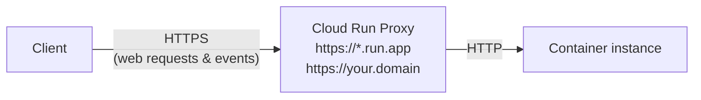

---

# BÖLÜM 3 — Cloud Run Jobs: Task, Execution, ve Array Job

## Job ne zaman kullanılır?

Eğer kodun bir iş yapıp **sonra duruyorsa** (bir script iyi bir örnektir), bu kodu Cloud Run'da bir **job** olarak çalıştırabilirsin.

Bir job'ı şu yollarla çalıştırabilirsin: **gcloud CLI**'dan komut satırından çalıştırarak, **tekrarlayan (recurring) bir job olarak zamanlayarak**, ya da bir **workflow'un parçası** olarak çalıştırarak.

## Job'ın anatomisi: task'lar ve execution

Bir job, verilen bir **job execution**'da **paralel olarak çalıştırılan bir ya da daha fazla bağımsız task'tan** oluşur. **Her task, bir container instance'ı çalıştırır.**

Bir job çalıştırıldığında, tüm job task'larının başlatıldığı bir **job execution** oluşturulur. **Bir job execution'ın başarılı sayılması için, o execution'daki tüm task'ların başarıyla tamamlanması gerekir.**

Task başarısızlıklarını handle etmek için, task'larda **timeout** ayarlayabilir ve **retry sayısını** belirtebilirsin.

## Array job: aynı işi paralelleştirmek

Birden fazla **özdeş (identical)** container instance'ı çalıştıran job'lara **Array job** denir. Bu, işi daha hızlı tamamlamak için kullanılır.

> **Örnek:** Cloud Storage'daki birden fazla görsel dosyasını **aynı anda, birden fazla container instance'ıyla** işlemek için bir Array job kullanabilirsin.

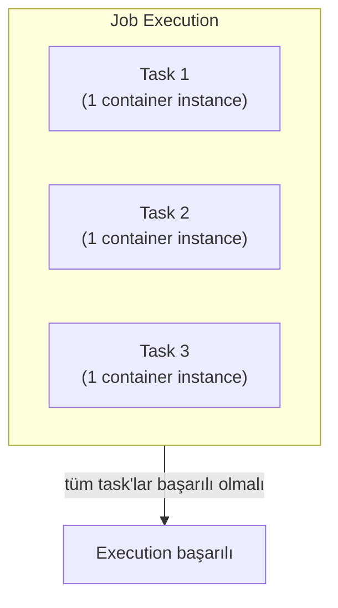

> **Bu neden BÖLÜM 1'deki "job" tanımının doğal bir genişlemesi?** BÖLÜM 1'de job'ı "bir iş yapıp sonlanan kod" olarak tanımlamıştık. Burada bunu somutlaştırıyoruz: bir job, tek bir task'tan ibaret olabileceği gibi, **paralel çalışan birden fazla task'tan** da oluşabilir — ve bu paralellik, Array job'ların Cloud Storage'daki toplu dosya işleme gibi senaryolarda neden bu kadar kullanışlı olduğunu açıklıyor.

---

# BÖLÜM 4 — Container Çalıştırma Gereksinimi ve Feature/Benefit Listesi

## Tek gerçek kısıtlama: 64-bit Linux binary

Servisin ya da job'ının Cloud Run'a deploy edilebilir olması için, onu bir **container image'a paketlemelisin.**

Container çalıştırmak, Cloud Run'ın büyük bir avantajıdır — bu, uygulamalarını **herhangi bir programlama dilinde** geliştirip Cloud Run'da çalıştırabileceğin anlamına gelir, tek şart bunların **64-bit bir Linux binary'sine compile edilebilir** ve bir container image'a paketlenebilir olmasıdır.

## Feature'lar ve benefit'ler

| Feature | Açıklama |
| --- | --- |
| Her servis için benzersiz HTTPS endpoint | `*.run.app` domain'inin bir subdomain'i; özel domain yapılandırılabilir |
| Hızlı, istek tabanlı auto scaling | Bir servis hızlıca **1.000 container instance'ına** kadar scale up edebilir; talep azalınca boşta olan container'lar kaldırılır |
| Built-in traffic management | Her deployment yeni, **immutable bir revision** oluşturur; trafiği en son revision'a yönlendirebilir, önceki bir revision'a **rollback** edebilir, ya da birden fazla revision arasında **trafik bölebilirsin** |
| Private ve public servisler | Bir servis internetten erişilebilir olabilir, ya da erişimi kısıtlayabilirsin (BÖLÜM 20-22) |
| VPC network'teki kaynaklara erişim | **Serverless VPC Access connector**'ı aracılığıyla (BÖLÜM 22) |

| Benefit | Açıklama |
| --- | --- |
| Google Cloud servisleriyle entegrasyon | Cloud SQL, Cloud Storage, Firestore gibi data storage servisleri; log alımı ve hata raporlaması için Cloud Logging; servis tanımlama ve kimlik doğrulama için IAM |
| Serverless | Altyapı provizyonlama ve yönetimiyle uğraşmana gerek yok |
| Sürekli kod teslimatı desteği | GitHub, Bitbucket, ya da Cloud Source Repositories gibi kaynak kod repository'leriyle CI/CD |
| Otomatik logging ve hata raporlama | — |
| Pay-per-use pricing | Servisler için kullandığın kadar öde |

---

# BÖLÜM 5 — Cloud Run'ı Tetiklemenin Yolları

Bir Cloud Run service'i şu yollarla çağrılabilir (invoke edilebilir):

| Yöntem | Ne zaman kullanılır |
| --- | --- |
| **HTTPS** | Sabit bir HTTPS URL'de servisi tetiklemek için istek gönder. Kullanım alanları: özel bir RESTful web API, private mikroservis, web uygulamaları için HTTP middleware/reverse proxy, önceden paketlenmiş bir web uygulaması |
| **gRPC** | Cloud Run servislerini diğer servislerle bağlamak için — özellikle dahili mikroservisler arasında **basit, yüksek performanslı** iletişim için. gRPC'yi şu durumlarda tercih et: dahili mikroservisler arasında iletişim kurmak istiyorsan, yüksek veri yüklerini desteklemen gerekiyorsa (gRPC, protocol buffer kullanır — REST çağrılarından **7 kata kadar daha hızlı**), sadece basit bir servis tanımına ihtiyacın varsa ve tam bir client kütüphanesi yazmak istemiyorsan, ya da streaming gRPC'ler kullanarak daha responsive uygulamalar/API'ler build etmek istiyorsan |
| **WebSockets** | Ek bir configuration gerekmeden Cloud Run'da desteklenir |
| **Pub/Sub** | Pub/Sub, servisinin endpoint'ine mesaj **push edebilir** — bu mesajlar container'lara HTTP istekleri olarak teslim edilir. Kullanım alanları: Cloud Storage bucket'ına bir dosya yüklendiğinde veriyi dönüştürmek, Google Cloud operations suite log'larını Pub/Sub'a export ederek Cloud Run ile işlemek, kendi custom event'lerini publish edip işlemek |
| **Cloud Scheduler** | Bir servisi bir zamanlamaya göre güvenle tetiklemek için — cron job kullanmaya benzer. Kullanım alanları: düzenli yedeklemeler, sitemap yeniden oluşturma ya da eski veri/configuration/senkronizasyon/revision silme gibi tekrarlayan yönetim görevleri, fatura ya da diğer belgeleri oluşturmak |
| **Cloud Tasks** | Bir görevi, bir Cloud Run servisi tarafından **asenkron olarak işlenmek üzere** güvenle zamanlamak için |
| **Eventarc** | Çeşitli Google Cloud kaynaklarından gelen event'lerle Cloud Run'ı tetiklemek için. Örnekler: bir data processing pipeline'ını tetiklemek için bir Cloud Storage event'i (Cloud Audit Logs üzerinden), bir job tamamlandığında downstream işlemeyi başlatmak için bir BigQuery event'i (Cloud Audit Logs üzerinden) |

> **Bu, BÖLÜM 1'deki "service vs job" ayrımıyla nasıl birleşiyor?** Bu tetikleme yöntemlerinin çoğu (HTTPS, gRPC, WebSockets, Pub/Sub) **service'ler** içindir — sürekli çalışıp isteklere yanıt veren kod için. Cloud Scheduler ve Eventarc ise, hem service'leri hem de (Cloud Scheduler durumunda) job'ları tetiklemek için kullanılabilir — bu, "zamanlanmış bir işi service içinde mi, job olarak mı çalıştırmalıyım?" sorusuna, BÖLÜM 1'deki temel ayrımı hatırlayarak cevap vermeni sağlar.

---

# BÖLÜM 6 — Kaynak Modeli: Service, Revision, Container Instance

## Service: Cloud Run'ın ana kaynağı

**Service, Cloud Run'ın ana kaynağıdır.** Her servis, Cloud Run'ın kullanılabilir olduğu **belirli bir Google Cloud region'unda** bulunur.

Servisler **regional bir kaynaktır**, ve bir servisin container instance'ları **region içindeki herhangi bir zone'da** başlayabilir. Redundancy için, yüksek trafikli ve çok sayıda container instance'ı olan servisler, region içindeki **birden fazla zone'a yayılır.** Bu, Cloud Run'ın bir zone'da sorun yaşaması durumunda, servisinin **isteklere hizmet vermeye devam edeceği** anlamına gelir.

Bir Google Cloud projesi, **farklı region'larda birçok servis** çalıştırabilir. Her servis **benzersiz bir endpoint** açığa çıkarır ve gelen istekleri handle etmek için altındaki altyapıyı **otomatik olarak ölçeklendirir.**

## Revision: her deployment, yeni bir kayıt oluşturur

Uygulamanın container image'ını Cloud Run'a her deploy edişinde, bir **service revision** oluşturulur. Bir revision, **belirli bir container image** ve **environment variable'lar, memory limit'leri, ya da concurrency değeri gibi environment ayarlarından** oluşur.

**Revision'lar immutable'dır.** Bir revision oluşturulduktan sonra **değiştirilemez.** Örneğin, yeni bir Cloud Run servisine bir container image deploy ettiğinde, **ilk revision** oluşturulur. Uygulama kodunu değiştirip aynı servise farklı bir container image deploy edersen, **ikinci bir revision** oluşturulur.

Uygulamana gelen istekler, otomatik olarak **mümkün olduğunca hızlı**, en son **sağlıklı (healthy)** service revision'a yönlendirilir.

## Container instance: revision'a gelen istekleri handle eder

İstek alan her service revision, bu istekleri handle etmek için gereken sayıda container instance'ıyla **otomatik olarak ölçeklendirilir.**

Bir container instance, **aynı anda birçok istek alabilir.** **Concurrency ayarıyla**, belirli bir container instance'ına **paralel olarak gönderilebilecek maksimum istek sayısını** belirleyebilirsin (bu konuya BÖLÜM 17'de geri döneceğiz).

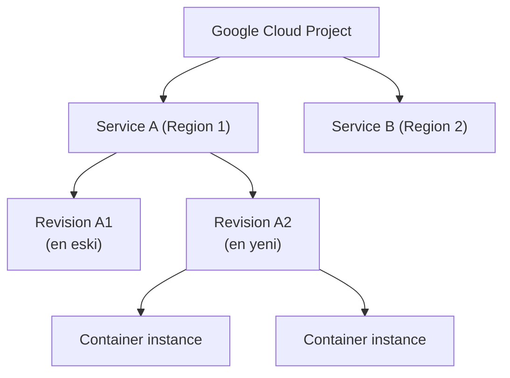

> **Sınav tuzağı — "service" ve "revision" birbirinin yerine kullanılabilir mi?** Hayır. **Service**, sabit bir kimliğe (benzersiz, kalıcı bir HTTPS URL'e) sahip **üst düzey kaynaktır.** **Revision**, o service'in **belirli bir deploy edilmiş halinin, immutable bir anlık görüntüsüdür** — service değişmez ama revision'lar gelir geçer. Trafik her zaman bir **service** endpoint'ine gider, ama o trafiği fiilen hangi **revision**'ın (ve o revision'ın hangi **container instance**'ının) handle edeceği, deployment geçmişine ve traffic splitting ayarlarına bağlıdır.

---

# BÖLÜM 7 — Kaynak Modeli: Job, Task, ve Execution

Her **job**, belirli bir Google Cloud region'unda bulunur.

Bir job, verilen bir job execution'da **paralel olarak çalıştırılan bir ya da daha fazla bağımsız task'tan** oluşur (BÖLÜM 3'te gördüğümüz gibi). Her task, **bir container instance çalıştırır.**

Bir job çalıştırıldığında, tüm job task'larının başlatıldığı bir **job execution** oluşturulur. **Job execution'ın başarılı sayılması için, tüm task'ların başarıyla tamamlanması gerekir.**

---

# BÖLÜM 8 — Region ve Zone

Cloud Run, container'larının deploy edileceği bir **region** seçmeni sağlayan **regional bir servistir.** Bir **region**, Google Cloud kaynaklarının barındırıldığı belirli bir coğrafi konumdur.

Bir region, **üç ya da daha fazla zone**'dan oluşur. Zone'lar ve region'lar, bir ya da daha fazla veri merkezinde sağlanan fiziksel kaynakların **mantıksal soyutlamalarıdır.** Bir region örneği, Kuzey Amerika, Iowa'daki **`us-central1`**'dir.

Bir **zone**, bir region içindeki cloud kaynakları için bir deployment alanıdır. Zone'lar, bir region içinde **tek bir hata alanı (single failure domain)** olarak kabul edilir.

**Yüksek erişilebilirlik için**, Cloud Run container'larını bir region içindeki **birden fazla zone'a dağıtır** — bu da uygulamanı bir zone'un başarısız olmasına karşı **dirençli (resilient)** kılar.

---

# BÖLÜM 9 — Container Yaşam Döngüsü: Genel Bakış ve Starting

## Beş relevant state

Bir Cloud Run container'ının yaşam döngüsündeki relevant state'ler:

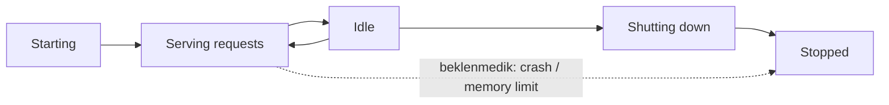

| State | Ne olur |
| --- | --- |
| **Starting** | Cloud Run, container image'ı **materialize eder (gerçekleştirir)** ve uygulamanı başlatır |
| **Serving requests** | Container'ın **web isteklerini handle ettiği** state |
| **Idle** | Container, web isteklerini handle **etmediği** zamanki state |
| **Shutting down** | **Shutdown hook'unu handle edersen**, Cloud Run uygulamanı **düzgün bir şekilde (gracefully)** durdurmana izin verir |
| **Stopped** | Yaşam döngüsündeki **son state** — container durdurulmuştur |

## Starting fazı: dört adım

**Starting** fazı, Cloud Run bir container image **pull ettiğinde** başlar, container **istekleri serve etmeye başladığında** biter.

Bir container'ı başlatmak dört adım gerektirir:

1. **Materialize eder:** Cloud Run, container image'ı materialize ederek container'ın **root dosya sistemini** oluşturur.
2. **Çalıştırır:** Container'ın dosya sistemi hazır olduğunda, Cloud Run container'ın **entrypoint programını (uygulamanı)** çalıştırır.
3. **Bekler:** Uygulaman başlarken, Cloud Run uygulamanın **hazır olup olmadığını** kontrol etmek için sürekli olarak **8080 portunu probe eder.** (Gerekirse port numarasını değiştirebilirsin.)
   - Yeni ve mevcut Cloud Run servisleri için, bir YAML dosyası kullanarak **HTTP, TCP, ve gRPC startup health check ve liveness probe'ları** yapılandırabilirsin.
   - Bir **startup probe**, bir container'ın ne zaman başladığını ve trafik kabul etmeye hazır olduğunu belirlemek için kullanılabilir.
4. **Forward eder:** Uygulaman TCP bağlantılarını kabul etmeye başladığında, Cloud Run **gelen web isteklerini container'a forward eder.** Uygulamanın portu **yalnızca istekleri handle etmeye hazır olduğunda** açtığından emin ol.

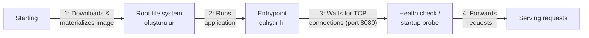

> **Bu neden BÖLÜM 4'teki (modül 18) PID 1/signal handling bilgisiyle bağlantılı?** Modül 18'de, container platformlarının sadece PID 1'e sinyal gönderebildiğini öğrenmiştik. Burada Cloud Run'ın **spesifik davranışını** görüyoruz: uygulamanın portu ne zaman açtığı, Cloud Run'ın onu ne zaman "hazır" sayıp trafik yönlendirmeye başlayacağını **doğrudan belirler.** Portu erken açmak (henüz gerçekten hazır değilken), yarım yamalak isteklerin başarısız olmasına yol açabilir — bu yüzden port, **yalnızca gerçekten hazır olduğunda** açılmalıdır.

---

# BÖLÜM 10 — Container Image Nereden Gelir?

## İki farklı "pull" olayı, iki farklı kaynak

Cloud Run, container image'larını **internal storage'ından** pull eder. Ancak, Cloud Run'ın bir container image pull ettiği **iki farklı olay** vardır, ve pull edebileceği **iki farklı kaynak** vardır:

1. Container image'ı **ilk kez deploy ettiğinde.**
2. Cloud Run **yeni bir container başlattığında.**

**Yeni bir container image deploy ettiğinde**, Cloud Run container image'ı **Artifact Registry'den pull edip kopyalar.** Cloud Run daha sonra image'ı **kendi internal storage'ında saklar**, ve her yeni container başlattığında, image'ı **oradan pull eder.**

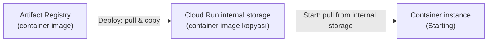

## Neden bu tasarım?

Bu internal storage, **büyük container image'ların, küçük olanlar kadar hızlı yüklenmesini** sağlayacak şekilde **optimize edilmiştir.**

Cloud Run container image'ları **kopyaladığı için**, bu aynı zamanda servisini şuna karşı **izole eder (insulates)**:

- **Artifact Registry'deki başarısızlıklara,**
- Ya da deploy edilmiş bir container image'ı **Artifact Registry'den yanlışlıkla kaldırdığında.**

> **Sınav tuzağı — "Cloud Run her başlangıçta Artifact Registry'ye gider" varsayımı:** Bu yanlıştır. Cloud Run, **her yeni container başlatıldığında Artifact Registry'ye gitmez** — bunun yerine, deploy anında zaten kopyaladığı, **kendi internal storage'ındaki** image'ı kullanır. Bu ayrım önemlidir: Artifact Registry'de bir kesinti yaşansa bile, **zaten deploy edilmiş** bir Cloud Run servisi, yeni container instance'ları başlatmaya **devam edebilir** — çünkü bu instance'lar Artifact Registry'ye değil, Cloud Run'ın kendi kopyasına bağımlıdır.

---

# BÖLÜM 11 — Idle State: CPU Throttling ve Sınırlamalar

## Serving requests'ten idle'a: 100 ms kuralı

Bir container, web isteklerini handle ettiği sürece **serving requests** state'indedir. Eğer bir container **100 ms boyunca hiçbir istek handle etmezse**, container **idle** state'ine geçer.

## Idle bir container'ın özellikleri

| Özellik | Açıklama |
| --- | --- |
| **İstekleri serve etmez** | — |
| **Maliyete yol açmaz** | Idle bir container **ücretlendirilmezsin** |
| **CPU'su neredeyse sıfıra throttle edilir** | Uygulaman **çok yavaş** çalışır |
| **Herhangi bir zamanda kapatılabilir** | Ama **graceful shutdown** için bir lifecycle hook'un vardır (BÖLÜM 12) |

## Idle container sınırlamaları

- **CPU throttling nedeniyle**, container'ında **güvenilir bir şekilde arka plan görevleri çalıştıramazsın.** Cloud Run'da görevleri zamanlamak için **Cloud Tasks** kullanabilirsin.
- Container idle'dayken, **üçüncü taraflara yapılan network istekleri başarısız olma olasılığı yüksektir.**
- Bu varsayılan davranışı değiştirebilirsin: **CPU'nun her zaman tahsis edilmiş ve kullanılabilir olmasını** sağlayacak şekilde ayarlayabilirsin — gelen istek olmasa bile. **CPU always allocated** ayarı, **kısa ömürlü arka plan görevleri** ve diğer asenkron işleme görevlerini çalıştırmak için kullanışlı olabilir. Bu ayarı seçersen, **container instance'ının tüm lifecycle'ı için ücretlendirilirsin.**

> **Bu neden BÖLÜM 3'teki "job" kavramıyla ilişkili?** Idle bir container'ın CPU'sunun throttle edilmesi, "arka planda bir iş çalıştırmak" fikrini **güvenilmez** kılar — bu, tam olarak BÖLÜM 1 ve 3'te gördüğümüz "sürekli çalışan, arka planda iş biriktiren bir service yerine, işi bitirip sonlanan bir **job** kullan" prensibinin **neden var olduğunun** somut kanıtıdır.

---

# BÖLÜM 12 — Idle ↔ Serving Requests Geçişi ve Shutdown

## Idle'dan serving requests'e: gecikme yok

Container'lar, **idle ile serving requests arasında birçok kez** gidip gelebilir.

Bir container, idle olduktan sonra bir istek handle ettiğinde, container **idle state'inden serving requests state'ine geçer.** Bu state geçişi sırasında, Cloud Run container'ın **CPU'sunu unthrottle eder** ve container'a **tam erişimi anında geri verir.** Uygulaman ve kullanıcıların **hiçbir gecikme fark etmeyeceği** şekilde.

Trafik sıçramalarını (spike) handle etmek ve cold start'ları minimize etmek için, Cloud Run bazı instance'ları **en fazla 15 dakika boyunca idle tutabilir.**

**Minimum instances ayarı**, Cloud Run'ın her zaman **belirli bir sayıda container instance'ını**, istekleri serve etmeye **hazır tutmasını** sağlar (bu ayara BÖLÜM 15'te geri döneceğiz).

## Shutting down: SIGTERM sinyali

Eğer container'ın idle'daysa, Cloud Run onu **durdurmaya karar verebilir.** Varsayılan olarak, bir container kapatıldığında **sadece ortadan kaybolur.**

Ancak, uygulamanı bir **SIGTERM sinyalini** handle edecek şekilde build edebilirsin. SIGTERM sinyali, uygulamanı **kapanmanın yakında olacağı konusunda uyarır.** Bu, container kaldırılmadan önce uygulamana, veritabanı bağlantılarını kapatmak ya da veri içeren buffer'ları flush etmek gibi şeyleri **temizlemek için 10 saniye** verir.

## Graceful shutdown: ne yapılmalı?

Düzgün bir şekilde durmak, uygulamana temizlik yapması için zaman tanır. Uygulamanın yapabileceği örnekler:

1. **Açık TCP bağlantılarını, dosya tanımlayıcılarını, ve veritabanı bağlantılarını kapat.** Çoğu downstream sistem, boşta bekleyen bağlantıları timeout etmekte **yavaştır** — uygulaman çok fazla scale up/down yaşıyorsa ve bağlantıları kapatmıyorsan, **maksimum bağlantı hatalarına** çarpabilirsin.
2. **Verisi olan buffer'ları flush et** — telemetri verisi, ya da göndermeden önce batch'lediğin herhangi bir veri gibi.
3. Son olarak, ileride debug etmeye yardımcı olacak bir **log yazmak** faydalıdır.

Çoğu programlama dili, SIGTERM gibi sonlandırma sinyallerini yakalayıp, uygulaman sonlanmadan önce rutinler çalıştırmak için kütüphaneler sağlar.

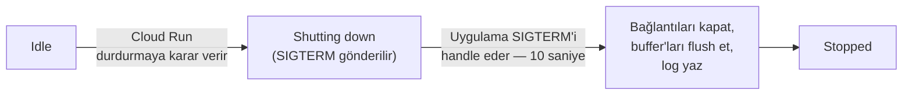

---

# BÖLÜM 13 — Stopped State: Beklenmedik Sonlanmalar

## SIGTERM handle edilmezse

Eğer uygulaman SIGTERM sinyalini **handle etmiyorsa**, Cloud Run container'ı **anında durdurur.** Bu durumda, process **sadece durur ve ortadan kaybolur.**

## Cloud Run bir container'ı ne zaman zorla durdurur?

**Normal koşullar altında, Cloud Run istekleri serve eden bir container'ı asla durdurmaz.**

Ancak bir container **aniden** durabilir:

- Eğer **uygulaman çıkarsa (exit)** — örneğin uygulama kodundaki bir hata nedeniyle,
- Ya da container **memory limit'ini aşarsa.** Varsayılan olarak, bir revision'ın ya da job'ın her container instance'ına tahsis edilen bellek **512 MiB'dır.**

Eğer bir container istekleri handle ederken durursa, **tüm devam eden (in-flight) istekler sonlandırılır ve bir hatayla başarısız olur.** Cloud Run bir yedek container başlatırken, yeni istekler **beklemek zorunda kalabilir.**

Bellek tükenmesini önlemek için, **memory limit'lerini yapılandırabilirsin.** Varsayılan olarak, Cloud Run'da bir container'a **512 MiB bellek** tahsis edilir, ama bu tahsisi **32 GiB'a kadar** artırabilirsin.

> **Sınav tuzağı — "Cloud Run, isteği işleyen bir container'ı istediği zaman durdurabilir" varsayımı:** Bu doğru değildir. Ders açıkça belirtiyor: **normal koşullarda Cloud Run, istekleri serve eden bir container'ı asla durdurmaz.** Sadece iki senaryo bunun istisnasıdır: **uygulamanın kendisinin çökmesi (crash)** ya da **memory limit'inin aşılması.** Bu ayrım önemlidir çünkü "Cloud Run isteği ortasında container'ımı kapatabilir mi?" sorusuna verilecek doğru cevap "hayır, sadece kontrolün dışındaki bu iki durumda" olmalıdır — "her an, herhangi bir nedenle" değil.

---

# BÖLÜM 14 — Otomatik Ölçeklendirme: Temel Mekanizma ve Scale to Zero

## Internal Application Load Balancer

Servisine gelen istekleri handle etme kapasitesini korumak için, Cloud Run gerektiğinde bir service revision'ının **container instance sayısını otomatik olarak artırır.** Bu özelliğe **autoscaling** denir.

Bir service revision'ına gelen istekler, **internal bir Application Load Balancer** tarafından container instance'ları grubuna **dağıtılır.**

- Tüm container instance'ları **meşgulse**, Cloud Run **ek instance'lar ekler.**
- Talep **azaldığında**, Cloud Run bazı instance'lara trafik göndermeyi durdurur ve onları **kapatır.**
- Bir container instance'ı **aynı anda birçok isteği** alabilir — **concurrency ayarı** (BÖLÜM 17), belirli bir container instance'ına paralel olarak gönderilebilecek maksimum istek sayısını belirler.

İstek oranına ek olarak, container instance sayısı şunlardan da etkilenir:

| Faktör | Detay |
| --- | --- |
| **CPU utilization** | İstekleri işlerken mevcut instance'ların CPU kullanımı — hedef **%60**'tır |
| **Maximum concurrency ayarı** | — |
| **Minimum/maximum container instance sayısı ayarı** | Bir Cloud Run servisindeki container instance sayısı **varsayılan olarak 1.000 instance ile sınırlıdır.** Daha fazlasına ihtiyacın varsa, bir **quota artışı** talep edebilirsin |

## Scale to zero: hiç istek yoksa, hiç container yok

Servisine **hiç gelen istek yoksa**, geriye kalan **son container instance'ı bile kapatılır.** Buna genellikle **scale to zero** denir.

Bu özellik, **ekonomik nedenlerle** çekicidir — çünkü boşta bekleyen (idling) container instance'ları için **ödeme yapmazsın.**

Servisine yeni bir istek gönderildiğinde, **istek üzerine (on demand)** yeni bir container instance başlar.

Servisin, hiç instance yokken yaşadığı **gecikmeyi (latency) azaltmak** için, Cloud Run'ı **minimum bir sayıda container instance'ını aktif tutacak** şekilde yapılandırabilirsin.

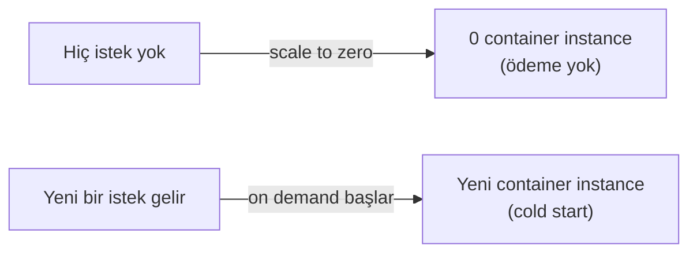

---

# BÖLÜM 15 — Request Queuing, Minimum Instances

## Cold start ve request queuing

Servisin sıfıra ölçeklendikten sonra gelen **ilk birkaç istek**, **ilk container instance'ı başlarken kuyruğa (queue) alınır.** Buna bir **"cold start"** denir.

Servisinin gecikmesini azaltmak için, Cloud Run'ı **minimum bir sayıda container instance'ını idle tutacak** şekilde yapılandırabilirsin. Bu instance'lar, istekler alındığında **işlemeye hazır** olacaktır.

## Minimum instances: varsayılan "scale to zero" davranışını değiştirmek

Varsayılan "scale to zero" davranışını değiştirmek için, **warm tutulacak ve istekleri serve etmeye hazır** bekletilecek minimum bir container instance sayısı belirtirsin.

Minimum instances ayarlandığında, Cloud Run **en az bu kadar instance'ı**, istek serve etmiyor olsalar bile (**idle**), **çalışır durumda tutar.**

Servisin istek aldıkça, **aktif instance sayısı artabilir**, ve **idle instance sayısı azalabilir.**

**Minimum instances özelliğiyle çalışır tutulan idle instance'lar, faturalandırma maliyetine yol açar.**

```shell
gcloud run services update my-service --min-instances 3
```

Servisinin minimum instances configuration'ını Google Cloud console'da, gcloud CLI ile, bir YAML configuration dosyasıyla, ya da Terraform ile ayarlayabilir/güncelleyebilirsin.

> **Bu neden BÖLÜM 11'deki idle CPU throttling bilgisiyle çelişmiyor?** BÖLÜM 11'de idle container'ların CPU'sunun throttle edildiğini öğrenmiştik. Minimum instances ile tutulan idle instance'lar da bu kuraldan **muaf değildir** — hâlâ throttle edilirler, ve hâlâ ücretlendirilirler (idle olsalar bile, "minimum instances" olarak ayrılmış oldukları için). Buradaki asıl fayda, **CPU performansı değil, gecikmedir**: minimum instance'lar sayesinde, bir istek geldiğinde **cold start'ın (container'ı sıfırdan başlatma sürecinin) yaşanmasına gerek kalmaz** — instance zaten var, sadece idle'dan serving requests'e (BÖLÜM 12'de gördüğümüz gibi, **gecikmesiz**) geçer.

---

# BÖLÜM 16 — Maximum Instances

Bir servis deploy edip **birçok container instance'ına kadar ölçeklenmesine izin verirsen**, o container'ları çalıştırmak için **maliyete katlanırsın.**

Eğer Cloud Run servisin **kısa bir süre içinde** birçok container instance'ına kadar ölçeklenirse, **downstream sistemlerin** ek trafik yükünü handle edemeyebilir. Cloud Run servisini yapılandırırken, o downstream sistemlerin **throughput kapasitesini** anlaman gerekir.

> **Örnek:** Cloud Run servisin, yalnızca belirli sayıda **eşzamanlı açık bağlantıyı** handle edebilen bir veritabanıyla etkileşime giriyor olabilir.

Başlatılabilecek toplam container instance sayısını sınırlamak için — **maliyet kontrolü** amacıyla, ya da servisinin kullandığı diğer kaynaklarla **daha iyi uyum sağlamak** için — service revision'ın için **maximum container instances** ayarını kullan. **Maximum instances'ı çok düşük ayarlamanın, Cloud Run'ın tüm gelen istekleri serve etmek için scale up etme yeteneğini etkileyeceğinin** farkında ol.

**Varsayılan olarak, Cloud Run servisleri maksimum 100 instance'a kadar scale out edecek şekilde yapılandırılmıştır.**

```shell
gcloud run services update my-service --max-instances 3
```

Servisinin maximum instances configuration'ını Google Cloud console'da, gcloud CLI ile, bir YAML configuration dosyasıyla, ya da Terraform ile ayarlayabilir/güncelleyebilirsin.

> **Sınav tuzağı — varsayılan maximum instance sayısı kaçtır?** BÖLÜM 14'te, bir Cloud Run servisindeki container instance sayısının **varsayılan olarak 1.000 ile sınırlı** olduğunu görmüştük — bu, **quota** (kota) sınırıdır. Burada ise, servisin **varsayılan olarak 100 instance'a** scale out edecek şekilde **yapılandırıldığını** görüyoruz — bu, **configuration** ayarıdır (`--max-instances`). Bu ikisi farklı kavramlardır: 1.000, platformun izin verdiği **üst sınırdır** (artırılabilir); 100, senin servisinin **varsayılan yapılandırmasıdır** (istediğin zaman, 1.000'e kadar herhangi bir değere değiştirebilirsin).

---

# BÖLÜM 17 — Maximum Concurrency

## Concurrency neden önemlidir?

Daha önce belirtildiği gibi, her service revision, gelen tüm istekleri handle etmek için gereken container instance sayısına **otomatik olarak ölçeklenir.** Daha fazla container instance istekleri işlerken, daha fazla **CPU ve bellek** kullanılır — bu da daha yüksek maliyetlere yol açar.

Sana daha fazla kontrol sağlamak için, Cloud Run bir **maximum concurrent requests per instance** ayarı sunar — bu, belirli bir container instance'ı tarafından **aynı anda işlenebilecek maksimum istek sayısını** belirtir. Cloud Run, concurrency'yi **yapılandırılan maksimuma kadar otomatik olarak ayarlar.**

**Varsayılan olarak, her Cloud Run container instance'ı aynı anda 80 isteğe kadar alabilir**; bunu **maksimum 1.000'e kadar** artırabilirsin.

## Concurrency'yi ne zaman 1'e ayarlamalısın?

Maximum concurrency'yi **1**'e ayarlamayı şu durumlarda düşün:

- Her istek, mevcut container CPU'sunun ya da belleğinin **çoğunu kullanıyorsa.**
- Uygulama kodun, **aynı anda birden fazla isteği handle etmek üzere tasarlanmamışsa.**
- Uygulama kodun, **birden fazla istek tarafından paylaşılamayan global state'lere** dayanıyorsa.

Container'ın birçok isteği eşzamanlı olarak işleyemiyorsa, **maximum concurrency ayarını düşürmeyi** düşünmelisin.

## Concurrency'nin diğer etkileri

Her container instance'ının serve edebileceği eşzamanlı istek sayısı, **teknoloji stack'i** ve **değişkenler ile veritabanı bağlantıları gibi paylaşılan kaynakların kullanımı** tarafından sınırlanabilir. Daha yüksek bir maximum concurrency ayarlamak, servisine trafik sıçramaları olduğunda **downstream servisler üzerinde** bir etki yaratabilir.

Ayrıca, servisine yapılan her istek **bir miktar ek bellek** gerektirdiğinden, yüksek bir maximum concurrency ayarı, container'ının **genel bellek gereksinimini artırabilir.**

```shell
gcloud run services update my-service --concurrency 1
gcloud run services update my-service --concurrency 80
```

Servisini, beklenen yük altında stabilite korumak için **optimal bir concurrency configuration'ıyla** yapılandır. Bunu, **yapılandırılabilir concurrency configuration'ını destekleyen araçlarla** uygulamanı load-test ederek başarabilirsin.

## Hatırlanacaklar (BÖLÜM 14-17)

1. Bir container'ı handle edecek instance yoksa, **istekler geçici olarak kuyruğa alınır.**
2. Cloud Run'ın sıfır container instance'ına ölçeklenmesini önlemek için **minimum instances** ayarını kullan.
3. Downstream servislerine giden trafik yükünü **maximum instances** ayarıyla yönet.
4. CPU, bellek kullanımını, ve ilgili maliyetleri azaltmak için, bir container instance'ının işlediği istek sayısını **concurrency** ayarıyla kontrol et.

---

# BÖLÜM 18 — Google Cloud'un API Modeli

## Google Cloud, aslında bir API koleksiyonudur

Google Cloud'a bakmanın bir yolu, onun sanal makineler, Cloud Run servisleri, load balancer'lar, ya da bir Pub/Sub topic'i ve bir Cloud SQL veritabanı sunucusundaki bir veritabanı tablosu gibi **sanal kaynakları oluşturup yönetmeni sağlayan bir API koleksiyonu** olduğudur.

Altyapını yönetmek için, bu API'lerle şu araçlarla etkileşim kurarsın:

| Araç | Açıklama |
| --- | --- |
| **Web console** | Bir tarayıcıdan (`console.cloud.google.com`) |
| **gcloud CLI** | Terminalden |
| **Terraform** | Infrastructure-as-code pratiği yapmanı sağlayan üçüncü parti bir uygulama |
| **Client kütüphaneleri** | Uygulama kodundan |

**Kilit nokta**, Google Cloud'un, sanal kaynaklar oluşturmanı sağlayan **bir API koleksiyonu olduğunu** fark etmektir.

## Bir container image deploy etmek, bir API çağrısıdır

Örneğin, bir container image'ı Cloud Run'a deploy etmek, **bir API çağrısıdır.**

Local makinende `gcloud run deploy` komutunu gcloud CLI ile çalıştırdığında, container image'ı deploy etmek için `run.googleapis.com` üzerindeki Cloud Run servisine **bir API çağrısı yapılır.**

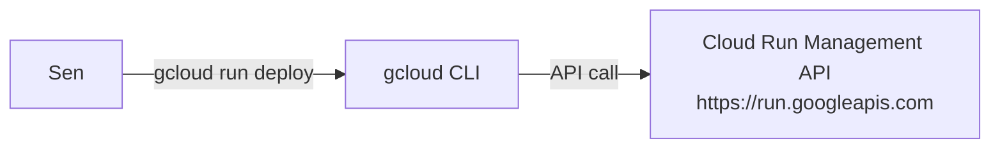

---

# BÖLÜM 19 — IAM: Identity, Authorization, Policy, Binding, Role

## IAM, API çağrılarını yetkilendirir

**Identity and Access Management (IAM)**, Google Cloud kaynakları için **izinler oluşturup yönetmeni** sağlayan bir Google Cloud servisidir.

IAM, **çağıranın kimliğini doğrular**, ve o kimliğin API çağrısını gerçekleştirme **izni olup olmadığını kontrol eder.** Bu kontrol başarısız olursa, çağrıyı **reddeder.**

Önemli bir nokta: IAM, senin Cloud Run uygulamasının yeni bir revision'ını deploy etmen (bir API çağrısı) ile, uygulama kodunun Google Cloud API'lerini kullanarak Pub/Sub'a bir mesaj publish etmesi arasında **aynı şekilde çalışır.** Her iki örnekte de, API çağrılarının yetkilendirmesini **IAM yapar.**

## IAM Policy: bir kaynağa bağlı bir kurallar listesi

Belirli aksiyonları Google Cloud kaynakları üzerinde gerçekleştirmeye **yetkin olup olmadığını** kontrol etmek için, IAM **policy'ler (politikalar)** kullanır.

Örneğin, bir Pub/Sub topic'ine mesaj publish etmek için, IAM o topic'e **bağlı (attached)** olan bir IAM policy'yi kontrol eder. Eğer o policy'nin, mesajı publish etmeni sağlayan bir **binding**'i varsa, IAM çağrının **geçmesine izin verir.**

## Policy binding: member + role

Bir **IAM Policy**, bir **policy binding'ler listesidir.** Bir **policy binding**, bir **member'ı (kimliği)** tek bir **role'e** bağlar.

- Örnekte, "Pub/Sub Publisher" role'üne sahipsen, IAM policy'nin bağlı olduğu Pub/Sub topic'ine **mesaj gönderebilirsin.**
- Bir member'ın, bir IAM policy'de **birden fazla policy binding'i** olabilir — bu, o member'ın **birden fazla role'e sahip olmasını** sağlar.
- Bir **role**, member kimliğinin Google Cloud kaynakları üzerinde belirli aksiyonları gerçekleştirmesini sağlayan bir **izinler kümesi (permissions)** içerir. Örnekte, "Pub/Sub Publisher" role'ü, bir topic'e mesaj publish etme erişimi sağlayan **`pubsub.topics.publish`** iznini içerir.

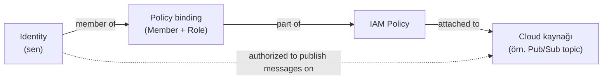

## Hepsi bir arada: IAM authorization

Bir IAM policy her zaman bir **kaynağa bağlıdır.** Bir mesajı topic'e publish etmeye yetkin olmanın nedeni:

1. Bir **policy binding'in üyesisin.**
2. **Binding'in role'ü "Pub/Sub Publisher".**
3. **Binding, topic'e bağlı bir IAM Policy'nin parçası.**

Bunu söylemenin bir başka yolu: IAM policy'deki policy binding, sana belirli bir topic'e mesaj publish etme **izni verir (grants).**

---

# BÖLÜM 20 — Bir Cloud Run Servisini Public Yapmak ve Erişimi Kontrol Etmek

## Varsayılan erişim: sadece owner/editor

Varsayılan olarak, yalnızca bir projede **owner ya da editor role'üne sahip** kullanıcılar ya da kimlikler, Cloud Run servislerini ve job'larını **oluşturabilir, güncelleyebilir, silebilir, ya da çağırabilir.**

Ayrıca, proje owner'ları ve **Cloud Run Admin role'üne (`roles/run.admin`)** sahip kimlikler, proje üzerindeki ya da bireysel Cloud Run servisi/job'ı üzerindeki **IAM policy'lerini değiştirebilir.**

## Bir servisi public yapmak: `allUsers` + Cloud Run Invoker

Bir Cloud Run servisini **public olarak erişilebilir** hale getirmek için, servise **kimlik doğrulanmamış (unauthenticated) çağrılara** izin verebilirsin. Bunu, **`allUsers` member türüne**, servis üzerinde IAM **Cloud Run Invoker role'ünü** atayarak yaparsın. Bu role'ü atayarak kimlik doğrulamayı yapılandırmak için, proje **Owner** ve **Cloud Run Admin** role'lerinde bulunan gereken izne sahip olmalısın.

```shell
gcloud run services add-iam-policy-binding my-service \
  --member="allUsers" \
  --role="roles/run.invoker"
```

Servisini deploy ederken `gcloud run deploy` komutuyla **`--allow-unauthenticated`** seçeneğini de kullanabilirsin.

Bir servisi Google Cloud console'da, gcloud CLI ile, bir YAML configuration dosyasıyla, ya da Terraform ile **public olarak erişilebilir** yapabilirsin.

## Bireysel servis/job'lara ve tüm projeye erişimi kontrol etmek

| Amaç | Komut |
| --- | --- |
| Bir service'e/job'a bir principal eklemek | `gcloud run services add-iam-policy-binding my-service --member=MEMBER_TYPE --role=role` |
| Bir job'dan bir principal'ı kaldırmak | `gcloud run jobs remove-iam-policy-binding my-job --member=MEMBER_TYPE --role=role` |
| Projedeki **tüm** servis/job'lara erişim vermek | `gcloud projects add-iam-policy-binding my-project-id --member=MEMBER_TYPE --role=role` |

> **Örnek:** Bir Cloud Run servisini bir **service account** ile çağırmak için, o member account'a `invoke` iznini şu şekilde verebilirsin:
> ```shell
> gcloud run services add-iam-policy-binding my-service \
>   --member=serviceAccount:sa_email --role=roles/run.invoker
> ```

Bireysel servis ve job'lar için erişim kontrolü **service/job düzeyinde**; tüm projedeki servis/job'lar için erişim kontrolü ise **project-level IAM** ile yapılır — bu, BÖLÜM 19'daki "policy her zaman bir kaynağa bağlıdır" prensibinin, kaynağın **granularity'sine (taneliliğine)** göre farklı seviyelerde uygulanabildiğini gösterir.

---

# BÖLÜM 21 — Network Erişim Kontrolü: Ingress Ayarları

## IAM'den bağımsız, ikinci bir katman

BÖLÜM 19-20'de tartışılan IAM kimlik doğrulama yöntemlerine ek olarak, **network ingress ayarları**, bir servise erişimi yönetmenin **başka bir yoludur.**

**Bu yöntemler birbirinden bağımsızdır**, ama erişimi yönetmek için **katmanlı bir yaklaşım** istiyorsan, **ikisini birlikte** kullanabilirsin.

## Üç ingress ayarı

| Ayar | Kısıtlama seviyesi | İzin verilen istekler |
| --- | --- | --- |
| **All** | En az kısıtlayıcı (varsayılan) | İnternetten doğrudan gönderilenler dahil, servisinin varsayılan `run.app` URL'sine ya da özel domain'ine gelen **tüm istekler** |
| **Internal** | En kısıtlayıcı | Yalnızca: internal HTTP(S) load balancer'dan; Cloud Run servisini içeren herhangi bir **VPC Service Controls perimeter'ının** izin verdiği kaynaklardan; Cloud Run servisinle **aynı projedeki ya da VPC Service Controls perimeter'ındaki** VPC network'lerinden; ve **aynı projede/perimeter'da** olmaları koşuluyla Cloud Tasks, Eventarc, Pub/Sub, ve Workflows gibi Google Cloud servislerinden gelen istekler |
| **Internal and Cloud Load Balancing** | Internal'dan biraz daha az kısıtlayıcı | Internal ayarının izin verdiği kaynaklardan, **artı** external HTTP(S) load balancer'dan (ama **doğrudan internetten değil**) |

**VPC Service Controls**, veri sızıntısına (exfiltration) karşı korumak için **güvenli bir perimeter** kurmanı sağlayan bir Google Cloud özelliğidir. Hem varsayılan `run.app` URL'si hem özel domain'ler VPC Service Controls'a **tabidir.**

**Internal** ayarında, bu kaynaklardan gelen istekler **Google network'ü içinde kalır** — servise `run.app` URL'sinden erişseler bile. **Diğer kaynaklardan (internet dahil) gelen istekler**, servisine `run.app` URL'sinde ya da özel domain'lerde **ulaşamaz.**

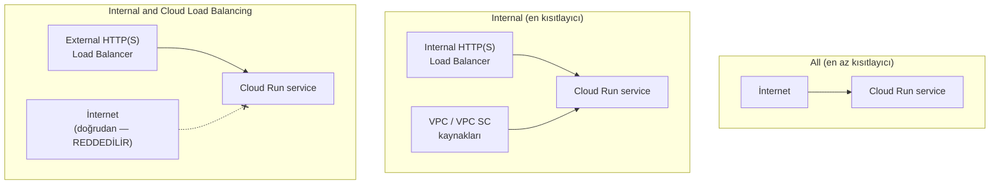

---

# BÖLÜM 22 — Serverless VPC Access

## VPC network nedir?

Bir **Virtual Private Cloud (VPC) network**, Google'ın production network'ü içinde implement edilmiş, fiziksel bir network'ün **sanal versiyonudur.**

Global bir kaynaktır ve veri merkezlerindeki, hepsi **global bir wide area network** ile bağlı, **regional sanal subnetwork'lerin (subnet'lerin)** bir listesinden oluşur.

## Serverless VPC Access ile VPC'ye bağlanmak

Bir Cloud Run servisini ya da job'ını, VM instance'ları, Memorystore instance'ları, ve internal IP adresi olan diğer kaynaklara erişmek için VPC network'üne **doğrudan bağlamak** için, **Serverless VPC Access** kullan.

Serverless VPC Access ile:

- VPC network'üne, **internal DNS ve internal IP adresleri** kullanarak istekler gönderebilir ve yanıtlar alabilirsin — böylece trafik **internete maruz kalmaz.**
- İnternal kaynaklara giden/gelen istek ve yanıtların **internet üzerinden geçmesini önlersin.**

## Configuration adımları

1. **Serverless VPC Access API'sini etkinleştir.**
2. Google Cloud projende bir **Serverless VPC Access connector** oluştur.
3. Connector'ı bir **VPC network'e ve region'a bağla.**
4. Cloud Run servisini ya da job'ını **connector'ı kullanacak şekilde yapılandır.**

```shell
gcloud run deploy my-service --image my-image --vpc-connector my-connector
```

**Bir Serverless VPC Access connector**, Cloud Run servisin/job'ın ile VPC network'ün arasındaki trafiği handle eden bir kaynaktır.

- Connector için yapılandırılan **region**, servisinin/job'ının deploy edildiği region ile **eşleşmelidir.**
- Connector'ı, **kullanılmayan bir `/28` subnet ya da örtüşmeyen bir `/28` CIDR aralığıyla** yapılandır. Bu subnet/CIDR aralığı, **yalnızca connector tarafından**, başka hiçbir kaynak tarafından kullanılmamalıdır.
- Connector'ı Google Cloud console'da, Google Cloud CLI ile, ya da Terraform ile oluşturabilirsin.

Connector'ı oluşturduktan sonra, Cloud Run servisini/job'ını **connector'ı kullanacak şekilde yapılandırmalısın.** Bunu, servisi/job'ı oluştururken ya da yeni bir revision deploy ederken, Google Cloud console'da, Google Cloud CLI ile, YAML dosyasıyla, ya da Terraform ile yapabilirsin. **Internal bir Cloud Run servisi için, servisten çıkan (egress) tüm trafiğin VPC connector'ını kullanacak şekilde ayarlanması gerekir.**

Connector'ının VPC network'ündeki kaynaklara erişimini **firewall kurallarıyla** da kısıtlayabilirsin.

---

# Toplu Özet (Hızlı Tekrar)

**Modülün ana fikri:** Modül 18'in verdiği genel bakışın üzerine, bu modül Cloud Run'ın **kaynak modelini** (service → revision → container instance; job → task → execution), **container yaşam döngüsünü** (starting → serving requests ↔ idle → shutting down → stopped), **autoscaling mekanizmasını** (internal load balancer, scale to zero, cold start, min/max instances, concurrency), ve **access control**'ünü (IAM policy'ler + network ingress + Serverless VPC Access) derinlemesine açıklıyor.

**Temel kavramlar (BÖLÜM 1-8):** Kod, **service** (sürekli, web isteklerine/event'lere yanıt verir) ya da **job** (iş yapıp sonlanır — task/execution/array job yapısıyla) olarak çalışır. HTTPS, TLS, WebSockets, HTTP/2, gRPC desteklenir; senin sorumluluğun sadece bir portu dinleyip HTTP handle etmektir. Tek gerçek çalıştırma kısıtlaması, 64-bit Linux binary'sine compile edilebilmektir. Cloud Run; HTTPS, gRPC, WebSockets, Pub/Sub, Cloud Scheduler, Cloud Tasks, ve Eventarc ile tetiklenebilir. Kaynak modeli: **service** (regional, ana kaynak) → **revision** (immutable, image + config) → **container instance** (isteği fiilen handle eden); job'lar için **job** → **task** (1 container instance) → **execution** (tüm task'lar başarılı olmalı).

**Container yaşam döngüsü (BÖLÜM 9-13):** Starting fazı dört adımdır (materialize → run entrypoint → port 8080'i probe et → forward et). Container image, deploy anında Artifact Registry'den Cloud Run'ın internal storage'ına kopyalanır; her yeni container başlatıldığında image **internal storage'dan** pull edilir (Artifact Registry'den değil). 100 ms istek almazsa container idle olur (CPU throttle edilir, ücretsizdir, her an kapatılabilir — ama CPU always allocated ayarıyla değiştirilebilir). Idle→serving requests geçişi anlıktır (unthrottle). Shutting down'da SIGTERM handle edilirse 10 saniye graceful cleanup süresi vardır; handle edilmezse anında durur. Cloud Run normalde isteği serve eden bir container'ı durdurmaz — sadece crash ya da memory limit aşımında (varsayılan 512 MiB, 32 GiB'a kadar artırılabilir).

**Autoscaling (BÖLÜM 14-17):** Internal Application Load Balancer, isteklere göre instance ekler/kaldırır (CPU %60 hedef, concurrency, min/max instance faktörleri de devrede). Scale to zero, hiç istek yokken tüm instance'ları kapatır (ekonomik ama cold start riski). Minimum instances, cold start'ı önler ama idle olsalar bile ücretlendirilir. Maximum instances (varsayılan 100, platform kotası 1.000), downstream sistem uyumluluğu ve maliyet kontrolü için sınır koyar. Concurrency (varsayılan 80, maks 1.000), bir instance'ın kaç isteği paralel işleyebileceğini belirler — global state paylaşımı güvenli değilse 1'e düşürülmelidir.

**Access control (BÖLÜM 18-22):** Google Cloud bir API koleksiyonudur; her işlem (deploy dahil) bir API çağrısıdır. IAM, bu çağrıları **policy** (member + role binding, bir kaynağa attached) aracılığıyla yetkilendirir. Bir servisi public yapmak için `allUsers`'a Cloud Run Invoker role'ü ver. Erişim, servis/job düzeyinde ya da project-level IAM ile yönetilebilir. Network ingress ayarları (All / Internal / Internal and Cloud Load Balancing), IAM'den **bağımsız** bir ikinci katmandır. Serverless VPC Access connector'ı, Cloud Run'ı internal DNS/IP kullanarak bir VPC network'üne bağlar — trafik internete çıkmaz.

---

# En Kritik Ayrımlar / Hızlı Tekrar (Cebinde Taşı)

- **Service ≠ Revision.** Service, sabit/kalıcı bir kaynaktır; revision, o servisin immutable bir anlık görüntüsüdür — her deploy yeni bir revision oluşturur.
- **Job → Task → Execution:** bir job, paralel çalışan bağımsız task'lardan oluşur (her task = 1 container instance); bir execution, ancak **tüm** task'lar başarılıysa başarılıdır.
- **Container image, her container başlatıldığında Artifact Registry'den değil, Cloud Run'ın internal storage'ından pull edilir** — Artifact Registry sadece deploy anında kullanılır.
- **Idle container: ücretsiz ama CPU'su neredeyse sıfıra throttle edilmiştir** — arka plan görevleri için güvenilmezdir (Cloud Tasks kullan).
- **SIGTERM handle edilirse 10 saniye graceful shutdown süresi vardır; handle edilmezse container anında durur.**
- **Cloud Run, normal koşullarda isteği serve eden bir container'ı asla durdurmaz** — yalnızca crash ya da memory limit aşımı (varsayılan 512 MiB) istisnadır.
- **Scale to zero = ekonomik ama cold start riski; minimum instances = cold start'ı önler ama idle olsa da ücretlidir.**
- **Maximum instances varsayılanı 100'dür (senin config'in); platform kotası 1.000'dir (artırılabilir)** — ikisi farklı kavramlar.
- **Concurrency varsayılanı 80, maksimum 1.000'dir** — global state paylaşımı güvenli değilse, ya da her istek CPU/belleğin çoğunu kullanıyorsa, concurrency'yi 1'e düşür.
- **Google Cloud, bir API koleksiyonudur** — konsol, gcloud CLI, Terraform, client kütüphaneleri hepsi bu API'lere çağrı yapar; deploy dahil her işlem bir API çağrısıdır.
- **IAM Policy = policy binding'ler listesi; policy binding = member + role; role = permission'lar kümesi; policy her zaman bir kaynağa attached'dır.**
- **Bir servisi public yapmak = `allUsers` member'ına `roles/run.invoker` vermek** (`--allow-unauthenticated` ile de yapılabilir).
- **IAM (kimlik) ve network ingress (All/Internal/Internal+LB) birbirinden bağımsızdır** — katmanlı güvenlik için ikisi birlikte kullanılabilir.
- **Serverless VPC Access, Cloud Run'ı internal DNS/IP ile bir VPC'ye bağlar** — trafik internete çıkmadan internal kaynaklara (VM, Memorystore) erişim sağlar.

---
