# Service Identity and Authentication — Baştan Sona Öğretici

> Bu metin, **"Service Identity and Authentication"** modülünde anlatılan **her şeyi** kavratmak için yazıldı.
>
> **Kapsam notu:** Bu, `deep-dive/19-fundamentals-of-cloud-run/` ile aynı kursun (Cloud Run'a odaklanan üçüncü kurs) **ikinci modülüdür.** Modül 19'da, Cloud Run'ın kaynak modelini, container yaşam döngüsünü, ve autoscaling'ini derinlemesine görmüştük — ve access control bölümünde (BÖLÜM 18-22), IAM policy'lerin, member'ların, ve role'lerin **temel mekaniğine** kısaca değinmiştik. Bu modül, tam olarak o temeli alıp **çok daha derine** iniyor: bir Cloud Run servisinin **kendi kimliği (service account)** nasıl çalışır, Google Cloud kaynakları nasıl **hiyerarşik olarak organize edilir** ve izinler nasıl **miras alınır (inherit edilir)**, **least privilege prensibini** pratikte nasıl uygularsın, ve hassas configuration'ı (API anahtarları, şifreler) **environment variable'lar** ve **Secret Manager** ile nasıl güvenli bir şekilde yönetirsin.

---

## Bu ders tam olarak neyi öğretiyor ve neden önemli?

Bu modül dört alanı kapsıyor, ve her biri bir öncekinin üzerine inşa ediyor:

1. **Service account ve identity (BÖLÜM 1-9)** — bir Cloud Run servisi, Google Cloud API'lerini çağırırken **kim olarak** tanımlanır, ve bu kimlik **nasıl doğrulanır (authenticate edilir)** ve **yetkilendirilir (authorize edilir)**?
2. **Resource hierarchy (BÖLÜM 10-13)** — Google Cloud kaynakları nasıl **organize edilir**, ve bir üst seviyede verilen bir izin, alt seviyedeki kaynaklara **nasıl yayılır**?
3. **Least privilege prensibi (BÖLÜM 14-18)** — varsayılan yapılandırmanın **neden riskli olduğunu**, ve bunun yerine **minimal, seçici izinlerle** nasıl çalışacağını?
4. **Secrets ve environment variable'lar (BÖLÜM 19-23)** — hassas olmayan configuration'ı (environment variable) ve hassas configuration'ı (secret) **birbirinden nasıl ayırt edip yönetirsin**?

Bu dört alan, ortak bir temaya hizmet ediyor: **bir Cloud Run servisi, sadece kodundan ibaret değildir — aynı zamanda bir kimliktir**, ve bu kimliğin **neye erişebildiği**, servisin güvenlik duruşunun temelini oluşturur.

---

# BÖLÜM 1 — Google Cloud API'leri ve Client Kütüphaneleri

## Kısa bir hatırlatma: Google Cloud, bir API koleksiyonudur

Önceki bir modülde, Google Cloud'un, sanal kaynaklar oluşturmanı sağlayan **bir API koleksiyonu** olduğunu öğrenmiştik. Bu API'leri, Cloud Run uygulama kodundan **client kütüphaneleriyle** çağırırsın.

Örnek Google Cloud API'leri ve tipik bir operasyon:

| Servis | Örnek operasyon |
| --- | --- |
| Cloud Build | Bir build submit etmek |
| Cloud Run | Bir servis oluşturmak |
| Compute Engine | Bir VM başlatmak |
| Artifact Registry | Bir container image push etmek |
| Cloud SQL | Bir instance oluşturmak |
| Cloud Storage | Bir bucket oluşturmak |

Bu servis API'leriyle etkileşim kurmak için, **gcloud CLI**'ı, **web console**'u, bir **client kütüphanesini**, ya da API'yi çağıran başka herhangi bir süreci (Terraform gibi) kullanabilirsin.

## Bir client kütüphanesi ile API çağrısı örneği

**Pub/Sub**, servisler arasında asenkron mesaj göndermek için kullanabileceğin, Google Cloud'daki bir mesaj broker servisidir. Python'dan Pub/Sub'a bir mesaj publish etmek için, `pubsub` client kütüphanesini kullanırsın:

```python
from google.cloud import pubsub_v1
publisher = pubsub_v1.PublisherClient()
publisher.publish(topic_path, data)
```

Client kütüphanesi, `pubsub.googleapis.com`'a yapılan API çağrısını **senin yerine handle eder.** Çoğu Google Cloud servisi için, **Go, Java, Node.js, Python, Ruby, PHP, C#, ve C++** dillerinde client kütüphaneleri mevcuttur.

---

# BÖLÜM 2 — Bir API Çağrısı Nasıl Yetkilendirilir?

Bu örnekte, uygulama kodu, `pubsub.googleapis.com`'a bir API çağrısı göndermek için `pubsub` client kütüphanesini kullanır. **IAM**, isteği inceler ve uygulamanı, **API isteğindeki credential'lar aracılığıyla** tanımlar.

IAM, kimliği (identity) elde ettikten sonra, o kimliğin Pub/Sub topic'i üzerinde **hangi operasyonlara izinli olduğunu** anlaması gerekir. IAM bunu, **Pub/Sub topic'ine attach ettiğin bir IAM policy'deki policy binding'leri kontrol ederek** yapar.

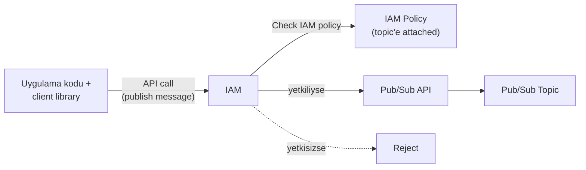

---

# BÖLÜM 3 — Policy Binding ve Identity Türleri

## Policy binding'in yapısı: member + role

Bir **policy binding**, bir ya da daha fazla **member'ı (kimliği)** tek bir **role'e** bağlar. Bir **role**, member kimliğinin Google Cloud kaynakları üzerinde belirli aksiyonlar gerçekleştirmesini sağlayan bir **izinler kümesi** içerir. Örneğin, **Pub/Sub Publisher** role'ü, bir topic'e mesaj publish etme erişimi sağlayan `pubsub.topics.publish` iznini içerir.

## IAM'in desteklediği identity türleri

| Identity türü | Açıklama |
| --- | --- |
| **Human (İnsan)** | Google Cloud'a giriş yapmak için kullandığın **Google hesabın** — bir grubun ya da domain'in parçası olabilir |
| **Machine (Makine) — service account** | Makineler ya da uygulamalar tarafından kullanılır. Bir service identity'ye sahip makinelere örnekler: bir sanal makine, bir Cloud Run servisi, bir Cloud Run function'ı, ya da diğer servisler |
| **All users** | Herkese ya da Google Cloud'daki bir servise **public erişime** izin vermek için özel bir tanımlayıcı |

Bir member, bir IAM policy içindeki **birden fazla policy binding'e** attach edilebilir — bu, o member'ın **birden fazla role'e** sahip olmasını sağlar.

> **Bu neden BÖLÜM 20'deki (modül 18/19'daki) "allUsers ile public yapma" bilgisiyle bağlantılı?** Modül 18/19'da, bir Cloud Run servisini `allUsers` member'ına `roles/run.invoker` vererek public yaptığını görmüştük. Burada, `allUsers`'ın aslında **üç identity türünden biri** olduğunu, human ve service account'la aynı policy binding mekanizmasını kullandığını görüyoruz — sadece **"herkes"** anlamına gelen özel bir tanımlayıcıdır.

---

# BÖLÜM 4 — Service Account Nedir?

## Bir makinenin kimliği

Tıpkı Google hesabının IAM açısından senin kimliğin olması gibi, bir Cloud Run servisinin de kendi kimliği vardır — buna **service account** denir.

Bir **service account**, makineler, uygulamalar, ya da servisler tarafından kullanılan özel bir hesap türüdür. **E-posta adresiyle tanımlanır**, ve bu e-posta adresi hesaba özgüdür (benzersizdir).

## Service account'ların user account'lardan farkları

- **Şifreleri yoktur**, ve tarayıcılar ya da cookie'ler kullanarak **giriş yapamazlar.**
- Diğer kullanıcıların ya da service account'ların, **bir service account adına hareket etmesine (act on behalf of)** izin verebilirsin.
- Service account'lar, user account'ların aksine **Google Workspace domain'inin üyesi değildir** — ama onları gruplara ekleyebilirsin.

---

# BÖLÜM 5 — Service Account Kullanımı: Built-in ve User-Managed

## Kod çalıştırdığın her yerde bir service account vardır

Service account'lar, makineler tarafından kullanılmak üzere tasarlanmıştır. Kodunu bir yerde çalıştırırsan — örneğin bir **sanal makinede**, bir **Cloud Run servisinde**, ya da **Cloud Build**'de bir build'in parçası olarak — **built-in bir service account'a erişimin olur.**

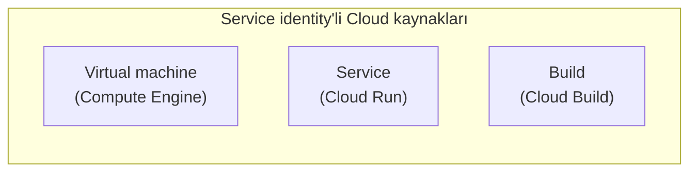

Google Cloud API'lerine bağlanmak için client kütüphanelerinden birini kullanırsan, kütüphaneler kimlik doğrulama için bu **built-in service account'u otomatik olarak kullanır.**

**Service account'u, her zaman kendi user-managed service account'unla değiştirebilirsin — ve bu önerilir.**

> **Bu neden önemli?** Built-in service account, "hiçbir configuration yapmadan çalışır" avantajı sunar — ama BÖLÜM 15'te göreceğimiz gibi, bu kolaylığın bir bedeli vardır. User-managed bir service account'a geçmek, ekstra bir adım gibi görünse de, güvenlik açısından **standart bir best practice**'tir.

---

# BÖLÜM 6 — Cloud Run'da Service Identity

Her Cloud Run servisi ya da job'ı, **"service identity"** olarak da bilinen bir service account'a **bağlıdır.**

| Kural | Detay |
| --- | --- |
| **Varsayılan** | Cloud Run servisleri ya da job'ları, varsayılan olarak, **Editor role'üne sahip default Compute Engine service account'u** olarak çalışır |
| **Önerilen** | Servisin işlevlerini yerine getirmesi için gereken **en minimal izin kümesine sahip**, user-managed bir service account kullan |
| **Best practice** | Her service identity için **ayrı bir service account** kullan, ve o hesaba **seçici izinler** ver |

---

# BÖLÜM 7 — Service Identity Akışı: Access Token ile API Çağrısı

## Pratikte ne olur?

Pratikte, uygulamanı içeren bir container, bir Cloud Run servisinin parçası olarak çalışır.

Uygulama kodunda, bir Pub/Sub topic'ine mesaj publish etmek için bir client kütüphanesi kullanırsan, kütüphane, kodunun isteklerini **servisin runtime service account'unu kullanarak** doğrulamak için **uygun token'ları otomatik olarak elde eder.** Çoğu Google API'sine erişirken, **OAuth 2.0 access token'ları** kullanılır.

Access token, Pub/Sub API'sini çağırmak için kullanılır. **IAM, access token'ı doğrular**, ve access token'daki kimliği kullanarak, attach edilmiş Pub/Sub topic'ine mesaj publish etmek için **gereken role'lere sahip bir policy binding olup olmadığını kontrol eder.**

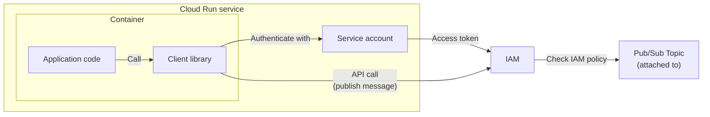

> **Bu neden BÖLÜM 2'deki genel akışın somutlaşmış hali?** BÖLÜM 2'de "IAM, credential'lar aracılığıyla kimliği tanımlar" demiştik — burada bu credential'ın **tam olarak ne olduğunu** görüyoruz: client kütüphanesinin, servisin **service account'undan** elde ettiği bir **OAuth 2.0 access token'ı.** Bu, servisin kimliğinin (service account) nasıl bir **kanıta (token)** dönüştüğünü ve bu kanıtın IAM tarafından **nasıl doğrulandığını** gösteren tam döngüdür.

---

# BÖLÜM 8 — Service-to-Service İletişim: Asenkron ve Senkron

Uygulama mimarin birden fazla Cloud Run servisi kullanıyorsa, bu servislerin muhtemelen **birbiriyle iletişim kurması gerekir.** Bu iletişim **asenkron ya da senkron** olabilir. Bu servislerin çoğu **private** olabilir, dolayısıyla erişim için **credential** gerektirebilir.

| İletişim türü | Nasıl yapılır |
| --- | --- |
| **Asenkron** | Cloud Tasks, Pub/Sub, Cloud Scheduler, ya da Eventarc gibi çeşitli Google Cloud servisleri kullanılabilir |
| **Senkron** | Servisin, başka bir servisin endpoint URL'ini **doğrudan HTTP üzerinden** çağırır |

Senkron iletişim için, **çağıran servis için IAM ve bireysel bir service identity kullanmak bir best practice'tir.** Service account'a, **gereken minimum izin kümesi** verilir.

## Bir service account'u nasıl kurarsın?

Alıcı servisi, çağıran servisten gelen istekleri kabul edecek şekilde yapılandırmak için, **çağıran servisin service account'unu, alıcı servis üzerinde bir principal yaparsın.** Sonra, o service account'a **Cloud Run Invoker (`roles/run.invoker`) role'ünü** verirsin.

Bunu Google Cloud console'da, gcloud CLI ile, ya da Terraform ile yapabilirsin:

```shell
gcloud run services add-iam-policy-binding RECEIVING_SERVICE \
  --member='serviceAccount:CALLING_SERVICE_IDENTITY' --role='roles/run.invoker'
```

---

# BÖLÜM 9 — Senkron Çağrılarda Kimlik Doğrulama: ID Token ve OpenID Connect

## Kimliğin kanıtı: Google tarafından imzalanmış bir ID token

Çağıran servisin yaptığı istek, bu kimliğin kanıtını, **Google tarafından imzalanmış bir OpenID Connect token'ı** biçiminde sunmalıdır.

**OpenID Connect**, bir authorization server tarafından gerçekleştirilen kimlik doğrulamaya dayanarak, bir client'ın kimlik doğrulamasını sağlayan, **OAuth 2.0 tabanlı bir identity protokolüdür.** Ayrıca client hakkında temel profil bilgisi elde etmek için de kullanılır.

Bu ID token'ı elde etmenin bir yolu, çağıran servisinin uygulama kodunda **Google authentication client kütüphanelerini** kullanmaktır.

Alıcı serviste, uygulama kodun isteği **parse etmek**, ve ID token'dan bilgi **çıkarıp doğrulamak** için Google'ın authentication kütüphanelerini kullanabilir.

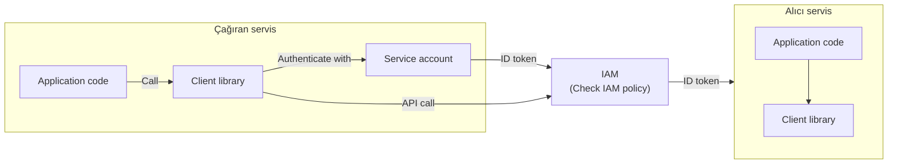

> **Bu neden BÖLÜM 7'deki access token'dan farklı bir mekanizma?** BÖLÜM 7'de, Pub/Sub gibi bir Google Cloud API'sini çağırırken **OAuth 2.0 access token'ı** kullanıldığını görmüştük. Burada, **kendi Cloud Run servisini** (bir Google Cloud API'si değil) çağırırken, bunun yerine bir **OpenID Connect ID token'ı** kullanılıyor. İkisi de aynı temel service account kimliğinden türetilir, ama farklı amaçlara hizmet eder: access token "bu kimliğin şu API üzerinde şu izinleri var" der; ID token ise "bu istek, gerçekten bu kimlikten geliyor" der — alıcı servisin, isteği **kimin gönderdiğini doğrulamasını** sağlar.

---

# BÖLÜM 10 — Resource Hierarchy: Organization, Folder, Project

## Kaynaklar hiyerarşik olarak organize edilir

Google Cloud kaynakları **hiyerarşik olarak organize edilir.** Bir Google Cloud **project**'i, kaynaklarını organize etmenin **birincil yoludur** — her kaynağın bir projede olması gerekir. Bir cloud kaynağı, örneğin bir Cloud Tasks queue'su, bir Cloud Run servisi, ya da bir Compute Engine sanal makinesi olabilir.

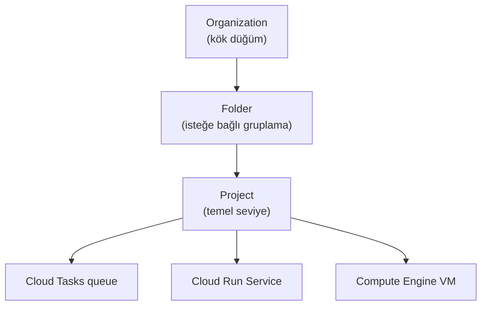

| Seviye | Açıklama |
| --- | --- |
| **Organization** | Resource hierarchy'nin **kök düğümüdür.** Organizasyona ait **her diğer kaynak** üzerinde merkezi görünürlük ve kontrol sağlar |
| **Folder** | Organization düğümünün altında **ek, isteğe bağlı bir gruplama mekanizmasıdır.** Folder'lar, organizasyon içindeki departmanlara, ekiplere, ya da iş birimlerine eşlenebilir |
| **Project** | Kaynakları organize etmek için **temel seviye varlıktır (base-level entity).** Kaynak oluşturmak, Cloud API'lerini ve servislerini kullanmak, izinleri yönetmek, ve billing'i etkinleştirmek gibi işler için **gereklidir.** Projeleri folder'lara organize edebilirsin |

**Her kaynağın tam olarak bir ebeveyni (parent) vardır** — en üstteki organization düğümü hariç, onun hiç ebeveyni yoktur.

---

# BÖLÜM 11 — Her Kaynağın Bir IAM Policy'si Vardır

Hiyerarşideki **her kaynağın bir IAM Policy'si vardır**, ve policy binding'ler kullanarak ona izinler verebilirsin.

Bir **policy binding**, bir identity'yi bir role'e bağlar ve o identity'ye o kaynak üzerinde izinler verir. Pub/Sub topic'ine mesaj publish etme örneğini hatırlarsan — ihtiyacın olan role neydi? **"Pub/Sub Publisher."**

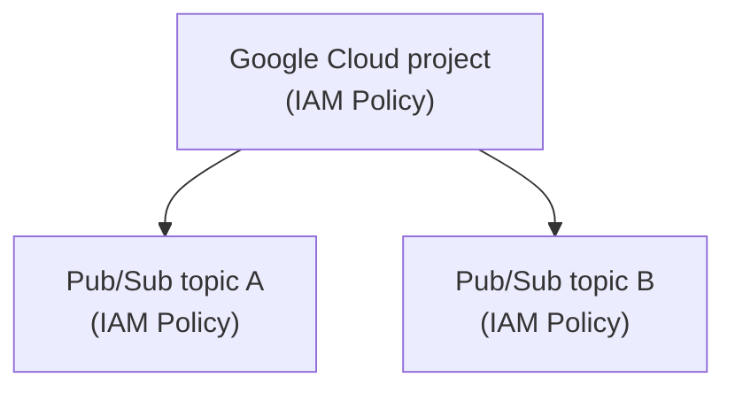

---

# BÖLÜM 12 — Policy Binding Inheritance

## Bir üst seviyeye eklemenin gücü

Bir policy binding'i, bireysel bir Pub/Sub topic'i yerine bir **projeye** eklemek ne kadar kullanışlı olurdu?

Bu **çok kullanışlıdır** — çünkü bir policy binding'i **daha yüksek seviyeli bir kaynağa** eklersen, bu binding **daha düşük seviyeli kaynaklar tarafından miras alınır (inherited).**

Örnekte, Pub/Sub topic'leri gibi daha düşük seviyeli kaynaklar, **ebeveyn kaynakları olan Google Cloud projesinden** policy binding'leri miras alır.

Bu, **tek bir topic'e değil, bir projedeki tüm topic'lere** mesaj publish etme izni vermen gerektiğinde kullanışlıdır.

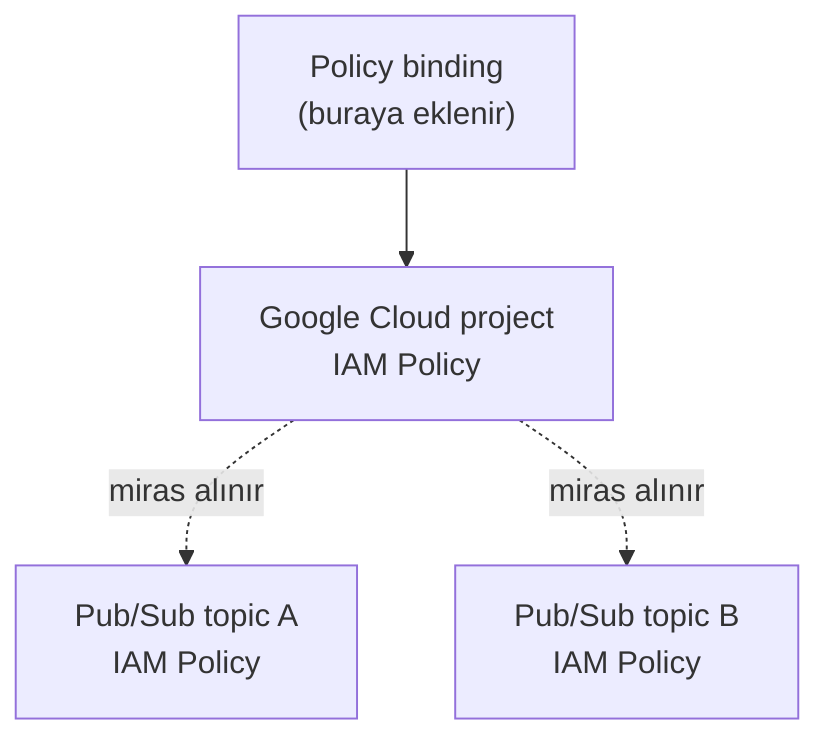

---

# BÖLÜM 13 — Effective IAM Policy

Policy binding inheritance'a bakmanın başka bir yolu daha var.

IAM, bir kaynağa erişimi değerlendirdiğinde, **ebeveyn kaynağın (ve onun ebeveyninin) policy binding'lerini de değerlendirir.** Kaynak üzerindeki **effective (etkin/geçerli) IAM policy**, bir ebeveyne verilmiş olan ve **senin geri alamayacağın** binding'leri de içerir.

```text
Effective IAM policy (kaynak üzerinde) =
    Kaynağın kendi policy binding'leri
  + Ebeveyn'in (ve tüm atalarının) policy binding'leri (miras alınan)
```

> **Sınav tuzağı — "alt seviyede bir kaynağın izinlerini, üst seviyede verilenden daha kısıtlayabilirim" varsayımı:** Bu yanlıştır. Ders açıkça belirtiyor: **daha yüksek bir seviyede verilen izinler, daha düşük bir seviyede geri alınamaz (can't be taken away).** Bir üst seviyeye (örneğin projeye) geniş bir izin verirsen, bu izin, altındaki **her kaynağa** sızar — ve bunu tek tek her alt kaynakta "kapatamazsın." Bu, BÖLÜM 15'te göreceğimiz **default service account riskinin** de temel nedenidir.

---

# BÖLÜM 14 — IAM Role Türleri: Basic, Predefined, Custom

IAM'de üç tür role vardır:

| Tür | Açıklama | Örnekler |
| --- | --- | --- |
| **Basic (Temel)** | **Tüm servisleri kapsayan** izinlere sahip, çok güçlü role'ler. **Production ortamlarında varsayılan olarak verilmemelidir** — bunun yerine, ihtiyaçlarını karşılayan en kısıtlı predefined ya da custom role'ü ver | Owner, Editor, Viewer |
| **Predefined (Önceden Tanımlı)** | **Belirli bir kaynağa** granular (ince taneli) erişim sağlar, Google Cloud tarafından yönetilir | Cloud Run Admin, Pub/Sub Publisher, Cloud Tasks Enqueuer |
| **Custom (Özel)** | Kullanıcının belirttiği bir izin listesine göre granular erişim sağlar — **kendi kullanım durumun için, bir izinler listesinden kendi role'ünü inşa edersin** | — |

---

# BÖLÜM 15 — Cloud Run'daki Default Service Account Riski

## Neden bu bir güvenlik riski?

Daha önce belirtildiği gibi, bir Cloud Run servisi deploy edip bir service account **belirtmezsen**, **default bir service account kullanılır.**

Kullanılan default service account, projede geniş **Editor role'üne** sahip olan **Compute Engine service account'udur.**

**Policy binding inheritance nedeniyle** (BÖLÜM 12'de öğrendiğimiz mekanizma), default service account, **projendeki çoğu kaynak üzerinde okuma ve yazma izinlerine** sahiptir.

Kullanışlı olsa da, bu **doğal bir güvenlik riskidir** — çünkü kaynaklar bu service account ile **oluşturulabilir, değiştirilebilir, ya da silinebilir.**

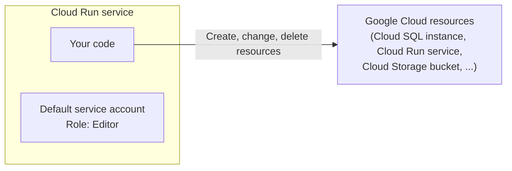

> **Bu neden BÖLÜM 5'teki "built-in service account kullan, ama değiştir" tavsiyesinin somut gerekçesi?** BÖLÜM 5'te, built-in service account'u user-managed olanla değiştirmenin **önerildiğini** görmüştük, ama nedenini tam açıklamamıştık. Burada nedeni açıkça görüyoruz: built-in (default) service account, **Editor** gibi aşırı geniş bir role taşır, ve bu genişlik, **proje geneline miras alınarak** yayılır (BÖLÜM 11-13). Yani "değiştirmemek", sadece bir best practice ihlali değil, **projendeki neredeyse her kaynağa okuma/yazma erişimi olan bir kimliği**, kodunun potansiyel bir zafiyeti aracılığıyla **saldırganlara açık bırakmaktır.**

---

# BÖLÜM 16 — Least Privilege Prensibini Uygulamak: Üç Adım

Bu güvenlik riskini azaltmak (mitigate etmek) için şunları yapmalısın:

1. Cloud Run servisi için **yeni bir service account oluştur.**
2. Bu service account'u **Cloud Run servisinin kimliği (identity)** olarak yapılandır.
3. Bu identity için, servisinin erişmesi gereken kaynaklara, **predefined ya da custom role'lerle policy binding'ler ekle.**

Bu üç adım, IAM'in temel yapı taşlarını (identity oluşturma, identity'yi bir kaynağa bağlama, ve o identity'ye seçici izinler verme) **doğrudan, pratik bir güvenlik iş akışına** dönüştürür.

---

# BÖLÜM 17 — Yeni Bir Service Account Oluşturmak ve Bağlamak

İlk adım, bir Cloud Run servisi için **yeni, user-managed bir service account** oluşturmak, ve onu servisin **service identity'si** olarak ayarlamaktır.

Bir service account'u Google Cloud console'da ya da gcloud CLI ile oluşturabilirsin.

Bir Cloud Run servisi için service account'u şu zamanlarda ayarlayabilirsin:
- Bir servis **oluştururken ya da güncellerken**,
- **Yeni bir service revision deploy ederken.**

Bunu Google Cloud console'da, gcloud CLI'da, bir YAML dosyasıyla, ya da Terraform ile yapabilirsin.

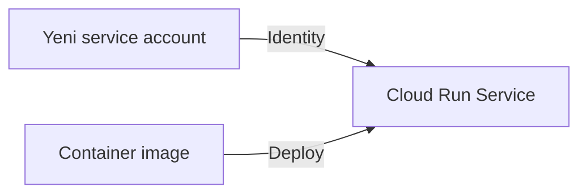

## Varsayılan olarak: hiçbir izin yok

**Varsayılan olarak, bu service account'un hiçbir izni yoktur.** Onu az önce oluşturdun, ve henüz hiçbir policy binding'de görünmüyor.

Cloud Run servisinin bir parçası olarak çalışan koddan **herhangi bir Google Cloud API'sini çağırırsan, çağrı IAM tarafından reddedilir.**

> **Bu neden önemli bir sıralama?** BÖLÜM 15'teki default service account'un tersine, yeni oluşturulan bir user-managed service account **"boş bir sayfa"** olarak başlar — hiçbir kaynağa erişimi yoktur. Bu, least privilege'ın **doğal başlangıç noktasıdır**: her izni, ihtiyaç duydukça, **açıkça (explicit olarak)** eklersin — varsayılan olarak geniş bir erişimden **kısıtlamaya doğru** gitmezsin.

---

# BÖLÜM 18 — Predefined Role'lerle Policy Binding Eklemek

Service account'a izin vermek için, servisin erişmesi gereken kaynağa **attach edilmiş IAM policy'ye**, service account member'ı için **uygun role'le bir policy binding eklersin.**

Örneğin, Cloud Run servisinin bir Pub/Sub topic'ine mesaj publish etmesini sağlamak için, topic'e attach edilmiş IAM policy'ye, **Pub/Sub Publisher** role'üyle bir policy binding eklersin:

```shell
gcloud pubsub topics add-iam-policy-binding my-topic \
  --member="my-service-account-email" --role="roles/pubsub.publisher"
```

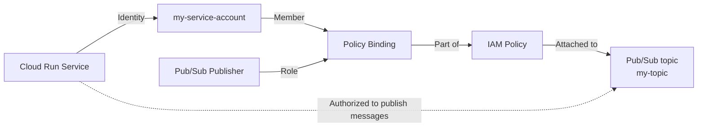

## Hatırlanacaklar (BÖLÜM 1-18)

1. Bir IAM policy, member'ları bir role'e bağlayan **policy binding'lerin bir listesini içerir.**
2. Bir **service account**, makineler, uygulamalar, ya da servisler tarafından kullanılan bir member identity **türüdür.**
3. **Her Cloud Run servisi ya da job'ı, bir service account'a bağlıdır.**
4. Her Cloud Run servisi için, **minimal bir izinler kümesine sahip, user-managed bir service account kullan.**
5. Google Cloud kaynakları bir **hiyerarşiye** organize edilir, project temel seviye varlıktır.
6. Kaynaklar, **ebeveynlerinden ve tüm atalarından** policy binding'leri miras alır.
7. Hiyerarşide **daha yüksek bir seviyede verilen izinler, daha düşük bir seviyede geri alınamaz.**
8. Cloud Run servisi, **varsayılan bir service account'a erişime sahiptir** — Google client kütüphaneleri, Google Cloud API'lerini çağırmak için bunu kullanır.
9. Default service account, **tüm servisler genelinde geniş izinlere sahip Editor basic role'üne** sahiptir.
10. Production ortamlarında, default service account'u, **predefined role'lere sahip, user-managed, servis başına bir hesapla değiştirmelisin.**

---

# BÖLÜM 19 — Environment Variable'lar (Cloud Run'da)

## Environment variable'lar nedir?

**Environment variable'lar**, servisinin uygulama kodu tarafından **işlevselliği kontrol etmek için** kullanılabilecek key-value çiftleridir.

Cloud Run'da environment variable'lar ayarladığında, bunlar **uygulama container'ına inject edilir** ve kodun tarafından **erişilebilir hale gelir.**

| Özellik | Detay |
| --- | --- |
| **Format** | Key-value çiftleri olarak ayarlanır |
| **Enjeksiyon** | Uygulama container'ına inject edilir |
| **Erişim** | Uygulama kodun tarafından **runtime'da** erişilir |
| **Ne zaman ayarlanır** | Bir servis/job oluşturulduğunda ya da güncellendiğinde, ya da yeni bir revision deploy edildiğinde |
| **Nasıl yönetilir** | Google Cloud console, gcloud CLI, YAML dosyası, ya da Terraform ile ayarlanabilir/güncellenebilir/kaldırılabilir |

```shell
# Service
gcloud run deploy my-service --image my-container-image-url \
  --update-env-vars FOO=bar,BAZ=boo

# Job
gcloud run jobs create my-job --image my-container-image-url \
  --update-env-vars FOO=bar,BAZ=boo
```

**Ayarlanamayan belirli, rezerve edilmiş environment variable'lar** vardır — bunların listesi container runtime contract'ında belgelenmiştir.

## Dockerfile'daki varsayılanlar ile Cloud Run ayarları arasındaki ilişki

Container'da bir Dockerfile'daki **`ENV`** ifadesiyle **varsayılan environment variable'lar** ayarlayabilirsin. Bir Cloud Run servisinde ya da job'ında **aynı isimle** ayarlanan bir environment variable, **varsayılan değişkende ayarlanan değeri override eder.**

> **Bu neden BÖLÜM 17'deki modül 17 bilgisiyle (Dockerfile `ENV` talimatı) doğrudan bağlantılı?** Modül 17'de, `ENV` talimatının container configuration'ının bir parçası olarak environment variable ayarladığını öğrenmiştik. Burada, Cloud Run'ın bu mekanizmanın **üzerine bindiğini** görüyoruz: Dockerfile'daki `ENV`, bir **varsayılan (fallback)** sağlar; Cloud Run'da ayarlanan aynı isimli bir değişken, bu varsayılanı **override eder.** Bu, "build-time configuration" (Dockerfile) ile "deploy-time configuration" (Cloud Run) arasındaki katmanlı ilişkiyi gösterir.

---

# BÖLÜM 20 — Environment Variable'lara Kod İçinden Erişmek

Uygulama kodunda environment variable'lara erişmek için, programlama dilin için mevcut olan kütüphane modüllerindeki **uygun fonksiyonları** kullanırsın.

| Dil | Erişim yöntemi |
| --- | --- |
| **Python** | `os` modülünde `environ.get("key")` |
| **Node.js** | `process.env.key` |
| **Java** | `System.getenv("key")` |

---

# BÖLÜM 21 — Secret Manager ve Secret'lar

## Neden hassas veriyi environment variable olarak saklamak yeterli değildir?

Servisin ya da job'ın, API anahtarları, şifreler, ya da başka hassas bilgiler gibi **hassas configuration gerektiren downstream servislere** erişmesi gerekebilir.

Cloud Run servisleri için, bu tür hassas bilgileri **Secret Manager'da oluşturulan bir secret'ta** saklaman önerilir.

## Secret Manager nedir?

**Secret Manager**, secret'ları saklamana, yönetmene, ve erişmene izin veren bir Google Cloud servisidir.

Bir **secret**, şunları içeren bir nesnedir:

- **Metadata koleksiyonu**, şunları içerir:
  - Replikasyon konumları (replication locations)
  - Etiketler (labels)
  - İzinler (permissions)
- **Secret version'lar** — secret verisini saklar.

Bir **secret version**, gerçek secret verisini — bir API anahtarı ya da şifre gibi — **metin string'i ya da binary blob** olarak saklar.

> **Bu neden environment variable'dan yapısal olarak farklıdır?** BÖLÜM 19'daki bir environment variable, **tek bir değeri (bir değer, bir zaman noktası) taşır.** Bir secret ise, **versiyonlanmış bir nesnedir** — aynı secret'ın (örneğin bir API anahtarının) birden fazla version'ı olabilir, ve metadata (replikasyon, izinler) taşır. Bu, secret'ların rotasyona (bir version'dan diğerine geçiş) ve granular erişim kontrolüne (kimin hangi secret'a erişebileceği) elverişli olmasını sağlar — düz bir environment variable'ın sağlayamayacağı bir yapı.

---

# BÖLÜM 22 — Secret'lara Erişmek: Volume vs Environment Variable

Bir secret'ı, Cloud Run'da çalışan servisine ya da job'una **iki yoldan biriyle** erişilebilir kılabilirsin:

| Yöntem | Nasıl çalışır | Ne zaman kullanılır |
| --- | --- | --- |
| **Volume olarak mount etmek** | Secret'ı, container'a **bir dosya olarak** kullanılabilir kılar. Bir volume'ü okumak **her zaman** Secret Manager'dan secret değerini getirir — bu yüzden **`latest` (en son) version** ile kullanılabilir | Secret'ın her zaman en güncel version'ını istiyorsan |
| **Environment variable olarak geçirmek** | Cloud Run servisine bir environment variable olarak geçirilir. Environment variable'lar **instance başlangıç zamanında (startup time) çözülür (resolved)** — bu yüzden bu yöntemi kullanırsan, `latest` yerine secret'ı **belirli bir version'a pinlemen** önerilir | Secret'ın belirli, sabit bir version'ını istiyorsan |

```shell
# secret volume olarak mount edilir
gcloud run deploy my-service --image my-container-image \
  --update-secrets=SECRET_FILE_PATH=my_secret:VERSION

# secret bir environment variable olarak geçirilir
gcloud run deploy my-service --image my-container-image \
  --update-secrets=ENV_VAR_NAME=my_secret:VERSION
```

Servisini Cloud Run'a deploy ederken, bir secret'ı ona erişilebilir kılabilirsin. Yeni bir revision deploy ederek ya da servisi güncelleyerek **mevcut secret'ları güncelleyebilirsin.**

Bunu Google Cloud console'da, gcloud CLI ile, ya da bir YAML dosyası kullanarak yapabilirsin.

**Secret güncellemek gibi herhangi bir configuration değişikliği, yeni bir service revision'ının oluşturulmasına yol açar.** Sonraki revision'lar da bu configuration ayarını **otomatik olarak alır.**

> **Sınav tuzağı — "environment variable olarak geçirdiğim secret, her zaman güncel kalır" varsayımı:** Bu yanlıştır. Ders açıkça belirtiyor: environment variable olarak geçirilen bir secret, **instance başlangıç zamanında bir kereye mahsus çözülür** — instance çalışmaya devam ettiği sürece, secret'ın **o anki değeriyle sabit kalır**, Secret Manager'daki secret'ın yeni bir version'ı oluşturulsa bile. Buna karşın, **volume olarak mount edilmiş** bir secret, **her okumada** Secret Manager'dan taze bir değer çeker — bu yüzden `latest` version ile kullanılmaya daha uygundur. Bu ayrım, hangi yöntemi seçeceğine karar verirken **kritik bir faktördür.**

---

# BÖLÜM 23 — Secret'lara Erişim İzni Vermek

Bir Cloud Run servisinin bir secret'a erişebilmesi için, Cloud Run service account'una **Secret Manager Secret Accessor** role'ünü vermelisin.

```shell
gcloud secrets add-iam-policy-binding my-secret-id \
  --member="my-service-account-email" --role="roles/secretmanager.secretAccessor"
```

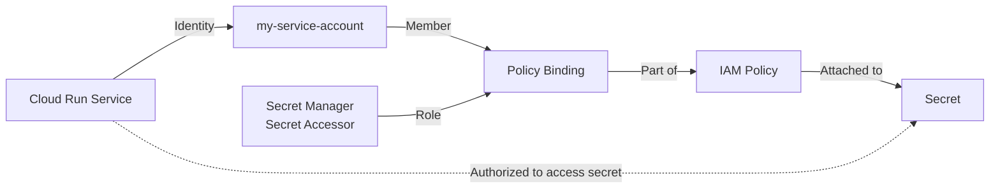

Bu, BÖLÜM 18'deki Pub/Sub Publisher örneğiyle **birebir aynı desendir** — sadece kaynak (bir Pub/Sub topic'i yerine bir secret) ve role (Pub/Sub Publisher yerine Secret Manager Secret Accessor) değişir. IAM'in temel mekaniği — **identity + role = policy binding, bir kaynağa attach edilir** — tüm bu modül boyunca **değişmeden kalır.**

## Hatırlanacaklar (BÖLÜM 19-23)

1. Environment variable'lar **key-value çiftleri olarak** ayarlanır ve Cloud Run servisine/job'una **inject edilir.**
2. Container'ın Dockerfile'ında ayarlanan bir environment variable'ın **varsayılan değeri**, bir servis deploy edildiğinde **override edilebilir.**
3. Cloud Run servisinde/job'ında **hassas bilgiyi saklamak ve erişmek için secret'lar kullan.**
4. Bir secret'a erişmek için, onu **bir volume olarak mount et** ya da servis/job için **bir environment variable olarak sağla.**

---

# Toplu Özet (Hızlı Tekrar)

**Modülün ana fikri:** Bir Cloud Run servisi, sadece çalışan kod değildir — aynı zamanda Google Cloud API'lerini çağırırken kullandığı **kendi kimliğine (service account)** sahiptir. Bu modül, bu kimliğin nasıl çalıştığını (service account, access token/ID token), izinlerin kaynak hiyerarşisinde nasıl yayıldığını (inheritance), varsayılan yapılandırmanın neden riskli olduğunu ve least privilege'ın nasıl uygulanacağını, ve hassas olmayan/hassas configuration'ı (environment variable'lar/secret'lar) nasıl yöneteceğini öğretiyor.

**Service account ve identity (BÖLÜM 1-9):** Google Cloud API'leri, client kütüphaneleriyle çağrılır; IAM her çağrıyı, çağıranın kimliğini ve attach edilmiş IAM policy'deki policy binding'leri kontrol ederek yetkilendirir. Bir policy binding, member (human/service account/allUsers) + role'den oluşur. Bir service account, makineler için özel bir kimlik türüdür (şifresiz, browser'la giriş yapılamaz). Her Cloud Run servisi/job'ı, "service identity" olarak da bilinen bir service account'a bağlıdır. Google Cloud API'lerini çağırırken OAuth 2.0 access token'ları; kendi Cloud Run servislerini senkron olarak çağırırken (Cloud Run Invoker role'üyle) OpenID Connect ID token'ları kullanılır.

**Resource hierarchy (BÖLÜM 10-13):** Kaynaklar Organization → Folder (opsiyonel) → Project → kaynaklar şeklinde hiyerarşik organize edilir; her kaynağın tam olarak bir ebeveyni vardır. Her kaynağın bir IAM policy'si vardır; bir üst seviyeye eklenen policy binding'ler, alt seviyedeki kaynaklara miras alınır (inherited). Effective IAM policy, kaynağın kendi binding'leri artı tüm atalarından miras alınan binding'lerden oluşur — ve üst seviyede verilen izinler alt seviyede geri alınamaz.

**Least privilege (BÖLÜM 14-18):** Üç role türü vardır: Basic (Owner/Editor/Viewer — çok geniş, production'da varsayılan olarak verilmemeli), Predefined (Google tarafından yönetilen, granular), Custom (kullanıcı tanımlı). Cloud Run servisleri varsayılan olarak, Editor role'üne sahip default Compute Engine service account'u olarak çalışır — inheritance nedeniyle bu, projedeki çoğu kaynağa okuma/yazma erişimi demektir (güvenlik riski). Riski azaltmak için: yeni bir service account oluştur → onu servisin identity'si yap → sadece ihtiyaç duyulan kaynaklara, predefined/custom role'lerle policy binding ekle. Yeni oluşturulan bir service account'un varsayılan olarak hiçbir izni yoktur.

**Secrets ve environment variable'lar (BÖLÜM 19-23):** Environment variable'lar, key-value çiftleri olarak container'a inject edilir; Dockerfile'daki `ENV` varsayılanları, Cloud Run'da aynı isimle ayarlanan değişkenler tarafından override edilir. Hassas veri için Secret Manager kullanılır — bir secret, metadata + versiyonlanmış secret data'dan oluşur. Secret'lara ya volume olarak (her okumada taze, `latest` ile uyumlu) ya da environment variable olarak (startup'ta bir kez çözülür, belirli bir version'a pinlenmeli) erişilebilir. Bir servisin bir secret'a erişebilmesi için, service account'una Secret Manager Secret Accessor role'ü verilmelidir — Pub/Sub Publisher örneğindeki aynı policy binding desenini izleyerek.

---

# En Kritik Ayrımlar / Hızlı Tekrar (Cebinde Taşı)

- **Bir policy binding = member (human/service account/allUsers) + role.** Bir member birden fazla binding'e sahip olabilir (birden fazla role).
- **Service account'ların şifresi yoktur, browser'la giriş yapamazlar** — makineler/uygulamalar/servisler için tasarlanmıştır, e-posta adresiyle tanımlanır.
- **Her Cloud Run servisi/job'ı bir service account'a (service identity) bağlıdır.**
- **Google Cloud API'lerini çağırırken OAuth 2.0 access token; kendi Cloud Run servislerini senkron çağırırken OpenID Connect ID token kullanılır** — ikisi farklı amaçlara hizmet eder (izin kanıtı vs kimlik kanıtı).
- **Asenkron service-to-service iletişim için Cloud Tasks/Pub/Sub/Cloud Scheduler/Eventarc; senkron için doğrudan HTTP + Cloud Run Invoker role'ü.**
- **Resource hierarchy: Organization (kök) → Folder (opsiyonel) → Project (temel seviye) → kaynaklar.** Her kaynağın tam olarak bir ebeveyni vardır.
- **Policy binding inheritance: üst seviyeye eklenen bir binding, tüm alt kaynaklara miras alınır** — ve bu, alt seviyede geri alınamaz.
- **Üç IAM role türü: Basic (Owner/Editor/Viewer — production'da varsayılan verilmemeli), Predefined (Google yönetimli, granular), Custom (kullanıcı tanımlı).**
- **Cloud Run'ın default service account'u = Compute Engine service account'u + Editor role'ü** — inheritance nedeniyle bu, projedeki çoğu kaynağa erişim demektir. **Bu bir güvenlik riskidir, kolaylık değil.**
- **Least privilege 3 adımı: yeni service account oluştur → identity olarak ayarla → sadece gereken kaynaklara policy binding ekle.** Yeni bir service account'un varsayılan olarak hiçbir izni yoktur.
- **Dockerfile `ENV` = build-time varsayılan; Cloud Run'da ayarlanan aynı isimli değişken = bu varsayılanı override eder (deploy-time).**
- **Secret ≠ environment variable.** Secret, metadata + versiyonlanmış data içeren bir Secret Manager nesnesidir; environment variable düz bir key-value çiftidir.
- **Volume olarak mount edilen bir secret her okumada taze çekilir (`latest` ile uyumlu); environment variable olarak geçirilen bir secret startup'ta bir kez çözülür (belirli bir version'a pinlenmeli).**
- **Bir secret'a erişim, `roles/secretmanager.secretAccessor` role'ünün service account'a verilmesini gerektirir** — Pub/Sub Publisher ile aynı policy binding deseni.

---
