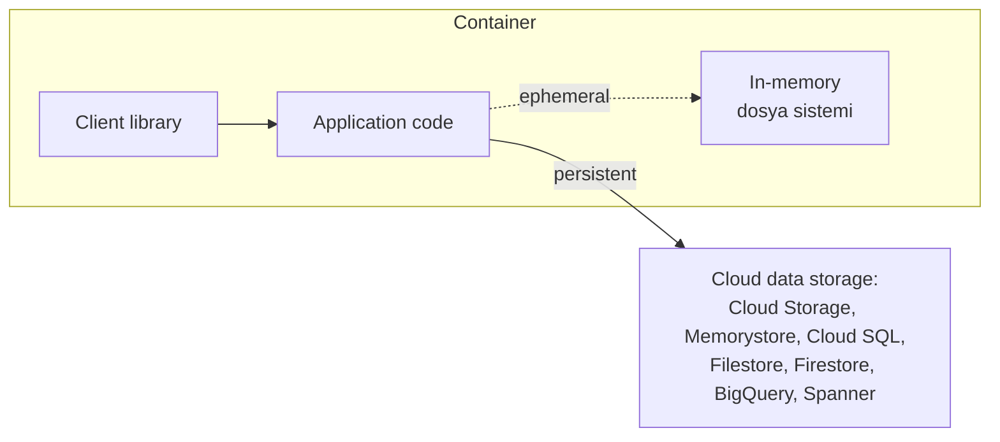
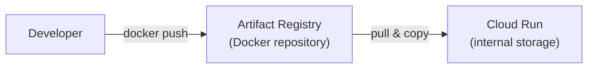
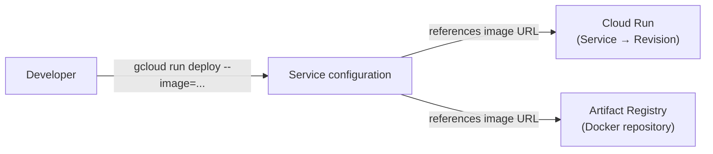
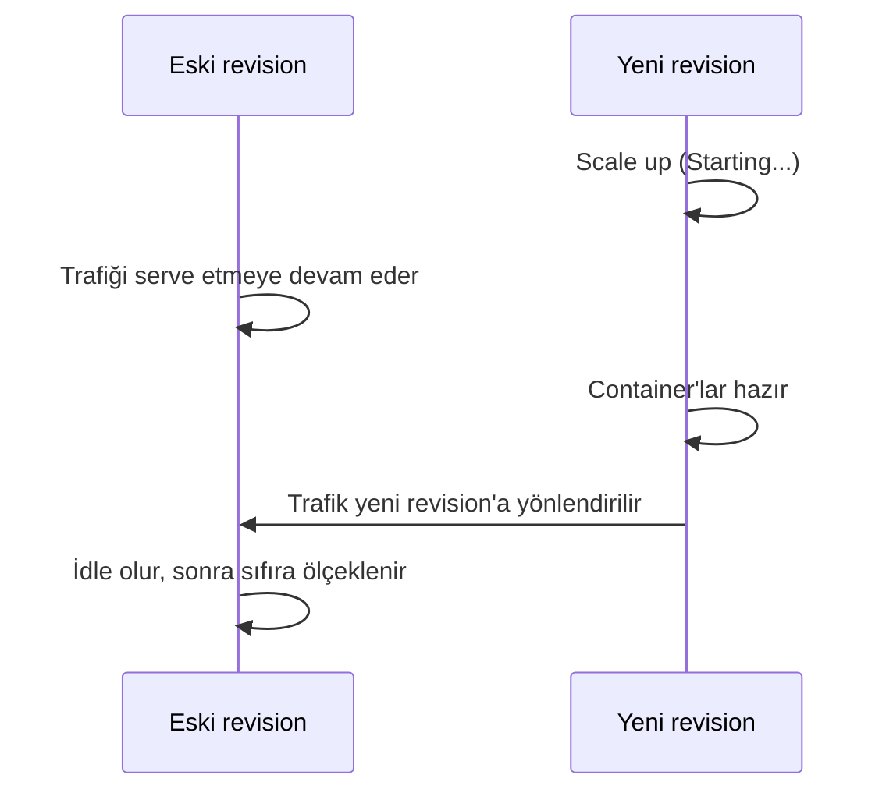
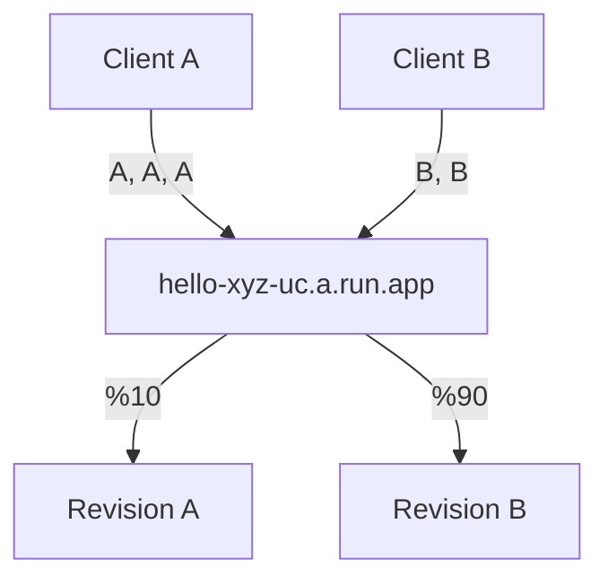
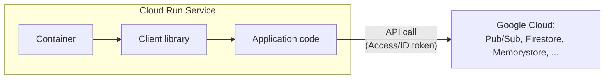
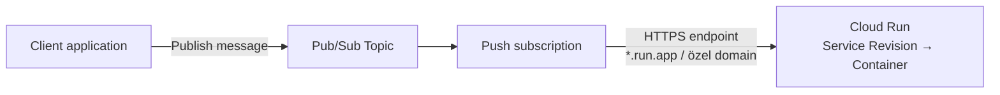

# Application Development, Testing, and Integration — Baştan Sona Öğretici

> Bu metin, **"Application Development, Testing, and Integration"** modülünde anlatılan **her şeyi** kavratmak için yazıldı.
>
> **Kapsam notu:** Bu, `deep-dive/19-fundamentals-of-cloud-run/` ve `deep-dive/20-service-identity-and-authentication/` ile aynı kursun (Cloud Run'a odaklanan üçüncü kurs) **üçüncü modülüdür.** Modül 19'da Cloud Run'ın nasıl çalıştığını (kaynak modeli, yaşam döngüsü, autoscaling), modül 20'de bir servisin **kim olarak** çalıştığını (service account, IAM, least privilege) öğrenmiştik. Bu modül, iki pratik soruya cevap veriyor: **(1)** bir uygulamayı Cloud Run'da nasıl **geliştirir, test eder, ve deploy edersin?**, ve **(2)** bir Cloud Run servisini diğer Google Cloud servisleriyle (Pub/Sub, Cloud SQL, Memorystore) nasıl **entegre edersin?**

---

## Bu ders tam olarak neyi öğretiyor ve neden önemli?

Bu modül üç alanı kapsıyor:

1. **Development ve testing (BÖLÜM 1-8)** — bir uygulamanın Cloud Run için **uygun olup olmadığını** nasıl anlarsın, container'ının **uyması gereken kurallar (runtime contract)** nelerdir, ve deploy etmeden önce **local'de nasıl geliştirip test edersin?**
2. **Deployment ve revision yönetimi (BÖLÜM 9-20)** — bir container image'ını **Artifact Registry'den Cloud Run'a** nasıl taşırsın, her deployment'ın **neden yeni bir revision** oluşturduğunu, ve trafiği revision'lar arasında **nasıl kontrollü bir şekilde geçirirsin (pinning, tagging, splitting)?**
3. **Google Cloud servisleriyle entegrasyon (BÖLÜM 21-27)** — Cloud Run servisini **Pub/Sub, Memorystore, ve Cloud SQL** gibi servislere nasıl bağlarsın, ve bunu **güvenli** bir şekilde nasıl yaparsın?

Bu üç alan, ortak bir temaya hizmet ediyor: **"kod yazmak" ile "production'da güvenilir bir şekilde çalışan bir servis işletmek" arasındaki mesafeyi kapatmak.** Bu modül, o mesafenin her adımını — uygunluk kontrolünden, deployment mekaniğine, downstream entegrasyonlara kadar — somutlaştırıyor.

---

# BÖLÜM 1 — Cloud Run İçin Uygunluk Kriterleri

## Uygulaman Cloud Run için iyi bir seçim mi?

Cloud Run için iyi bir seçim olması için, uygulaman **aşağıdaki kriterlerin tümünü** karşılamalıdır:

| Kriter | Detay |
| --- | --- |
| **İstek/stream/event türü** | HTTP, HTTP/2, WebSockets, ya da gRPC üzerinden teslim edilen istekleri, stream'leri, ya da event'leri serve eder — **ya da tamamlanana kadar çalışır (job)** |
| **Dosya sistemi** | **Local persistent** bir dosya sistemi gerektirmez — local **ephemeral** bir dosya sistemi ya da bir **network dosya sistemi** ile çalışır |
| **Eşzamanlılık** | Uygulamanın **birden fazla instance'ının aynı anda çalışmasını** handle edecek şekilde build edilmiştir |
| **Kaynak sınırı** | Instance başına **8 CPU ya da 32 GiB bellekten** fazlasını gerektirmez |
| **Dil/paketleme** | Şunlardan birini karşılar: containerized'dır, **Go, Java, Node.js, Python, ya da .NET**'te yazılmıştır, ya da başka bir şekilde containerize edilebilir |

Uygulaman bu kriterleri karşılıyorsa, **Cloud Run için iyi bir seçimdir.**

---

# BÖLÜM 2 — Developer Workflow (Kısa Hatırlatma) ve Buildpacks Alternatifi

Herhangi bir programlama dilinde kod yazabilir ve ondan bir container image build edebiliyorsan, Cloud Run'a deploy edebilirsin. Üç adımlı developer workflow: **kodunu yaz → build edip paketle → Cloud Run'a deploy et.**

Container image build etmek **isteğe bağlıdır (opsiyoneldir).** Go, Node.js, Python, Java, .NET Core, ya da Ruby kullanıyorsan, container'ı **senin için build edip deploy eden** source-based deployment seçeneğini kullanabilirsin.

Source-based yaklaşımı kullanırsan, bir container image yerine **kaynak kodunu** deploy edersin. Cloud Run, **Buildpacks kullanarak** kaynağını build eder, ve uygulamayı bağımlılıklarıyla birlikte senin için bir container image'a paketler. (Buildpacks, "Developing Containerized Applications on Google Cloud" kursunda — handbook'ta modül 17'de — detaylı işlenmiştir.)

---

# BÖLÜM 3 — HTTPS ve Container Runtime Contract

## HTTPS: tekrar edilen, ama önemli bir temel

Cloud Run, uygulamana **güvenli HTTPS istekleri** desteği sunar. Cloud Run:

- Geçerli bir **TLS sertifikası** ve HTTPS isteklerini desteklemek için diğer configuration'ı **provizyonlar.**
- Gelen istekleri **handle eder, decrypt eder**, ve uygulamana **forward eder.**

Cloud Run, container'ının web isteklerini handle etmek için **8080 portunu dinlemesini bekler.** Bu port numarası **yapılandırılabilir bir varsayılandır.** Bir HTTPS sunucusu sağlamana gerek yoktur — Google'ın altyapısı bunu senin için halleder.

## Container runtime contract: temel gereksinimler

Cloud Run'da container çalıştırmanın **kilit gereksinimleri:**

| Gereksinim | Detay |
| --- | --- |
| **Herhangi bir dil, herhangi bir base image** | Uygulaman herhangi bir programlama dilinde yazılabilir ve herhangi bir base image kullanılarak containerize edilmelidir. Container image'daki **executable'lar Linux 64-bit için compile edilmelidir** |
| **Desteklenen image formatları** | Cloud Run, Docker Image Manifest V2 (Schema 1, Schema 2) ve **OCI image formatlarını** kabul eder |
| **Service olarak: doğru portu dinle** | Container, isteklerini **doğru portta** dinlemelidir |
| **Yapılandırılmış timeout içinde yanıt ver** | Container instance'ı, isteği aldıktan sonra **yapılandırılmış request timeout süresi içinde** (maks. 1 saat) — **container instance başlangıç süresi dahil** — bir yanıt göndermelidir. Aksi halde istek sonlandırılır ve **504 hatası döndürülür** |
| **Job olarak: doğru exit code ile çık** | Job **başarıyla tamamlandığında `0` exit code'uyla**, başarısız olduğunda **sıfır olmayan bir exit code'la** çıkmalıdır. Job'lar istek serve etmemelidir — container bir portu dinlememeli ya da bir web sunucusu başlatmamalıdır |
| **TLS'i kendin implement etme** | Container, **transport layer security'yi doğrudan implement etmemelidir** — çünkü HTTPS ve gRPC için TLS, Cloud Run tarafından **şeffaf bir şekilde terminate edilir.** İstekler daha sonra container'a **HTTP/1 ya da gRPC olarak proxy'lenir.** HTTP/2 için, container'ın istekleri **HTTP/2 cleartext formatında** handle etmesi gerekir |

> **Sınav tuzağı — "job'lar da bir portu dinlemeli mi?" varsayımı:** Hayır. Ders açıkça belirtiyor: job'lar **istek serve etmemelidir** — bu yüzden bir job'ın container'ı **bir portu dinlememeli ya da bir web sunucusu başlatmamalıdır.** Bunun yerine, job başarıyla tamamlandığında **`0` exit code'uyla** çıkmalı; başarısız olduğunda **sıfır olmayan bir exit code'la** çıkmalıdır. Bu, service'lerin (port dinleyip yanıt veren) ve job'ların (bir iş yapıp exit code ile çıkan) **temelde farklı runtime contract'lara** sahip olduğunu gösterir.

---

# BÖLÜM 4 — Execution Environment'lar: First Generation vs Second Generation

Cloud Run, servislerini ve job'larını çalıştıran **iki execution environment** sunar: **first generation** ve **second generation.**

| | First generation | Second generation |
| --- | --- | --- |
| **Varsayılan kullanım** | Service'ler için varsayılan, **değiştirilebilir** | Job'lar için varsayılan, **değiştirilemez** |
| **Ne zaman kullanılır** | Hızlıca **scale out etmesi gereken** servisler; **kısa cold start** süreleri gereken servisler; **seyrek trafikli** servisler; instance başına **512 MiB'dan az bellek** tüketen servisler | Bir **network dosya sistemi** gerektiğinde; **istikrarlı trafikli** ve daha yavaş cold start'lara **tolerant** servisler; **CPU-yoğun** workload'lar gerektiğinde; first generation ortamlarında **implement edilmemiş sistem çağrıları** sorun yarattığında |
| **Sistem çağrısı desteği** | Çoğu, ama tüm işletim sistemi çağrılarının **değil**, emülasyonu | Sistem çağrısı emülasyonu yerine **tam Linux uyumluluğu** |

**Execution environment'ı yalnızca servisler için değiştirebilirsin.** Cloud Run job'ları otomatik olarak second generation execution environment'ı kullanır — bu, job'lar için **değiştirilemez.**

Second generation execution environment sağladıkları:

- **Daha hızlı CPU performansı**
- **Daha hızlı network performansı**, özellikle paket kaybı olduğunda
- **Tam Linux uyumluluğu** — tüm sistem çağrıları, namespace'ler, ve cgroup'lar dahil
- **Network dosya sistemi desteği**

---

# BÖLÜM 5 — Dosya Sistemi ve Data Storage Erişimi

## In-memory dosya sistemi: yazılabilir ama geçici

Cloud Run'da, container'ının **yazılabilir bir in-memory dosya sistemine** erişimi vardır. Container'ından bir dosyaya yazmak, container instance'ının **tahsis edilmiş belleğini** kullanır.

Dosya sistemine yazılan veri, container instance'ı durdurulduğunda **kalıcı olmaz (persist etmez).** In-memory dosya sistemini bir **cache** olarak, atılabilir istek-başı veri ya da configuration saklamak için kullanabilirsin.

## Kalıcılık gerekiyorsa: network dosya sistemi

Bir container instance'ının ömrünün ötesinde veri saklamak istiyorsan, ve **standart dosya sistemi semantiklerini** kullanmak istiyorsan, Cloud Run ile **Filestore** ya da diğer self-managed network dosya sistemlerini kullanabilirsin. Cloud Run ile network dosya sistemi kullanmak için, servisini deploy ederken **second generation execution environment'ı belirtmelisin.**

Cloud Storage'a, bir Cloud Run servisine mount edilmiş bir network dosya sistemi olarak erişmek için, **Cloud Storage FUSE** kullanabilirsin.

## Standart bir dosya sistemine ihtiyacın yoksa: cloud data storage client kütüphaneleri

Standart bir dosya sistemine ihtiyacın yoksa, en basit seçenek **cloud data storage client kütüphanelerini** kullanmaktır. Bu kütüphanelerle, Cloud Run servisini Google Cloud'daki **Firestore, Cloud SQL, Spanner, Cloud Storage, Memorystore, ve BigQuery** storage servislerine bağlayabilirsin.



---

# BÖLÜM 6 — Cloud Code: IDE Entegrasyonu

**Cloud Code**, uygulamalarını Google Cloud ile oluşturmayı, deploy etmeyi, ve entegre etmeyi kolaylaştıran, popüler IDE'ler için bir dizi plugin'dir.

Cloud Code, Kubernetes ve Cloud Run uygulamalarının **tüm geliştirme döngüsü** için IDE desteği sağlar — örnek şablonlardan yeni bir uygulama oluşturup özelleştirmekten, bitmiş uygulamayı çalıştırmaya kadar. Cloud Code, örnekler, configuration snippet'leri, ve **özel bir debug deneyimi** sağlar.

Cloud Code herhangi bir cloud platformuyla çalışsa da, Google Cloud'da barındırılan cluster'ların kolayca oluşturulması ve **Cloud Source Repositories, Cloud Storage, ve Cloud Client Libraries** gibi Google Cloud araçlarıyla daha iyi entegrasyon için **daha akıcı bir deneyim** sunar.

| Özellik | Açıklama |
| --- | --- |
| **IDE desteği** | VS Code, IntelliJ, ve Cloud Shell için plugin'ler |
| **IDE desteği kapsamı** | Kubernetes ve Cloud Run uygulamaları oluşturmak ve deploy etmek |
| **Örnekler** | Çalıştırma ve debug etme için configuration'la birlikte örnek uygulamalar sağlar |
| **Entegrasyon** | Google Cloud araçlarıyla kolay entegrasyonu destekleyen, akıcı bir deneyim |
| **Log'lar** | Log streaming ve görüntülemeyi destekler |

---

# BÖLÜM 7 — Cloud Code ile Local Test ve Deploy Akışı

## VS Code'da Cloud Code kurulumu

Intellij, Visual Studio Code (VS Code), ya da Cloud Shell'i, bir Cloud Code şablonuyla kullanarak bir Cloud Run servisi oluşturup deploy edebilirsin.

1. **Cloud Code for VS Code extension'ını kur** — bu, VS Code'a Google Cloud geliştirmesi için destek ekler.
2. **Docker'ı kur** — local makinenin işletim sistemi için (Mac, Windows, Linux). Emulator ile container image'ını local'de build etmek için, Docker gibi bir builder kurmalısın.
3. **Uygulamayı Cloud Run Emulator ile local'de test et** — VS Code'daki Cloud Code status bar'ından **"Run on Cloud Run Emulator"**'ı seç. Build'in ilerlemesini VS Code'un output window'unda görebilirsin. Başarıyla tamamlandığında, uygulamana bir URL üretilir ve output tab'ında görüntülenir.
4. **Cloud Run'a deploy et** — uygulamanı local'de test ettikten sonra, VS Code'daki Cloud Code status bar'ından **"Deploy to Cloud Run"**'ı seç.

## Deploy sırasında yapılandırabileceklerin

VSCode'da Cloud Code kullanarak deploy ederken:

- **Google Cloud projeni** ayarla.
- Servis için bir **isim** ver.
- **Cloud Run (fully-managed)**'i seç, ve bir **region** seç.
- (Cloud Run for Anthos kullanıyorsan) **Kubernetes cluster bilgisini** yapılandır.
- **Kimlik doğrulama, container image URL'i, ve service account** sağla.
- Image'ını **local'de** ya da **Cloud Build ile uzaktan** build et.

Cloud Code for VS Code, image'ını build eder, registry'ye push eder, ve servisini Cloud Run'a deploy eder. Servisine canlı URL, VSCode'un output tab'ında görüntülenir.

---

# BÖLÜM 8 — Local Testing Seçenekleri: Cloud Code, gcloud CLI, Docker

Geliştirme sırasında, container'ını Cloud Run'a deploy etmeden önce **local'de çalıştırıp test edebilirsin.**

| Araç | Nasıl çalışır |
| --- | --- |
| **Cloud Code** | IDE'in için extension'ı kur; uygulamanı build edip test etmek için **Cloud Run emulator**'ı kullan. CPU/bellek tahsisi gibi property'leri yapılandırabilir, environment variable'lar belirtebilir, ve Cloud SQL veritabanı bağlantıları ayarlayabilirsin |
| **gcloud CLI** | Google Cloud CLI, Cloud Run'ı emüle eden bir **local development environment** içerir — kaynaktan bir container build edebilir, container'ı local makinende çalıştırabilir, ve kaynak kod değişikliklerinde container'ı **otomatik olarak yeniden build edebilir.** Local dizinde bir Dockerfile varsa, container'ı build etmek için o kullanılır; yoksa, container **Google Cloud's buildpacks ile** build edilir. Servisini local'de test etmek için, tarayıcında `http://localhost:8080/`'a git |
| **Docker** | Docker kurulu olduğunda, container'ını local'de `docker run` komutuyla çalıştır — container image URL'ini ve uygulamanın HTTP(S) istekleri için dinleyeceği portu belirt. Servisini local'de test etmek için, tarayıcında `http://localhost:port/`'a git |

## Hatırlanacaklar (BÖLÜM 1-8)

1. Cloud Run'ı, **herhangi bir programlama dilinde** yazılmış containerized uygulamaları çalıştırmak için kullan.
2. Kaynak kodunu **Buildpacks ile build et** ve Cloud Run'a deploy et.
3. Cloud Run'da çalışan bir servisin container'ı, **yapılandırılmış portta istekleri dinlemeli** ve **belirtilen süre içinde bir yanıt döndürmelidir.**
4. Uygulamalarını Google Cloud ile kolayca oluşturmak, deploy etmek, ve entegre etmek için popüler IDE'lerle **Cloud Code kullan.**
5. Cloud Run'a deploy etmeden önce, uygulamanı **Cloud Code, gcloud CLI, ya da Docker ile local'de test et.**

---

# BÖLÜM 9 — Container Build Etmenin Üç Yolu

Cloud Run deployment'ını tartışmadan önce, containerized uygulamanı **nasıl build edeceğine** kısaca bakalım.

| Araç | Nasıl çalışır |
| --- | --- |
| **Docker** | Bir Dockerfile ile, container image'ı **local'de build et.** Container image'ı bir repository'ye **push et** (`docker build` ve `docker push` komutları) |
| **Cloud Build** | Container image'ı **Google Cloud'da build et.** Bir **Dockerfile** ya da **Google Cloud's buildpacks** kullan. Cloud Build'i kullanmak için, gcloud CLI'dan `gcloud builds submit` komutunu çalıştır. Google Cloud's buildpacks ile Cloud Build kullanarak bir container image build etmek için, `gcloud builds submit` komutunu **`pack` flag'iyle** çalıştır |
| **Cloud Run** | Kaynak koddan bir container build etmek için **buildpacks ya da bir Dockerfile** kullanır. Container'ı **Cloud Run'a deploy eder**. `--source` flag'iyle `gcloud run deploy` komutu, uygulama kaynak kodunu bir Dockerfile'la (varsa) ya da Google Cloud's buildpacks ile build eder; sonuçtaki container image bir image repository'sine de yüklenir ve Cloud Run'a deploy edilir |

Container image'ını, **`pack` komutuyla Google Cloud's buildpacks kullanarak local'de** de build edebilirsin.

---

# BÖLÜM 10 — Container'ları Cloud Run'a Deploy Etmek: Artifact Registry Zorunluluğu

Bir container Cloud Run'a deploy edilmeden önce, container image'ın, **Cloud Run'ın erişebileceği bir repository'de saklanması gerekir.**

**Artifact Registry**'de ya da **Docker Hub**'da saklanan container image'ları kullanabilirsin. Bir **Artifact Registry remote repository** kurarak, diğer public ya da private registry'lerden (JFrog Artifactory, Nexus, ya da GitHub Container Registry gibi) gelen container image'larını da kullanabilirsin. **Google, Artifact Registry kullanımını önerir.**

Job'ı ya da servisi oluşturduğun **aynı projede** saklanan container image'larını, ya da (doğru IAM izinleri ayarlanmışsa) **diğer Google Cloud projelerinden** gelen image'ları kullanabilirsin.

> **Sınav tuzağı — "container image'larımı desteklenmeyen bir registry'de tutabilirim" varsayımı:** Genellikle container image'larını başka bir yerde (desteklenmeyen bir public ya da private container registry gibi) barındırıyorsan, Cloud Run ile **önce onları Artifact Registry'ye push etmen gerektiğini** hatırla. Bunu `docker push` komutuyla başarabilirsin. Cloud Run, **doğrudan herhangi bir keyfi registry'den** pull edemez — ya desteklenen bir registry'de (Artifact Registry, Docker Hub) olmalı, ya da bir Artifact Registry remote repository aracılığıyla erişilebilir olmalıdır.

---

# BÖLÜM 11 — Artifact Registry: Repository Türleri

**Artifact Registry**, container image'lar ve yazılım paketleri dahil, yazılım artifact'lerini **private repository'lerde** saklamak ve yönetmek için kullanılan, Google Cloud'daki **universal bir package manager servisidir.**

**Google Cloud için önerilen container registry'sidir.** Artifact Registry, build'lerinden gelen paketleri ve container image'ları saklamak için **Cloud Build ile entegre olur.**

| Repository türü | İçeriği |
| --- | --- |
| **Docker repository** | Container image'ları |
| **NPM repository** | Node.js paketleri |
| **Maven repository** | Java paketleri |
| **PyPI** | Python paketleri |

Container image'larını barındırmak için, **Cloud Run'ın container image'ları pull edebileceği bir "Docker repository" oluşturursun.**

---

# BÖLÜM 12 — Image Push/Pull Akışı ve Internal Storage

## Push: image'ı Artifact Registry'ye yüklemek

Container image'ını Cloud Run'a deploy etmeye hazır olduğunda, image'ı Artifact Registry'deki bir **Docker repository'sine "push" ederek (upload ederek)** başlarsın.

Container image'ının, repository'de **benzersiz bir URL'i olacaktır** — örneğin `us-central1-docker.pkg.dev/${PROJECT_ID}/my-repo/my-image` — bunu, image'ı Cloud Run'a deploy ederken kullanabilirsin.

## Pull: Cloud Run image'ı çeker ve kopyalar

Container image'ın Docker repository'sine push edildikten sonra, onu Cloud Run'daki bir servise **deploy edebilirsin.** Bu, container image URL'ini Cloud Run'a **teslim ettiğin**, ve Cloud Run'ın image'ı **Artifact Registry'den pull ettiği** anlamına gelir.

Cloud Run'daki container'ların **güvenilir ve hızlı** başlamasını sağlamak için, **Cloud Run container image'ı kopyalayıp local'de saklar.** Internal container storage hızlıdır — bu, image boyutunun container başlangıç süresini **etkilemediğini** garanti eder. **Büyük image'lar, küçükler kadar hızlı yüklenir.**

Cloud Run image'ı kopyaladığı için, deploy edilmiş bir container image'ı **Artifact Registry'den yanlışlıkla silsen bile bir sorun olmaz.** Bu kopya, Cloud Run servisinin **çalışmaya devam etmesini** garanti eder.



> **Bu neden modül 19'daki (BÖLÜM 10'daki) bilgiyle birebir aynı?** Modül 19'da, Cloud Run'ın container image'ları **internal storage'ından** pull ettiğini, ve Artifact Registry'ye sadece **deploy anında** gittiğini öğrenmiştik. Burada aynı mekanizmayı, **push/pull terminolojisiyle** ve daha somut örneklerle (unique URL, repository türleri) tekrar görüyoruz — bu, kavramın ne kadar merkezi olduğunu gösteriyor.

---

# BÖLÜM 13 — Servis Oluşturmak/Güncellemek: Gerekli Roller

Bir container image'ı Cloud Run'a deploy etmek için, Google Cloud console'u ya da gcloud CLI'ı kullanarak **mevcut bir servisi oluştur ya da güncelle**, ve **container image URL'ini sağla.**

Bir container image'ı **ilk kez deploy ettiğinde**, Cloud Run bir **servis ve onun ilk revision'ını** oluşturur. **Servis başına yalnızca bir container image vardır.**

Deploy edebilmek için, şunlardan birine sahip olmalısın:

- **Owner** role'ü,
- **Editor** role'ü,
- Ya da hem **Cloud Run Admin** hem **Service Account User** role'leri.

Gerekli izinleri içeren bir **custom role** de kullanabilirsin.



---

# BÖLÜM 14 — Yeni Bir Revision Deploy Etmek: Beş Adım

**Bir Cloud Run servisinin her revision'ı immutable'dır.** Uygulamanı Cloud Run'da güncellemek için, genellikle şu adımları izlersin:

1. **Uygulama kaynak kodunu değiştir.**
2. **Uygulamanı bir container image'a build edip paketle.**
3. **Container image'ı Artifact Registry'ye push et.**
4. **Container image'ı Cloud Run servisine yeniden deploy et.**
5. **Cloud Run'ın değişikliklerini deploy etmesini bekle.**

Container image'ını mevcut bir servise **yeniden deploy ettiğinde, otomatik olarak yeni bir revision oluşturulur.**

Yeni bir revision'ı Google Cloud console'da, gcloud CLI ile, bir YAML configuration dosyasıyla, ya da Terraform ile deploy edebilirsin.

---

# BÖLÜM 15 — Service Configuration: Sekiz Bileşen

Cloud Run servisinin **configuration'ı**, sekiz alanı kapsar:

| # | Bileşen |
| --- | --- |
| 1 | **Container image URL** |
| 2 | **Container entrypoint ve argümanları** |
| 3 | **Secret'lar ve environment variable'lar** |
| 4 | **Request timeout** |
| 5 | **Concurrency** |
| 6 | **CPU/bellek limitleri** |
| 7 | **Scaling boundaries** (min/max instances) |
| 8 | **Google Cloud configuration** (service account, connectors) |

**Cloud Run servisinin herhangi bir configuration ayarını değiştirmek, container image'ın kendisinde bir değişiklik olmasa bile, yeni bir revision'ın oluşturulmasına yol açar.**

Sonraki service revision'ları, **açıkça değiştirmedikçe**, bu configuration ayarlarını **otomatik olarak** alır.

> **Bu neden BÖLÜM 14'teki 5 adımın "eksik" bir tarifi olduğunu gösteriyor?** BÖLÜM 14'teki 5 adım, **kod değişikliği** üzerinden yeni bir revision oluşturmayı tarif ediyordu. Ama burada öğrendiğimiz gibi, **kodda hiçbir değişiklik olmasa bile** — sadece bir environment variable'ı, timeout'u, ya da concurrency ayarını değiştirsen bile — Cloud Run **yeni bir revision oluşturur.** Yani "yeni revision = yeni kod" varsayımı yanlıştır; doğrusu "yeni revision = container image VEYA configuration'da herhangi bir değişiklik"tir.

---

# BÖLÜM 16 — Revision Immutability ve Servis Güncelleme Akışı

## Service resource: Cloud Run'ın uygulamanı nasıl çalıştıracağını tanımlar

**Service resource**, Cloud Run'ın uygulamanı nasıl çalıştırdığını tanımlayan configuration'ı içerir (container image URL, environment variable'lar, CPU/bellek boyutu, scaling boundaries gibi).

Uygulamanda ya da service configuration'ında değişiklik yapıp deploy ettiğinde, Cloud Run servisinin **yeni bir revision'ını oluşturur.**


## Revision: immutable bir kopya

Cloud Run, service resource'a yaptığın her değişiklikten sonra uygulamanı deploy eder. Aynı zamanda, service resource'un **immutable bir kopyasını** oluşturur — buna **revision** denir. "Immutable" demek, **bir revision üzerinde değişiklik yapamayacağın** anlamına gelir.

**Daha fazla güncelleme yapmak için, sadece yeni revision'lar ekleyebilirsin.**

Bir revision, **container image'ının ve service configuration'ının immutable bir kopyasıdır.**

---

# BÖLÜM 17 — Trafik Servisi: Yeni Revision Scale-Up ve Migration

## Trafiğin geçiş anı: eski revision hâlâ serve ediyor

Yeni bir service revision oluşturulduktan sonra, Cloud Run önce **yeni revision'ı, mevcut revision'ın kapasitesine ulaşacak şekilde scale up eder.**

Cloud Run, o revision'daki container instance'larının **başlamasını bitirmesini bekler.** Bu gerçekleşirken, **mevcut (eski) revision'daki container instance'ları**, servise gelen istek trafiğini **serve etmeye devam eder.**

## Trafik geçişi: her iki revision da bağımsız ölçeklenir

Yeni service revision'ındaki container instance'ları hazır olduğunda, Cloud Run trafiği **yeni revision'a yönlendirir.**

Her iki revision ("önceki" ve "yeni") **bağımsız olarak autoscale eder.** Önceden aktif olan revision'daki container'lar, sonunda **istekleri serve etmeyi durdurup idle** hale gelir.

Yeni revision, talebi karşılamak için **daha fazla container eklemek zorunda kalabilir**, ve önceki revision sonunda idle container'ları **kaldırıp sıfıra ölçeklenir.**

## Kademeli rollout: `--no-traffic`

Bir uygulama değişikliğinin **kademeli rollout'unu** gerçekleştirmek için, yeni bir service revision, deploy edilirken **`--no-traffic` seçeneğiyle**, başlangıçta **hiç trafik almayacak** şekilde yapılandırılabilir. Yeni service revision'ın aldığı trafik miktarını kademeli olarak artırmak için, ardından servisi **artan bir yüzde değeri belirterek** güncelleyebilirsin.



---

# BÖLÜM 18 — Trafiği Pinlemek

İstek trafiğini, **en son revision yerine belirli bir service revision'ına pinleyebilirsin** — bu, yeni bir revision'ın deployment'ını, trafiğin migration'ından **ayırır (decouple eder).**

Bu, **yeni bir revision eklersen, Cloud Run'ın o yeni revision'a otomatik olarak trafik göndermeyeceği** anlamına gelir.

**Bir revision'a pinlemek**, şu durumlarda kullanışlıdır:

- **Önceki bir revision'a geri dönmek (rollback)** istiyorsan,
- Ya da tüm istek trafiğini ona taşımadan önce **yeni revision'ını test etmek** istiyorsan.

Bu, revision'a giden istek trafiği yüzdesini **`100`'e ayarlayarak** başarılır. Bunu Google Cloud console'da, gcloud CLI ile, bir YAML configuration dosyasıyla, ya da Terraform ile ayarlayabilirsin.

---

# BÖLÜM 19 — Revision'ları Tag'lemek

Bir servis deploy ederken, yeni revision'a, **trafik serve etmeden onu belirli bir URL'de erişilebilir kılan** bir **tag** atayabilirsin.

Bu tag'i daha sonra, trafiği **tag'lenmiş revision'a kademeli olarak taşımak**, ya da **tag'lenmiş bir revision'ı geri almak (rollback)** için kullanabilirsin.

Bu özelliğin yaygın bir kullanım alanı, **herhangi bir trafik serve etmeden önce**, yeni bir service revision'ını **test etmek ve doğrulamaktır (vet etmektir).**

Tag'lenmiş bir revision'ın kendi **benzersiz URL'i** vardır — bu, Cloud Run servisinin URL'i, artı önek olarak eklenen tag adıdır. Örneğin, `hello` servisinde `green` tag adını kullandıysan, tag'lenmiş revision'ı şu URL'de test edersin: `https://green---hello-xyz-uc.a.run.app`.

> **Örnek:** Bir revision'ı, o revision'ı oluşturmak için kullanılan version control'deki commit'in ID'siyle tag'leyebilirsin.

Yeni revision'ın **düzgün çalıştığını doğruladıktan sonra**, Google Cloud console, gcloud komut satırı, Terraform, ya da bir YAML dosyası kullanarak ona trafik taşımaya başlayabilirsin.

---

# BÖLÜM 20 — Trafiği Bölmek (Splitting) ve Session Affinity

## Splitting: aynı anda birden fazla revision'a trafik göndermek

Cloud Run, hangi service revision'larının trafik alacağını, ve bir revision'ın aldığı trafik yüzdelerini **belirlemeni sağlar.**

Bu özellik şunları yapmanı sağlar: **önceki bir revision'a geri dönmek (rollback)**, bir revision'ı **kademeli olarak rollout etmek**, ve trafiği **birden fazla revision arasında bölmek.**

İstek trafiğini birden fazla service revision arasında bölmek için, bir **yüzde değeri belirtirsin.** Bu değer, her revision'a yönlendirilen isteklerin yüzdesini belirtir. Bu yüzdeyi Google Cloud console'da, gcloud CLI ile, bir YAML configuration dosyasıyla, ya da Terraform ile yapılandırabilirsin.

**Trafik yönlendirme ayarlamaları anlık değildir.** Revision'lar için traffic splitting configuration'ını değiştirdiğinde, **o anda işlenmekte olan tüm istekler tamamlanmaya devam eder.** Devam eden (in-flight) istekler **düşürülmez**, ve geçiş dönemi sırasında ya yeni bir revision'a ya da önceki bir revision'a yönlendirilebilirler.

## Session affinity: aynı client'ı aynı instance'a yönlendirmek

Varsayılan olarak, **aynı client'tan gelen istekler**, bir service revision'ındaki **farklı container instance'ları tarafından handle edilebilir.** Bu davranışı değiştirmek için, Cloud Run'da bir revision için **session affinity'i etkinleştirebilirsin.**

**Session affinity**, Cloud Run'ın aynı client'tan gelen istekleri **aynı revision container instance'ına yönlendirmek için gösterdiği en iyi çaba (best effort)**'dır.



## Hatırlanacaklar (BÖLÜM 9-20)

1. Cloud Run'a deploy ederken, **Artifact Registry'de ya da Docker Hub'da saklanan** container image'ları kullanabilirsin.
2. Cloud Run'daki container'ların **güvenilir ve hızlı** başlamasını sağlamak için, **Cloud Run container image'ı kopyalayıp local'de saklar.**
3. Bir container image'ı **ilk kez deploy ettiğinde**, Cloud Run bir **servis ve onun ilk revision'ını** oluşturur. Servis başına **yalnızca bir container image** vardır.
4. Cloud Run servisinin **herhangi bir configuration ayarını değiştirmek**, yeni bir revision'ın oluşturulmasına yol açar.
5. Cloud Run, **isteklerin yüzdesine göre**, trafiği service revision'ları arasında bölmeni sağlar.

---

# BÖLÜM 21 — Google Cloud Servislerine Bağlanmak: Client Kütüphaneleri ve Per-Service Identity

## Client kütüphaneleriyle bağlanmak

Cloud Run'ı, desteklenen Google Cloud servislerine, o servislerin sağladığı **client kütüphaneleriyle** uygulamandan bağlanmak için kullanabilirsin.

Client kütüphaneleri, Google Cloud servisleriyle **şeffaf bir şekilde** kimlik doğrulamak için **built-in service account'u** kullanır. Bu service account, **Project > Editor role'üne** sahiptir — bu, tüm Google Cloud API'lerini çağırabileceği, ve projendeki **tüm kaynaklar üzerinde okuma/yazma erişimine** sahip olduğu anlamına gelir.

## Neden per-service identity kullanmalısın?

Daha önce belirtildiği gibi, Cloud Run servisinin erişebileceği API'leri ve kaynakları kısıtlamak için **per-service identity** kullanmalısın. Bunu, Cloud Run servisine **minimal bir izinler kümesine sahip bir service account atayarak** yapabilirsin.

> **Örnek:** Cloud Run servisin sadece Firestore'dan **veri okuyorsa**, ona sadece **Firestore User** IAM role'üne sahip bir service account atamalısın.

Cloud Run servisini entegre edebileceğin Google Cloud servislerinin tam listesi için dokümantasyona bakılabilir.



> **Bu neden modül 20'nin doğrudan bir tekrarı ve pekiştirmesi?** Modül 20'de, Cloud Run'ın default service account'unun **Editor role'üne sahip Compute Engine service account'u** olduğunu, ve bunun **inheritance nedeniyle geniş bir riske** yol açtığını öğrenmiştik. Burada aynı riski, **spesifik olarak Google Cloud API çağrıları bağlamında** tekrar görüyoruz: built-in service account'la yapılan her API çağrısı, potansiyel olarak **projendeki her kaynağa** erişebilir. Çözüm de aynıdır: **per-service, minimal izinli bir service account.**

---

# BÖLÜM 22 — Memorystore'a Bağlanmak: Serverless VPC Access

**Memorystore**, Redis ve Memcached için **yüksek erişilebilir, ölçeklenebilir, ve güvenli bir in-memory cache çözümü** sağlayan bir Google Cloud servisidir.

Cloud Run servisinden bir Memorystore for Redis instance'ına bağlanmak için, **Serverless VPC Access** kullanırsın.

## Adımlar

1. **Redis instance'ının yetkili VPC network'ünü belirle.**
2. **Bir Serverless VPC Access connector'ı oluştur** — Cloud Run servisinle **aynı region'da.**
3. **Connector'ı, Redis instance'ının yetkili VPC network'üne bağla (attach et).**

```shell
gcloud run deploy \
  --image my-container-image \
  --platform managed \
  --region us-central1 \
  --vpc-connector my-connector \
  --set-env-vars \
  REDISHOST=[REDIS_IP],REDISPORT=[REDIS_PORT]
```

Servisi Cloud Run'a deploy ederken, **connector'ın adını** ve Redis instance'ının host/port'una bağlanmak için **environment variable'ları** (`REDISHOST`, `REDISPORT`) belirtirsin. Uygulama kodun, Redis instance'ına bağlanan bir client instantiate etmek için bu environment variable'ları kullanabilir.

---

# BÖLÜM 23 — Cloud Run Integrations Özelliği

**Integrations özelliği**, belirli bir entegrasyon için gereken kaynakları ve servisleri oluşturup yapılandıran, basit bir Google Cloud console UI'ı ve gcloud CLI komutu sağlar — bu, aksi takdirde gereken **karmaşık adımları ortadan kaldırır.**

Integrations şu anda şunları yapmanı sağlar:

- **Özel domain'leri Cloud Run servislerine eşlemek.**
- Bir **Cloud Run servisini bir Memorystore for Redis instance'ına bağlamak.**

Gelecekte desteklenecek daha fazla entegrasyon vardır.

## Bir Memorystore entegrasyonu ne yapar?

1. Bir Cloud Run servisini bir **Memorystore for Redis cache'ine** bağlamak için bir entegrasyon oluştur.
2. **Yapılandırılabilir bir bellek boyutuyla**, tam olarak yapılandırılmış bir Redis cache **otomatik olarak oluşturulur.**
3. Servis için **yeni bir Cloud Run service revision'ı** oluşturulur.
4. Servisin Redis cache'ine erişmesi için **networking ve environment variable'lar da yapılandırılır.**

> **Bu neden BÖLÜM 22'deki manuel süreçle karşılaştırılmalı?** BÖLÜM 22'de, bir Memorystore instance'ına bağlanmanın manuel adımlarını (VPC network belirleme, connector oluşturma, attach etme, environment variable'ları elle ayarlama) görmüştük. Integrations özelliği, **tüm bu adımları tek bir UI etkileşimi ya da CLI komutuna** indirgiyor — connector'ı, Redis cache'ini, ve gereken environment variable'ları **senin için otomatik olarak** oluşturup yapılandırıyor.

---

# BÖLÜM 24 — Pub/Sub'dan Tetiklenmek

## Push subscription: mesajları HTTP isteği olarak teslim etmek

Pub/Sub'ı, Cloud Run servisinin endpoint'ine **mesaj push etmek** için kullanabilirsin — mesajlar daha sonra container'lara **HTTP istekleri olarak teslim edilir.** Endpoint, **IAM ile korunabilir** ve public olması gerekmez.

Cloud Run servisin, Pub/Sub mesajını, **600 saniye içinde** (maksimum acknowledgement deadline) bir yanıt döndürerek **acknowledge etmelidir** — aksi halde Pub/Sub mesajı **yeniden teslim eder**, bu da Cloud Run servisinin **tekrar tetiklenmesine** neden olur.



> **Sınav tuzağı — "Pub/Sub'dan tetiklenen bir Cloud Run servisi public olmalıdır" varsayımı:** Bu yanlıştır. Ders açıkça belirtiyor: endpoint **IAM ile korunabilir ve public olmasına gerek yoktur.** Pub/Sub push subscription'ı, servise **kimlik doğrulanmış (authenticated)** bir istekle erişebilir — bunun için, BÖLÜM 25'te göreceğimiz gibi, subscription'a Cloud Run Invoker role'üne sahip bir service account atanır.

---

# BÖLÜM 25 — Pub/Sub Entegrasyonu: Adım Adım

Cloud Run servisini Pub/Sub ile entegre etmek için:

1. **Bir Pub/Sub topic'i oluştur.**
2. **Cloud Run servisinde**, topic'e gönderilen Pub/Sub mesajlarına yanıt verecek **kod ekle.**
   - Servisin, isteği HTTP request'inden **çıkarması (extract etmesi)** ve beklenen bir **HTTP status response code'u** döndürmesi gerekir.
   - **Başarı kodları** (HTTP 200 ya da 204 gibi), Pub/Sub mesajının **tam olarak işlendiğini** acknowledge eder.
   - **Hata kodları** (HTTP 400 ya da 500 gibi), mesajın **yeniden deneneceğini (retry edileceğini)** belirtir.
3. Cloud Run servisini çağırmak için gereken izne (**role: Cloud Run Invoker**) sahip **bir service account oluştur.**
4. Oluşturduğun topic için **bir Pub/Sub push subscription'ı oluştur**, ve onu service account ile **ilişkilendir.** Servisinin URL'ini **endpoint URL'i olarak** sağla. Bu subscription, topic'e publish edilen her mesajı servisine gönderir.

## Hatırlanacaklar (BÖLÜM 21-25)

1. Cloud Run uygulamanı, client kütüphanelerini kullanarak **desteklenen Google Cloud servislerine bağlamak** için kullan.
2. Cloud Run servisinin erişebileceği API'leri ve kaynakları kısıtlamak için **per-service identity (service account)** kullan.
3. Cloud Run servisinden bir Memorystore for Redis instance'ına, **Serverless VPC Access** ile bağlan.
4. Pub/Sub mesajları, Cloud Run'daki container'ına **HTTP istekleriyle teslim edilir.**

---

# BÖLÜM 26 — Cloud SQL'e Bağlanmak: Public IP vs Private IP

**Cloud SQL**, MySQL, PostgreSQL, ve SQL Server için, Google Cloud'da ilişkisel veritabanları kurmanı, yönetmeni, ve idare etmeni sağlayan, **tam yönetilen bir veritabanı servisidir.**

## Public IP yolu (varsayılan)

Varsayılan olarak, Cloud SQL, yeni bir instance oluşturduğunda **bir public IP adresi atar.**

Cloud Run servisinden instance'a bağlanmak için:

- Servisin kullandığı **service account'un, uygun Cloud SQL role'lerine ve izinlerine sahip olması gerekir** (**Cloud SQL Client** ya da **Cloud SQL Admin**'den biri).
- Cloud Run servisini, Cloud SQL instance'ının **instance connection name'iyle** deploy et ya da güncelle. Bunu Google Cloud console'da, gcloud CLI ile, ya da Terraform ile yapabilirsin.

```shell
gcloud run services update my-service \
  --add-cloudsql-instances=my-sql-instance-connection
```

## Private IP yolu (opsiyonel)

Cloud SQL instance'ına **private bir IP adresi** de atayabilirsin. Private IP adresiyle, Cloud Run servisinden gelen **tüm egress trafiğini**, bir **Serverless VPC Access connector'ı** kullanarak Cloud SQL instance'ına yönlendirebilirsin. Bunu yapmak için, servisi deploy ya da güncelle ederken **connector'ı kullanacak şekilde yapılandırırsın.**

| | Public IP | Private IP |
| --- | --- | --- |
| **Bağlantı mekanizması** | **Cloud SQL Auth proxy** (network socket'ları ya da bir Cloud SQL connector kullanarak) — Cloud Run şifreleme sağlar | Doğrudan **Serverless VPC Access** üzerinden |
| **Cloud SQL connector'lar** | **Dile özgü kütüphaneler** — Cloud SQL instance'ına bağlanırken şifreleme ve IAM tabanlı yetkilendirme sağlar | — |

---

# BÖLÜM 27 — Cloud SQL Bağlantısı: Best Practice'ler

## Uygulama kodunun ihtiyaç duyduğu bilgi

Uygulama kodunun, Cloud SQL instance'ının **connection name'ine**, veritabanı adına, ve credential'lara erişimi olması gerekir.

**Hassas veritabanı credential'larını saklamak için Secret Manager kullanmak önerilir**, ve bu bilgiyi uygulamana **environment variable olarak ya da Cloud Run'da bir volume olarak mount edilmiş şekilde** geçirmek önerilir.

> **Bu neden modül 20'deki secret erişim mekanizmasının doğrudan bir uygulamasıdır?** Modül 20'de, secret'lara ya bir **volume olarak** (her okumada taze, `latest` ile uyumlu) ya da bir **environment variable olarak** (startup'ta bir kez çözülür, belirli bir version'a pinlenmeli) erişilebileceğini öğrenmiştik. Burada bu genel mekanizma, **spesifik olarak veritabanı credential'ları** bağlamında uygulanıyor — prensip aynı, kullanım alanı somutlaşıyor.

## Connection pool kullan

**Broken client bağlantılarını otomatik olarak yeniden bağlayan connection pool'ları destekleyen bir client kütüphanesi kullanmalısın.**

Bir connection pool kullanarak, servisin kullandığı **maksimum bağlantı sayısını da sınırlayabilirsin.**

## Bağlantı sınırları

**Cloud Run servisleri, bir Cloud SQL veritabanına servis başına 100 bağlantıyla sınırlıdır.** Cloud SQL tarafından dayatılan ek kota ve sınırlar da vardır.

## Hatırlanacaklar (BÖLÜM 26-27)

1. Private bir IP adresiyle Cloud SQL'e bağlanmak için, **Serverless VPC Access üzerinden bağlan.**
2. Public bir IP adresiyle bağlanmak için, Cloud Run, **Cloud SQL Auth proxy** kullanarak Cloud SQL'e bağlanır.
3. Uygulama kodundan bir Cloud SQL veritabanına bağlanırken, **veritabanı credential'ları gibi hassas bilgileri saklamak için Secret Manager kullan.**
4. Cloud Run servisinin kullandığı **maksimum bağlantı sayısını sınırlamak için**, uygulama kodunda **connection pool'lar kullan.**

---

# Toplu Özet (Hızlı Tekrar)

**Modülün ana fikri:** Bu modül, bir uygulamanın Cloud Run için ne zaman uygun olduğunu, container'ının uyması gereken kuralları (runtime contract), local'de nasıl geliştirilip test edileceğini, container'ın Artifact Registry'den Cloud Run'a nasıl taşındığını, trafiğin revision'lar arasında nasıl kontrollü bir şekilde yönetildiğini (pinning, tagging, splitting), ve bir Cloud Run servisinin Pub/Sub, Memorystore, ve Cloud SQL gibi diğer Google Cloud servisleriyle nasıl güvenli bir şekilde entegre edileceğini öğretiyor.

**Development ve testing (BÖLÜM 1-8):** Cloud Run için uygunluk, beş kriterin tümünü karşılamayı gerektirir (HTTP/gRPC/WebSockets desteği, ephemeral/network dosya sistemi, çoklu instance'a uygunluk, 8 CPU/32 GiB sınırı, uygun dil/containerize edilebilirlik). Container runtime contract: Linux 64-bit, doğru portu dinle (service) ya da doğru exit code'la çık (job), timeout içinde yanıt ver (maks. 1 saat), TLS'i kendin implement etme. Execution environment'lar: first generation (service varsayılanı, hızlı cold start, kısmi sistem çağrısı desteği) vs second generation (job varsayılanı, tam Linux uyumluluğu, network dosya sistemi desteği, değiştirilemez). Dosya sistemi: in-memory (ephemeral, cache için) vs Filestore/network FS (persistent, second gen gerektirir) vs client kütüphaneleriyle cloud storage servisleri. Cloud Code, IDE'lerde local emulator ve tek tıkla deploy sağlar; gcloud CLI ve Docker da local test seçenekleridir.

**Deployment ve revision yönetimi (BÖLÜM 9-20):** Container'lar Docker, Cloud Build, ya da Cloud Run'ın kendisi (buildpacks/Dockerfile ile source-based) tarafından build edilebilir. Cloud Run'a deploy etmeden önce, image Artifact Registry'de (önerilen) ya da Docker Hub'da saklanmalıdır; Cloud Run image'ı pull edip local'de kopyalar (büyük image'lar küçükler kadar hızlı yüklenir). İlk deploy, bir servis ve ilk revision oluşturur (Owner/Editor ya da Cloud Run Admin+Service Account User rolleri gerekir). Herhangi bir configuration değişikliği (kod değil, ayar bile) yeni bir immutable revision oluşturur. Yeni revision'lar önce eski revision'ın kapasitesine scale up edilir, sonra trafik kademeli olarak (--no-traffic ile başlangıçta sıfır, sonra artan yüzdeyle) taşınır. Trafik belirli bir revision'a pinlenebilir (rollback/test için), revision'lar tag'lenip trafiksiz test edilebilir, ve trafik yüzdeye göre birden fazla revision arasında bölünebilir (session affinity ile aynı client aynı instance'a yönlendirilebilir).

**Google Cloud entegrasyonu (BÖLÜM 21-27):** Client kütüphaneleri built-in service account'u (geniş Editor role'ü) kullanır — bunun yerine per-service, minimal izinli bir service account kullanılmalı. Memorystore'a Serverless VPC Access ile bağlanılır (connector oluştur, VPC network'e attach et, environment variable'larla deploy et); Integrations özelliği bu süreci otomatikleştirir. Pub/Sub, push subscription ile mesajları HTTP isteği olarak container'a teslim eder (600 saniye ack deadline, IAM ile korunabilir, Cloud Run Invoker role'ü gerekir). Cloud SQL'e public IP (Cloud SQL Auth proxy) ya da private IP (Serverless VPC Access) ile bağlanılır; credential'lar Secret Manager'da saklanmalı, connection pool kullanılmalı (servis başına 100 bağlantı sınırı).

---

# En Kritik Ayrımlar / Hızlı Tekrar (Cebinde Taşı)

- **Cloud Run uygunluğu, 5 kriterin TÜMÜNÜ gerektirir** — herhangi biri eksikse uygun değildir.
- **Job'lar bir portu dinlememelidir, service'ler dinlemelidir** — job'lar exit code (0 = başarı, sıfır olmayan = başarısızlık) ile biter, service'ler request timeout içinde (maks. 1 saat, startup dahil) yanıt verir.
- **Container'ında TLS implement etme** — HTTPS/gRPC için TLS Cloud Run tarafından şeffaf terminate edilir.
- **First generation = service varsayılanı (değiştirilebilir, hızlı cold start); second generation = job varsayılanı (değiştirilemez, tam Linux uyumluluğu, network FS desteği).**
- **In-memory dosya sistemi ephemeral'dır** — kalıcılık için Filestore/network FS (second gen gerektirir) ya da cloud data storage client kütüphaneleri kullan.
- **Cloud Run, image'ı her başlangıçta Artifact Registry'den değil, kendi internal storage'ından pull eder** — image boyutu startup süresini etkilemez, ve Artifact Registry'den yanlışlıkla silme servisi bozmaz.
- **İlk deploy = servis + ilk revision; servis başına yalnızca bir container image vardır.**
- **Herhangi bir configuration değişikliği (kod değil bile) yeni bir immutable revision oluşturur** — configuration sonraki revision'lara otomatik taşınır (açıkça değiştirilmedikçe).
- **`--no-traffic` = yeni revision'ı trafiksiz deploy et; pinning = %100 trafiği belirli bir revision'a sabitle; tagging = trafiksiz, benzersiz bir test URL'i ver; splitting = yüzdeye göre birden fazla revision arasında böl.**
- **Trafik yönlendirme ayarlamaları anlık değildir** — devam eden istekler düşürülmez, geçiş sırasında ya yeni ya eski revision'a gidebilir.
- **Built-in service account = geniş Editor role'ü (riskli); per-service identity = minimal izin (önerilen).**
- **Memorystore/Cloud SQL'e private IP ile bağlanmak Serverless VPC Access gerektirir; Cloud SQL'e public IP ile bağlanmak Cloud SQL Auth proxy kullanır.**
- **Pub/Sub push subscription, mesajları HTTP isteği olarak teslim eder — endpoint public olmak zorunda değildir, IAM ile korunabilir (Cloud Run Invoker role'ü gerekir). 600 saniyelik ack deadline'ı aşarsan mesaj yeniden teslim edilir.**
- **Cloud SQL bağlantı sınırı: servis başına 100** — connection pool kullanarak bunu kontrol altında tut, credential'ları Secret Manager'da sakla.

---
